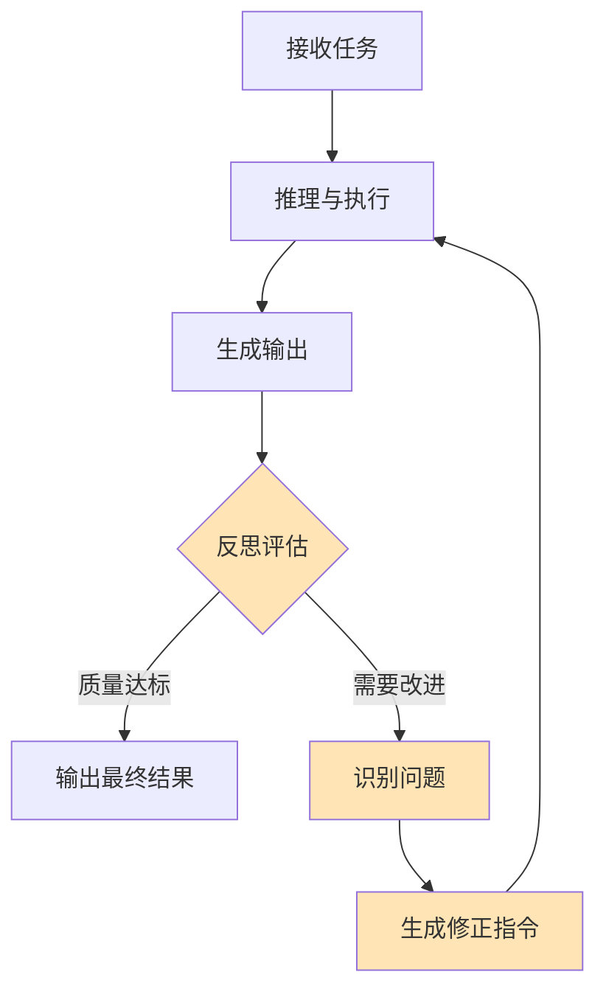
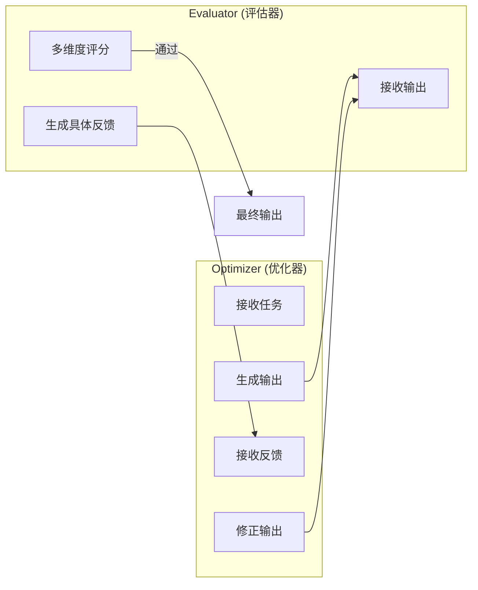
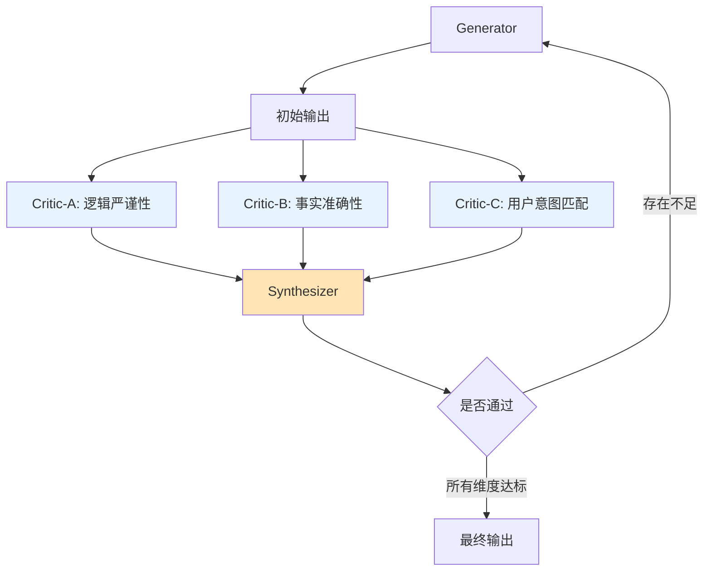

## 概述

反思（Reflection）是 Agent 对自身输出和行为进行自我评估与修正的元认知能力。如果说推理是"想明白问题的答案"，那么反思就是"想明白自己的答案对不对"。

人类专家区别于新手的一个核心特征，正是"知道自己不知道什么"以及"能发现自己的错误"。将这种元认知能力赋予 Agent，是提升其可靠性和输出质量的关键路径。

## 反思在 Agent 中的定位



反思模块通常位于 Agent 执行流程的"输出关卡"，扮演内部质量检查员的角色。它可以在多个层面发挥作用：单次回答的质量把控、工具调用结果的有效性验证、多步执行计划的中期检查。

## Reflexion 框架

Reflexion [Shinn et al., 2023] 是最具影响力的 Agent 反思框架，其核心创新在于将自然语言形式的"反思"作为一种"语义记忆"，跨尝试传递学习经验——本质上是一种"语言强化学习"（Verbal Reinforcement Learning）。

### Reflexion 的三组件

- **Actor（执行者）**：执行任务并生成动作轨迹
- **Evaluator（评估者）**：对执行结果进行评分
- **Self-Reflection（反思者）**：分析失败原因，生成自然语言的反思总结

### 工作流程

```python
def reflexion_loop(task: str, llm, evaluator, max_trials: int = 5):
    """Reflexion 反思循环"""
    reflections = []  # 累积的反思记忆
    
    for trial in range(max_trials):
        # 1. Actor 执行任务（带上历史反思）
        context = f"任务: {task}\n"
        if reflections:
            context += "从之前的尝试中学到的经验:\n"
            for i, ref in enumerate(reflections):
                context += f"  尝试 {i+1} 的反思: {ref}\n"
        
        trajectory = llm.execute_task(context)
        
        # 2. Evaluator 评估结果
        score = evaluator.evaluate(task, trajectory)
        
        if score >= THRESHOLD:
            return trajectory  # 成功
        
        # 3. Self-Reflection 生成反思
        reflection = llm.generate(f"""
        任务: {task}
        执行轨迹: {trajectory}
        评估结果: 失败 (得分: {score})
        
        请分析失败原因，总结经验教训。
        重点关注：
        - 哪一步出了问题？
        - 为什么那样做是错的？
        - 下次应该怎么做不同？
        
        用 2-3 句话简洁总结：
        """)
        
        reflections.append(reflection)
    
    return None  # 所有尝试均失败
```

Reflexion 的关键洞察是：通过自然语言而非梯度来传递学习信号。这使得它可以在不更新模型参数的情况下实现"学习"——每次失败的经验都被编码为文本，供下次尝试参考。

## 自我批评模式（Self-Critique）

自我批评是最常见的反思实现模式，其基本流程是"生成-评估-修正"三步循环：

### Generate-Evaluate-Revise

```python
def self_critique_loop(task: str, llm, max_iterations: int = 3):
    """自我批评循环"""
    # 第一次生成
    output = llm.generate(task)
    
    for iteration in range(max_iterations):
        # 评估当前输出
        critique = llm.generate(f"""
        请严格评估以下输出的质量：
        
        任务要求: {task}
        当前输出: {output}
        
        从以下维度评估：
        1. 准确性：是否有事实错误？
        2. 完整性：是否遗漏了重要内容？
        3. 逻辑性：推理是否连贯？
        4. 格式：是否符合要求的格式？
        
        如果输出已经足够好，回答"PASS"。
        否则，具体指出需要改进的地方。
        """)
        
        if "PASS" in critique:
            return output  # 质量达标
        
        # 基于批评进行修正
        output = llm.generate(f"""
        原始任务: {task}
        当前输出: {output}
        改进建议: {critique}
        
        请根据改进建议修正输出，保留正确的部分，
        只修改需要改进的内容。
        """)
    
    return output  # 返回最后一轮的输出
```

## Evaluator-Optimizer 模式

Anthropic 在其"Building Effective Agents"指南中提出的 Evaluator-Optimizer 模式，是反思机制的一种系统化实现。其核心思想是将"生成者"和"评估者"明确分离为两个独立的角色。

### 架构设计



### 设计要点

**评估标准显式化**：将评估维度以 Rubric 形式明确写入 Evaluator 的 Prompt，避免评估标准模糊或不一致。

**反馈需可操作**：Evaluator 的反馈不应只是"不够好"，而应具体指出"第三段的数据有误，应该是 X 而非 Y"。

**分离关注点**：Optimizer 专注于生成质量，Evaluator 专注于评判标准。两个角色可以使用不同的模型或不同的 Prompt。

这种模式特别适用于参考 [../05-fundamentals/agentic-patterns.md](../05-fundamentals/agentic-patterns.md) 中讨论的 Evaluator-Optimizer 架构模式。

## 何时触发反思

并非每次 Agent 输出都需要反思——过度反思会导致延迟增加和成本膨胀。以下场景适合触发反思：

### 高价值决策

当 Agent 即将执行不可逆操作（如发送邮件、删除文件、提交代码）时，在执行前进行一次反思检查。

### 工具调用失败后

工具返回错误或异常结果时，反思帮助 Agent 理解失败原因并调整策略，而非盲目重试。

### 低置信度输出

当模型自身对输出不确定（可通过 logprob 或显式置信度评估检测）时，触发反思进行二次验证。

### 用户反馈否定后

当用户明确表示"这不对"或"不是我要的"时，Agent 需要反思哪里理解偏差，而非简单重复。

### 多步任务的检查点

在长链任务的关键节点进行阶段性反思，确保整体方向正确。

## 避免无限反思循环

反思机制最大的风险是陷入"反思-修正-再反思"的无限循环。以下策略用于控制这一问题：

### 最大迭代次数

最直接的方法：硬性限制反思轮数（通常 2-3 轮即可）。

### 收益递减检测

```python
def should_continue_reflection(scores: list) -> bool:
    """检测反思是否仍有收益"""
    if len(scores) < 2:
        return True
    
    # 计算最近两轮的改进幅度
    improvement = scores[-1] - scores[-2]
    
    # 改进幅度低于阈值时停止
    if improvement < MIN_IMPROVEMENT_THRESHOLD:
        return False
    
    # 分数已经足够高时停止
    if scores[-1] >= GOOD_ENOUGH_THRESHOLD:
        return False
    
    return True
```

### 多样性约束

如果反思修正后的输出与修正前高度相似（编辑距离很小），说明反思已无法产生实质性改进，应当终止。

### 升级机制

当反思循环达到上限仍未通过评估时，应升级为"请求人类帮助"而非继续空转。

## LLM-as-Judge

LLM-as-Judge 是利用 LLM 本身作为评估器的范式，广泛应用于 Agent 的反思环节。

### 评分维度设计

```python
evaluation_rubric = {
    "accuracy": {
        "description": "事实准确性和信息正确性",
        "scale": "1-5",
        "anchors": {
            5: "所有事实完全正确，无任何错误",
            3: "大部分正确，有 1-2 处小错误",
            1: "存在严重事实错误"
        }
    },
    "completeness": {
        "description": "对任务要求的覆盖程度",
        "scale": "1-5",
        "anchors": {
            5: "完整覆盖所有要求",
            3: "覆盖主要要求，遗漏次要部分",
            1: "严重缺失关键内容"
        }
    },
    "coherence": {
        "description": "逻辑连贯性和表达清晰度",
        "scale": "1-5",
        "anchors": {
            5: "逻辑清晰，论述连贯",
            3: "基本连贯，有少量逻辑跳跃",
            1: "逻辑混乱，难以理解"
        }
    }
}
```

### LLM-as-Judge 的局限

- **自我偏好**：模型倾向于给自己的输出更高评分
- **位置偏差**：在对比评估中倾向于选择第一个选项
- **长度偏差**：倾向于给更长的回答更高分
- **风格偏好**：可能偏好某种特定的表达风格

缓解方法包括：使用不同模型作为 Judge、随机化呈现顺序、设计具体的评分锚点（Anchors）。

## 反思的工程实践

### 反思结果的复用

反思产生的经验不应仅用于当次修正，还应作为长期记忆存储，供未来类似任务参考。这形成了一个"反思-学习-成长"的正循环。

### 分级反思策略

- **轻量反思**：快速的格式和基本事实检查（低成本）
- **标准反思**：多维度质量评估（中等成本）
- **深度反思**：含外部验证（如搜索验证事实）的全面审查（高成本）

根据任务重要性选择合适的反思深度，避免"杀鸡用牛刀"。

### 可观测性

反思过程应被完整记录，包括每轮的评估结果、识别的问题和修正措施。这既用于调试，也用于持续优化反思 Prompt。

## 本章小结

反思与自我修正赋予了 Agent "知错能改"的能力，是从"可用"到"可靠"的关键跃迁。Reflexion 框架展示了如何通过语言化的经验积累实现跨尝试学习，Evaluator-Optimizer 模式提供了系统化的质量保障架构，LLM-as-Judge 则使自动化评估成为可能。在实践中，反思机制的设计重点在于"何时反思"和"何时停止"——过少则质量无保障，过多则效率受损。好的反思系统应像一个有分寸的内部审查员：在关键节点严格把关，在常规流程中轻量通过。

## 多层反思架构 (Multi-Layer Reflection)

前文讨论的自我批评模式依赖单一视角的评估，这在复杂任务中可能遗漏某些维度的问题。多层反思架构通过引入多个独立的 Critic 角色，从不同维度同时评判输出质量，再由 Synthesizer 综合各方意见形成改进方案。

这种架构的核心思想是：一个 Critic 可能有盲点，但多个关注不同维度的 Critic 组合起来，覆盖面远比单一评估者更全面。

### 架构概览



### 实现

```python
from dataclasses import dataclass
from typing import Callable


@dataclass
class CriticFeedback:
    """Single critic's evaluation result"""
    dimension: str
    score: float  # 0.0 - 1.0
    passed: bool
    feedback: str


class MultiCriticReflection:
    """Multi-layer reflection with independent critics"""

    def __init__(self, llm, critics: list[dict], threshold: float = 0.7, max_rounds: int = 3):
        self.llm = llm
        self.critics = critics  # Each: {"name": str, "dimension": str, "prompt": str}
        self.threshold = threshold
        self.max_rounds = max_rounds

    def _run_critic(self, critic: dict, task: str, output: str) -> CriticFeedback:
        """Run a single critic evaluation"""
        response = self.llm.generate(f"""
        你是一个专注于 [{critic['dimension']}] 的评审专家。
        
        {critic['prompt']}
        
        任务要求: {task}
        待评估输出: {output}
        
        请从 [{critic['dimension']}] 维度评估，给出:
        1. 分数 (0-10)
        2. 是否通过 (YES/NO)
        3. 具体问题描述（如果未通过）
        """)
        # Parse response into CriticFeedback
        return self._parse_feedback(response, critic['dimension'])

    def _synthesize(self, feedbacks: list[CriticFeedback], task: str, output: str) -> str:
        """Synthesize all critic feedbacks into actionable revision instructions"""
        feedback_summary = "\n".join(
            f"- [{fb.dimension}] 得分: {fb.score:.1f}, "
            f"{'通过' if fb.passed else '未通过'}: {fb.feedback}"
            for fb in feedbacks
        )
        
        revision_prompt = f"""
        综合以下多维度评审意见，生成统一的修正指令：
        
        原始任务: {task}
        当前输出: {output}
        
        各维度评审结果:
        {feedback_summary}
        
        请生成一份优先级排序的修正指令，确保修正不会在改善某维度时破坏其他维度。
        """
        return self.llm.generate(revision_prompt)

    def run(self, task: str) -> str:
        """Execute multi-critic reflection loop"""
        output = self.llm.generate(task)
        
        for round_num in range(self.max_rounds):
            # Run all critics in parallel (conceptually)
            feedbacks = [
                self._run_critic(critic, task, output)
                for critic in self.critics
            ]
            
            # Check if all critics pass
            all_passed = all(fb.passed for fb in feedbacks)
            if all_passed:
                return output
            
            # Synthesize feedback and revise
            revision_instructions = self._synthesize(feedbacks, task, output)
            output = self.llm.generate(f"""
            原始任务: {task}
            当前输出: {output}
            修正指令: {revision_instructions}
            
            请根据修正指令改进输出。
            """)
        
        return output  # Return best effort after max rounds

    def _parse_feedback(self, response: str, dimension: str) -> CriticFeedback:
        """Parse LLM response into structured feedback (simplified)"""
        # Implementation depends on output format
        ...
```

多层反思的优势在于评估维度间的正交性——逻辑严谨性 Critic 不关心事实是否正确，事实准确性 Critic 不关心表达是否流畅。这种分工使每个 Critic 的 Prompt 更专注、评估更精准。实践中通常 2-4 个 Critic 即可覆盖大部分质量维度，过多反而增加综合难度。

## Constitutional AI 自对齐

Constitutional AI (CAI) 由 Anthropic 提出，其核心洞察是：与其依赖大量人类标注来教模型"什么是好的输出"，不如让模型根据一组明确的"宪法原则"进行自我审查与修正。这本质上是一种原则驱动的反思机制。

### 两阶段流程

CAI 的反思过程分为 Critique 和 Revision 两个清晰阶段：

**Critique 阶段**：逐条对照宪法原则，检查输出是否违反任何原则，并生成具体的违规描述。

**Revision 阶段**：基于 Critique 的发现，在不破坏输出核心价值的前提下，修正违规内容使其符合所有原则。

这种"先发现问题，再定向修复"的分步策略，比一步到位的修正更可控、更透明。

### 实现

```python
@dataclass
class Principle:
    """A single constitutional principle"""
    name: str
    description: str
    critique_prompt: str  # How to check for violations
    revision_prompt: str  # How to fix violations


class ConstitutionalReflector:
    """Implements Constitutional AI self-alignment through principle-guided reflection"""

    DEFAULT_PRINCIPLES = [
        Principle(
            name="helpfulness",
            description="输出应尽可能帮助用户完成其真实意图",
            critique_prompt="这个回答是否真正帮助用户解决了问题？是否有更有用的信息被遗漏？",
            revision_prompt="请修改回答使其更好地帮助用户，补充被遗漏的有用信息。"
        ),
        Principle(
            name="harmlessness",
            description="输出不应包含有害、误导或危险的内容",
            critique_prompt="这个回答是否包含可能误导用户或造成伤害的内容？",
            revision_prompt="请移除或修正任何可能误导或有害的内容，同时保持回答的有用性。"
        ),
        Principle(
            name="honesty",
            description="输出应诚实标注不确定性，不编造信息",
            critique_prompt="这个回答是否有编造信息的嫌疑？对不确定的内容是否做了诚实标注？",
            revision_prompt="请对不确定的内容添加适当的限定语，移除无法验证的断言。"
        ),
    ]

    def __init__(self, llm, principles: list[Principle] = None, max_revisions: int = 2):
        self.llm = llm
        self.principles = principles or self.DEFAULT_PRINCIPLES
        self.max_revisions = max_revisions

    def critique(self, task: str, output: str) -> list[dict]:
        """Critique phase: check output against each principle"""
        violations = []
        
        for principle in self.principles:
            response = self.llm.generate(f"""
            宪法原则 [{principle.name}]: {principle.description}
            
            检查问题: {principle.critique_prompt}
            
            任务: {task}
            输出: {output}
            
            请判断输出是否违反了此原则。
            回答格式:
            - 是否违反: YES/NO
            - 违规描述: (如果违反，具体说明哪里违反了)
            """)
            
            if self._is_violation(response):
                violations.append({
                    "principle": principle,
                    "description": self._extract_violation(response)
                })
        
        return violations

    def revise(self, task: str, output: str, violations: list[dict]) -> str:
        """Revision phase: fix violations while preserving output quality"""
        if not violations:
            return output
        
        violation_summary = "\n".join(
            f"- [{v['principle'].name}] {v['description']}\n"
            f"  修正指导: {v['principle'].revision_prompt}"
            for v in violations
        )
        
        revised = self.llm.generate(f"""
        原始任务: {task}
        当前输出: {output}
        
        以下原则被违反:
        {violation_summary}
        
        请修正输出使其符合所有原则。注意：
        1. 只修正违规部分，保留正确和有价值的内容
        2. 修正不应降低输出的有用性
        3. 如果原则间有冲突，优先保证 harmlessness
        """)
        return revised

    def reflect(self, task: str, output: str) -> str:
        """Full constitutional reflection: critique then revise iteratively"""
        current_output = output
        
        for _ in range(self.max_revisions):
            violations = self.critique(task, current_output)
            
            if not violations:
                return current_output  # All principles satisfied
            
            current_output = self.revise(task, current_output, violations)
        
        return current_output

    def _is_violation(self, response: str) -> bool:
        """Check if critic response indicates a violation"""
        return "YES" in response.split("\n")[0].upper()

    def _extract_violation(self, response: str) -> str:
        """Extract violation description from critic response"""
        lines = response.strip().split("\n")
        return "\n".join(lines[1:]).strip()
```

Constitutional AI 的设计哲学强调原则的可审计性——每次修正都有对应的原则依据，这使得反思过程透明且可追溯。在实际应用中，原则集应根据具体场景定制：面向用户的 Agent 更强调 helpfulness 和 harmlessness，而面向代码生成的 Agent 可能更强调 correctness 和 security。

## 反思质量的元评估

一个常被忽视的问题是：反思本身也可能出错。如果 Critic 给出的反馈质量低下（过于笼统、前后矛盾、或重复发现相同问题），那么基于它的修正非但无法提升质量，反而可能引入新问题。元评估（Meta-Reflection）正是对反思过程本身进行质量控制。

### 无效反思的典型模式

通过观察实践中的反思失败案例，可以归纳出几种常见的无效反思模式：

**重复问题（Repetition）**：连续多轮反思提出相同的问题，说明 Agent 无法真正解决该问题，继续反思只是空转。

**过于笼统（Vagueness）**：反馈内容是"需要改进""不够好"这类缺乏行动指导的空话，无法转化为具体修正。

**自相矛盾（Contradiction）**：第 N 轮反思要求增加内容，第 N+1 轮反思又要求精简，形成振荡。

**虚假进步（Hallucinated Progress）**：每轮反思都声称有改进，但实际输出几乎未变。

### 实现

```python
from collections import Counter


class ReflectionQualityChecker:
    """Meta-evaluator that assesses the quality of reflection itself"""

    def __init__(self, similarity_threshold: float = 0.85, min_actionable_length: int = 20):
        self.similarity_threshold = similarity_threshold
        self.min_actionable_length = min_actionable_length
        self.history: list[dict] = []

    def record_reflection(self, feedback: str, output_before: str, output_after: str):
        """Record a reflection round for quality tracking"""
        self.history.append({
            "feedback": feedback,
            "output_before": output_before,
            "output_after": output_after,
        })

    def check_repetition(self) -> bool:
        """Detect if recent reflections are raising the same issues"""
        if len(self.history) < 2:
            return False
        
        recent_feedbacks = [h["feedback"] for h in self.history[-3:]]
        # Compare semantic similarity between consecutive feedbacks
        for i in range(len(recent_feedbacks) - 1):
            similarity = self._compute_similarity(
                recent_feedbacks[i], recent_feedbacks[i + 1]
            )
            if similarity > self.similarity_threshold:
                return True  # Repetition detected
        return False

    def check_vagueness(self, feedback: str) -> bool:
        """Detect overly vague feedback that lacks actionable guidance"""
        # Vague indicators: short length, generic phrases
        vague_phrases = [
            "需要改进", "不够好", "可以更好", "还有提升空间",
            "needs improvement", "could be better", "not good enough"
        ]
        
        if len(feedback.strip()) < self.min_actionable_length:
            return True
        
        vague_count = sum(1 for phrase in vague_phrases if phrase in feedback)
        # If most of the feedback is vague phrases, it's not actionable
        return vague_count >= 2 and len(feedback) < 100

    def check_contradiction(self) -> bool:
        """Detect contradictory feedback across reflection rounds"""
        if len(self.history) < 2:
            return False
        
        # Simple heuristic: if output oscillates (A -> B -> A-like)
        if len(self.history) >= 3:
            first_output = self.history[-3]["output_after"]
            latest_output = self.history[-1]["output_after"]
            middle_output = self.history[-2]["output_after"]
            
            # If latest is more similar to first than to middle, likely oscillating
            sim_first_latest = self._compute_similarity(first_output, latest_output)
            sim_middle_latest = self._compute_similarity(middle_output, latest_output)
            
            if sim_first_latest > sim_middle_latest:
                return True
        
        return False

    def check_hallucinated_progress(self) -> bool:
        """Detect cases where reflection claims improvement but output barely changes"""
        if len(self.history) < 1:
            return False
        
        latest = self.history[-1]
        output_similarity = self._compute_similarity(
            latest["output_before"], latest["output_after"]
        )
        
        # High similarity between before/after means little actual change
        return output_similarity > 0.95

    def should_stop_reflection(self) -> tuple[bool, str]:
        """Comprehensive check: should the reflection loop be terminated?"""
        if self.check_repetition():
            return True, "反思重复提出相同问题，继续循环无意义"
        
        if len(self.history) > 0 and self.check_vagueness(self.history[-1]["feedback"]):
            return True, "反思反馈过于笼统，无法指导有效修正"
        
        if self.check_contradiction():
            return True, "反思意见前后矛盾，输出出现振荡"
        
        if self.check_hallucinated_progress():
            return True, "反思未产生实质性改变，存在虚假进步"
        
        return False, ""

    def _compute_similarity(self, text_a: str, text_b: str) -> float:
        """Compute text similarity (simplified; use embedding similarity in production)"""
        # Simple Jaccard similarity on character n-grams
        n = 3
        ngrams_a = set(text_a[i:i+n] for i in range(len(text_a) - n + 1))
        ngrams_b = set(text_b[i:i+n] for i in range(len(text_b) - n + 1))
        
        if not ngrams_a or not ngrams_b:
            return 0.0
        
        intersection = ngrams_a & ngrams_b
        union = ngrams_a | ngrams_b
        return len(intersection) / len(union)
```

元评估的实践意义在于：它为反思循环提供了一个"熔断器"。当反思本身质量下降时，与其继续低质量的循环，不如及时终止并输出当前最优结果，或升级为人类介入。将 `ReflectionQualityChecker` 集成到前文的反思循环中，可以显著减少无意义的计算开销，同时避免因低质量修正引入的"越改越差"问题。

## 延伸阅读

- [Shinn et al., 2023] "Reflexion: Language Agents with Verbal Reinforcement Learning"
- [Madaan et al., 2023] "Self-Refine: Iterative Refinement with Self-Feedback"
- [Anthropic, 2024] "Building Effective Agents" - Evaluator-Optimizer Pattern
- [Zheng et al., 2023] "Judging LLM-as-a-Judge with MT-Bench and Chatbot Arena"
- [Kim et al., 2024] "Language Models can Solve Computer Tasks"
- [Pan et al., 2024] "Automatically Correcting Large Language Models: Surveying the Landscape"
- [Bai et al., 2022] "Constitutional AI: Harmlessness from AI Feedback"
- [OpenAI, 2024] "Generative Verifiers and Self-Critique"
- [Agentic Design Patterns, 2025] Chapter 4: Reflection Pattern
