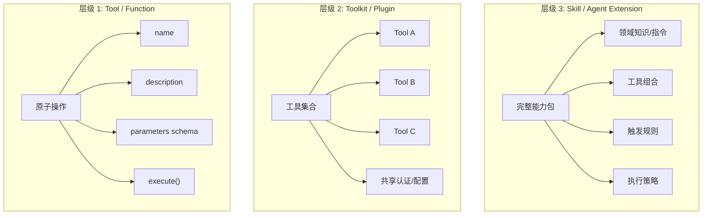
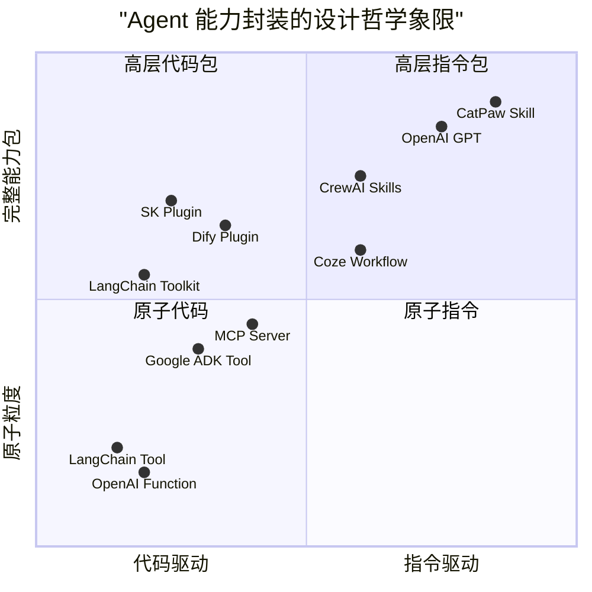

## 概述

当我们讨论 Agent 的"工具使用"（Tool Use）时，通常指的是原子层面的能力——调用一个函数、查询一个 API、读取一个文件。但在实际的 Agent 工程中，完成一个有意义的任务往往需要**一组工具 + 领域知识 + 执行策略**的协同。这种更高层次的能力封装在不同平台上有着不同的名字：OpenAI 叫 Actions/GPTs，Microsoft 叫 Plugin（后又改为 Copilot Agent），LangChain 叫 Toolkit，CatPaw 叫 Skill，Google 叫 Extension。

名称不同，但它们回答的是同一个问题：**如何将 Agent 的能力打包为可复用、可分发、可组合的单元？**

本章系统梳理这一概念的演化历程、各平台的具体实现，以及正在形成的行业共识。

## 概念层次：Tool → Toolkit → Skill

在讨论各平台实现之前，先建立一个通用的概念分层：

| 层级 | 封装内容 | 典型粒度 | 例子 |
|------|---------|---------|------|
| Tool | 单个可调用函数 | 一次 API 调用 | `search_web(query)` |
| Toolkit | 同一领域的工具集合 + 共享配置 | 一个服务的多个端点 | Gmail Toolkit（发送、搜索、读取） |
| Skill | 工具 + 知识 + 指令 + 触发条件 | 完成一类任务的完整能力 | "代码评审 Skill"（含评审标准、Git API 工具、评审流程指令） |

这三层不是互斥的，而是递进包含关系。Skill 建立在 Toolkit 之上，Toolkit 建立在 Tool 之上。

## 各平台实现详述

### OpenAI：从 Plugins 到 GPTs + Actions

OpenAI 的扩展体系经历了一次完整的范式转换。

**ChatGPT Plugins（2023.3 - 2024.4，已废弃）**：业界最早的 LLM 能力扩展尝试。每个 Plugin 由一个 `ai-plugin.json` 清单文件 + 一个 OpenAPI 规范文件组成，LLM 根据清单描述判断何时调用。Plugin 商店曾短暂开放但生态未能起飞，最终在 2024 年 4 月正式下线。

**GPTs + Actions（2023.11 至今，稳定）**：取代 Plugins 的新体系。一个 Custom GPT 包含四个组件：Instructions（系统级自然语言指令，定义 GPT 的行为和人格）、Knowledge（上传的文档，作为 RAG 检索源）、Actions（通过 OpenAPI Schema 定义的外部 API 调用能力）、以及 Capabilities（内置的代码解释器、DALL-E、浏览器等能力开关）。GPT Store 于 2024 年 1 月上线，是最早的"AI 能力应用商店"形态。

**设计哲学**：GPT 是一个"角色 + 能力"的完整封装——它不只是工具集合，还包含人格定义和知识基础。这使得 GPT 更接近"Skill"层级而非"Toolkit"层级。

### Anthropic MCP：协议层而非应用层

MCP（Model Context Protocol）的定位有别于上述所有平台——它不是"能力封装格式"，而是"能力连接协议"。

MCP 定义了三种原语：Tools（可调用操作）、Resources（可读取数据源）和 Prompts（可复用提示模板）。每个 MCP Server 暴露这些原语的组合，Agent 作为 MCP Client 动态发现和调用它们。通信基于 JSON-RPC 2.0，传输层支持 stdio（本地进程）和 HTTP+SSE（远程服务）。

**MCP 与 Skill 的关系**：MCP 本身不定义"Skill"概念，但它是 Skill 的天然底层基础设施。一个 Skill 可以引用一个或多个 MCP Server 作为其工具后端。例如 CatPaw 的 Skill 系统中，许多 Skill 的执行依赖于 MCP Server 提供的工具能力。

**生态现状**：MCP 正在快速成为行业事实标准。GitHub MCP Registry（2025.9 上线）定位为"MCP 服务器的 npm"，采用标准化的 `server.json` 清单和反向 DNS 命名空间验证。Google ADK、LangChain、CrewAI 均已原生支持 MCP。

### Microsoft Semantic Kernel：命名轮回史

Semantic Kernel（SK）的命名演变本身就是行业认知变迁的缩影。

**2023 年初**：SK 使用 "Skill" 一词描述能力集合。一个 Skill 包含多个 Function（分为 Native Function 和 Semantic Function）。

**2023 年中**：为"对齐 OpenAI Plugins"标准，SK 将所有 "Skill" 重命名为 "Plugin"，社区代码经历大规模重构。

**2025 年**：行业又重新拥抱"Skill"一词（CrewAI Skills、CatPaw Skills），但此时的"Skill"含义已从最初的"函数集合"演化为"领域知识 + 工作流程 + 最佳实践"的完整封装。

SK Plugin 当前的架构：一个 Plugin 是一组 Kernel Functions 的集合，函数类型包括 Native Functions（强类型代码，用 `[KernelFunction]` 标注）、Semantic Functions（纯 Prompt 模板 + 配置文件）、和 OpenAPI Functions（外部 API 调用）。Plugin 支持依赖注入，兼容 OpenAI 插件规范。

### LangChain：Toolkit 模式

LangChain 的工具组织相对简洁——Tool 是原子单元（通过 `BaseTool` 类或 `@tool` 装饰器定义），Toolkit 是为特定场景设计的 Tool 集合（通过 `get_tools()` 方法暴露工具列表）。

Toolkit 的典型例子：Gmail Toolkit 包含 `send_email`、`search_emails`、`get_email` 等工具，共享同一个 OAuth 认证。开发者可以一次性加载整个 Toolkit，也可以挑选其中部分 Tool。

LangChain 没有定义高于 Toolkit 的"Skill"层——它将更复杂的编排逻辑交给 LangGraph（图编排引擎）处理。

### Google ADK：四类工具 + Agent-as-Tool

Google Agent Development Kit（2025.4 发布）定义了四类工具：Function Tools（自定义 Python 函数）、Built-in Tools（Google Search、Code Execution 等原生服务）、Third-party Tools（合作伙伴生态预构建工具）、MCP Tools（通过 MCP 协议连接外部服务）。

ADK 的独特设计是 `ToolContext` 机制——工具在执行时可以访问和修改会话状态、管理文件 Artifacts、与长期记忆交互。更重要的是"Agent as Tool"模式：一个 Agent 本身可以作为另一个 Agent 的工具被调用，实现层级化的能力组合。这种设计模糊了"工具"和"子 Agent"的边界。

### CatPaw / Friday：指令驱动的 Skill

CatPaw 的 Skill 设计独树一帜——一个 Skill 本质上是"一份结构化的说明书"（SKILL.md 文件），而非代码包。其核心思路是：Agent（LLM）本身就具备理解和执行复杂指令的能力，因此不需要将流程硬编码为代码，只需用自然语言 + 结构化标记描述"在什么场景下、按什么步骤、调用哪些工具"。

SKILL.md 的典型结构包含：YAML Frontmatter（name、description、version 等元数据）和 Markdown 正文（触发条件、分步执行指南、示例、约束规则）。Skill 可以引用 MCP Server、CLI 命令、浏览器自动化等多种后端。

**加载机制**：平时只加载简短的 description 用于触发匹配（几十个字节），只有在触发后才将完整的 SKILL.md 内容加载到 LLM 上下文中。这种"惰性加载"设计使得 Agent 可以同时注册数十甚至上百个 Skill 而不消耗 Token 预算。

**分发方式**：Friday 技能广场（SkillHub），支持搜索、安装、更新、版本管理、评论评分等完整市场功能。

### Coze（字节跳动）：Plugin + Workflow 双层

Coze 的能力扩展分为两个层次：Plugin（插件）封装单个 API 调用或功能点，通过 OpenAPI 文档导入或自定义代码编写（Go 语言）；Workflow（工作流）是可视化的多步骤编排，将多个 Plugin 调用、逻辑判断和 LLM 推理节点组合为完整流程。

这种设计将"原子能力"（Plugin）和"能力编排"（Workflow）清晰分层。Bot 可以直接使用 Plugin，也可以使用编排好的 Workflow——后者类似于 CatPaw Skill 中"执行策略"的可视化表达。

### Dify：五类 Plugin 架构

Dify 自 v1.0.0（2025.2）引入全插件化架构，将能力封装为五个正交维度：Models（模型提供者）、Tools（工具插件）、Agent Strategies（推理策略插件，如 ReAct、Function Calling 的不同实现）、Extensions（外部服务集成扩展）、Bundles（将相关插件打包的集合）。

Dify 的独特之处在于将"Agent 推理策略"也抽象为可插拔的 Plugin——这意味着同一个 Agent 可以在运行时切换不同的推理范式，而不需要重建整个应用。

### CrewAI：五种 Agent Capability

CrewAI 在 2025 年将 Agent 的能力扩展体系化为五种类型：Tools（可调用函数）、MCPs（通过 MCP 协议接入的远程工具服务）、Apps（Slack/Jira 等平台集成连接器）、Skills（领域专业知识，经验性指令集）、Knowledge（用于 RAG 检索的知识库）。

值得注意的是 CrewAI 明确区分了 Tools（执行能力）和 Skills（知识能力）——前者是"能做什么"，后者是"知道什么"。这与 CatPaw 的 Skill 定义不完全一致（CatPaw Skill 同时包含工具引用和知识指令），但反映了行业对"能力 ≠ 工具"这一认知的深化。

## 设计哲学对比

各平台的设计可以沿两个轴进行分类：

**代码中心派**（Semantic Kernel、LangChain、Google ADK）：能力封装为强类型代码对象，由编译器和类型系统保证正确性。优势是精确可控、可测试；代价是开发门槛高、灵活性受限。

**指令中心派**（CatPaw Skill、OpenAI GPTs）：能力封装为自然语言说明书，由 LLM 理解执行。优势是极低门槛（不需要写代码就能创建 Skill）、高灵活性；代价是执行确定性较低、难以做静态验证。

**混合派**（Coze Workflow、Dify、CrewAI）：代码定义原子操作，可视化/指令定义编排逻辑。兼顾两者优势，但引入了额外的抽象层复杂度。

## 正在形成的行业共识

尽管命名和实现各异，但观察各平台的演进方向，可以识别出几个正在收敛的共识：

**共识一：完整的能力封装需要三层组成**

所有成熟的"Skill"类概念都包含相似的组成部分：

| 组成层 | 作用 | 各平台对应 |
|-------|------|-----------|
| 指令层 | 告诉 Agent 何时使用、如何使用 | GPT Instructions、SK Semantic Function、CatPaw SKILL.md、CrewAI Skills |
| 工具层 | 提供实际执行能力 | Actions、Native Function、MCP Tools、Plugins |
| 知识层 | 提供领域上下文 | GPT Knowledge、CatPaw 内嵌知识、CrewAI Knowledge、RAG 源 |

缺少任何一层都会导致能力不完整：只有工具没有指令，Agent 不知道何时使用；只有指令没有工具，Agent 无法执行；只有工具和指令没有知识，Agent 缺乏领域判断力。

**共识二：MCP 正在成为工具层的通用标准**

Google ADK、CrewAI、LangChain、CatPaw 均已原生支持 MCP 作为工具接入协议。这意味着无论上层的"Skill"如何定义，其底层的工具调用越来越多地通过 MCP 完成。MCP 之于 Skill，就像 TCP/IP 之于 Web 应用——你不一定直接使用它，但它是基础设施。

**共识三：分发标准化正在到来**

GPT Store、Dify Marketplace、CatPaw SkillHub、MCP Registry——各平台都在建设自己的"能力市场"。当 MCP Registry 作为工具层的统一发现平台逐步成熟时，上层 Skill 的标准化分发协议也有望出现。

**共识四：Agent 间协作需要新协议**

Google 于 2025 年 4 月发布的 A2A（Agent2Agent Protocol）开始解决一个 MCP 未覆盖的问题：不同 Agent 之间如何发现彼此的能力、协商合作方式、交换任务。A2A 与 MCP 的关系是互补的——MCP 解决 Agent→Tool 的连接，A2A 解决 Agent→Agent 的连接。

## 对 Agent 工程师的实践启示

**选择封装粒度时**：如果能力是"执行一个明确操作"（发邮件、查数据库），封装为 Tool 即可；如果是"完成一类任务"（代码评审、需求分析），需要 Skill 级别的封装，包含判断逻辑、领域知识和多工具编排。

**设计 Skill 时**：遵循"三层完备"原则——确保指令层（何时触发、如何执行）、工具层（需要调用什么）、知识层（需要知道什么）都有覆盖。一个只有工具引用没有执行指令的"Skill"和一个 Toolkit 没有本质区别。

**工具层标准化**：无论上层 Skill 格式如何定义（Markdown 指令、JSON 清单、代码类），底层工具接入建议优先采用 MCP 协议。这确保了工具的可复用性——同一个 MCP Server 可以被不同 Skill 引用，也可以被不同 Agent 框架调用。

**面向分发设计**：如果希望 Skill 能被团队内或社区共享，需要考虑：清晰的触发条件描述（让用户和 Agent 都能判断何时使用）、最小化的外部依赖（减少安装摩擦）、以及版本管理策略（Skill 的指令和工具都可能更新）。

## 本章小结

从 Function Calling 到 MCP 再到 Skill/Plugin，Agent 能力扩展的演进方向是清晰的：**封装粒度越来越粗、语义越来越丰富、分发越来越标准化**。原子工具解决"能不能做"的问题，Skill 解决"知不知道什么时候做、怎么做好"的问题。当前行业尚未形成统一的 Skill 标准定义，但各平台的设计正在向"指令 + 工具 + 知识"三层模型收敛。

对于 Agent 工程师而言，理解这个分层比记住各平台的特定术语更重要：你在设计 Agent 能力时，需要思考的不只是"提供什么工具"，还有"附带什么知识"和"给出什么执行策略"——这三者的组合，才是一个完整的、可靠的 Agent 能力单元。

## 延伸阅读

- [Anthropic, 2024] Model Context Protocol Specification: https://modelcontextprotocol.io
- [Google, 2025] Agent2Agent Protocol: https://github.com/google/A2A
- [OpenAI, 2024] GPTs Actions Documentation: https://platform.openai.com/docs/actions
- [Microsoft, 2024] Semantic Kernel Plugins: https://learn.microsoft.com/en-us/semantic-kernel/concepts/plugins/
- [Google, 2025] Agent Development Kit: https://adk.dev/
- [LangChain] Tools Documentation: https://python.langchain.com/docs/integrations/tools/
- [CrewAI, 2025] Tools & Capabilities: https://docs.crewai.com/en/concepts/tools
- [Dify, 2025] Plugin Marketplace: https://marketplace.dify.ai/
- [CatPaw] Skill Documentation: https://catpaw.meituan.com/guides/settings/skill
