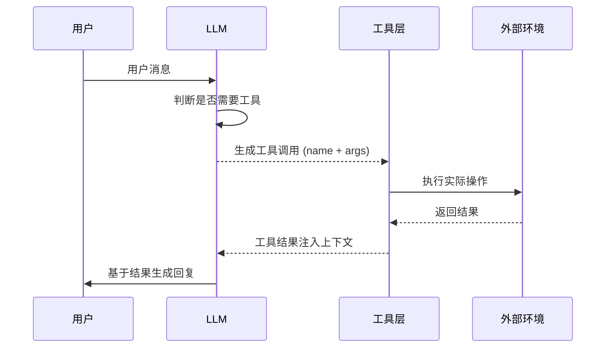
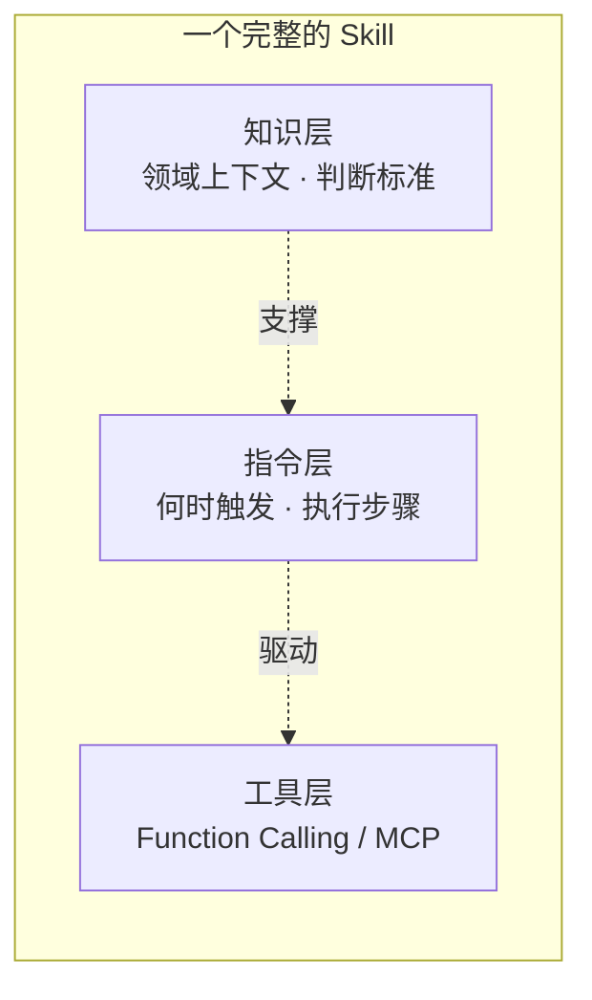

## 概述

工具使用（Tool Use）是 Agent 从"纯文本生成器"跨越到"行动执行者"的关键桥梁。如果说推理是 Agent 的大脑，那么工具就是 Agent 的双手——它们使 Agent 能够读写文件、查询数据库、调用 API、浏览网页，从而真正地与外部世界产生交互。

工具使用能力的核心挑战不在于"能不能调用工具"，而在于"何时调用、调用哪个、用什么参数、如何处理结果"。本章将系统性地讨论工具使用的设计模式、协议标准和工程实践。

## 工具使用的基本范式

### Function Calling 机制

Function Calling 是当前主流 LLM 提供的原生工具调用能力。其核心流程是：



### OpenAI 风格的 Function Calling

OpenAI 的方案通过 JSON Schema 定义工具接口：

```python
tools = [
    {
        "type": "function",
        "function": {
            "name": "search_database",
            "description": "搜索产品数据库，根据关键词返回匹配的产品列表",
            "parameters": {
                "type": "object",
                "properties": {
                    "query": {
                        "type": "string",
                        "description": "搜索关键词"
                    },
                    "category": {
                        "type": "string",
                        "enum": ["electronics", "clothing", "food"],
                        "description": "产品分类过滤"
                    },
                    "max_results": {
                        "type": "integer",
                        "description": "最大返回数量，默认10"
                    }
                },
                "required": ["query"]
            }
        }
    }
]
```

### Anthropic 风格的 Tool Use

Anthropic 的方案在概念上类似，但强调工具描述的详细程度和使用场景说明，并通过 `tool_use` 和 `tool_result` 消息类型实现多轮工具交互。

## 工具描述设计最佳实践

工具描述（Tool Description）的质量直接影响 LLM 选择和调用工具的准确性。好的工具描述应包含：

**清晰的功能边界**：明确说明工具能做什么和不能做什么。模糊的描述会导致 LLM 在不恰当的时机调用工具。

**参数语义说明**：每个参数都需要清晰的自然语言描述，包括取值范围、默认值和典型用例。

**返回值格式**：说明工具返回数据的结构，帮助 LLM 预期和解析结果。

**使用场景示例**：提供 1-2 个典型调用场景，作为 few-shot 指引。

```python
# 反例：描述过于简略
bad_tool = {
    "name": "query",
    "description": "查询数据",
    "parameters": {"q": {"type": "string"}}
}

# 正例：描述详尽明确
good_tool = {
    "name": "query_order_status",
    "description": (
        "查询用户订单的当前状态。适用于用户询问订单物流、"
        "配送进度、退款状态等场景。不适用于修改订单或取消订单。"
        "返回订单状态枚举值和最后更新时间。"
    ),
    "parameters": {
        "order_id": {
            "type": "string",
            "description": "订单编号，格式为 ORD-XXXXXXXX"
        }
    }
}
```

## MCP：标准化工具接口协议

Model Context Protocol (MCP) 是 Anthropic 在 2024 年提出的开放标准，旨在为 Agent 与工具之间建立统一的通信协议——类似于 USB 对硬件设备所做的事情。

### MCP 的核心设计

MCP 定义了三种核心原语：

- **Tools**：可执行的操作（如搜索、写文件、调用 API）
- **Resources**：可读取的数据源（如文件内容、数据库表）
- **Prompts**：可复用的提示模板

MCP 采用 Client-Server 架构，Agent 作为 Client 连接多个 MCP Server，每个 Server 暴露一组工具和资源。这种设计使得工具的开发和部署可以独立于 Agent 本身。

### MCP 的优势

**标准化**：不同 Agent 框架可以共享同一套工具实现，避免重复开发。

**动态发现**：Agent 可以在运行时发现和加载新工具，无需预先硬编码。

**权限隔离**：每个 MCP Server 运行在独立进程中，天然实现了安全沙箱。

## 工具选择：LLM 如何决定调用哪个工具

当 Agent 配备了几十甚至上百个工具时，准确选择正确的工具成为核心挑战。

### 影响工具选择的因素

- **工具描述质量**：描述越精确，LLM 选择越准确
- **工具数量**：工具过多会导致选择困难（实践中建议单次不超过 20-30 个工具）
- **上下文相关性**：当前对话上下文对工具选择有强引导作用
- **工具间语义距离**：功能相似的工具容易混淆

### 优化策略

**分层工具路由**：先用分类器确定工具类别，再在小范围内精选。

**动态工具加载**：根据当前任务上下文只加载相关工具，减少选择空间。

**工具使用示例**：在 System Prompt 中提供典型场景与工具的对应关系。

## 错误处理

工具调用是 Agent 系统中最容易出错的环节。健壮的错误处理机制至关重要：

```python
class ToolExecutor:
    """带错误处理的工具执行器"""
    
    def execute(self, tool_name: str, args: dict, max_retries: int = 3):
        """执行工具调用，包含重试和降级逻辑"""
        for attempt in range(max_retries):
            try:
                # 参数校验
                validated_args = self.validate_args(tool_name, args)
                
                # 执行工具
                result = self.tools[tool_name].run(validated_args)
                
                # 结果校验
                if self.is_valid_result(result):
                    return ToolResult(success=True, data=result)
                else:
                    raise InvalidResultError(f"工具返回了无效结果: {result}")
                    
            except RateLimitError:
                # 限流：指数退避重试
                wait_time = 2 ** attempt
                time.sleep(wait_time)
                
            except ToolNotFoundError:
                # 工具不存在：尝试降级到替代工具
                fallback = self.find_fallback(tool_name)
                if fallback:
                    return self.execute(fallback, args, max_retries=1)
                return ToolResult(success=False, error="工具不可用且无替代方案")
                
            except ValidationError as e:
                # 参数错误：让 LLM 修正参数
                return ToolResult(
                    success=False, 
                    error=f"参数校验失败: {e}",
                    suggestion="请检查参数格式并重试"
                )
        
        return ToolResult(success=False, error="重试次数耗尽")
```

## 工具组合与链式调用

复杂任务往往需要多个工具协作完成。工具组合（Tool Composition）有两种主要模式：

**顺序链式**：工具 A 的输出作为工具 B 的输入。例如：搜索文档 -> 提取关键信息 -> 写入报告。

**并行扇出**：同时调用多个工具，汇聚结果。例如：同时查询天气、航班和酒店信息。

**条件分支**：根据某个工具的结果决定后续调用路径。

LLM 天然具备编排这些模式的能力——它可以根据中间结果动态决定下一步调用什么工具。这也是 Agent 相比传统工作流引擎的核心优势。

## 安全机制

工具使用引入了显著的安全风险——一个被恶意 Prompt 注入的 Agent 可能通过工具执行危险操作。

### 沙箱隔离

工具执行（尤其是代码执行、Shell 命令、文件读写）应在受限环境中运行，限制文件系统访问范围、网络访问白名单和系统调用权限。一个被恶意 Prompt 注入的 Agent，如果工具直接在宿主环境执行，可能删除文件、泄露密钥或发起内网攻击。沙箱隔离的本质是在"Agent 想做的操作"和"宿主真实资源"之间插入一道可控边界。

业界的沙箱技术方案按隔离强度由弱到强大致分为五个层次：

| 隔离层次 | 代表技术 | 隔离机制 | 启动开销 | 隔离强度 | 典型场景 |
|---------|---------|---------|---------|---------|---------|
| **进程级隔离** | seccomp、namespaces、cgroups | 限制系统调用白名单、隔离 PID/网络/挂载点、限制资源配额 | 极低（毫秒级） | 弱（共享内核） | MCP Server 进程隔离、轻量工具 |
| **容器隔离** | Docker、Podman | 镜像封装 + 只读文件系统 + 网络白名单 + capabilities 裁剪 | 低（百毫秒级） | 中 | 生产环境主流方案 |
| **微虚拟机** | Firecracker、gVisor | 用户态内核拦截系统调用 / 轻量 VM 监控器 | 较低（几十~几百毫秒） | 强（接近 VM） | 不可信代码执行、Agent 云沙箱 |
| **WebAssembly** | Wasmtime、WasmEdge | Wasm 能力模型 + 内存隔离 | 极低 | 强（细粒度） | 不可信代码片段快速执行 |
| **完整虚拟机** | KVM/QEMU、独立 VM | 硬件级虚拟化、独立内核 | 高（秒级） | 最强 | Computer Use、高安全要求场景 |

**进程级隔离**是最轻量的方案，正是前文 MCP 一节提到的"每个 MCP Server 运行在独立进程中"的底层支撑——通过 Linux 的 `seccomp`（限制可用系统调用）、`namespaces`（隔离命名空间）、`cgroups`（限制 CPU/内存/IO）实现。开销小、启动快，但与宿主共享内核，隔离边界相对薄弱。

**容器隔离**（Docker/Podman）是当前生产环境最主流的方案，平衡了隔离性和易用性，配合只读根文件系统、出站网络白名单和能力裁剪使用。

**微虚拟机**（microVM）提供接近虚拟机的隔离强度但启动只需几十到几百毫秒。AWS 的 Firecracker（Lambda/Fargate 底层）和 Google 的 gVisor（用户态内核）是代表。E2B、Modal、Daytona 等"Agent 专用沙箱"云服务大多基于 Firecracker 构建，专门用于安全执行 Agent 生成的不可信代码。

**WebAssembly 沙箱**（Wasmtime/WasmEdge）通过 Wasm 的能力模型实现细粒度资源隔离，启动极快、跨平台，适合执行不可信代码片段。

**完整虚拟机**隔离最彻底但成本最高，通常只在需要完整桌面环境（如 Claude Computer Use）或极高安全要求时使用。

除了上述纵向的隔离层次，还有几类横向的辅助手段：**文件系统隔离**（chroot、overlayfs、只读挂载、限制可访问目录）、**网络隔离**（出站白名单、禁止访问内网元数据端点如 `169.254.169.254`、DNS 限制）、以及**临时环境**（每次执行后销毁、无状态化，防止跨会话污染）。

工程实践上的选型逻辑大致是：MCP 工具调用用进程级隔离即可；不可信代码执行优先选 Firecracker/gVisor 微虚拟机或 Wasm；浏览器自动化用浏览器上下文隔离；高风险或需完整系统能力的场景才上完整 VM。相关威胁建模详见 [威胁模型](../11-safety/threat-model.md) 与 [权限控制](../11-safety/permission-control.md)。

### 权限模型

为每个工具定义明确的权限级别：只读操作（低风险）、写入操作（中风险）和不可逆操作如删除、发送（高风险，需人工确认）。

### 速率限制

对工具调用频率设置上限，防止 Agent 进入无限循环或被恶意利用进行资源耗尽攻击。

### 审计日志

记录所有工具调用的完整信息（调用者、参数、结果、时间戳），便于事后追溯和异常检测。

## 工具注册与动态分发

```python
class ToolRegistry:
    """工具注册表：管理工具的注册、发现和分发"""
    
    def __init__(self):
        self._tools = {}
        self._categories = {}
    
    def register(self, tool, category: str = "general"):
        """注册工具"""
        self._tools[tool.name] = tool
        self._categories.setdefault(category, []).append(tool.name)
    
    def get_tools_for_context(self, context: str, max_tools: int = 15):
        """根据上下文动态选择相关工具"""
        # 计算每个工具与当前上下文的相关性
        scored_tools = []
        for name, tool in self._tools.items():
            relevance = compute_relevance(tool.description, context)
            scored_tools.append((name, relevance))
        
        # 返回最相关的工具
        scored_tools.sort(key=lambda x: x[1], reverse=True)
        selected = [self._tools[name] for name, _ in scored_tools[:max_tools]]
        return selected
    
    def to_schema(self, tools=None):
        """将工具列表转为 LLM 可理解的 Schema 格式"""
        tools = tools or self._tools.values()
        return [tool.to_function_schema() for tool in tools]
```

## 从工具到技能：能力的高层封装

> 本节是 Agent 能力扩展的核心枢纽概念，建议重点理解。完整的平台对比与生态分析见专章 [从工具到技能：Agent 能力扩展生态](./skill-ecosystem.md)。

到目前为止，本章讨论的都是**原子层面**的工具使用——单次函数调用、单个 API 交互。但实际的 Agent 任务往往需要"一组工具 + 领域知识 + 执行策略"的协同。这催生了一个更高层的抽象概念——在不同平台上被称为 Skill、Plugin、Toolkit、Action 或 Extension。

为什么"工具"不够用？因为单个工具只回答"能做什么"，却不回答"什么时候该做、按什么步骤做、做得好不好"。一个配了 `git_diff`、`comment_on_pr` 等工具的 Agent，并不会自动成为一个好的代码评审者——它还需要知道评审的标准、关注的重点、输出的格式。这部分"领域知识 + 执行策略"，正是 Skill 相比 Tool 多出来的价值。

### 三层递进关系

| 层级 | 封装内容 | 典型粒度 | 例子 |
|------|---------|---------|------|
| **Tool** | 单个可调用函数 | 一次 API 调用 | `search_web(query)` |
| **Toolkit** | 同一领域的工具集合 + 共享配置 | 一个服务的多个端点 | Gmail Toolkit（发送、搜索、读取） |
| **Skill** | 工具 + 知识 + 指令 + 触发条件 | 完成一类任务的完整能力 | "代码评审 Skill"（含评审标准、Git API 工具、评审流程指令） |

### Skill 的三层组成

一个完整的 Skill 级能力封装通常包含三个组成部分，缺少任何一层都会导致能力不完整：

- **指令层**：告诉 Agent 何时使用、按什么步骤执行。这是 Skill 区别于 Toolkit 的本质——只有工具没有指令，Agent 不知道何时使用、如何串联。
- **工具层**：提供实际执行能力，通常通过 [MCP](#mcp标准化工具接口协议) 或 Function Calling 接入。这是前文讨论的原子工具，作为 Skill 的"双手"。
- **知识层**：提供领域判断所需的上下文信息。只有工具和指令、没有知识，Agent 缺乏领域判断力。



### 惰性加载：Skill 规模化的关键机制

当 Agent 注册了数十甚至上百个 Skill 时，如果把所有 Skill 的完整内容都塞进上下文，会迅速耗尽 Token 预算。主流方案采用**惰性加载（Lazy Loading）**：平时只加载每个 Skill 简短的 description（用于触发匹配），只有当某个 Skill 被判定相关后，才把它的完整定义（指令 + 工具 + 知识）注入上下文。这与前文 [工具选择](#工具选择llm-如何决定调用哪个工具) 一节讲的"动态工具加载"是同一思路在 Skill 层级的体现——本质上都是对有限上下文窗口的精细管理（即 Context Engineering）。

### 行业现状与标准化

当前行业尚未形成统一的 Skill 标准——OpenAI 用 GPTs+Actions、Microsoft 用 Plugin（原 Skill）、LangChain 用 Toolkit、Google 用 Extension、CrewAI 区分 Tools 与 Skills、CatPaw/Friday 用 SKILL.md。但各平台的设计正在向"指令 + 工具 + 知识"三层模型收敛，MCP 正在成为工具层的通用连接标准。这套生态全景与设计哲学象限对比，详见专章 [Skill 能力扩展生态](./skill-ecosystem.md)。

### Skill 在全书中的关联脉络

Skill 是贯穿本书多个主题的横切概念，相关讨论分布在：

- [Skill 能力扩展生态](./skill-ecosystem.md) — 各平台（OpenAI/SK/LangChain/ADK/CatPaw/Coze/Dify/CrewAI）Skill 实现的完整对比与设计哲学象限。
- [学习与自适应](./learning-and-adaptation.md) — Voyager 模式的"技能库"（Skill Library）：Agent 如何把成功经验沉淀为可复用、可组合的技能并自动积累。
- [Agent 技术栈产品全景](../09-frameworks/agent-stack-landscape.md) — 从 Harness 视角看 Skill 作为"Harness-as-Platform"的扩展能力（如 Pi/OpenClaw 的 Skill 生态）。
- [编码 Agent 工作流](../12-engineering/coding-agent-workflow.md) — Claude Code 等编码 Agent 如何用 subagent + skills 编排复杂多步任务。
- [MCP 与协议](../08-multi-agent/mcp-and-protocols.md) — Skill 工具层的底层连接协议。
- [威胁模型](../11-safety/threat-model.md) — 第三方 Skill 引入的供应链与权限风险。

## 学术参考

Toolformer [Schick et al., 2023] 是最早展示 LLM 可以自主学会何时及如何使用工具的研究，通过自监督方式让模型在生成过程中插入 API 调用。ToolLLM [Qin et al., 2023] 进一步扩展到大规模工具集（16000+ API），并提出了深度优先搜索的工具选择策略。这些研究奠定了当前 Agent 工具使用的理论基础。

## 本章小结

工具使用能力使 Agent 从"知道"跃迁到"能做"。Function Calling 提供了底层机制，MCP 正在建立行业标准，而良好的工具描述设计、错误处理和安全机制则是生产级 Agent 的必备要素。更高层的 Skill/Plugin 封装正在让工具生态从"原子操作的集合"演化为"可复用、可分发的完整能力包"——Agent 不再只是调用工具，而是加载整套包含知识、策略和工具组合的技能。

## 延伸阅读

- [Schick et al., 2023] "Toolformer: Language Models Can Teach Themselves to Use Tools"
- [Qin et al., 2023] "ToolLLM: Facilitating Large Language Models to Master 16000+ Real-world APIs"
- [Anthropic, 2024] Model Context Protocol Specification: https://modelcontextprotocol.io
- [Patil et al., 2023] "Gorilla: Large Language Model Connected with Massive APIs"
- OpenAI Function Calling Guide: https://platform.openai.com/docs/guides/function-calling
