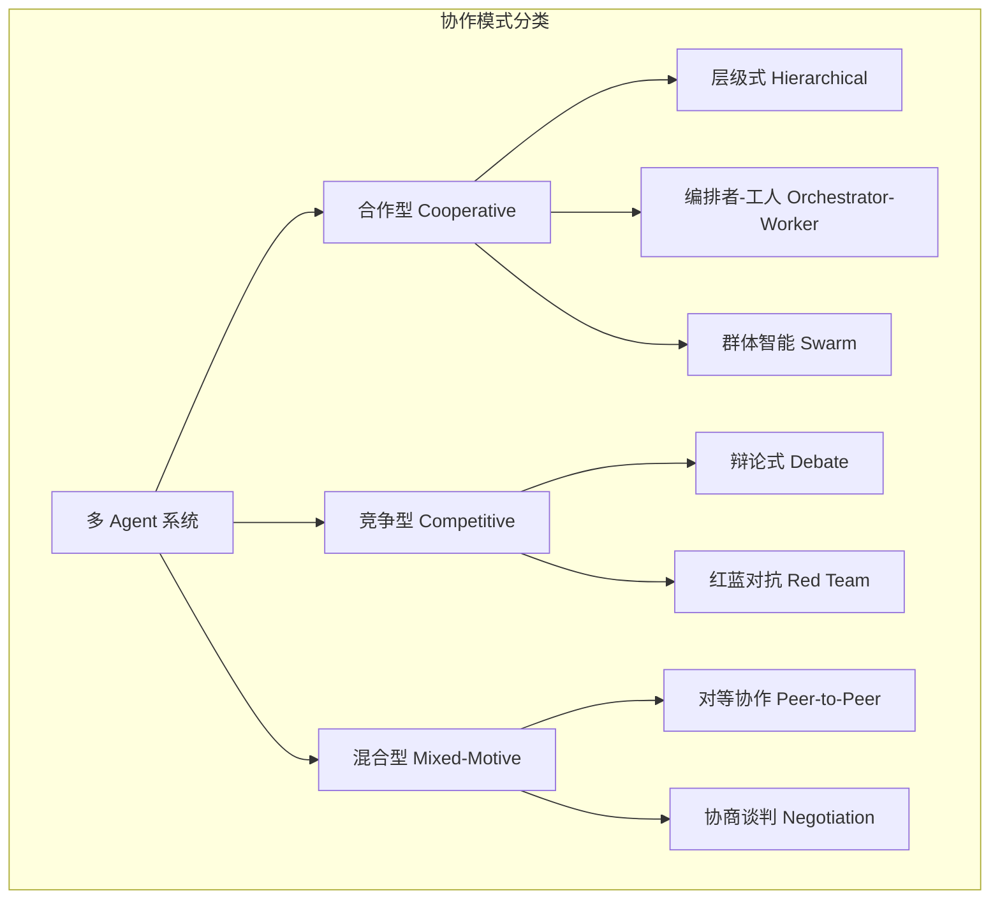
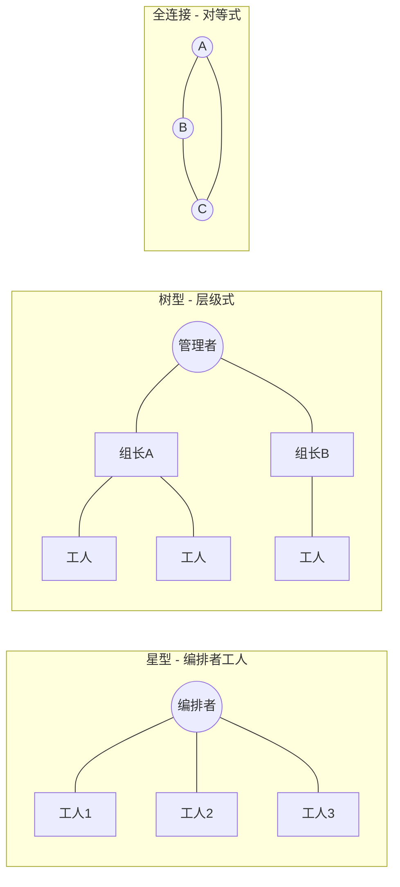

# 多 Agent 协作模式总览

## 为什么需要多 Agent

单个 Agent 在处理复杂任务时面临三重瓶颈：上下文窗口限制导致信息丢失、单一提示词难以同时胜任多种专业角色、以及缺乏自我验证的"盲点"。多 Agent 系统（Multi-Agent System, MAS）通过将复杂任务分解给多个专业化 Agent，实现了三大核心优势 [Wooldridge, 2009]。

**分工协作（Division of Labor）**：每个 Agent 只需关注自己擅长的子任务，降低了单个 Agent 的认知负担。一个 Agent 尝试同时扮演研究员、程序员、测试员和写手时，每个角色的表现都会下降。将这些角色分配给专门的 Agent，每个角色都能达到更高的质量标准。

**专业化（Specialization）**：为每个 Agent 配置针对性的系统提示词、工具集和记忆策略。Research Agent 配备搜索工具和学术数据库访问权限；Coding Agent 配备代码执行环境和 IDE 集成；Review Agent 配备静态分析工具和代码规范库。专业化让每个 Agent 在自己的领域内表现得更像"专家"。

**鲁棒性（Robustness）**：冗余设计带来容错能力。当某个 Agent 产出错误结果时，下游的审查 Agent 可以检测并修正；当某个 Agent 完全失败时，系统可以将任务重新分配给备选 Agent。这种多重验证机制远优于单 Agent 的"一次生成"。

## 协作模式分类学

从博弈论视角出发，多 Agent 协作模式可分为三大类：

**合作型（Cooperative）**：所有 Agent 共享同一目标函数，通过协作最大化全局收益。典型场景包括软件开发团队（所有角色共同目标是交付高质量软件）、研究助理群组（共同目标是产出准确全面的研究报告）。合作型系统的挑战在于协调效率——如何减少沟通开销同时保持信息同步。

**竞争型（Competitive）**：Agent 之间存在对抗关系，通过竞争产生更优解。典型场景包括辩论系统（通过正反方论证逼近真相）、红蓝对抗（红队找漏洞迫使蓝队加强防御）。竞争型系统的价值在于对抗暴露了单方视角的盲点。

**混合型（Mixed-Motive）**：Agent 有各自的局部目标，但需要通过协商达成全局一致。典型场景包括多部门协调（产品要速度、安全要合规、运维要稳定）、资源分配谈判。混合型最接近现实世界的协作模式。



## 关键协作模式概览

### 层级式（Hierarchical）

树状组织结构，从战略层到执行层逐级分解。适合极复杂任务，如大型软件项目。MetaGPT [Hong et al., 2023] 采用此模式，模拟产品经理、架构师、程序员、测试员的开发流程。每一层处理不同抽象级别的决策，信息逐层细化。

### 编排者-工人模式（Orchestrator-Worker）

中心化调度，编排者负责任务分解和结果聚合，工人负责具体执行。类似于 MapReduce 的思想——Map 阶段分发任务，Reduce 阶段聚合结果。AutoGen [Wu et al., 2023] 和 CrewAI 的基础模式都属于此类。这是最常用的多 Agent 模式，因为它在控制性和灵活性之间取得了良好平衡。

### 对等协作（Peer-to-Peer）

去中心化架构，Agent 之间直接通信、协商决策。无单点故障，但协调开销大。适合创意型任务和头脑风暴场景。Agent 之间通过提议-协商-共识的过程达成决策，类似于开源社区的协作方式。

### 辩论式（Debate）

多个 Agent 对同一问题提出不同观点，通过多轮辩论逼近真相。Du et al. [2023] 的研究表明，LLM 辩论能显著提升事实准确性——在算术推理任务上提升超过 20%。辩论强迫 Agent 为自己的立场提供证据和逻辑链，暴露了单 Agent 模式中隐藏的推理错误。

### 群体智能（Swarm）

大量简单 Agent 通过局部交互产生涌现行为。每个 Agent 遵循简单规则，但群体层面产生复杂的智能行为——类似蚁群和鸟群。OpenAI Swarm 框架探索了这一方向，适合需要高度并行的探索型任务，如大规模代码库搜索或多路径问题求解。



## 何时使用多 Agent vs 单 Agent

并非所有场景都需要多 Agent。引入多 Agent 会带来协调开销（Coordination Overhead），包括通信延迟、token 消耗增加和调试复杂度上升。工程师需要在单 Agent 的简洁性和多 Agent 的能力之间做出权衡。

**适合单 Agent 的场景**：任务可在一次对话中完成（如回答一个问题、写一段代码）、所需能力单一（不需要跨领域知识）、对延迟敏感（用户等待实时响应）、预算有限（token 成本需要控制）。

**适合多 Agent 的场景**：任务涉及多个专业领域（如同时需要编码、测试和文档）、需要自我验证和质量保证（如生成需要事实核查的内容）、任务可并行分解（如同时研究多个子话题）、需要多视角审视决策（如架构设计的权衡分析）。

一个实用的**复杂度阈值**判断方法：当单 Agent 的系统提示词超过 2000 token，或需要同时管理超过 5 种工具，或任务有 3 个以上独立子目标时，应认真考虑多 Agent 方案。

## 协调开销的权衡

多 Agent 系统的总成本可以表示为：

```
总成本 = Sum(单 Agent 执行成本) + 通信成本 + 协调成本 + 冲突解决成本
```

其中通信成本随 Agent 数量的增长而增长。在全连接拓扑中，通信复杂度为 O(n^2)——每对 Agent 之间都可能通信；在星型拓扑中为 O(n)——所有通信经过中心节点；在树型拓扑中为 O(n*log(n))——信息沿树的路径传递。

工程实践中的优化策略包括：限制通信频率（批量交换而非实时同步，类似于 Git 的 commit-push 模式）、压缩传递信息（摘要替代全文，只传递关键结论而非完整推理过程）、选择合适的拓扑结构以控制通信路径数量。

一个经验法则是：多 Agent 系统的 token 消耗通常是等效单 Agent 的 2-5 倍，延迟是 1.5-3 倍。只有当质量提升或任务范围扩展能证明这些额外成本时，多 Agent 才是正确选择。

## 框架生态概览

当前主流多 Agent 框架各有侧重：

**AutoGen**（微软）是灵活的会话式多 Agent 框架，支持人机协作和复杂的对话流编排。适合研究和快速原型验证，其可编程的对话模式让实验不同协作策略变得容易。

**CrewAI** 强调角色定义和流程编排，提供了清晰的 Role-Task-Crew 三层抽象。API 简洁直观，适合需要快速上手的生产级应用。

**MetaGPT** 模拟软件公司的多角色协作，内置了标准化的 SOP 流程（从需求到代码的完整链路）。特别适合软件工程类任务。

**LangGraph** 基于图的 Agent 编排，将 Agent 工作流建模为状态图。提供细粒度的状态管理、条件分支和循环控制，适合需要精确流程控制的场景。

**OpenAI Swarm** 是实验性框架，探索大规模 Agent 群体的涌现行为。它采用极简设计——Agent 之间通过 handoff 机制传递控制权，适合理解 Agent 协作的基本原理。

## 选择指南

根据项目特征选择协作模式时，可以参考以下对照表：

明确分工且 5 个以内 Agent 的场景，推荐编排者-工人模式，可用 CrewAI 或 AutoGen 实现。复杂项目需要多层管理时，推荐层级式架构，MetaGPT 是成熟选择。创意探索类任务（无明确正确答案）适合对等协作，通常需要自定义实现。需要高准确性验证的场景适合辩论式，AutoGen 的对话模式可以支持。大规模并行搜索或探索适合群体智能，OpenAI Swarm 提供了参考实现。

混合使用也是常见策略——例如顶层用层级式组织多个团队，每个团队内部用编排者-工人模式，关键决策点引入辩论机制进行质量把关。

## 实践中的设计考量

### 渐进式复杂度

建议从最简单的架构开始，在需要时逐步增加复杂度。典型演进路径为：单 Agent（验证基本能力）到双 Agent（引入审查/验证）到编排者加多 Worker（并行化）到层级架构（大规模协作）。每一步增加复杂度都应该有明确的质量或能力提升作为驱动。

### Agent 数量的上限

实践表明，一个多 Agent 系统中活跃参与的 Agent 数量不宜超过 7-10 个。超过这个数量，协调成本会急剧上升，系统行为变得难以预测和调试。如果任务确实需要更多 Agent，应该通过层级架构将其组织为多个小团队。

### 可观测性设计

多 Agent 系统的调试难度远高于单 Agent。从设计之初就应该内置可观测性：每条 Agent 间的消息都应该被记录、每个决策点都应该有 trace、每个 Agent 的输入输出都应该可以独立审计。这是从单 Agent 过渡到多 Agent 时最容易被忽视但最影响工程效率的点。

### 成本与质量的平衡

```python
# 多 Agent 系统的简单成本模型
def estimate_cost(num_agents: int, topology: str, 
                  avg_tokens_per_agent: int, rounds: int) -> dict:
    """估算多 Agent 系统的运行成本"""
    
    # 基础执行成本
    base_cost = num_agents * avg_tokens_per_agent * rounds
    
    # 通信开销（取决于拓扑）
    if topology == "star":
        comm_factor = num_agents  # O(n)
    elif topology == "full_mesh":
        comm_factor = num_agents * (num_agents - 1) / 2  # O(n^2)
    elif topology == "tree":
        import math
        comm_factor = num_agents * math.log2(max(num_agents, 2))  # O(n*logn)
    else:
        comm_factor = num_agents
    
    # 通信成本（假设每次通信平均 500 token）
    comm_cost = comm_factor * 500 * rounds
    
    total_tokens = base_cost + comm_cost
    
    return {
        "total_tokens": int(total_tokens),
        "base_execution_tokens": int(base_cost),
        "communication_tokens": int(comm_cost),
        "communication_overhead_pct": round(comm_cost / total_tokens * 100, 1),
    }

# 示例：5 个 Agent 的星型拓扑，3 轮交互
result = estimate_cost(num_agents=5, topology="star",
                       avg_tokens_per_agent=2000, rounds=3)
# 输出：总 token 约 37500，其中通信开销占 20%
```

### 失败模式与防御

多 Agent 系统常见的失败模式包括：无限循环（Agent A 要求 Agent B 修改，B 修改后 A 又要求改回来）、群体思维（所有 Agent 收敛到同一个错误答案）、角色混乱（Agent 偏离自己的专业领域做出不当判断）。防御措施包括设置最大交互轮次、引入多样性约束（确保不同 Agent 使用不同的推理策略）、严格的角色边界检查。

## 本章小结

多 Agent 系统通过分工协作实现了超越单 Agent 的能力边界。选择协作模式时需要权衡任务复杂度、协调开销和系统可控性。层级式适合结构化的复杂项目，编排者-工人模式适合有明确分工的并行任务，对等协作适合创意探索，辩论式适合需要高质量输出的决策场景。后续章节将逐一深入每种模式的设计原理和工程实现。

## 延伸阅读

- [Wooldridge, 2009] *An Introduction to MultiAgent Systems* — 多 Agent 系统经典教材
- [Hong et al., 2023] "MetaGPT: Meta Programming for A Multi-Agent Collaborative Framework"
- [Wu et al., 2023] "AutoGen: Enabling Next-Gen LLM Applications via Multi-Agent Conversation"
- [Du et al., 2023] "Improving Factuality and Reasoning in Language Models through Multiagent Debate"
- [Li et al., 2023] "CAMEL: Communicative Agents for Mind Exploration of Large Language Model Society"
- [Park et al., 2023] "Generative Agents: Interactive Simulacra of Human Behavior"
- 相关章节：[Agent 架构总览](../06-architecture/router-architecture.md)、[规划模块](../07-core-modules/planning.md)
