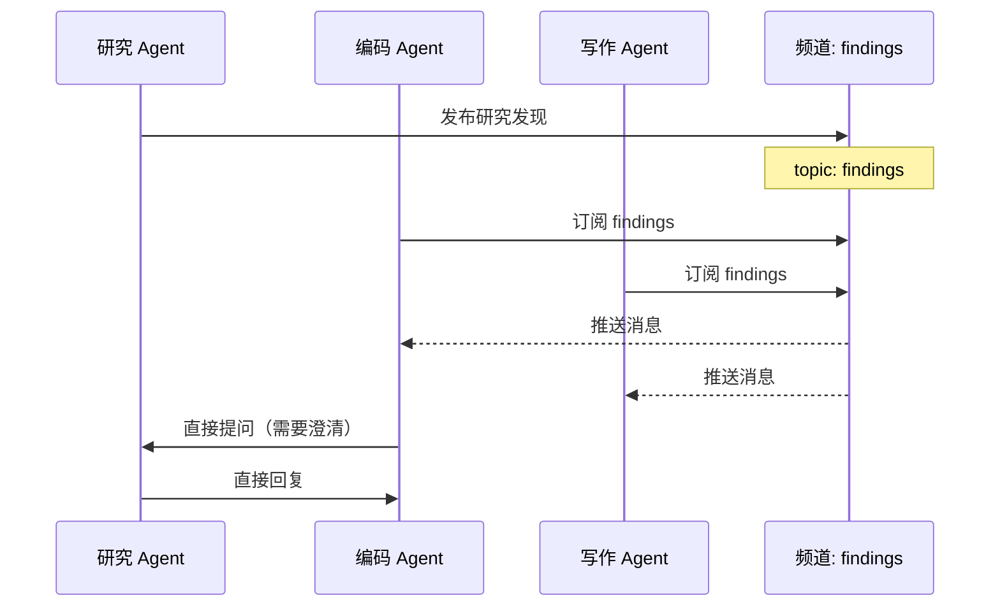
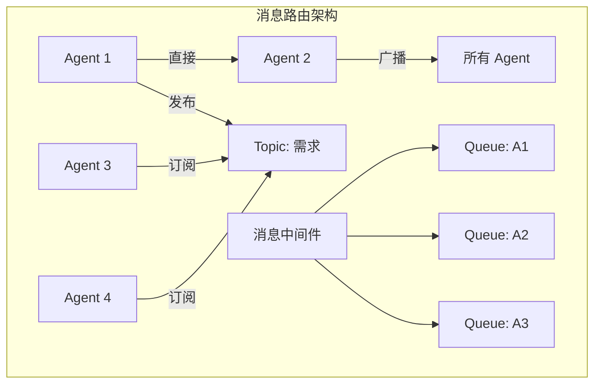

# 通信协议：Agent 间的信息交换

## 通信是多 Agent 协作的基石

在多 Agent 系统中，Agent 之间的通信质量直接决定了协作效率。设计不良的通信协议会导致信息丢失、误解和无效交互，最终表现为系统性能下降和输出质量劣化。

通信协议设计需要回答四个核心问题：用什么格式（Format）、通过什么渠道（Channel）、何时通信（Timing）、传递多少信息（Bandwidth）。

## 消息格式

### 自然语言 vs 结构化格式

Agent 间通信可以使用自然语言（Natural Language）或结构化格式（Structured Format）。两者各有权衡：

自然语言的优势在于表达灵活、LLM 原生友好、易于调试（人可直接阅读）。但它的问题是解析不确定性——接收方 Agent 可能对同一段文字产生不同理解。

结构化格式（JSON、函数调用等）消除了解析歧义，但牺牲了表达的灵活性。实践中推荐混合方案：顶层使用结构化信封（envelope），内容部分允许自然语言。

```python
from dataclasses import dataclass, field
from typing import Any
from datetime import datetime

@dataclass
class AgentMessage:
    """Agent 间通信的标准消息格式"""
    # 结构化信封
    msg_id: str
    sender: str
    receiver: str  # 可以是具体 Agent ID 或频道名
    msg_type: str  # "task", "result", "question", "feedback", "broadcast"
    timestamp: datetime = field(default_factory=datetime.now)
    reply_to: str = ""  # 关联消息 ID
    priority: int = 0   # 0=normal, 1=high, 2=urgent
    
    # 内容部分（允许自然语言）
    content: str = ""
    structured_data: dict[str, Any] = field(default_factory=dict)
    
    # 元数据
    context_summary: str = ""  # 传递精简上下文
    requires_response: bool = False
    ttl: int = -1  # 消息存活时间（轮次），-1 表示永不过期


class MessageSerializer:
    """消息序列化，支持多种格式"""
    
    @staticmethod
    def to_json(msg: AgentMessage) -> dict:
        return {
            "id": msg.msg_id,
            "from": msg.sender,
            "to": msg.receiver,
            "type": msg.msg_type,
            "content": msg.content,
            "data": msg.structured_data,
            "context": msg.context_summary,
            "meta": {
                "timestamp": msg.timestamp.isoformat(),
                "reply_to": msg.reply_to,
                "priority": msg.priority,
            }
        }
    
    @staticmethod
    def to_natural_language(msg: AgentMessage) -> str:
        """转换为自然语言，用于注入 LLM 上下文"""
        return f"[来自 {msg.sender}] {msg.content}"
```

## 通信渠道模式

### 直接通信（Direct）

点对点通信，发送方明确指定接收方。适合任务分配和结果返回等确定性交互。

### 广播（Broadcast）

发送方向所有 Agent 发送同一消息。适合全局通知、状态变更公告。但在 Agent 数量大时可能造成信息过载。

### 基于主题的通信（Topic-Based）

Agent 订阅感兴趣的话题频道，消息发送到频道而非特定 Agent。解耦了发送方和接收方，提供了灵活的多对多通信。



## 同步 vs 异步通信

**同步通信**：发送方等待接收方回复后才继续。适合强依赖场景（如需要对方输出才能继续工作）。缺点是可能造成阻塞。

**异步通信**：发送方发出消息后立即继续工作，接收方在方便时处理。适合并行任务。需要消息队列和回调机制。

```python
import asyncio
from collections import defaultdict

class MessageBroker:
    """异步消息中间件"""
    
    def __init__(self):
        self.queues: dict[str, asyncio.Queue] = defaultdict(asyncio.Queue)
        self.topics: dict[str, list[str]] = defaultdict(list)  # topic -> subscribers
    
    async def send_direct(self, msg: AgentMessage):
        """直接发送"""
        await self.queues[msg.receiver].put(msg)
    
    async def publish(self, topic: str, msg: AgentMessage):
        """发布到主题"""
        for subscriber in self.topics[topic]:
            await self.queues[subscriber].put(msg)
    
    def subscribe(self, agent_id: str, topic: str):
        """订阅主题"""
        self.topics[topic].append(agent_id)
    
    async def receive(self, agent_id: str, timeout: float = None) -> AgentMessage:
        """接收消息（可设超时）"""
        try:
            return await asyncio.wait_for(
                self.queues[agent_id].get(), timeout=timeout
            )
        except asyncio.TimeoutError:
            return None
```

## 上下文共享策略

多 Agent 通信中最关键的设计决策之一是：传递多少上下文信息。传递过多会消耗 token 并增加接收方的处理负担；传递过少则可能导致接收方缺乏足够信息做出正确决策。

### 摘要转发策略

```python
class ContextManager:
    """管理 Agent 间的上下文传递"""
    
    async def prepare_context(self, full_context: str, 
                               receiver_role: str,
                               relevance_threshold: float = 0.7) -> str:
        """为接收方准备适当的上下文"""
        # 策略1：基于角色过滤
        relevant_parts = await self._filter_by_relevance(
            full_context, receiver_role, relevance_threshold
        )
        
        # 策略2：压缩摘要
        if len(relevant_parts) > 2000:  # token 数阈值
            return await self._summarize(relevant_parts)
        
        return relevant_parts
    
    async def _summarize(self, content: str) -> str:
        """使用 LLM 生成结构化摘要"""
        prompt = f"""
        将以下内容压缩为关键信息摘要，保留：
        - 核心结论和决策
        - 关键数据和指标
        - 未解决的问题
        
        原文：{content}
        """
        return await llm_call(prompt)
```

### 带宽管理原则

实践中推荐的上下文传递层级：第一层是摘要（Summary）——最精简的信息，通常 100-200 token。第二层是关键细节（Key Details）——支撑结论的关键证据。第三层是完整内容（Full Content）——仅在明确需要时转发原文。

默认使用第一层，当接收方明确请求更多细节时逐级升级。

## A2A 协议：标准化的 Agent 通信

Google 提出的 Agent-to-Agent（A2A）协议旨在标准化不同框架、不同组织的 Agent 之间的通信。其核心设计包括：

**Agent Card**：描述 Agent 能力和接口的元数据文件，类似于 API 的 OpenAPI 规范。

**Task 生命周期**：标准化的任务状态流转（submitted -> working -> completed/failed）。

**Message Parts**：支持文本、文件、结构化数据等多种内容类型的消息格式。

A2A 协议解决了异构 Agent 互操作的问题——不同框架构建的 Agent 只要遵循同一协议就能互相通信，类似于 HTTP 对 Web 服务的统一作用。

## 会话管理

### 线程化（Threading）

多 Agent 对话容易变得混乱。线程化将相关消息组织成逻辑线程（Thread），每个线程追踪一个话题或子任务的完整生命周期。

### 上下文窗口管理

当通信历史超过 LLM 的上下文窗口时，需要淘汰策略：保留最近的 N 条消息（时间局部性）、保留与当前任务相关的消息（相关性过滤）、用摘要替代旧消息（渐进摘要）。



## 本章小结

通信协议是多 Agent 系统的神经网络。核心设计要点包括：采用结构化信封加自然语言内容的混合消息格式、根据场景选择直接/广播/主题通信渠道、善用异步通信提升并行效率、通过摘要策略控制上下文传递的带宽。A2A 等标准协议的出现正在推动 Agent 互操作的生态建设。

## 延伸阅读

- [Google, 2024] "Agent-to-Agent (A2A) Protocol Specification"
- [FIPA, 2002] "FIPA Agent Communication Language Specifications" — 经典 Agent 通信标准
- [Wu et al., 2023] "AutoGen: Enabling Next-Gen LLM Applications via Multi-Agent Conversation"
- 相关章节：[共享记忆](./shared-memory.md)、[对等协作](./peer-to-peer.md)
