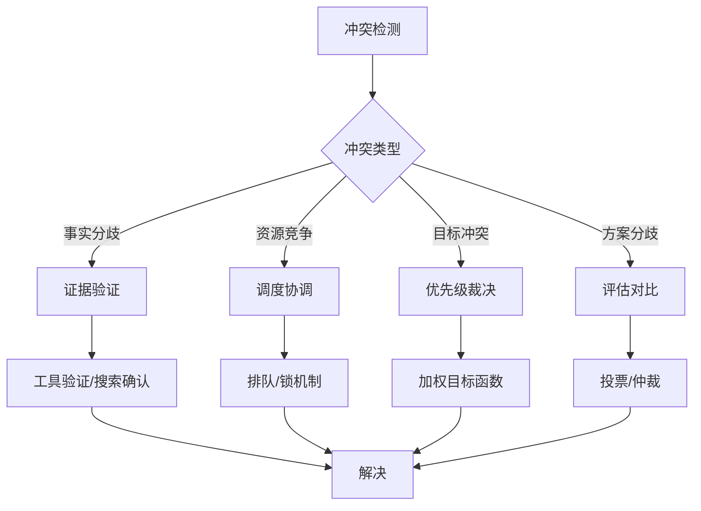
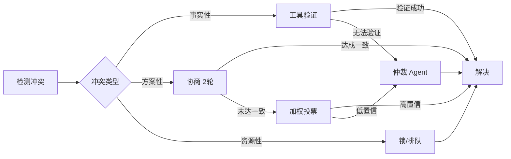

# 冲突解决：当 Agent 意见不一致

## 冲突的必然性

多 Agent 系统中的冲突不是异常，而是常态。当多个具有不同"视角"和"专长"的 Agent 处理同一问题时，产生分歧是系统设计的必然结果——这恰恰是我们引入多 Agent 的原因之一（通过多样性提升决策质量）。

关键不在于消除冲突，而在于建立高效的冲突解决机制，将分歧转化为更高质量的输出。

## 冲突类型

### 事实性分歧（Factual Disagreement）

Agent 对客观事实持有不同判断。例如，Research Agent 说"Python 3.12 支持该特性"，而 Coding Agent 说"该特性在 3.13 才引入"。

### 资源竞争（Resource Contention）

多个 Agent 需要同时使用或修改同一资源。例如，两个编码 Agent 同时修改同一个文件，或同时调用有频率限制的 API。

### 目标冲突（Goal Conflict）

Agent 的局部目标之间存在矛盾。例如，Performance Agent 建议增加缓存（提升速度），而 Security Agent 建议减少缓存（降低数据泄露风险）。

### 方案分歧（Solution Disagreement）

对同一问题提出不同的解决方案。例如，一个 Agent 建议用微服务架构，另一个建议用单体架构。



## 解决策略

### 投票机制（Voting）

最直接的民主化决策方式。每个 Agent 对争议点投票，多数意见胜出。

**简单多数投票**：过半即通过，简单但可能忽略少数派的重要洞察。

**加权投票**：根据 Agent 的专业相关度赋予不同权重。例如在性能优化决策中，Performance Agent 的投票权重高于 UI Agent。

```python
from dataclasses import dataclass

@dataclass
class Vote:
    agent_id: str
    choice: str
    confidence: float  # 0-1
    rationale: str

class VotingSystem:
    """多 Agent 投票决策系统"""
    
    def __init__(self, agent_weights: dict[str, float] = None):
        self.weights = agent_weights or {}
    
    def simple_majority(self, votes: list[Vote]) -> dict:
        """简单多数投票"""
        tally = {}
        for vote in votes:
            tally[vote.choice] = tally.get(vote.choice, 0) + 1
        
        winner = max(tally, key=tally.get)
        return {
            "decision": winner,
            "vote_count": tally,
            "unanimity": len(set(v.choice for v in votes)) == 1
        }
    
    def weighted_vote(self, votes: list[Vote], topic: str) -> dict:
        """加权投票"""
        weighted_tally = {}
        for vote in votes:
            weight = self.weights.get(vote.agent_id, 1.0)
            # 综合权重 = 角色权重 * 置信度
            effective_weight = weight * vote.confidence
            weighted_tally[vote.choice] = (
                weighted_tally.get(vote.choice, 0) + effective_weight
            )
        
        winner = max(weighted_tally, key=weighted_tally.get)
        total_weight = sum(weighted_tally.values())
        winner_ratio = weighted_tally[winner] / total_weight
        
        return {
            "decision": winner,
            "weighted_scores": weighted_tally,
            "winner_ratio": winner_ratio,
            "high_confidence": winner_ratio > 0.7
        }
```

### 权威层级（Authority Hierarchy）

在层级架构中，上级 Agent 有最终裁决权。当下级 Agent 之间产生冲突无法自行解决时，将分歧上报给共同上级，由上级根据全局视角做出裁决。

### 证据仲裁（Evidence-Based Arbitration）

设立专门的仲裁 Agent（Arbitrator），基于证据强度做出判断。仲裁者不参与实际工作，保持中立性。

```python
class ArbitratorAgent:
    """仲裁 Agent：基于证据解决冲突"""
    
    def __init__(self):
        self.system_prompt = """
        你是一个中立的仲裁者。你的职责是：
        1. 不偏袒任何一方
        2. 基于证据的强度和逻辑的严密性做判断
        3. 当证据不足时，建议收集更多信息而非猜测
        4. 给出裁决时必须说明理由
        """
    
    async def arbitrate(self, conflict: dict) -> dict:
        """对冲突做出裁决"""
        prompt = f"""
        冲突描述：{conflict['description']}
        
        方A（{conflict['party_a']['agent']}）的立场：
        {conflict['party_a']['position']}
        证据：{conflict['party_a']['evidence']}
        
        方B（{conflict['party_b']['agent']}）的立场：
        {conflict['party_b']['position']}
        证据：{conflict['party_b']['evidence']}
        
        请做出裁决：
        1. 哪方的论据更有说服力？为什么？
        2. 对方的论据有什么不足？
        3. 是否需要更多信息才能做出最终判断？
        4. 你的裁决结论是什么？
        """
        response = await llm_call(self.system_prompt, prompt)
        return {
            "decision": response["conclusion"],
            "reasoning": response["reasoning"],
            "needs_more_info": response.get("needs_more_info", False),
            "confidence": response.get("confidence", 0.8)
        }
```

## 资源冲突处理

当多个 Agent 需要修改同一资源（如同一个文件、同一个数据库记录）时，采用类似数据库的并发控制机制：

**乐观锁**：Agent 先执行修改，提交时检查是否有冲突。如果有，回退并重新尝试。适合冲突率低的场景。

**悲观锁**：Agent 在修改前先获取锁，完成后释放。防止冲突但可能降低并行度。

**分区策略**：将资源预先分区，每个 Agent 只负责自己分区内的部分。彻底避免冲突但灵活性降低。

## 优先级系统

当冲突无法通过协商解决时，预定义的优先级规则提供了确定性的解决方案：

**基于角色优先级**：某些角色的输出在特定场景下优先级更高。例如安全审查结果优先于性能优化建议。

**基于置信度**：输出中附带置信度分数，高置信度的结果优先。

**基于时效性**：更新的信息覆盖旧的信息（last-writer-wins）。

**基于用户偏好**：用户预设的偏好规则（如"安全优先"或"速度优先"）决定优先级。

## 死锁检测与打破

死锁发生在 Agent 之间形成循环等待时：Agent A 等待 B 的输出，B 等待 C 的输出，C 又等待 A 的输出。

```python
class DeadlockDetector:
    """死锁检测器"""
    
    def __init__(self):
        self.wait_graph: dict[str, str] = {}  # agent -> waiting_for_agent
    
    def register_wait(self, agent_id: str, waiting_for: str):
        """注册等待关系"""
        self.wait_graph[agent_id] = waiting_for
    
    def detect_deadlock(self) -> list[str]:
        """检测死锁环路"""
        visited = set()
        for start in self.wait_graph:
            path = []
            current = start
            while current and current not in visited:
                if current in path:
                    # 找到环路
                    cycle_start = path.index(current)
                    return path[cycle_start:]
                path.append(current)
                current = self.wait_graph.get(current)
            visited.update(path)
        return []
    
    def break_deadlock(self, cycle: list[str]) -> str:
        """打破死锁：选择优先级最低的 Agent 回退"""
        # 选择环中优先级最低的 Agent 重置其任务
        lowest_priority = min(cycle, key=lambda a: self._get_priority(a))
        del self.wait_graph[lowest_priority]
        return lowest_priority  # 通知该 Agent 放弃当前等待，尝试替代方案
```

## 冲突解决流水线

实际系统中，冲突解决通常是一个多阶段流水线：



第一阶段是冲突检测：通过比对 Agent 输出发现不一致。第二阶段是分类：确定冲突类型以选择对应策略。第三阶段是解决：执行具体的解决策略。第四阶段是验证：确认解决方案被所有相关 Agent 接受。

## 工程最佳实践

设计冲突解决机制时，建议遵循以下原则：尽早检测（在冲突扩大前发现）、分级处理（简单冲突自动解决，复杂冲突上升仲裁）、记录决策（保存冲突和解决过程用于审计和学习）、避免过度共识（并非所有分歧都需要解决，有些可以"求同存异"）。

## 本章小结

冲突解决是多 Agent 系统健壮性的保障。核心机制包括：投票（简单多数或加权）、权威裁决（上级或仲裁 Agent）、证据仲裁（基于论据强度）、优先级系统（预定义规则）和死锁处理（检测+打破）。好的冲突解决机制不是消除分歧，而是将分歧转化为更全面的决策。

## 延伸阅读

- [Rosenschein & Zlotkin, 1994] *Rules of Encounter: Designing Conventions for Automated Negotiation*
- [Durfee, 1999] "Distributed Problem Solving and Planning" — 分布式冲突解决理论
- [Wooldridge, 2009] *An Introduction to MultiAgent Systems* — 第11章 协商与仲裁
- 相关章节：[辩论与讨论](./debate-and-discussion.md)、[共享记忆](./shared-memory.md)
