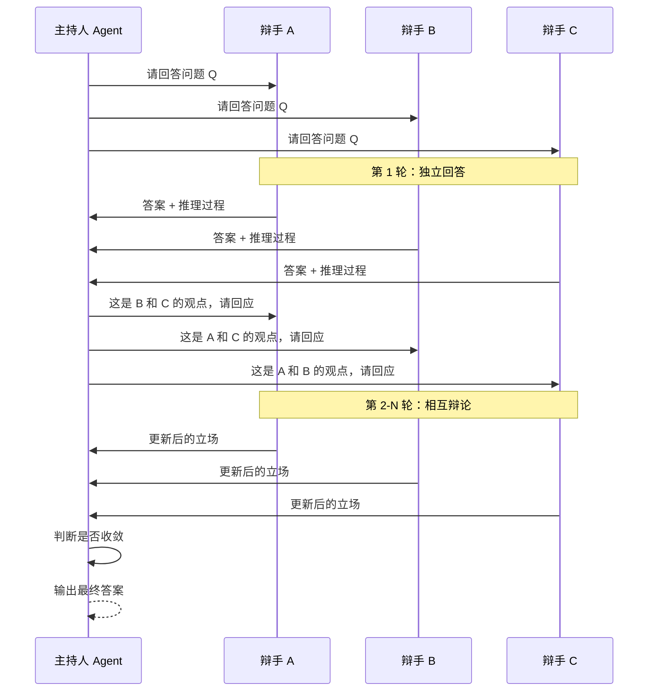

# 辩论与讨论：通过对抗提升质量

## 为什么辩论能提升质量

LLM 存在一个根本性弱点：它们无法可靠地自我验证。单个 Agent 产出的结果往往包含幻觉（Hallucination）、逻辑跳跃和事实错误，而 Agent 自身很难发现这些问题——这就像让考生自己批改自己的试卷。

多 Agent 辩论（Multi-Agent Debate）通过引入"对手"来解决这个问题。Du et al. [2023] 的开创性研究表明，当多个 LLM Agent 围绕同一问题展开辩论时，它们的事实准确性和推理能力都显著提升。这一现象的本质是：反驳迫使 Agent 重新审视自己的推理链，找出漏洞并修正。

## 多 Agent 辩论框架

### 基本辩论流程



### 实现代码

```python
from dataclasses import dataclass

@dataclass
class DebateRound:
    round_number: int
    positions: dict[str, str]  # agent_name -> position
    arguments: dict[str, str]  # agent_name -> reasoning

class DebateSystem:
    def __init__(self, debaters: list[dict], moderator_prompt: str,
                 max_rounds: int = 4):
        self.debaters = debaters  # [{"name": ..., "system_prompt": ...}]
        self.moderator_prompt = moderator_prompt
        self.max_rounds = max_rounds
        self.history: list[DebateRound] = []
    
    async def run_debate(self, question: str) -> dict:
        """执行完整辩论流程"""
        
        # 第一轮：独立回答
        initial_positions = {}
        for debater in self.debaters:
            response = await self._get_initial_position(debater, question)
            initial_positions[debater["name"]] = response
        
        self.history.append(DebateRound(1, initial_positions, initial_positions))
        
        # 后续轮次：互相辩论
        for round_num in range(2, self.max_rounds + 1):
            new_positions = {}
            for debater in self.debaters:
                others_views = {
                    k: v for k, v in self.history[-1].positions.items()
                    if k != debater["name"]
                }
                response = await self._debate_round(
                    debater, question, others_views, round_num
                )
                new_positions[debater["name"]] = response
            
            self.history.append(DebateRound(round_num, new_positions, new_positions))
            
            # 检查收敛
            if self._has_converged(new_positions):
                break
        
        # 主持人总结
        return await self._moderator_judgment(question)
    
    async def _debate_round(self, debater: dict, question: str,
                            others: dict, round_num: int) -> str:
        """单轮辩论"""
        prompt = f"""
        问题：{question}
        
        你之前的立场：{self.history[-1].positions[debater['name']]}
        
        其他辩手的观点：
        {self._format_others(others)}
        
        请：
        1. 指出其他观点中的错误或不足
        2. 回应对你观点的潜在质疑
        3. 给出你更新后的答案（可以维持原观点或修改）
        """
        return await llm_call(debater["system_prompt"], prompt)
    
    def _has_converged(self, positions: dict) -> bool:
        """检查是否所有辩手达成一致"""
        values = list(positions.values())
        # 简化判断：检查核心结论是否一致
        return len(set(self._extract_conclusion(v) for v in values)) == 1
    
    async def _moderator_judgment(self, question: str) -> dict:
        """主持人基于辩论历史做出最终判断"""
        prompt = f"""
        {self.moderator_prompt}
        
        问题：{question}
        辩论历史：{self._format_history()}
        
        请基于各方论据的逻辑强度和证据支撑，给出最终判断。
        说明你采纳了哪些论点，拒绝了哪些，以及原因。
        """
        return await llm_call("你是公正客观的辩论主持人", prompt)
```

## 苏格拉底方法：挑战者 Agent

苏格拉底式追问（Socratic Questioning）是辩论的轻量级变体。不需要多个完整的辩手，只需一个专门的"挑战者 Agent"（Challenger）来质疑主 Agent 的每一个断言。

挑战者 Agent 的系统提示词设计重点是：不提供自己的答案，只提出尖锐的反问。例如："你说 X 是因为 Y，但如果 Z 情况成立呢？"、"你的推理从第 3 步到第 4 步的逻辑跳跃是否成立？"、"你引用的事实来源是什么？"

这种方式的 token 成本远低于完整辩论，但仍能有效暴露推理漏洞。

## 红蓝对抗（Red Team / Blue Team）

红蓝对抗模式来自网络安全领域，在 Agent 系统中被用于对抗性质量保证：

**蓝队 Agent（Builder）**：负责完成用户的任务，产出初始结果。

**红队 Agent（Attacker）**：尝试在蓝队的输出中找到错误、漏洞、不一致和潜在风险。

**裁判 Agent（Judge）**：评估红队发现的问题是否有效，决定蓝队是否需要修正。

```python
class RedBlueTeam:
    def __init__(self):
        self.blue = Agent(prompt="你是一个严谨的内容创作者...")
        self.red = Agent(prompt="你是一个专业的质量审查员，专注于找出错误和漏洞...")
        self.judge = Agent(prompt="你是公正的裁判，评估问题是否成立...")
    
    async def adversarial_review(self, task: str, max_iterations: int = 3):
        """对抗性审查流程"""
        # 蓝队产出
        output = await self.blue.execute(task)
        
        for i in range(max_iterations):
            # 红队攻击
            issues = await self.red.find_issues(output)
            
            if not issues:
                break  # 红队找不到问题，质量通过
            
            # 裁判评估
            valid_issues = await self.judge.evaluate(output, issues)
            
            if not valid_issues:
                break  # 裁判认为红队的问题不成立
            
            # 蓝队修正
            output = await self.blue.fix_issues(output, valid_issues)
        
        return output
```

## Society of Mind：多元视角

Minsky [1986] 提出的"心智社会"（Society of Mind）理论认为，智能来自大量简单心智过程的协作。在多 Agent 系统中，这体现为让拥有不同"人格"或"专业视角"的 Agent 从各自角度审视同一问题。

例如，对于"是否应该在系统中引入缓存"这个决策，可以让以下视角的 Agent 分别发表意见：性能工程师（关注速度提升）、安全专家（关注缓存投毒风险）、运维工程师（关注复杂度增加）、产品经理（关注用户体验改善）。每个视角都是片面但有价值的，综合后能得到更全面的判断。

## CAMEL 的角色扮演方法

CAMEL [Li et al., 2023] 提出了一种有趣的双 Agent 协作范式：通过角色扮演（Role-Playing）让两个 Agent 在对话中互相推进任务。一个 Agent 扮演"用户"（提出需求和反馈），另一个扮演"助手"（执行任务并请求澄清）。

这种方法的独特之处在于：它将辩论内化为对话协作。"用户" Agent 通过提问和反馈间接地挑战"助手" Agent 的输出，而不是直接对抗。

## 收敛检测

辩论系统需要解决"何时停止"的问题。常用的收敛检测方法包括：观点不再变化（连续两轮所有 Agent 的核心结论相同）、达到最大轮次（预设上限，通常 3-5 轮）、主持人判断（让主持人 Agent 评估是否继续讨论有价值）。

## 适用场景

辩论式协作最适合：事实核查和准确性要求高的场景、需要权衡多个因素的决策问题、代码审查（一个 Agent 写代码，另一个审查）、方案评估（多方案对比论证）。不适合：简单明确的执行任务、时间敏感场景（辩论需要多轮）、创意生成（辩论可能抑制发散思维）。

## 本章小结

多 Agent 辩论通过引入对抗性机制，有效解决了单 Agent 自我验证困难的问题。核心实现包括：多轮辩论框架（独立回答到互相质疑到收敛）、苏格拉底挑战者（轻量级质疑）、红蓝对抗（系统化的质量保证）。辩论不是目的而是手段——最终目标是通过理性对抗产出更高质量的结果。

## 延伸阅读

- [Du et al., 2023] "Improving Factuality and Reasoning in Language Models through Multiagent Debate"
- [Li et al., 2023] "CAMEL: Communicative Agents for Mind Exploration of Large Language Model Society"
- [Liang et al., 2023] "Encouraging Divergent Thinking in Large Language Models through Multi-Agent Debate"
- [Minsky, 1986] *The Society of Mind* — 心智社会理论
- 相关章节：[冲突解决](./conflict-resolution.md)、[对等协作](./peer-to-peer.md)
