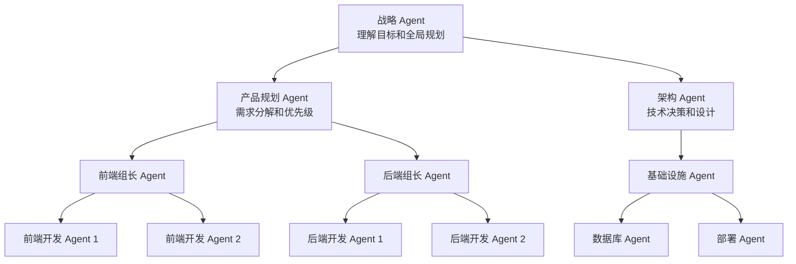

# 层级架构：多层管理的 Agent 组织

## 从现实组织到 Agent 层级

软件公司的组织架构是层级式 Agent 系统的天然蓝本。CTO 制定技术战略，技术总监将战略转化为季度目标，团队负责人将目标拆解为具体需求，工程师完成代码实现。每一层处理不同抽象级别的决策，信息逐层细化、结果逐层汇总。

层级式多 Agent 架构（Hierarchical Multi-Agent Architecture）将这一理念应用于 AI 系统：顶层 Agent 处理战略性问题，中层 Agent 负责战术协调，底层 Agent 执行具体操作。相比扁平的编排者-工人模式，层级架构的优势在于能够处理更大规模、更高复杂度的任务——编排者-工人模式中编排者的上下文窗口是瓶颈，而层级架构通过分层分解绕过了这个限制。



## 各层级的抽象级别

### 战略层（Strategy Layer）

最高层 Agent 负责理解用户的终极目标，制定整体方案。它不关心实现细节，而是决定"做什么"和"按什么顺序做"。战略层 Agent 通常拥有最强的推理能力（使用最大的模型如 GPT-4 或 Claude 3.5 Sonnet），但工具集最少——它几乎不直接操作外部系统，而是通过指令驱动下级。

战略层的输出是高层计划和方向指引，例如："这个项目需要分三个阶段：先搭建基础架构，再实现核心业务逻辑，最后做性能优化和测试"。

### 战术层（Tactics Layer）

中间层 Agent 将战略转化为可执行的任务组。它们理解自己管辖领域的专业知识，负责在约束条件下做出技术选择。

例如"架构 Agent"需要决定使用微服务还是单体架构、选择哪个数据库、API 设计遵循什么规范。"产品规划 Agent"需要确定功能优先级、迭代节奏、MVP 范围。这些决策既需要领域专业知识，也需要理解上层的战略意图。

战术层 Agent 的模型选择可以略低于战略层，但需要更丰富的领域知识（通过系统提示词或 RAG 提供）。

### 执行层（Execution Layer）

底层 Agent 负责具体的操作执行。它们拥有丰富的工具集但有限的决策权，专注于在给定指令下高质量完成单项任务。

执行层 Agent 可以使用较小、更快的模型（如 GPT-4o-mini 或 Claude 3.5 Haiku）以降低成本和延迟，因为它们的任务范围已经被上层充分约束。一个执行层 Agent 的典型任务可能是："根据以下 API 规范编写 Python 实现代码"——无需做架构决策，只需精确执行。

## 委派模式（Delegation Patterns）

### 基于能力的委派（Capability-Based）

根据 Agent 声明的能力标签（Capability Tags）进行任务路由。每个 Agent 注册自己能处理的任务类型，上级 Agent 根据任务需求匹配能力。

```python
from dataclasses import dataclass, field

@dataclass
class AgentCapability:
    agent_id: str
    skills: list[str]
    max_complexity: int  # 1-10 复杂度上限
    current_load: int = 0
    max_concurrent: int = 3

class ManagerAgent:
    """中层管理 Agent"""
    
    def __init__(self, subordinates: list[AgentCapability]):
        self.subordinates = subordinates
    
    def delegate(self, task: dict) -> str:
        """选择最合适的下级 Agent"""
        required_skills = task["required_skills"]
        complexity = task["complexity"]
        
        # 过滤能力满足的候选者
        candidates = [
            agent for agent in self.subordinates
            if all(skill in agent.skills for skill in required_skills)
            and agent.max_complexity >= complexity
            and agent.current_load < agent.max_concurrent
        ]
        
        if not candidates:
            return self._escalate_or_decompose(task)
        
        # 选择负载最低的候选者
        best = min(candidates, key=lambda a: a.current_load)
        best.current_load += 1
        return best.agent_id
    
    def _escalate_or_decompose(self, task: dict) -> str:
        """无合适候选者时的处理策略"""
        if task["complexity"] > 5:
            # 复杂度过高：尝试进一步拆分
            subtasks = self._decompose(task)
            results = [self.delegate(st) for st in subtasks]
            return f"DECOMPOSED:{results}"
        else:
            # 能力不足：向上级求助
            return "ESCALATE_TO_PARENT"
    
    def _decompose(self, task: dict) -> list[dict]:
        """将复杂任务拆分为更小的子任务"""
        # 由 LLM 决定如何拆分
        return []  # 实际实现调用 LLM
```

### 基于负载的委派（Load-Based）

当多个 Agent 具有相同能力时，优先分配给当前负载最轻的 Agent。这在大规模系统中保证了资源利用的均衡。负载指标可以是当前并发任务数、队列深度或平均响应时间。

### 基于领域的委派（Domain-Based）

按业务领域划分管辖范围，每个中层 Agent 负责一个业务域的所有事务。例如"支付域 Agent"管理所有支付相关的任务，"用户域 Agent"管理所有用户相关的任务。这种方式减少了跨域协调的频率，但可能导致信息孤岛——一个涉及两个域的任务需要额外的跨域协调机制。

## 信息流动机制

在层级架构中，信息遵循两个方向流动：

**指令向下（Top-Down）**：上级 Agent 将抽象目标转化为具体指令，逐层传递。每一层增加细节和约束条件。例如，战略层说"实现用户认证"，战术层将其转化为"使用 JWT + Redis 实现无状态认证，支持 OAuth2.0"，执行层收到的是"编写 JWT 签发和验证的 Python 代码，使用 PyJWT 库"。

**结果向上（Bottom-Up）**：执行结果和状态报告逐层汇总。每一层过滤和摘要信息，避免上级被细节淹没。执行层报告"JWT 模块编码完成，单元测试全部通过"，战术层汇总为"认证模块开发完成，进入集成测试阶段"，战略层看到的是"第一阶段（基础架构）完成 80%"。

```python
class HierarchicalCommunication:
    """层级通信管理器"""
    
    def send_instruction_down(self, parent_id: str, child_id: str,
                               instruction: str, context: dict) -> dict:
        """向下传递指令，逐层具体化"""
        enriched = {
            "instruction": instruction,
            "constraints": context.get("constraints", []),
            "deadline": context.get("deadline"),
            "priority": context.get("priority", "normal"),
            "output_format": context.get("expected_output_format"),
        }
        return self._deliver(parent_id, child_id, enriched)
    
    def report_up(self, child_id: str, parent_id: str,
                  result: dict, detail_level: str = "summary") -> dict:
        """向上汇报结果，控制信息粒度"""
        if detail_level == "summary":
            report = {
                "status": result["status"],
                "key_findings": result.get("summary", ""),
                "blockers": result.get("blockers", []),
                "completion_pct": result.get("progress", 100),
            }
        elif detail_level == "detailed":
            report = result  # 全部信息
        else:
            report = {"status": result["status"]}
        
        return self._deliver(child_id, parent_id, report)
    
    def escalate(self, child_id: str, issue: dict) -> dict:
        """紧急上报：跨级通信"""
        return self._deliver(
            child_id, 
            self._get_root_agent(),
            {"type": "escalation", "issue": issue, "urgency": "high"}
        )
```

## 何时选择层级架构

层级架构在以下条件下表现最佳：任务复杂度高且需要 5 个以上 Agent 协作、存在明确的技能层次和专业分工、任务有自然的分层结构（战略到战术到执行）、需要严格的权限控制和信息隔离。

反之，当任务简单（3 个以下 Agent 就够）、需要频繁的跨组协作（层级结构反而阻碍沟通）或追求最快响应（层级增加延迟）时，应选择更扁平的架构。

## 实现注意事项

### 深度限制

实践中层级深度不宜超过 3-4 层。每增加一层都会引入额外的延迟（等待上下级通信）和信息损失（逐层摘要的精度衰减）。MetaGPT 的实践表明，2-3 层的扁平层级在大多数软件工程任务中已经足够。更深的层级往往带来管理开销大于任务收益的情况。

### 通信开销控制

层级架构的通信复杂度为 O(n*d)，其中 n 是 Agent 总数，d 是平均层级深度。优化方式包括：批量报告（下级积累一定量结果后统一上报，而非每完成一步就汇报）、异常驱动通信（正常执行时不主动通信，只在遇到问题或完成里程碑时通知上级）、结果缓存（上级可以查询缓存而非每次都向下级请求）。

### 跨层短路机制

某些紧急情况需要允许跨层直接通信。例如底层 Agent 发现严重安全漏洞时，应能直接通知顶层 Agent 而非逐级上报（那样太慢）。实现方式是预定义"紧急通道"——当检测到特定关键词或条件时，消息直接发送到最高层。

### 故障隔离与恢复

中间层 Agent 失败时，其下属 Agent 不应全部瘫痪。实现策略包括：备用管理者（Failover Manager）——为每个中层 Agent 配置备份，自动接管；临时扁平化——将失去管理者的 Agent 暂时归属更上一级管理，维持系统运转直到故障恢复。

## 实际框架中的应用

**MetaGPT** 实现了经典的两层层级：顶层是 Environment（环境管理器，负责全局调度和消息路由），中层是角色 Agent（产品经理、架构师、工程师、QA），每个角色内部还有自己的 Action 队列和状态机。角色之间通过标准化的文档接口通信——产品经理输出 PRD，架构师据此输出系统设计，工程师据设计输出代码。

**AutoGen** 的 GroupChat 模式支持嵌套组——一个 GroupChat 的参与者本身可以是另一个 GroupChat，从而实现多层嵌套的层级结构。这种设计让层级的深度可以根据任务需要动态调整。

**LangGraph** 的子图（Subgraph）机制天然支持层级架构——每个子图封装一组 Agent 的协作逻辑，父图通过调用子图实现层级委派。

## 本章小结

层级架构通过分层抽象和逐级委派，使多 Agent 系统能够处理高度复杂的任务。关键设计决策包括：确定合适的层级深度（通常 2-3 层）、选择委派策略（基于能力、负载或领域）、设计高效的信息流动机制（摘要上报、约束下传）、实现跨层短路和故障隔离。层级架构特别适合有明确分工边界的大规模项目，但需要注意通信延迟和信息损失的代价。

## 延伸阅读

- [Hong et al., 2023] "MetaGPT: Meta Programming for A Multi-Agent Collaborative Framework"
- [Qian et al., 2023] "Communicative Agents for Software Development" — ChatDev 的层级设计
- [Minsky, 1986] *The Society of Mind* — 心智社会理论的层级观点
- [Mintzberg, 1979] *The Structuring of