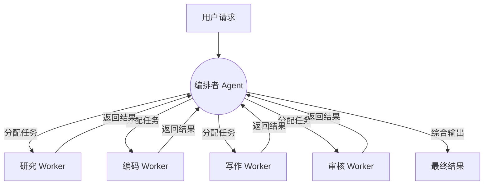

# 编排者-工人模式：中心化协调

## 模式概述

编排者-工人模式（Orchestrator-Worker Pattern）是多 Agent 系统中最直观、最常用的协作架构。其核心思想来自经典的主从模式（Master-Slave Pattern）：一个编排者 Agent（Orchestrator）负责理解全局任务、进行任务分解、分配给专业化的工人 Agent（Worker），然后收集结果并综合输出。

这种模式的通信拓扑是星型结构——所有信息流都经过编排者中转，工人之间不直接通信。这使得系统行为高度可预测，调试路径清晰。



## 编排者的职责

编排者 Agent 承担以下核心职能：

**任务理解与分解**：接收用户的高层需求，将其拆解为可独立执行的子任务。这要求编排者具备全局视野，了解每个 Worker 的能力边界。

**任务分配与调度**：根据子任务的类型和 Worker 的专长进行匹配。当多个 Worker 可以处理同一类任务时，需要考虑负载均衡。

**结果聚合与质量控制**：收集各 Worker 的输出，检查一致性，处理冲突，合成最终结果。

**进度追踪与异常处理**：监控各 Worker 的执行状态，处理超时、失败等异常情况，必要时重试或重新分配。

## Worker Agent 的设计原则

优秀的 Worker Agent 具有三个特征：

**专注（Focused）**：每个 Worker 只做一件事，并把它做好。系统提示词简洁明确，工具集精简。

**有限范围（Limited Scope）**：Worker 不需要理解全局上下文，只需要处理分配给自己的子任务。这降低了提示词复杂度，提升了输出质量。

**可预测行为（Predictable）**：给定相同输入，Worker 应产生结构一致的输出。通过严格的输出格式约束实现。

## 实现架构

### 任务队列设计

```python
from dataclasses import dataclass, field
from enum import Enum
from typing import Any
import asyncio

class TaskStatus(Enum):
    PENDING = "pending"
    RUNNING = "running"
    COMPLETED = "completed"
    FAILED = "failed"

@dataclass
class Task:
    id: str
    type: str  # 对应 Worker 类型
    input_data: dict
    status: TaskStatus = TaskStatus.PENDING
    result: Any = None
    retries: int = 0
    max_retries: int = 3
    dependencies: list[str] = field(default_factory=list)

class Orchestrator:
    def __init__(self, workers: dict[str, "WorkerAgent"]):
        self.workers = workers  # type -> worker 映射
        self.task_queue: list[Task] = []
        self.results: dict[str, Any] = {}
    
    async def decompose_task(self, user_request: str) -> list[Task]:
        """调用 LLM 将用户需求分解为子任务"""
        decomposition_prompt = f"""
        将以下需求分解为独立的子任务：
        {user_request}
        
        可用的 Worker 类型：{list(self.workers.keys())}
        输出 JSON 格式的任务列表。
        """
        tasks = await self.llm_call(decomposition_prompt)
        return [Task(id=t["id"], type=t["type"], 
                     input_data=t["input"], 
                     dependencies=t.get("deps", [])) 
                for t in tasks]
    
    async def execute(self, user_request: str) -> str:
        """主执行流程"""
        # 1. 分解任务
        tasks = await self.decompose_task(user_request)
        self.task_queue = tasks
        
        # 2. 按依赖关系调度执行
        while pending := self._get_ready_tasks():
            batch = [self._dispatch(t) for t in pending]
            await asyncio.gather(*batch)
        
        # 3. 聚合结果
        return await self._aggregate_results()
    
    def _get_ready_tasks(self) -> list[Task]:
        """获取依赖已满足的待执行任务"""
        return [t for t in self.task_queue 
                if t.status == TaskStatus.PENDING
                and all(self.results.get(dep) for dep in t.dependencies)]
    
    async def _dispatch(self, task: Task):
        """分派任务给对应 Worker"""
        task.status = TaskStatus.RUNNING
        worker = self.workers[task.type]
        try:
            result = await worker.execute(task.input_data)
            task.result = result
            task.status = TaskStatus.COMPLETED
            self.results[task.id] = result
        except Exception as e:
            if task.retries < task.max_retries:
                task.retries += 1
                task.status = TaskStatus.PENDING
            else:
                task.status = TaskStatus.FAILED
    
    async def _aggregate_results(self) -> str:
        """综合所有 Worker 结果生成最终输出"""
        aggregate_prompt = f"""
        基于以下子任务结果，生成综合回答：
        {self.results}
        """
        return await self.llm_call(aggregate_prompt)
```

### Worker 实现模板

```python
class WorkerAgent:
    def __init__(self, name: str, system_prompt: str, tools: list):
        self.name = name
        self.system_prompt = system_prompt
        self.tools = tools
    
    async def execute(self, input_data: dict) -> dict:
        """执行单个子任务"""
        messages = [
            {"role": "system", "content": self.system_prompt},
            {"role": "user", "content": self._format_input(input_data)}
        ]
        response = await llm_call(messages, tools=self.tools)
        return self._parse_output(response)

# 实例化专业 Worker
research_worker = WorkerAgent(
    name="researcher",
    system_prompt="你是一个专业研究员，负责搜集和整理信息。输出结构化的研究报告。",
    tools=[web_search, document_reader]
)

coding_worker = WorkerAgent(
    name="coder",
    system_prompt="你是一个资深程序员，负责编写高质量代码。只输出代码和必要注释。",
    tools=[code_executor, file_writer]
)
```

## 典型应用场景

### MetaGPT 的角色协作

MetaGPT [Hong et al., 2023] 是编排者-工人模式的经典实现。它定义了产品经理、架构师、项目经理、工程师和 QA 工程师五个角色，通过标准化的文档接口（PRD → 设计文档 → 任务列表 → 代码 → 测试报告）实现流水线式协作。

### 研究 + 写作 Agent 组合

一个常见的生产级应用是将研究和写作分离：Research Worker 负责信息检索和事实核查，Writing Worker 负责将原始信息转化为流畅的文章，Review Worker 负责检查逻辑和引用的准确性。

## 优势与劣势

**优势**：

控制流清晰——所有决策路径都经过编排者，便于日志记录和问题定位。可预测性高——给定任务分解策略，执行路径是确定性的。扩展简单——新增能力只需添加 Worker，不影响其他组件。

**劣势**：

编排者是瓶颈——所有信息都要经过编排者处理，当 Worker 数量多时，编排者的上下文窗口可能溢出。单点故障——编排者出错会导致整个系统停摆。灵活性有限——Worker 之间无法直接协作，某些需要紧密交互的场景效率较低。

## 工程最佳实践

**编排者提示词要精简**：编排者的核心任务是"分配"而非"执行"，避免让编排者参与具体工作。

**定义明确的接口契约**：每个 Worker 的输入输出格式要严格规范，使用 JSON Schema 约束。

**实现优雅降级**：当某个 Worker 失败时，编排者应能决定是重试、跳过还是使用备选 Worker。

**控制并发度**：并非所有子任务都适合并行，编排者需要识别任务间的依赖关系。

## 本章小结

编排者-工人模式是多 Agent 系统的"入门级"架构，其清晰的控制流和可预测性使其成为生产环境中最受欢迎的选择。核心实现要点包括：智能的任务分解、明确的 Worker 接口定义、健壮的异常处理和高效的结果聚合。当系统规模增大时，可以考虑引入层级式架构来分散编排者的压力。

## 延伸阅读

- [Hong et al., 2023] "MetaGPT: Meta Programming for A Multi-Agent Collaborative Framework"
- [Wu et al., 2023] "AutoGen: Enabling Next-Gen LLM Applications via Multi-Agent Conversation"
- CrewAI 文档：https://docs.crewai.com — 生产级编排框架
- 相关章节：[路由架构](../06-architecture/router-architecture.md)、[任务分解](./task-decomposition.md)
