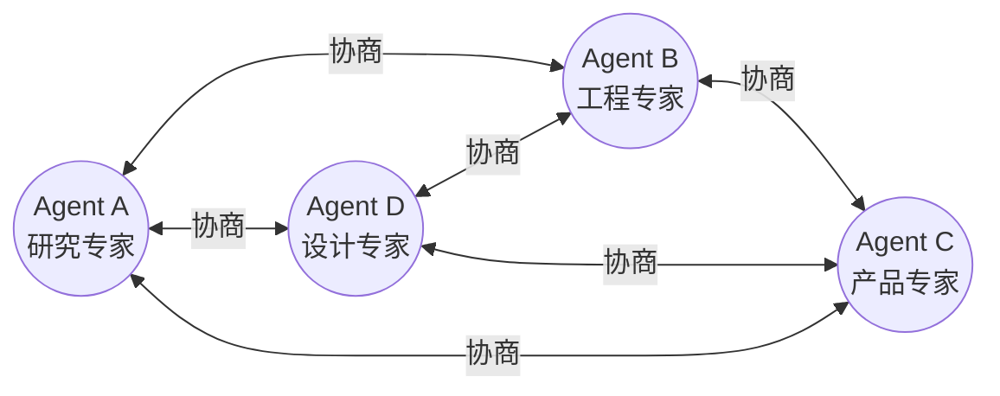

# 对等协作：去中心化多 Agent 系统

## 去中心化的哲学

在编排者-工人和层级架构中，都存在一个（或多个）拥有特殊权力的中心节点。而对等协作（Peer-to-Peer, P2P）模式打破了这种权力不对称——所有 Agent 地位平等，通过直接通信和协商达成决策。没有谁能"命令"其他 Agent，协作完全基于自愿和互利。

这种架构的灵感来自分布式系统和市场经济：没有中央计划者，参与者通过局部交互和协商实现全局目标的涌现。在 LLM Agent 领域，对等协作特别适合需要多样视角、创意碰撞的场景。



## 协商协议

### 提议-反提议-达成（Propose-Counter-Agree）

对等协作中最基本的交互模式是三步协商：

```python
from enum import Enum
from dataclasses import dataclass
from typing import Optional

class NegotiationStatus(Enum):
    PROPOSED = "proposed"
    COUNTERED = "countered"
    ACCEPTED = "accepted"
    REJECTED = "rejected"

@dataclass
class Proposal:
    sender: str
    content: str
    rationale: str
    status: NegotiationStatus = NegotiationStatus.PROPOSED

class PeerAgent:
    def __init__(self, name: str, expertise: str, preferences: dict):
        self.name = name
        self.expertise = expertise
        self.preferences = preferences
        self.inbox: list[Proposal] = []
    
    async def propose(self, target: "PeerAgent", idea: str) -> Proposal:
        """向对等 Agent 发起提议"""
        proposal = Proposal(
            sender=self.name,
            content=idea,
            rationale=await self._generate_rationale(idea)
        )
        target.inbox.append(proposal)
        return proposal
    
    async def evaluate_proposal(self, proposal: Proposal) -> Proposal:
        """评估收到的提议"""
        evaluation_prompt = f"""
        你是 {self.name}，专长是 {self.expertise}。
        收到提议：{proposal.content}
        理由：{proposal.rationale}
        
        基于你的专业判断：
        1. 如果同意，说明为什么这对整体有利
        2. 如果不同意，提出改进后的反提议
        """
        response = await self._llm_call(evaluation_prompt)
        
        if response["decision"] == "accept":
            proposal.status = NegotiationStatus.ACCEPTED
        else:
            counter = Proposal(
                sender=self.name,
                content=response["counter_proposal"],
                rationale=response["rationale"],
                status=NegotiationStatus.COUNTERED
            )
            return counter
        return proposal
```

### 合同网协议（Contract Net Protocol）

合同网协议 [Smith, 1980] 是经典多 Agent 协商协议，已被多个现代框架采用。核心流程为：需求方广播任务公告（Task Announcement）、候选方提交投标（Bid）、需求方选择中标者（Award）。

```python
class ContractNet:
    """适配 LLM Agent 的合同网协议"""
    
    def __init__(self, agents: list[PeerAgent]):
        self.agents = agents
    
    async def announce_task(self, requester: PeerAgent, task: dict):
        """广播任务公告"""
        bids = []
        for agent in self.agents:
            if agent.name == requester.name:
                continue
            bid = await agent.evaluate_and_bid(task)
            if bid is not None:
                bids.append(bid)
        
        # 选择最优投标
        if bids:
            winner = await requester.select_bid(bids, task)
            return winner
        return None
    
    async def evaluate_and_bid(self, agent: PeerAgent, task: dict):
        """Agent 评估任务并决定是否投标"""
        prompt = f"""
        任务描述：{task['description']}
        所需技能：{task['required_skills']}
        
        你的能力：{agent.expertise}
        当前负载：{agent.current_load}
        
        评估你完成此任务的能力和意愿（0-100）。
        如果适合你，提出你的执行方案和预估时间。
        """
        response = await agent._llm_call(prompt)
        if response["confidence"] > 60:
            return {"agent": agent.name, "plan": response["plan"],
                    "confidence": response["confidence"]}
        return None
```

## 共识机制

当多个对等 Agent 需要就某个问题达成一致时，需要共识机制。LLM Agent 系统中常用的共识方法包括：

**轮询投票**：每个 Agent 对提案投票，多数通过。简单但可能丢失少数派的有效意见。

**逐步收敛**：多轮讨论，每轮要求 Agent 回应他人观点并更新自己的立场，直到分歧收窄到可接受范围。

**德尔菲法（Delphi Method）**：匿名提交观点，由协调程序（非 Agent）汇总后再次征求意见，避免锚定效应和权威偏见。

```python
async def iterative_consensus(agents: list[PeerAgent], 
                               topic: str, max_rounds: int = 5) -> dict:
    """迭代收敛式共识"""
    positions = {}
    
    # 初始立场收集
    for agent in agents:
        positions[agent.name] = await agent.state_position(topic)
    
    for round_num in range(max_rounds):
        new_positions = {}
        for agent in agents:
            # 每个 Agent 看到他人立场后更新自己的观点
            others = {k: v for k, v in positions.items() if k != agent.name}
            new_positions[agent.name] = await agent.update_position(
                topic, positions[agent.name], others
            )
        
        # 检查是否达成共识
        if _check_convergence(new_positions):
            return {"consensus": True, "result": _merge_positions(new_positions)}
        
        positions = new_positions
    
    # 未收敛，返回多数意见
    return {"consensus": False, "majority": _majority_vote(positions)}
```

## 优势与劣势

对等协作的优势在于：无单点故障（任何 Agent 退出不影响系统运行）、无瓶颈（通信和计算分散在所有节点）、涌现性（多样视角碰撞可能产生任何单一 Agent 想不到的创新解）、公平性（避免中心节点的权力过大导致偏见传播）。

劣势同样明显：调试困难（没有单一控制点，难以追踪决策路径）、潜在死锁（Agent 之间可能陷入无限协商循环）、通信爆炸（全连接拓扑下消息量为 O(n^2)）、收敛不确定（无法保证在有限时间内达成共识）。

## 适用场景

对等协作特别适合以下场景：头脑风暴和创意生成（需要多样视角）、开放式问题探索（没有明确正确答案）、多专家会诊（平等的专业意见值得被同等对待）、鲁棒性要求极高的系统（不能容忍单点故障）。

不适合的场景包括：有明确正确答案的任务、时间敏感的执行任务、需要严格流程控制的场景。

## 实现要点

### 消息传递

对等系统中推荐使用发布-订阅（Pub-Sub）模式管理消息。每个 Agent 订阅自己感兴趣的话题频道，发送消息到相应频道。

### 轮次管理

为避免同时发言导致的混乱，实践中通常采用 turn-taking 机制。最简单的方式是令牌环（Token Ring）——持有令牌的 Agent 才能发言，发言后传递令牌。

### 终止条件

对等协作必须定义明确的终止条件：达成共识、超过最大轮次、所有 Agent 标记"无更多意见"。否则讨论可能无限循环。

## 本章小结

对等协作模式通过去中心化架构实现了高鲁棒性和创新性，但代价是协调复杂度和收敛不确定性。工程实现的关键在于设计合理的协商协议（如合同网）、共识机制（如迭代收敛）和终止条件。对等模式最适合创意型任务和需要多元视角的决策场景，在需要确定性和效率的执行型任务中则应优先选择中心化架构。

## 延伸阅读

- [Smith, 1980] "The Contract Net Protocol: High-Level Communication and Control in a Distributed Problem Solver"
- [Ferber, 1999] *Multi-Agent Systems: An Introduction to Distributed Artificial Intelligence*
- [Park et al., 2023] "Generative Agents: Interactive Simulacra of Human Behavior" — 对等 Agent 社会模拟
- 相关章节：[通信协议](./communication-protocols.md)、[冲突解决](./conflict-resolution.md)
