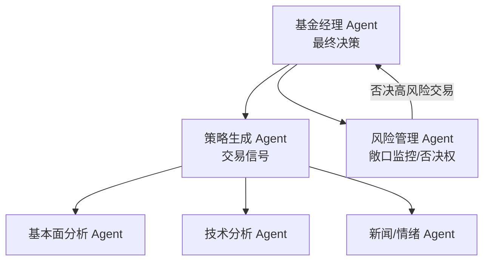
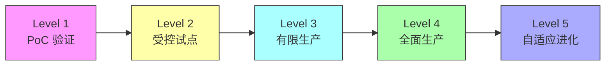

# Multi-Agent 生产部署实证

## 从实验室到工厂的鸿沟

截至 2026 年，多智能体系统（MAS）的生产部署仍处于早期探索阶段。前面章节讨论的协作模式、通信协议、任务分解等设计原则，在真实生产环境中面临的挑战远超理论预期。本章将基于行业实证研究，系统剖析 MAS 生产部署的核心挑战、已验证的解决方案以及来自金融和工业制造领域的真实案例。

行业数据描绘了一幅复杂的图景：MAS 在模拟环境中表现惊人（某量化交易系统回测年化 398%、夏普比率 5.0），但迁移到生产环境后性能急剧下降。这一"模拟-生产"落差，正是 MAS 工程化面临的核心矛盾。

## 六大核心挑战

### 1. 协调与通信效率瓶颈

随着 Agent 数量增加，通信开销呈超线性增长。在全连接拓扑下，N 个 Agent 的通信复杂度为 O(N²)。频繁的状态同步、任务协商和结果汇总消耗大量计算资源，中心化的"指挥官" Agent 或消息总线容易成为性能瓶颈。

一个典型案例：某金融 MAS 系统在 5 个 Agent 时响应时间为 2 秒，扩展到 15 个 Agent 后响应时间飙升至 45 秒——通信开销占总耗时的 70%。

**已验证的解决方案**：

分层架构（Hierarchical Architecture）将 Agent 分组管理，组内通信高频、组间通信低频。异步通信协议替代同步阻塞调用。精简通信内容——只传递必要的增量信息，而非完整状态快照。消息优先级队列确保关键信号不被低优先级通信淹没。

### 2. 任务分解与动态分配难题

如何将复杂任务自动、合理地分解为子任务，并动态分配给最合适的 Agent，是 MAS 的核心设计难题。静态的、预设的分配规则在面对动态变化的环境时往往失效。

**已验证的解决方案**：

引入专门的"规划者 Agent"（Planner Agent）负责任务分解和动态调度。基于 Agent 能力画像和实时负载的动态竞标机制——Agent 根据自身状态"投标"任务，调度器择优分配。渐进式分解策略——先粗粒度分配，Agent 执行过程中再细化子任务。

### 3. 一致性维护与冲突消解

多个 Agent 并行操作共享资源（数据库、文件、API 配额）时，数据不一致和决策冲突几乎不可避免。在金融场景中，两个 Agent 对同一标的给出矛盾的买/卖信号，如何裁决直接影响盈亏。

**已验证的解决方案**：

借鉴分布式系统理论，引入简化版共识算法。事务性操作和乐观锁机制防止并发写入冲突。明确的优先级裁决规则——基于 Agent 的历史准确率、预设权限等级或投票机制决定最终行为。设置专门的"裁判 Agent"，在冲突发生时做出权威决策。

### 4. 错误累积与雪崩效应

这是 MAS 区别于单 Agent 系统的最致命问题。单个 Agent 的微小错误会在协作链条中被传递和放大，最终导致整个系统任务失败。研究表明，在 5 步串行协作链中，即使每步 Agent 准确率为 95%，系统整体准确率也会降至约 77%（0.95⁵）。

**已验证的解决方案**：

反思机制（Reflection）——Agent 执行后对自身输出进行自检和修正。冗余与备份——关键角色配备备份 Agent，主 Agent 故障时自动切换。时间冗余策略——允许 Agent 发现问题后回溯和重试，而非单向执行。全局监控与熔断——异常检测系统在错误累积到阈值前隔离故障 Agent，防止雪崩扩散。

### 5. 监控、调试与可解释性黑洞

监控数十上百个 Agent 组成的动态交互系统极其困难。传统的日志和指标体系无法有效展示 Agent 间的因果关系和决策链路。当系统输出错误时，定位根源如同大海捞针。

**已验证的解决方案**：

开发专门的 MAS 可视化监控平台，实时展示每个 Agent 的状态、通信流和任务进度。强制结构化日志——每条日志包含 Agent ID、决策上下文、输入/输出摘要。设计"审计 Agent"（Auditor Agent），不参与业务逻辑，专门负责追踪和记录关键决策路径。分布式追踪（类似 OpenTelemetry）为每个请求生成完整的 Agent 调用链路图。

### 6. 成本的超线性增长

MAS 的成本并非简单的"Agent 数量 × 单 Agent 成本"。协调通信、冗余计算、监控开销共同导致成本呈超线性增长。行业观察指出，MAS 的总成本可能呈 O(N²) 增长，其中 N 为 Agent 数量。

```
# MAS 成本模型估算
def estimate_mas_cost(num_agents, avg_tokens_per_agent, coordination_overhead=0.3):
    """
    coordination_overhead: 协调开销系数（通信+冲突解决+监控）
    典型值：分层架构 0.2，全连接 0.5，星型 0.3
    """
    base_cost = num_agents * avg_tokens_per_agent
    coordination_cost = base_cost * coordination_overhead * (num_agents - 1) / 4
    monitoring_cost = base_cost * 0.1  # 审计和可观测性
    total = base_cost + coordination_cost + monitoring_cost
    return {
        "base_cost_tokens": base_cost,
        "coordination_tokens": coordination_cost,
        "monitoring_tokens": monitoring_cost,
        "total_tokens": total,
        "overhead_ratio": (total - base_cost) / base_cost
    }
```

## 行业实证案例

### 案例一：金融量化交易——模拟人类交易团队的 MAS

**系统架构**

多个研究和实践项目（QuantAgents、TradingAgents 框架）展示了一种共同的设计哲学：构建模拟人类量化基金团队的 MAS。典型架构包含四类角色：



信息分析层由多个专业 Agent 组成，分别处理基本面、技术指标、新闻情绪等不同信息源。策略生成 Agent 整合分析结果产生交易信号。风险管理 Agent 监控整体敞口，拥有"一票否决权"。基金经理 Agent 作为最终决策者下达交易指令。

**模拟环境性能指标**

| 指标 | MAS 表现 | 单一策略对照 | 说明 |
|------|---------|------------|------|
| 年化收益率 | 398% | — | 特定回测周期，非生产环境 |
| 夏普比率 | 5.0 / 2.15 | < 1.5 | 不同研究给出不同数据 |
| 最大回撤 | 8.2%-11% | > 15% | 风险管理 Agent 贡献显著 |
| 胜率 | — | — | 未公开 |

**生产部署的残酷现实**

尽管模拟数据亮眼，将这类系统部署到实盘面临严峻挑战。2025 年上半年，某国内量化私募部署的 MAS 交易系统模拟收益率 48.4%，但仍被业界视为"个例"而非"范式"。一个个人投资者的复盘更具警示意义：其 AI 量化策略在模拟盘三个月亏损 18.7%，失败原因包括——策略过拟合历史数据、忽视真实交易成本（滑点和手续费）、LLM 幻觉导致错误信号、无法适应市场状态切换（从震荡转为趋势）。

核心教训：模拟环境和生产环境之间存在的数据延迟、噪声、API 限制和流动性差异，是 MAS 量化系统的"最后一公里"挑战。

### 案例二：金融风控——多 Agent 反欺诈系统

**系统架构**

某金融科技公司在反欺诈和信用评估场景中部署了生产级 MAS，由四个协作 Agent 组成：数据采集 Agent（实时聚合多源数据）、特征工程 Agent（动态构建风险特征）、多模型决策 Agent（并行运行多个风控模型，如规则引擎、图网络、行为序列模型）、以及最终裁决 Agent（综合各模型输出做出通过/拒绝/人工审核的三级判定）。

**生产环境验证指标**

| 指标 | 部署前 | 部署后 | 提升 |
|------|-------|-------|------|
| 欺诈检测准确率 | 基线 | +15% | 多模型互补 |
| 误杀率（False Positive） | 基线 | -20% | 裁决 Agent 校准 |
| 平均响应时间 | 基线 | -30% | 并行处理 |
| 年节约成本 | — | 数百万美元 | 减少人力审核 + 降低损失 |

这是目前公开可查的、在生产环境中取得可量化成果的 MAS 案例之一。其成功的关键在于：场景边界清晰（反欺诈是 Yes/No 决策）、可衡量的业务指标、以及保留了人工审核的兜底环节。

### 案例三：工业制造——生产计划与调度

**已知应用**

大众汽车集团旗下的斯柯达品牌部署了"基于智能体的生产计划工具"，用于汽车发动机生产制造的排产调度。意大利国家研究委员会记录了三个早期工业 MAS 案例：个性化新闻服务（Agent 理解用户偏好、抓取和筛选新闻）、海洋保护区船只监控（Agent 处理传感器数据、识别违规行为）、智能呼叫中心（Agent 智能路由客户请求）。

**关键发现：实证数据的缺失**

必须诚实指出，工业制造领域的 MAS 应用虽有先例，但**普遍缺乏公开的深度实证报告**。上述案例中，斯柯达项目没有公开具体的性能提升数据或技术挑战细节；意大利案例虽有学术论文记录，但具体的准确率、延迟和成本指标在公开资料中无法获取。

这一现象的原因包括：工业企业视 MAS 部署细节为商业机密；早期项目（2010 年前后）的技术框架与当今 LLM-based MAS 差异巨大，参考价值有限；以及行业尚缺乏统一的 MAS 性能评估标准。

## 生产部署成熟度模型

综合案例研究，我们可以构建一个 MAS 生产部署的成熟度阶梯：



| 级别 | 特征 | 当前行业状态 |
|------|------|------------|
| L1 PoC 验证 | 模拟数据、单一场景、开发者监控 | 大量项目停留于此 |
| L2 受控试点 | 真实数据子集、有限流量、全程人工审核 | 金融风控案例已达到 |
| L3 有限生产 | 生产流量、关键节点人工介入、持续监控 | 极少数头部案例 |
| L4 全面生产 | 全量生产流量、异常时自动降级、例行审计 | 尚无公开案例 |
| L5 自适应进化 | 自动优化协作策略、动态调整 Agent 组合 | 理论阶段 |

截至 2026 年，行业主体仍处于 L1-L2 阶段，少数金融领域头部机构进入 L3。

## 从失败中提炼的工程原则

综合所有案例的经验教训，MAS 生产部署应遵循以下工程原则：

**最小可行 Agent 数量**：不要为了"多 Agent"而多 Agent。从 2-3 个 Agent 的最小配置开始，验证协作收益确实超过协调开销后再扩展。行业经验表明，超过 7 个 Agent 后，管理复杂度急剧上升。

**可降级设计**：MAS 的每个关键能力必须有单 Agent 或规则引擎的降级方案。当协作链路出现故障时，系统应自动降级为简化版本继续运行，而非整体瘫痪。

**渐进式信任建立**：初期所有 Agent 决策都经过人工审核，随着系统稳定性得到验证逐步放开。信任是动态的——新市场环境、新数据模式出现时应临时收紧审核。

**成本感知调度**：调度器在分配任务时必须将 LLM 调用成本纳入考量。对于低价值或低紧急度的子任务，使用小模型或规则引擎替代完整 Agent 推理。

**不可逆操作的双重确认**：在金融交易、数据删除等不可逆操作前，必须由独立的"审核 Agent"（或人工）进行二次确认。任何单一 Agent 不应拥有对高风险操作的完整自主权。

## 本章小结

MAS 的生产部署尚处于"黎明前的探索"阶段。金融领域因数据化程度高、价值量化直接而走在前列，但即便是最成功的案例也远未达到"全自动、全场景"的理想状态。工业制造虽有早期先例，但公开实证数据的匮乏使得行业难以系统性学习。

核心启示是：MAS 的价值不在于 Agent 数量的堆砌，而在于通过精巧的架构设计、高效的协同机制和完善的工程保障，将"一群个体"真正打造成"一个团队"。对于工程师而言，当前阶段最务实的策略是：在边界清晰、收益可量化的场景中，从最小 Agent 配置起步，以数据驱动的方式逐步扩展协作规模。

## 延伸阅读

- [Bergenti et al., 2010] "Multi-Agent Systems in the Industry: Three Notable Cases in Italy" — 早期工业 MAS 实证
- [TradingAgents, 2025] "Multi-Agents LLM Financial Trading Framework" — 金融量化 MAS 框架
- [QuantAgents, 2025] "Towards Multi-agent Financial System via Simulated Trading" — 模拟交易多 Agent 系统
- 中国金融智能体发展研究报告 (2025) — 国内金融 Agent 行业全景
- UiPath 2026 AI and Agentic Automation Trends Report — 企业级 Agent 自动化趋势
- 相关章节：[协作模式总览](./collaboration-patterns.md)、[冲突解决机制](./conflict-resolution.md)、[成本优化](../12-engineering/cost-optimization.md)
