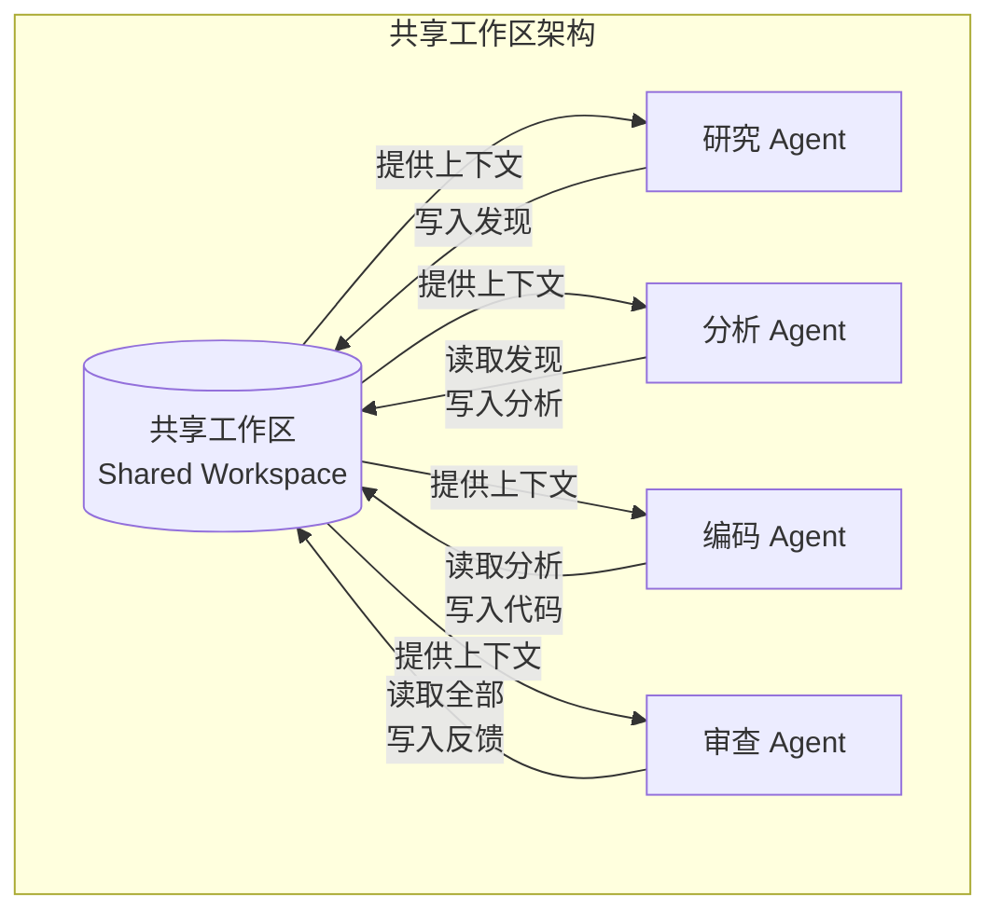

# 共享记忆：多 Agent 的知识协同

## 为什么需要共享记忆

当多个 Agent 协作完成复杂任务时，每个 Agent 都会产生中间成果和新发现。如果这些信息只存在于各 Agent 的私有上下文中，就会导致两个问题：重复劳动（Agent B 重新研究 Agent A 已经解决的问题）和信息孤岛（Agent C 的决策缺乏 Agent A 发现的关键事实）。

共享记忆（Shared Memory）为多 Agent 系统提供了公共知识空间，让 Agent 能够在彼此的工作基础上继续推进，形成知识的累积增长而非平行浪费。

## 共享记忆架构

### 共享工作区（Shared Workspace）

最简单的共享记忆形式：一个所有 Agent 都能读写的文档空间。Agent 将中间成果写入工作区，其他 Agent 在开始工作前先阅读工作区中的已有内容。



### 知识图谱（Knowledge Graph）

结构化的知识表示，以实体和关系的形式存储 Agent 的发现。适合需要推理和关联查询的场景。

### 向量存储（Vector Store）

将 Agent 的工作成果向量化存储，支持语义相似性检索。适合非结构化信息的共享，如研究笔记、代码片段、决策记录。

## 黑板系统（Blackboard System）

黑板系统 [Erman et al., 1980] 是人工智能领域经典的协作架构，其核心隐喻是：多个专家围坐在一块黑板前，每个人在黑板上写下自己的发现，其他人根据黑板上的信息推进自己的工作。

在 LLM Agent 系统中，黑板系统包含三个组件：

**黑板（Blackboard）**：共享数据结构，存储问题的当前状态和所有中间结果。

**知识源（Knowledge Sources）**：即各 Agent，它们监控黑板内容，在能做贡献时主动写入。

**控制组件（Controller）**：决定下一步激活哪个知识源（Agent）。

```python
from dataclasses import dataclass, field
from typing import Any
from datetime import datetime

@dataclass
class BlackboardEntry:
    key: str
    value: Any
    author: str
    timestamp: datetime = field(default_factory=datetime.now)
    confidence: float = 1.0
    version: int = 1
    tags: list[str] = field(default_factory=list)

class Blackboard:
    """多 Agent 共享黑板"""
    
    def __init__(self):
        self.entries: dict[str, BlackboardEntry] = {}
        self.history: list[BlackboardEntry] = []
        self.watchers: dict[str, list[callable]] = {}  # tag -> callbacks
    
    def write(self, key: str, value: Any, author: str, 
              confidence: float = 1.0, tags: list[str] = None):
        """写入或更新黑板条目"""
        if key in self.entries:
            existing = self.entries[key]
            entry = BlackboardEntry(
                key=key, value=value, author=author,
                confidence=confidence, 
                version=existing.version + 1,
                tags=tags or []
            )
        else:
            entry = BlackboardEntry(
                key=key, value=value, author=author,
                confidence=confidence, tags=tags or []
            )
        
        self.entries[key] = entry
        self.history.append(entry)
        self._notify_watchers(entry)
    
    def read(self, key: str = None, tags: list[str] = None,
             min_confidence: float = 0.0) -> list[BlackboardEntry]:
        """读取黑板内容"""
        results = list(self.entries.values())
        
        if key:
            results = [e for e in results if e.key == key]
        if tags:
            results = [e for e in results 
                      if any(t in e.tags for t in tags)]
        if min_confidence > 0:
            results = [e for e in results if e.confidence >= min_confidence]
        
        return results
    
    def get_summary(self, max_tokens: int = 1000) -> str:
        """获取黑板内容摘要，用于注入 Agent 上下文"""
        entries = sorted(self.entries.values(), 
                        key=lambda e: e.timestamp, reverse=True)
        summary_parts = []
        for entry in entries:
            part = f"[{entry.author}] {entry.key}: {entry.value}"
            summary_parts.append(part)
        return "\n".join(summary_parts)[:max_tokens]
    
    def watch(self, tags: list[str], callback: callable):
        """注册监听器，当特定标签的内容更新时触发"""
        for tag in tags:
            if tag not in self.watchers:
                self.watchers[tag] = []
            self.watchers[tag].append(callback)
    
    def _notify_watchers(self, entry: BlackboardEntry):
        """通知相关监听器"""
        for tag in entry.tags:
            for callback in self.watchers.get(tag, []):
                callback(entry)
```

## 读写模式与冲突处理

### 并发访问问题

当多个 Agent 同时读写共享记忆时，可能出现以下问题：

**脏读（Dirty Read）**：Agent A 读到 Agent B 尚未完成的中间状态。

**写冲突（Write Conflict）**：Agent A 和 B 同时修改同一条目。

**过期读取（Stale Read）**：Agent A 基于旧版本信息做决策，而该信息已被更新。

### 解决策略

```python
class ConflictResolver:
    """共享记忆冲突解决器"""
    
    def resolve_write_conflict(self, existing: BlackboardEntry, 
                                new: BlackboardEntry) -> BlackboardEntry:
        """解决写冲突"""
        # 策略1：基于置信度——高置信度覆盖低置信度
        if new.confidence > existing.confidence + 0.1:
            return new
        
        # 策略2：基于时间——最新写入优先
        if new.timestamp > existing.timestamp:
            # 保留旧版本到历史
            return new
        
        # 策略3：合并——两个写入都有价值时
        merged_value = self._merge_values(existing.value, new.value)
        return BlackboardEntry(
            key=existing.key,
            value=merged_value,
            author=f"{existing.author}+{new.author}",
            confidence=max(existing.confidence, new.confidence),
            version=existing.version + 1
        )
    
    def _merge_values(self, v1: Any, v2: Any) -> Any:
        """合并两个值（场景相关的合并逻辑）"""
        if isinstance(v1, list) and isinstance(v2, list):
            return list(set(v1 + v2))  # 列表去重合并
        if isinstance(v1, dict) and isinstance(v2, dict):
            return {**v1, **v2}  # 字典合并
        # 默认保留两者
        return {"version_a": v1, "version_b": v2, "needs_resolution": True}
```

## 一致性挑战

### 过期信息

Agent 的上下文窗口是有限的。当共享记忆中的某条信息被更新后，已经将旧版本加载到上下文中的 Agent 不会自动感知变化。解决方案包括：版本号检查（Agent 在使用信息前确认版本未变化）、关键信息推送（重要更新主动通知相关 Agent）、定期刷新（Agent 在每个步骤开始前重新读取相关条目）。

### 矛盾检测

不同 Agent 可能写入相互矛盾的信息。需要矛盾检测机制：维护关键事实的一致性约束，当新写入违反约束时触发警告或仲裁。

## 工程实现选择

实际项目中共享记忆的实现技术包括：

**共享向量数据库**（如 Pinecone、Weaviate）：适合语义检索场景，Agent 将发现向量化存储，其他 Agent 通过语义查询获取相关信息。

**协作文档**（如结构化 JSON 文件）：简单场景下的轻量方案，Agent 直接读写文件系统中的共享文档。

**结构化数据库**（如 Redis、PostgreSQL）：适合需要事务保证和复杂查询的场景。

**消息队列作为事件日志**（如 Kafka）：所有 Agent 的行为记录在有序日志中，任何 Agent 都可以重放历史了解全局状态。

## 与单 Agent 记忆的关系

共享记忆是单 Agent 记忆系统的多 Agent 延伸。单 Agent 的工作记忆（Working Memory）对应共享工作区，长期记忆（Long-term Memory）对应共享知识库。关键区别在于多 Agent 场景需要额外处理并发访问和一致性问题。

## 本章小结

共享记忆是多 Agent 协作效率的倍增器。核心设计选择包括：存储形式（工作区/知识图谱/向量库）、读写模式（乐观锁/悲观锁/事件溯源）、冲突处理策略（置信度优先/时间优先/合并）。黑板系统模式为 LLM Agent 提供了经过验证的共享知识协作框架。实现时需要特别关注一致性挑战和带宽控制。

## 延伸阅读

- [Erman et al., 1980] "The Hearsay-II Speech-Understanding System" — 黑板系统的起源
- [Park et al., 2023] "Generative Agents" — Agent 共享记忆的实际应用
- [Hong et al., 2023] "MetaGPT" — 共享文档接口设计
- 相关章节：[记忆模块](../07-core-modules/memory.md)、[通信协议](./communication-protocols.md)
