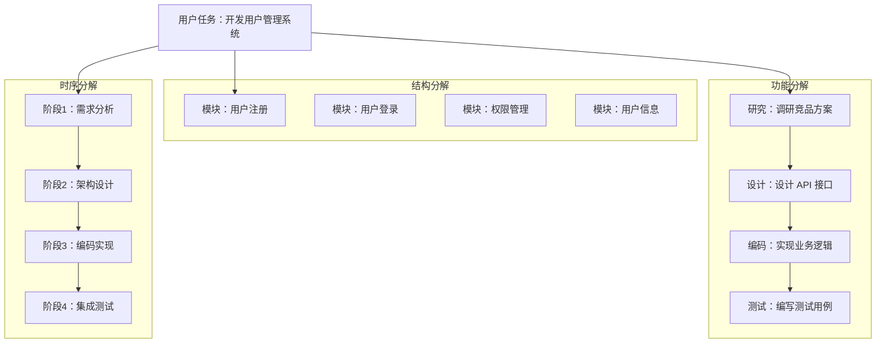

# 任务分解：多 Agent 的工作分配

## 分解的核心挑战

任务分解（Task Decomposition）是多 Agent 系统的第一步，也是决定系统效率的关键步骤。分解得当，Agent 各司其职、并行推进；分解失误，则可能出现工作重叠、遗漏或依赖死锁。

与单 Agent 的规划（Planning）不同，多 Agent 任务分解需要额外考虑：子任务如何分配给不同 Agent、哪些子任务可以并行、Agent 之间如何处理依赖关系。

## 分解策略

### 功能分解（Functional Decomposition）

按所需技能类型划分子任务。每种技能对应一类 Worker Agent。

适用场景：Agent 有明确的专业分工。例如，"撰写技术报告"可分解为：信息检索（Research Agent）、数据分析（Analysis Agent）、文档编写（Writing Agent）、格式校对（Review Agent）。

### 结构分解（Structural Decomposition）

按任务的逻辑结构划分。将大任务拆成独立的模块或组件。

适用场景：任务本身有自然的模块边界。例如，"开发 Web 应用"可分解为：前端页面、后端 API、数据库设计、部署配置——每个模块独立开发。

### 时序分解（Temporal Decomposition）

按执行阶段划分。同一个 Agent 可能参与多个阶段，但每个阶段有不同的关注点。

适用场景：任务有天然的时间序列。例如，"项目交付"可分解为：需求分析阶段、设计阶段、开发阶段、测试阶段、部署阶段。



## 动态 vs 静态分解

**静态分解**：在执行前一次性完成所有分解。编排者预先规划全部子任务和分配。适合任务结构确定、不会中途变化的场景。

**动态分解**：边执行边分解。根据已完成子任务的结果动态调整后续计划。适合探索性任务、不确定性高的场景。

```python
class DynamicDecomposer:
    """动态任务分解器"""
    
    def __init__(self, available_agents: list[dict]):
        self.agents = available_agents
        self.completed_tasks: list[dict] = []
        self.task_graph: dict = {}
    
    async def initial_decompose(self, goal: str) -> list[dict]:
        """初始分解：只规划第一批可并行任务"""
        prompt = f"""
        目标：{goal}
        可用 Agent：{[a['name'] + ':' + a['skills'] for a in self.agents]}
        
        请仅规划当前可以立即开始的子任务（无前置依赖）。
        后续子任务将根据第一批结果动态确定。
        
        输出格式：
        [{{"task_id": "t1", "description": "...", 
           "assigned_to": "agent_name", "can_parallelize": true}}]
        """
        return await llm_call(prompt)
    
    async def next_batch(self, completed_results: list[dict], 
                          goal: str) -> list[dict]:
        """基于已完成结果动态规划下一批任务"""
        self.completed_tasks.extend(completed_results)
        
        prompt = f"""
        原始目标：{goal}
        已完成的任务及结果：{self.completed_tasks}
        可用 Agent：{[a['name'] for a in self.agents]}
        
        基于当前进展，规划下一批需要执行的子任务。
        如果目标已完成，返回空列表。
        如果需要调整方向，说明原因。
        """
        return await llm_call(prompt)
```

## 技能匹配

将子任务分配给合适的 Agent 需要技能匹配（Skill Matching）算法：

```python
class SkillMatcher:
    """基于能力模型的任务-Agent 匹配"""
    
    def __init__(self, agent_profiles: list[dict]):
        """
        agent_profiles: [
            {"name": "coder", "skills": ["python", "javascript"], 
             "capacity": 3, "current_load": 1},
            {"name": "writer", "skills": ["technical_writing", "documentation"],
             "capacity": 2, "current_load": 0},
        ]
        """
        self.profiles = agent_profiles
    
    def match(self, task: dict) -> list[dict]:
        """返回按匹配度排序的候选 Agent"""
        required = set(task.get("required_skills", []))
        preferred = set(task.get("preferred_skills", []))
        
        scored_agents = []
        for agent in self.profiles:
            agent_skills = set(agent["skills"])
            
            # 必需技能覆盖率
            required_coverage = len(required & agent_skills) / max(len(required), 1)
            if required_coverage < 1.0:
                continue  # 必需技能不满足，跳过
            
            # 偏好技能加分
            preferred_score = len(preferred & agent_skills) / max(len(preferred), 1)
            
            # 负载惩罚
            load_ratio = agent["current_load"] / agent["capacity"]
            availability_score = 1.0 - load_ratio
            
            total_score = required_coverage * 0.5 + preferred_score * 0.3 + availability_score * 0.2
            scored_agents.append({"agent": agent["name"], "score": total_score})
        
        return sorted(scored_agents, key=lambda x: x["score"], reverse=True)
```

## 依赖管理

子任务之间往往存在依赖关系。依赖管理需要确定哪些任务可以并行，哪些必须串行。

```python
class TaskGraph:
    """任务依赖图"""
    
    def __init__(self):
        self.tasks: dict[str, dict] = {}
        self.dependencies: dict[str, list[str]] = {}  # task_id -> [dependency_ids]
    
    def add_task(self, task_id: str, task_info: dict, depends_on: list[str] = None):
        self.tasks[task_id] = task_info
        self.dependencies[task_id] = depends_on or []
    
    def get_parallelizable_batch(self) -> list[str]:
        """获取当前可并行执行的任务批次"""
        completed = {tid for tid, info in self.tasks.items() 
                    if info.get("status") == "completed"}
        
        ready = []
        for task_id, deps in self.dependencies.items():
            if self.tasks[task_id].get("status") == "pending":
                if all(d in completed for d in deps):
                    ready.append(task_id)
        return ready
    
    def detect_cycles(self) -> bool:
        """检测循环依赖"""
        visited = set()
        path = set()
        
        def dfs(node):
            visited.add(node)
            path.add(node)
            for dep in self.dependencies.get(node, []):
                if dep in path:
                    return True
                if dep not in visited and dfs(dep):
                    return True
            path.remove(node)
            return False
        
        return any(dfs(t) for t in self.tasks if t not in visited)
```

## 负载均衡

当多个 Agent 具有相似能力时，需要负载均衡来避免"热点" Agent 过载而其他 Agent 闲置。

策略包括：轮询分配（Round-Robin）——简单但不考虑任务复杂度差异；加权分配——根据 Agent 的处理能力加权；动态调整——根据实时完成速度调整分配比例。

## 失败处理

任务执行过程中不可避免会出现失败。多 Agent 系统的失败处理策略：

**重试**：同一 Agent 重新执行失败任务，适合临时性错误。

**重新分配**：将失败任务分配给其他有能力的 Agent，适合 Agent 特定的能力缺陷。

**降级执行**：降低任务质量要求后重试，适合非关键子任务。

**向上汇报**：无法处理时通知上级或用户，适合需要人工介入的情况。

## 粒度权衡

任务分解的粒度是关键决策。过细的分解（如把"写一个函数"拆成"写函数签名"、"写循环体"、"写返回值"）会导致协调开销大于收益。过粗的分解（如整个系统作为一个任务）则失去了多 Agent 协作的意义。

经验法则：每个子任务应该是一个 Agent 在单次执行中可以完成的"原子单元"，通常对应 1-3 个工具调用或一段连续的推理链。

## 本章小结

任务分解是多 Agent 协作的起点。有效的分解需要选择合适的策略（功能/结构/时序）、实现智能的技能匹配、管理好依赖关系以最大化并行度、并准备好失败应对方案。动态分解比静态分解更灵活但实现更复杂。分解粒度需要在协调开销和协作收益之间找到平衡点。

## 延伸阅读

- [Wei et al., 2022] "Chain-of-Thought Prompting" — 思维链分解方法论的基础
- [Yao et al., 2023] "Tree of Thoughts" — 树状任务分解与搜索
- [Khot et al., 2023] "Decomposed Prompting" — 提示词级别的任务分解
- 相关章节：[规划模块](../07-core-modules/planning.md)、[编排者-工人模式](./orchestrator-worker.md)
