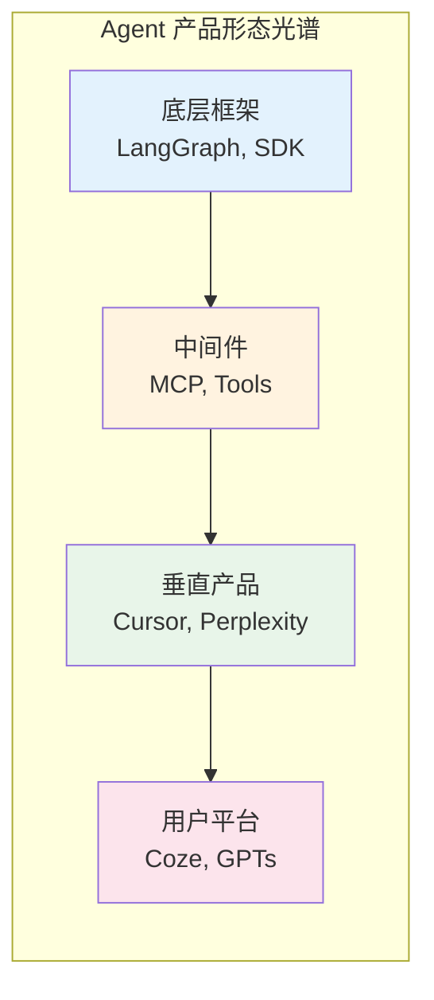
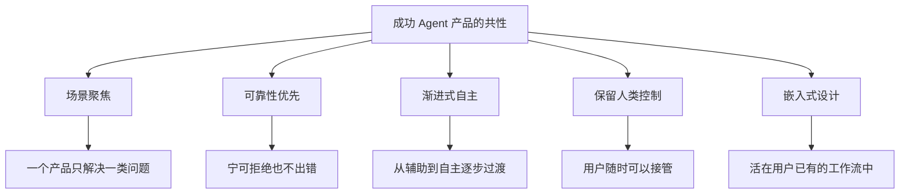
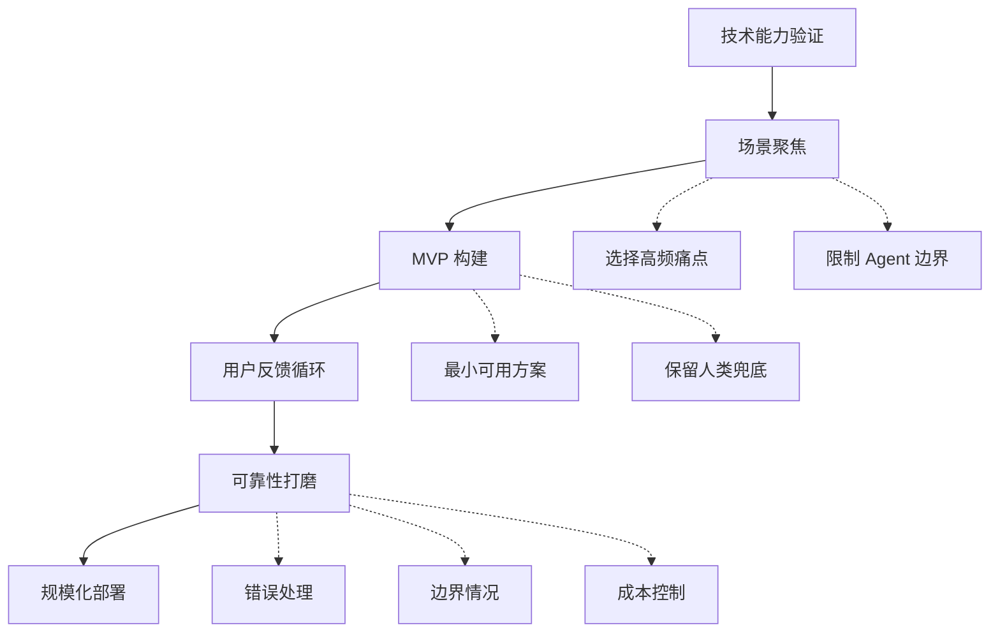

# Agent 产品形态：从框架到用户产品

框架是面向开发者的工具，而产品是面向用户的解决方案。两者之间的鸿沟比很多技术人员想象的更大。2024-2025 年，一批 Agent 产品从实验室走向市场，在商业上取得了显著成功，证明了 Agent 技术的商业化潜力。本章分析这些产品的设计模式，提炼从框架到产品的转化经验，为 Agent 开发者提供产品化的思维框架。

## 产品形态光谱

Agent 产品可以按抽象程度排列成一个连续光谱：

越靠近右端，技术细节越被隐藏，用户体验越成为核心竞争力。本章聚焦光谱右半段——那些已经找到用户价值的 Agent 产品。

## 搜索型 Agent：Perplexity

Perplexity 是将"搜索"重新定义为 Agent 行为的代表性产品。传统搜索引擎返回链接列表，用户需要自己点击、阅读和总结；Perplexity 的 Agent 自动执行搜索、阅读多个来源、综合信息并生成带引用的直接答案。

**成功因素分析**：

极其聚焦的场景定义——"用 AI 回答问题"。不试图做日程管理、代码编写或其他任何事，只做好一件事。

可验证的输出质量——每个结论都带有来源引用，用户可以一键验证。这解决了 LLM 幻觉带来的信任危机。

增量替代而非颠覆——用户的心智模型仍是"搜索"，只是结果直接给出答案而非链接列表。切换成本极低。

速度——响应时间控制在数秒内，接近传统搜索体验，而非等待几分钟的"Agent 正在思考"。

**产品启示**：Agent 产品的第一要务是可靠性和速度，而非自主性。Perplexity 的 Agent 行为高度受控——它不会决定"也许用户真正需要的是另一个问题"，它只做好"回答当前问题"这一件事。克制是产品设计的美德。

## 编程 Agent：Cursor 与 Windsurf

Cursor 和 Windsurf 代表了"将 Agent 嵌入专业工具"的产品形态。它们不是独立运行的 Agent，而是 IDE 中的 AI 增强层——Agent 生活在开发者已有的工作环境中。

**Cursor 的设计哲学**：Agent 应该生活在用户的工作环境中，而非要求用户进入 Agent 的环境。Cursor 基于 VS Code fork，保留了开发者熟悉的一切操作，Agent 作为一个可随时召唤也可随时关闭的助手存在。用户始终保有最终控制权。

**成功因素**：

无缝集成到现有工作流——不需要学习新工具，IDE 的使用方式不变。

渐进式信任建立——从简单的代码补全开始，到 Tab 接受单行建议，到多文件 Agent 编辑，逐步增加 Agent 的自主权。用户在每一步都有选择退出的权利。

丰富的上下文优势——Agent 能看到整个代码库结构、当前打开的文件、终端输出、编译错误、Git 历史。这种上下文密度是独立 Agent 产品难以匹配的。

即时反馈——编辑结果实时可见，用户可以立即判断质量并决定接受或拒绝。

**Claude Code 的另一种路线**：与 Cursor 的 GUI 路线不同，Anthropic 的 Claude Code 选择了终端作为 Agent 的栖息地。终端环境给了 Agent 更大的操作自由度（文件操作、命令执行、环境管理），适合需要大范围重构或全新项目创建的深度任务。两种形态并非替代关系，而是互补。

## 法律 Agent：Harvey

Harvey 是面向法律行业的垂直 Agent 产品，服务于律所和企业法务部门。估值超过 20 亿美元的它揭示了企业级 Agent 产品的关键成功要素。

**成功因素**：

深度的领域理解——Harvey 团队中有资深律师参与产品设计，确保产品贴合真实法律工作流。这不是"通用 AI + 法律提示词"，而是深入理解合同审查、案例研究、法规分析等具体场景后的定制化方案。

严格的准确性保障——法律领域对错误零容忍。一个错误的法律引用可能导致案件败诉。Harvey 投入大量精力在事实核验、引用准确性、以及明确表达不确定性上。

渐进式渗透策略——先从低风险任务（法律研究、初步起草）入手，在证明可靠性后逐步扩展到更高风险的工作。

**产品启示**：在高风险领域，Agent 的价值不在于"自主完成任务"，而在于"让专业人员效率提升 10 倍"。Harvey 的 Agent 从不独立出具法律意见，它辅助律师更快地完成研究、起草和审核。这种"AI 赋能而非 AI 替代"的定位是获得专业用户信任的关键。

## 客服 Agent：Sierra

Sierra 由 Bret Taylor（前 Salesforce 联合 CEO）和 Clay Bavor（前 Google VP）创立，专注于企业客户服务 Agent。它代表了"Agent-as-a-Service"（Agent 即服务）的产品模式。

**设计特点**：

品牌一致性——每个客户的 Agent 都有符合其品牌调性的人格和表达方式。与通用 chatbot 不同，Sierra 为每个企业定制独特的 Agent 身份。

安全边界——严格限制 Agent 的操作范围，防止越权行为。Agent 只能在预定义的操作集内工作（查询订单、处理退款、更新信息），不能做超出授权的事。

人工升级机制——无法处理的问题平滑转接给人工客服，且所有上下文自动传递。Agent 知道自己的边界，主动触发升级。

持续学习——从每次交互中积累知识，通过分析失败案例和人工接管的情况持续提升解答质量。

**产品启示**：企业级 Agent 产品的核心竞争力不在于底层模型的能力，而在于业务流程集成的深度和安全可靠性保障。企业买的不是"最强的 AI"，而是"最可靠的自动化方案"。

## 全栈开发 Agent：Replit Agent

Replit Agent 代表了另一类产品形态——让非专业用户也能"说出想法就得到应用"。用户用自然语言描述想要的应用功能，Agent 自主完成从技术选型到代码编写到部署上线的全过程。

**设计特点**：

端到端交付——不只是写代码，而是交付一个可运行、已部署的应用。用户不需要理解代码、数据库、部署等技术概念。

迭代式完善——用户通过自然语言反馈来修改和改进应用。"把按钮改成蓝色"、"添加一个登录页面"都是有效的指令。

即时预览——每一步修改都能在内置预览窗口中立即看到效果。

**产品启示**：对于非专业用户，Agent 的价值在于消除技术复杂度。用户不关心你用了什么框架、什么数据库，他们只关心"我说的东西能不能用"。

## 成功 Agent 产品的共性模式

**极度聚焦的场景定义**：所有成功的 Agent 产品都选择了一个明确而狭窄的场景。Perplexity 做搜索问答，Cursor 做代码编辑，Harvey 做法律研究。没有一个成功产品试图做"通用 Agent"——至少在产品初期不是。

**可靠性优先于能力范围**：用户能接受 Agent 说"这个问题我不确定"或"这超出了我的能力范围"，但无法接受 Agent 给出错误答案却表现得很自信。所有成功产品都投入大量精力确保输出质量，宁可缩小能力范围也要保证已有能力的可靠性。

**渐进式增加自主性**：而非一步到位的全自主。Cursor 从自动补全（自主性最低）开始，逐步到整行建议、多行编辑、多文件重构（自主性逐步提高）。这让用户有时间建立对 Agent 的信任。

**始终保留人类控制权**：用户随时可以接管、修改、否决 Agent 的决定。Agent 是助手而非替代者。即使是 Replit Agent 这种高自主性产品，用户仍然可以直接编辑代码。

**嵌入式而非独立式**：Agent 活在用户已有的工作流中（IDE、浏览器、通信工具），而非要求用户学习新的交互方式。降低用户迁移成本是产品成功的关键。

## 从框架到产品的转化路径

对 Agent 开发者的实践建议：

**从窄开始，逐步扩展**。不要试图构建"通用 Agent"。选择一个你深度理解的垂直场景，把它做到极致可靠，再考虑扩展。

**可靠性是产品的基础设施**。一个只能完成 80% 任务但从不出错的 Agent，在商业上远胜于能尝试 100% 任务但经常犯错的 Agent。用户信任一旦丧失，几乎不可能重建。

**关注 UX 而非技术深度**。用户不关心你用了 LangGraph 还是 OpenAI SDK，他们关心的是"这个东西好不好用、快不快、准不准"。Agent 产品的差异化往往在交互设计和场景理解，而非底层技术的先进性。

**设计优雅的失败路径**。Agent 一定会失败——当它失败时，用户体验应该是"平滑地承认局限并提供替代方案"，而非"系统崩溃"或"自信地给出错误答案"。

**度量一切**。成功的 Agent 产品都有完善的指标体系：任务完成率、用户满意度、Agent 介入后的效率提升、人工升级率等。没有度量就没有改进方向。

## 未来展望

Agent 产品形态仍在快速演进中。可以预见的趋势包括：更多垂直领域的专业 Agent 产品将涌现——金融、医疗、教育等高价值领域是下一波机会；Agent 之间的协作将成为产品特性——一个 Agent 调用另一个 Agent 的能力（MCP 等协议使之更容易实现）；Agent 产品从"辅助工具"向"自主执行者"的过渡将持续但缓慢——每一步都需要用户信任的积累；定价模式将从传统 SaaS 订阅向"按任务完成付费"或"按价值分成"演进。

## 本章小结

从框架到产品的跨越，不是简单的"加个界面"的问题，而是从"技术可行性"到"用户价值交付"的根本视角转变。成功的 Agent 产品无一例外地选择了聚焦场景、保证可靠性、渐进式赋能的路径。对于正在构建 Agent 产品的团队，最重要的不是选择哪个框架，而是深刻理解你要服务的用户——他们的工作流是什么、痛点在哪里、什么程度的 AI 自主性他们能接受。

## 延伸阅读

- [Perplexity](https://www.perplexity.ai/)
- [Cursor](https://cursor.sh/)
- [Harvey AI](https://www.harvey.ai/)
- [Sierra](https://sierra.ai/)
- [Replit Agent](https://replit.com/)
- [Anthropic: Building Effective Agents](https://www.anthropic.com/research/building-effective-agents)
- [框架选型](./comparison-matrix.md) — 为产品选择合适的框架
- [Agent 框架分类](./classification.md) — 理解产品背后的技术栈
