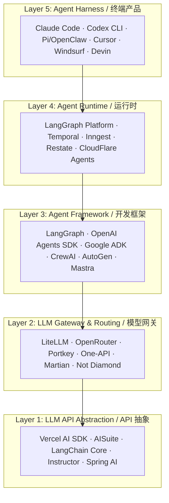
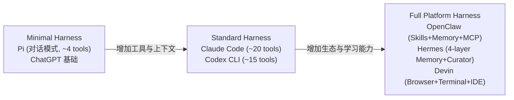

# Agent 技术栈产品全景 (2024-2026)

## 引言：为什么需要"技术栈"视角

传统的 Agent 分类多从"自主程度"或"组织结构"出发（见 [taxonomy.md](../05-fundamentals/taxonomy.md)），框架分类则按"抽象层级/编排范式"划分（见 [classification.md](./classification.md)）。这两套体系能回答"Agent 是什么类型"和"框架怎么选"，但无法回答一个更实际的问题：**一个完整的 Agent 产品，从模型调用到用户交互，到底由哪些层组成？每层有哪些技术选项？**

2025-2026 年，随着 Mitchell Hashimoto 提出 **"Agent = Model + Harness"** 公式、Anthropic 提出 **Context Engineering** 概念，行业开始用"技术栈（Stack）"视角审视 Agent 生态。本章提出一个五层模型，并在每层穷举主要产品与选型。

## 五层技术栈模型



各层之间的关系并非严格串行依赖。一个极简 Agent（如直接用 Claude API + bash 工具）可以跳过 Layer 2-4，直接在 Layer 1 和 Layer 5 之间完成闭环。但在生产环境中，多数 Agent 产品会在各层做出选型。

---

## Layer 1: LLM API 统一抽象层

### 层定义

这一层解决的核心问题是：**屏蔽不同 LLM 提供商的 API 差异**，让上层代码可以无感切换模型。它不编排 Agent 逻辑，只做"把请求翻译成各厂商格式，把响应翻译回统一格式"。

### 产品全景

| 产品 | 语言 | Star(2025H1) | 核心特征 | 适用场景 |
|------|------|-------------|---------|---------|
| **Vercel AI SDK** | TypeScript | ~12k | 流式优先、React/Next.js 深度集成、`generateText`/`streamText` 统一接口 | 全栈 Web 应用中调用 LLM |
| **AISuite (Andrew Ng)** | Python | ~8k | 极简两行代码切换模型、`chat.completions.create` OpenAI 兼容接口 | 快速实验、教学 |
| **LangChain Core** | Python/JS | (LangChain 整体 ~95k) | `ChatModel` 统一抽象、支持 Runnable 协议 | 作为 LangGraph 等框架的底层 |
| **Instructor** | Python/JS/Ruby/Go/Elixir | ~9k | 结构化输出为核心、Pydantic 模型绑定、自动重试 | 需要可靠 JSON 输出的场景 |
| **Spring AI** | Java | ~3.5k | Spring 生态集成、`ChatClient` 统一接口、企业级 | Java 企业应用 |
| **AISDK (Alibaba)** | Java | 阿里内部为主 | 兼容通义系列 + 开源模型 | 阿里生态 |
| **Semantic Kernel** | C#/Python/Java | ~22k | 微软生态深度集成、Plugin 体系 | Azure/Microsoft 365 场景 |
| **ModelFusion** | TypeScript | ~1k | 函数式、类型安全、可观测 | TS 开发者偏好函数式风格 |

### 重点剖析：Vercel AI SDK vs AISuite

Vercel AI SDK 代表了"前端工程化"路线——流式渲染、React Server Components 集成、Edge Runtime 支持，是 2025 年 TypeScript Agent 应用的事实标准底层。AISuite 则代表"极简实验"路线——Andrew Ng 团队出品，核心设计是"两行代码切换模型"，适合 Jupyter Notebook 中快速验证不同模型表现。

在工程实践中，Vercel AI SDK 常被直接嵌入 Agent Framework（如 Mastra），而 AISuite 更多作为独立使用的轻量工具。

---

## Layer 2: LLM Gateway & 智能路由层

### 层定义

这一层在 API 抽象之上增加了**运维级能力**：负载均衡、Fallback、速率限制、成本追踪、缓存、智能路由（根据任务选模型）。它是 Agent 系统走向生产必须面对的中间层。

### 产品全景

| 产品 | 类型 | 支持模型数 | 核心差异化 | 部署方式 |
|------|------|-----------|-----------|---------|
| **LiteLLM** | 开源代理 | 100+ | OpenAI 兼容接口统一所有模型、`completion()` 一行调用 | 自托管/SDK |
| **OpenRouter** | 云端网关 | 200+ | 按 token 付费、一个 key 访问所有模型、社区定价 | SaaS API |
| **Portkey** | AI 网关平台 | 200+ | 企业级：Guardrails、可观测性、Virtual Keys、Gateway-as-Code | SaaS/自托管 |
| **One-API** | 开源管理面板 | 主流模型 | 中文社区主流、渠道管理、令牌管理、配额控制 | 自托管 Docker |
| **Not Diamond** | 智能路由 | 主流模型 | ML 模型选择最优 LLM（按 query 类型路由）、声称节省 30-50% 成本 | SaaS API |
| **Martian** | 智能路由 | 主流模型 | "Model Router"——根据 prompt 特征自动选最优模型 | SaaS API |
| **Unify.ai** | 智能路由 | 100+ | 基于基准测试的路由决策、多维质量-成本-速度平衡 | SaaS |
| **Helicone** | 可观测性 | 所有 | 代理层观测：日志、成本、延迟追踪、prompt 版本管理 | SaaS/自托管 |
| **Keywords AI** | 开发者平台 | 200+ | 统一 API + 内置可观测 + A/B Test + Prompt Playground | SaaS |
| **Braintrust** | 评估平台 | 所有 | AI Proxy + 评估 + 日志一体化 | SaaS |

### 重点剖析：LiteLLM vs OpenRouter vs Portkey

**LiteLLM** 是开源自托管方案的首选。核心价值是一个 `completion()` 函数调用 100+ 模型：

```python
from litellm import completion
# 切换模型只需改 model 参数
response = completion(model="gpt-4o", messages=[...])
response = completion(model="anthropic/claude-sonnet-4-20250514", messages=[...])
response = completion(model="deepseek/deepseek-chat", messages=[...])
```

它提供 Proxy Server 模式（OpenAI 兼容 endpoint），可以部署为团队共享网关，支持配额管理、负载均衡和 Fallback。

**OpenRouter** 是"一键付费"方案——开发者不需要分别注册各厂商账号，用一个 OpenRouter API Key 即可访问所有模型。它的独特优势是社区驱动的定价（多个推理提供商竞价）和 "自动路由"模式。

**Portkey** 定位企业级 AI 网关，核心差异化在 Guardrails（输出安全检查）、Gateway-as-Code（配置即代码）、Virtual Keys（密钥轮转/权限隔离）。它是 2025 年企业生产环境中增长最快的选择。

### 智能路由的技术趋势

Not Diamond 和 Martian 代表了一个新兴方向："不是开发者选模型，而是系统自动选模型"。其核心假设是不同 query 适合不同模型（数学问题→推理模型，创意写作→Claude，代码→GPT-4o/Codex）。2025 年 benchmark 表明，智能路由可以在保持质量的前提下降低 30-50% 成本。

---

## Layer 3: Agent 开发框架层

### 层定义

这一层提供 Agent 开发的核心编程模型：状态管理、工具注册、流程编排（循环/条件/并行）、记忆集成、多 Agent 通信。它是开发者日常接触最多的层。

### 产品全景（按流行度排序）

| 框架 | 背景 | Star(2025H1) | 编排范式 | 核心特征 |
|------|------|-------------|---------|---------|
| **LangGraph** | LangChain 团队 | ~8k | 图（有限状态机） | 状态图、检查点、人工干预、流式、生产级 |
| **OpenAI Agents SDK** | OpenAI | ~15k | 代码优先 + Handoff | Agent-as-function、Guardrails 内置、Tracing |
| **Google ADK** | Google | ~10k(快速增长) | 图 + 多Agent | Gemini 深度集成、多模态原生、A2A 协议 |
| **CrewAI** | 开源社区 | ~25k | 角色扮演 + 任务 | Crew/Agent/Task 三层抽象、简单易上手 |
| **AutoGen** | Microsoft | ~38k | 对话式 | GroupChat、代码执行沙箱、研究级 |
| **Agno** (原 Phidata) | 开源社区 | ~18k | 代码优先极简 | 14 行代码建 Agent、Multi-modal 原生 |
| **Mastra** | 开源社区 | ~8k | TypeScript 图式 | TS 原生、Vercel AI SDK 底层、工作流引擎 |
| **Smolagents** | Hugging Face | ~14k | 代码执行 | 代码即Action、极简、模型无关 |
| **PydanticAI** | Pydantic 团队 | ~8k | 代码优先 | 类型安全、依赖注入、结构化输出 |
| **LlamaIndex Workflows** | LlamaIndex | (整体~38k) | 事件驱动 | RAG 深度集成、知识图谱 |
| **Dify** | 开源平台 | ~60k | 可视化拖拽 | RAG 一体化、Workflow 画布、无代码 |
| **Coze (扣子)** | 字节跳动 | 商业闭源 | 可视化 | 插件市场、对话流、Bot 生态 |
| **n8n AI Agent** | n8n | ~55k | 可视化工作流 | 自动化平台 + AI Agent 融合 |
| **Semantic Kernel** | Microsoft | ~22k | Plugin + Planner | C#/Python/Java 三语言、Azure 集成 |
| **Haystack** | deepset | ~18k | Pipeline(DAG) | 企业 RAG、文档处理、模块化 |
| **MetaGPT** | 开源研究 | ~45k | SOP + 多角色 | 模拟软件公司、结构化输出 |
| **CAMEL** | 开源研究 | ~6k | 角色扮演对话 | 研究基础设施、多智能体社会模拟 |
| **BeeAI/ARC** | IBM (i2 Labs) | ~2k | 代码优先 | TypeScript、高级内存、可序列化 |

### 重点剖析：2025 四大热门框架深度对比

#### LangGraph：生产级编排的标杆

LangGraph 的核心设计是**有限状态机**——开发者定义节点（Node）和边（Edge），框架管理状态流转。它的杀手级特性是：

- **检查点（Checkpointing）**：任何时刻可以保存/恢复 Agent 状态，支持人工干预后继续执行
- **流式（Streaming）**：Token 级、Node 级、状态级三层流式输出
- **LangGraph Platform**：2025 年推出的托管运行时，提供持久化、部署和监控

```python
from langgraph.graph import StateGraph, END

class AgentState(TypedDict):
    messages: list
    plan: str
    
graph = StateGraph(AgentState)
graph.add_node("plan", plan_step)
graph.add_node("execute", execute_step)
graph.add_node("reflect", reflect_step)
graph.add_edge("plan", "execute")
graph.add_conditional_edges("reflect", should_continue, {"yes": "execute", "no": END})
```

局限性：学习曲线陡峭、图定义可能过度工程化、与 LangChain 生态绑定较深。

#### OpenAI Agents SDK：官方极简方案

OpenAI 在 2025 年 3 月开源了 Agents SDK，设计哲学是"Agent 就是一个函数"：

```python
from openai_agents import Agent, Runner

agent = Agent(
    name="researcher",
    instructions="You are a research assistant.",
    tools=[web_search, file_read],
    model="gpt-4o"
)
result = Runner.run_sync(agent, "Find latest AI papers on agent memory")
```

核心创新是 **Handoff（交接）**——Agent 之间通过 `handoff()` 转移控制权，无需复杂的编排图。内置 Guardrails（输入/输出校验）和 Tracing（OpenTelemetry 兼容）。

局限性：模型强绑定 OpenAI、多 Agent 模式相对简单、社区生态刚起步。

#### Google ADK (Agent Development Kit)：多模态原生

Google 在 2025 年 4 月推出 ADK，与 Gemini 模型深度集成：

```python
from google.adk import Agent, Tool

agent = Agent(
    model="gemini-2.5-pro",
    tools=[google_search, code_execution, maps_api],
    multimodal=True  # 原生支持图片/视频/音频输入
)
```

核心差异化：A2A（Agent-to-Agent）协议支持、Google 搜索/地图/YouTube 原生集成、Vertex AI 企业级部署。

#### CrewAI：最快上手的多 Agent 框架

CrewAI 的核心隐喻是"组建一个团队"：

```python
from crewai import Agent, Task, Crew

researcher = Agent(role="研究员", goal="找到最新信息", tools=[search])
writer = Agent(role="作家", goal="撰写报告", tools=[])
task = Task(description="写一份 AI Agent 市场报告", agent=writer)

crew = Crew(agents=[researcher, writer], tasks=[task], process="sequential")
result = crew.kickoff()
```

优势在于概念直觉（角色/任务/团队）、文档友好、5 分钟上手。局限性是精细控制不足、大规模 Agent 协作性能问题。

### 框架选型决策树

```mermaid
graph TD
    Q1{"需要可视化/无代码？"} -->|是| R1["Dify / Coze / n8n"]
    Q1 -->|否| Q2{"语言偏好？"}
    Q2 -->|TypeScript| R2["Mastra / Vercel AI SDK + 自建"]
    Q2 -->|Python| Q3{"编排复杂度？"}
    Q2 -->|Java/C#| R3["Spring AI / Semantic Kernel"]
    Q3 -->|简单线性| R4["OpenAI Agents SDK / Agno"]
    Q3 -->|复杂图/状态机| R5["LangGraph"]
    Q3 -->|多Agent协作| R6["CrewAI / AutoGen / Google ADK"]
    Q3 -->|研究探索| R7["MetaGPT / CAMEL / Smolagents"]
```



---

## Layer 4: Agent Runtime / 运行时层

### 层定义

Runtime 层解决的问题是：**Agent 执行可能持续数分钟到数小时，甚至跨越多次 HTTP 请求或进程重启——如何保证执行的持久性、容错性和可观测性？** 它提供的是执行引擎级别的基础设施，而非业务逻辑编排。

### 为什么需要独立 Runtime

一个简单的 Agent loop（`while True: plan → execute → observe`）运行在单进程中时足够了。但生产环境面临：长时间执行中进程可能崩溃（需要从断点恢复）、用户可能在 Agent 执行中途关闭浏览器（需要后台持续运行）、需要人工审批步骤（Agent 需要"休眠"等待）、多实例并发执行需要队列和调度。Runtime 层正是解决这些问题。

### 产品全景

| 产品 | 类型 | 核心机制 | Agent 适配度 | 适用场景 |
|------|------|---------|-----------|---------|
| **LangGraph Platform** | Agent 专用 | 检查点 + 持久化状态图 | 原生设计 | LangGraph Agent 的托管运行 |
| **Temporal** | 通用工作流引擎 | Durable Execution、Event Sourcing | 需适配 | 长时间任务、金融级可靠性 |
| **Inngest** | 事件驱动函数 | 步骤函数、自动重试、并发控制 | 良好 | Serverless Agent、事件触发 |
| **Restate** | 持久执行引擎 | 虚拟对象、日志重放 | 良好 | 低延迟持久工作流 |
| **CloudFlare Agents** | Edge Runtime | Durable Objects、Hibernatable WebSocket | 新兴 | 全球边缘部署的 Agent |
| **AWS Step Functions** | 云原生状态机 | 可视化状态机、与 AWS 服务集成 | 中等 | AWS 生态内的 Agent 编排 |
| **Azure Durable Functions** | 云原生编排 | Orchestrator + Activity 模型 | 中等 | Azure 生态 |
| **Hatchet** | 开源任务编排 | DAG、队列、并发控制 | 良好 | 自托管 Agent 任务队列 |
| **Trigger.dev** | 后台任务 | TypeScript、长时间运行、重试 | 良好 | TS Agent 的后台执行 |

### 重点剖析：Temporal vs LangGraph Platform vs Inngest

#### Temporal：企业级持久执行

Temporal 的核心概念是 **Durable Execution**——你的代码写成普通函数，但 Temporal 保证即使进程崩溃，函数也会从中断处恢复执行（通过 Event Sourcing 重放）。

```python
@workflow.defn
class AgentWorkflow:
    @workflow.run
    async def run(self, task: str):
        plan = await workflow.execute_activity(plan_step, task)
        for step in plan.steps:
            result = await workflow.execute_activity(execute_step, step)
            # 即使进程在此处崩溃，恢复后会从上次完成的 step 继续
            if result.needs_human_review:
                approved = await workflow.wait_for_signal("approval")
```

优势：金融级可靠性、成熟的生产部署经验（Uber/Netflix/Stripe 在用）。劣势：概念重（Workflow/Activity/Signal/Query）、Agent 用例需要大量适配。

#### LangGraph Platform：Agent-Native Runtime

LangGraph Platform 是 2025 年推出的 LangGraph 托管运行时。核心是将 LangGraph 的检查点机制升级为完整的持久化服务：

- 状态自动持久化到数据库
- 支持 "time travel"（回到任意检查点重放）
- Human-in-the-loop 原生支持（Agent 暂停等待人工输入）
- 内置 Cron 调度和事件触发

它的优势是与 LangGraph 零摩擦集成，但锁定在 LangChain 生态中。

#### Inngest：Serverless Agent 友好

Inngest 定位是"事件驱动的步骤函数"，对 Agent 场景天然友好：

```typescript
const agentRun = inngest.createFunction(
  { id: "research-agent" },
  { event: "agent/research.requested" },
  async ({ step }) => {
    const plan = await step.run("plan", () => planResearch(task));
    const results = await Promise.all(
      plan.queries.map((q, i) => step.run(`search-${i}`, () => search(q)))
    );
    return await step.run("synthesize", () => synthesize(results));
  }
);
```

每个 `step.run()` 自动持久化、可重试、可观测。优势是 Serverless 部署、按执行计费、零运维。

### Runtime 选型指南

| 需求场景 | 推荐方案 |
|---------|---------|
| 已用 LangGraph，需要托管部署 | LangGraph Platform |
| 金融/医疗等高可靠性要求 | Temporal |
| Serverless 架构、事件驱动 | Inngest / Trigger.dev |
| 全球边缘部署、低延迟 | CloudFlare Agents |
| AWS/Azure 重度用户 | Step Functions / Durable Functions |
| 自托管、灵活调度 | Hatchet / Temporal Self-hosted |

---

## Layer 5: Agent Harness / 终端产品层

### 层定义与核心概念

这一层是用户直接交互的层。Mitchell Hashimoto (Ghostty/Terraform 创始人) 在 2026 年提出了影响深远的公式：

> **Agent = Model + Harness**

其中 Harness（驾驭系统）包括一个 Agent 产品区别于"裸模型 API"的所有工程：System Prompt、工具定义与编排、上下文管理（Context Engineering）、记忆系统、安全沙箱、输出格式化等。两个使用相同模型的 Agent 产品，其差异完全来自 Harness 的设计。

### Context Engineering：2025 的范式跃迁

Andrej Karpathy 将这一概念定义为：

> "Context Engineering 是一门精确的工程学科——设计和构建动态系统，在恰当的时机以恰当的格式将恰当的信息和工具提供给 LLM。"

它与 Prompt Engineering 的区别在于：Prompt Engineering 是写一段静态文本；Context Engineering 是构建一个动态系统，根据运行时状态组装完整的 context window 内容。Context Engineering 是 Harness 的核心技术挑战。

### 产品全景

#### 编码 Agent（Coding Agents）—— 当前最火热的赛道

| 产品 | 发布方 | 运行环境 | 核心特征 | 定价模式 |
|------|--------|---------|---------|---------|
| **Claude Code** | Anthropic | CLI (Terminal) | ~20 工具、长上下文、反思循环、CLAUDE.md 约定 | Claude Pro 订阅 / API |
| **Codex CLI** | OpenAI | CLI (Terminal) | 沙箱执行、`codex-full-auto` 模式、多文件编辑 | API 按量 |
| **Gemini CLI** | Google | CLI (Terminal) | Gemini 2.5 Pro、Google 搜索集成、开源 | 免费（Gemini API） |
| **Cursor** | Cursor Inc. | IDE (VS Code fork) | Tab 补全 + Agent 模式、`.cursor/rules` | $20/月 Pro |
| **Windsurf** | Codeium→OpenAI | IDE (VS Code fork) | Cascade Agent、全项目感知 | $10/月起 |
| **GitHub Copilot** | GitHub/Microsoft | IDE 插件/CLI | Copilot Workspace(云)、Agent 模式 | $10-39/月 |
| **Devin** | Cognition | 云端 Web | 全自主、自带浏览器/终端/编辑器 | $500/月起 |
| **Augment Code** | Augment | IDE 插件 | 企业级、大 codebase 理解、团队知识 | 企业定价 |
| **Amp** | Sourcegraph | CLI + Web | 超长上下文、`.amp/` 约定文件 | 企业定价 |
| **Aider** | 开源 | CLI | Git 深度集成、pair programming、diff 编辑 | 免费(自带 API key) |
| **OpenCode** | 开源 | CLI (Go) | 极快启动、LSP 集成、多模型 | 免费 |
| **Cline** | 开源 | VS Code 插件 | 人工确认每步、Plan/Act 模式 | 免费(自带 API key) |
| **Roo Code** | 开源 (Cline fork) | VS Code 插件 | 自定义模式、Boomerang 编排 | 免费 |
| **Continue** | 开源 | IDE 插件 | 多 IDE 支持、自托管、可定制 | 免费/企业版 |
| **Void** | 开源 | IDE (VS Code fork) | 完全本地化、隐私优先 | 免费 |
| **Zed AI** | Zed | 原生 IDE | Rust 原生性能、Agent Panel | $20/月 |
| **Replit Agent** | Replit | 云端 IDE | 全栈生成+部署一体化 | $25/月 Replit Core |
| **Bolt.new** | StackBlitz | 浏览器 | WebContainer 沙箱、即时预览 | 按量 |
| **v0** | Vercel | 浏览器 | UI 生成专精、Next.js/React | $20/月 Pro |
| **Lovable** | Lovable | 浏览器 | 全栈 App 生成、设计到代码 | $20/月起 |
| **Pi / OpenClaw** | 美团 | CLI + IDE | Skill 生态、长期记忆、Dreaming、MCP 集成 | 内部 |
| **Hermes** | 美团 | CLI | 四层记忆、Curator 自学习、FTS5 检索 | 内部 |

#### 通用 Agent 产品

| 产品 | 定位 | 核心特征 |
|------|------|---------|
| **ChatGPT** (Operator 模式) | 通用对话 + 自动化 | Computer Use、浏览器操作、GPT Store |
| **Claude** (Project/Artifact) | 通用对话 + 长文档 | 200k 上下文、Projects 知识库、MCP |
| **Gemini** (Deep Research) | 通用 + 深度研究 | 1M 上下文、多模态、Google 服务集成 |
| **Manus** | 通用全自主 | 浏览器 + 代码 + 文件一体化操作 |
| **Perplexity** | 搜索增强 | 实时搜索、引用追踪、学术聚焦 |
| **Rabbit r1 / Humane Pin** | 硬件 Agent | 专用设备、语音优先 |

### 重点剖析：Claude Code vs Codex CLI vs Pi/OpenClaw

这三个产品代表了 Coding Agent Harness 的三种设计哲学：

#### Claude Code：Context Engineering 的典范

Claude Code 的 Harness 设计围绕"尽可能丰富的上下文"展开。它的 ~20 个工具包括文件读写、搜索（grep/glob/semantic）、终端命令、浏览器等。核心架构特征：

- **CLAUDE.md 约定**：项目根目录的约定文件自动加载为 system context，让 Agent 理解项目规范
- **反思循环**：每次工具调用后自动评估结果质量
- **长对话管理**：自动 summarize 早期对话、维护 compact 表示
- **权限模型**：读操作免确认、写操作需确认（可通过 `--dangerously-skip-permissions` 跳过）

#### Codex CLI：沙箱安全的极致

OpenAI Codex CLI 的设计哲学是"安全沙箱内的全自主"：

- **沙箱执行**：所有代码在隔离环境中运行，默认无网络访问
- **三档模式**：suggest（只建议）→ auto-edit（自动编辑需确认）→ full-auto（完全自主）
- **Patch 输出**：修改以 unified diff 格式呈现，天然 Git 友好

#### Pi / OpenClaw：Harness-as-Platform

Pi/OpenClaw 代表了更激进的 Harness 理念——Harness 不仅是一组工具和 prompt，而是一个可扩展的**平台**：

- **Skill 生态**：第三方能力以 Skill 文件形式热加载，无需改代码
- **双层记忆**：MEMORY.md（长期）+ daily/*.md（短期）+ Dreaming（离线整理）
- **MCP 集成**：通过 Model Context Protocol 无限扩展工具能力
- **Automation**：定时任务、事件触发的自动化执行

### Harness 复杂度光谱



这个光谱表明：同一个底层模型（如 Claude Sonnet），配以不同复杂度的 Harness，会呈现出截然不同的产品形态和能力边界。这正是 "Agent = Model + Harness" 公式的直观体现。

---

## 跨层概念：Context Engineering 的三个时代

理解五层技术栈的演进，还需要理解"工程师在做什么"这个元问题的演变：

| 时代 | 核心活动 | 时间 | 代表 |
|------|---------|------|------|
| **Prompt Engineering** | 手工编写静态 prompt | 2022-2023 | ChatGPT prompt 技巧、系统 prompt |
| **Context Engineering** | 构建动态上下文组装系统 | 2024-2025 | Claude Code 的工具+记忆+规则组装 |
| **Harness Engineering** | 设计完整的 Agent 运行壳 | 2025-2026 | Pi/OpenClaw 的 Skill+Memory+Automation 体系 |

这三个阶段不是替代关系，而是包含关系：好的 Harness Engineering 需要好的 Context Engineering，好的 Context Engineering 建立在 Prompt Engineering 基础之上。

---

## 与本书已有分类体系的整合

本章的五层技术栈模型与已有分类的关系：

| 已有分类 | 对应本章层级 | 互补关系 |
|---------|-----------|---------|
| [taxonomy.md](../05-fundamentals/taxonomy.md) 的自主程度/组织结构分类 | Layer 5（产品特征描述） | 已有分类描述"是什么"，本章描述"由什么组成" |
| [classification.md](./classification.md) 的抽象层级/编排范式分类 | Layer 3（框架选型） | 已有分类的"底层SDK/中间层/高层平台"可映射为本章 Layer 1-3 的组合 |
| [comparison-matrix.md](./comparison-matrix.md) 的框架对比 | Layer 3 的横向对比 | 本章补充了 Layer 3 以外的产品全景 |

关键启发：已有的 `classification.md` 将"底层 SDK"定义为 OpenAI Agents SDK 等，但从本章视角看，OpenAI Agents SDK 已经是 Layer 3（Framework）级别的产品，真正的 Layer 1 是更底层的 API 抽象（如 Vercel AI SDK）。这种认知差异反映了 Agent 生态在 2025 年的快速分化——18 个月前还不存在明确的 Gateway 层和 Runtime 层。

---

## 总结：选型实践指南

面对一个具体的 Agent 项目，按以下顺序做决策：

**Layer 5 决策（用户体验形态）**：是 CLI 工具、IDE 插件、Web 应用还是 API 服务？这决定了 Harness 的交互模式。

**Layer 1-2 决策（模型策略）**：使用单一模型还是多模型？需要 Fallback/路由吗？成本敏感还是质量优先？这决定了是否需要 Gateway 层。

**Layer 3 决策（开发效率）**：团队是否需要框架？编排复杂度如何？偏好哪种编程语言？这决定了框架选型。

**Layer 4 决策（生产要求）**：Agent 执行是否需要持久化？是否有人工审批环节？是否需要从崩溃中恢复？这决定了 Runtime 选型。

核心原则依然是 Anthropic 的那句话：**找到最简单的可行方案，只在确实需要时才增加复杂性。** 许多成功的 Agent 产品（如 Aider）只在 Layer 1 + Layer 5 上构建，跳过了中间三层。

---

## 参考文献

- [Hashimoto, 2026] Mitchell Hashimoto. "AI Agent = Model + Harness". https://mitchellh.com/writing/agents-model-and-harness
- [Karpathy, 2025] Andrej Karpathy. "Context Engineering". X/Twitter thread on context engineering definition.
- [Anthropic, 2024] Building Effective Agents. https://www.anthropic.com/research/building-effective-agents
- [OpenAI, 2025] A Practical Guide to Building Agents. https://platform.openai.com/docs/guides/agents
- [LangChain, 2025] LangGraph Documentation. https://langchain-ai.github.io/langgraph/
- [Google, 2025] Agent Development Kit (ADK). https://google.github.io/adk-docs/
- [Temporal, 2025] Temporal Documentation. https://docs.temporal.io/
- [Inngest, 2025] AI Agent Patterns with Inngest. https://www.inngest.com/docs/guides/ai-agents
- [CloudFlare, 2025] Building AI Agents on CloudFlare. https://developers.cloudflare.com/agents/
- [e2b, 2025] AI Agent Ecosystem Map. https://e2b.dev/blog/open-source-ai-agents
- [Portkey, 2025] AI Gateway Documentation. https://portkey.ai/docs
- [LiteLLM, 2025] LiteLLM Documentation. https://docs.litellm.ai/
- [Vercel, 2025] AI SDK Documentation. https://sdk.vercel.ai/docs
