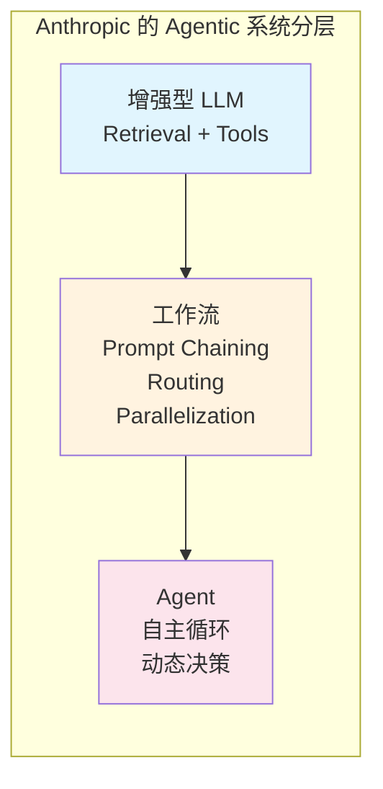
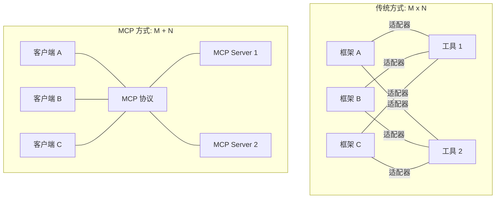

# Anthropic Agent 生态：MCP 与 Claude Code

在 Agent 框架竞争白热化的 2024-2025 年，Anthropic 做出了一个反直觉的选择：不发布自己的 Agent 框架。相反，他们通过一篇博客（"Building Effective Agents"）、一个标准协议（MCP）和一款产品（Claude Code）表达了自己的立场——当模型足够强大时，最好的框架就是没有框架。

## Anthropic 的 Agent 哲学

2024 年 12 月，Anthropic 发布了 "Building Effective Agents" 博客文章，这篇文章迅速成为 Agent 开发社区的必读材料。其核心观点可以提炼为：

**简单代码胜过复杂框架**：大多数 Agent 用例用简单的 while 循环 + 工具调用就能实现，不需要引入框架的额外抽象。

**Agentic 系统的分层**：从简单的增强型 LLM 调用（augmented LLM），到链式工作流（workflow），再到自主 Agent（autonomous agent），不同复杂度的任务需要不同层次的方案。

**避免过度工程**：不要在不确定需求时就引入复杂的多 Agent 架构。从最简单的方案开始，只在证明有必要时才增加复杂度。



## 为什么不做框架

Anthropic 不发布 Agent 框架是一个深思熟虑的产品决策，背后有几层原因：

第一，模型能力可以替代框架复杂度。Claude 系列模型在指令遵循、长上下文处理、工具调用方面的能力持续提升。当模型能够可靠地执行复杂指令时，框架的"辅助引导"作用就变得多余。

第二，框架会引入不必要的抽象层。每一层抽象都是一个潜在的调试黑箱和性能瓶颈。对于经验丰富的开发者，原生 API 调用比框架封装更透明、更可控。

第三，标准协议比框架更有持久价值。与其锁定用户在特定框架中，不如建立行业标准让所有人受益——这正是 MCP 的定位。

## MCP：Model Context Protocol

MCP（Model Context Protocol）是 Anthropic 在 2024 年 11 月发布的开放标准协议，定义了 AI 模型与外部工具/数据源之间的通信方式。它不是一个框架，而是一个协议规范。

### MCP 的核心思想

传统方式下，每个 Agent 框架都要为每个工具写一个集成适配器，这导致了 M x N 的组合爆炸问题。MCP 通过定义统一的接口规范，将问题简化为 M + N：工具提供者实现一次 MCP Server，所有支持 MCP 的客户端都能使用。



### MCP 的组成

MCP 协议定义了三类核心能力：Resources（资源）让模型访问文件、数据库等上下文数据；Tools（工具）让模型执行操作和调用外部服务；Prompts（提示模板）提供可复用的交互模板。

### MCP 的生态影响

截至 2025 年中，MCP 已被广泛采纳：Claude Desktop、Cursor、Windsurf、VS Code (GitHub Copilot) 等主流 AI 工具都支持 MCP；社区已有数千个 MCP Server 实现；LangChain、CrewAI 等框架也开始集成 MCP 作为工具接入层。

## Claude Code：终端原生的编程 Agent

Claude Code 是 Anthropic 在 2025 年初推出的编程 Agent 产品，以终端工具的形式运行。它体现了 Anthropic 的产品哲学——不是提供框架让别人构建 Agent，而是直接交付一个强大的 Agent 产品。

### 设计特点

Claude Code 运行在终端中，直接访问文件系统和命令行工具。它没有复杂的 UI，也没有框架层的中间抽象。模型（Claude Sonnet/Opus）直接驱动代码的读取、修改和执行。

其核心循环非常简单：读取用户指令 → 理解上下文（读文件、搜索代码）→ 制定计划 → 执行修改 → 验证结果。这正是 Anthropic "简单代码胜过复杂框架" 哲学的产品化体现。

### 与 IDE Agent 的区别

与 Cursor、Windsurf 等 IDE 集成的 Agent 不同，Claude Code 选择了终端作为交互界面。这个选择有其深意：终端是开发者最原始也最强大的工具；无 UI 框架的约束意味着能力上限更高；与现有工作流（git、make、docker 等）天然集成。

## Computer Use：浏览器与桌面操控

Anthropic 在 2024 年 10 月推出了 Computer Use 能力，让 Claude 能够操控浏览器和桌面应用——查看屏幕截图、移动鼠标、点击按钮、输入文本。这是另一种"用模型能力取代框架"的体现：不需要为每个应用写 API 集成，直接让模型像人一样操作 GUI。

## 代码优先的 Agent 构建方式

按照 Anthropic 的哲学，构建 Agent 应该这样：

```python
import anthropic

client = anthropic.Anthropic()

tools = [
    {
        "name": "read_file",
        "description": "读取文件内容",
        "input_schema": {
            "type": "object",
            "properties": {"path": {"type": "string", "description": "文件路径"}},
            "required": ["path"]
        }
    },
    {
        "name": "write_file",
        "description": "写入文件",
        "input_schema": {
            "type": "object",
            "properties": {
                "path": {"type": "string"},
                "content": {"type": "string"}
            },
            "required": ["path", "content"]
        }
    }
]

def run_agent(task: str) -> str:
    """最简单的 Agent 循环——不需要框架"""
    messages = [{"role": "user", "content": task}]
    
    while True:
        response = client.messages.create(
            model="claude-sonnet-4-20250514",
            max_tokens=4096,
            tools=tools,
            messages=messages
        )
        
        # 如果模型结束对话，返回结果
        if response.stop_reason == "end_turn":
            return "".join(
                block.text for block in response.content 
                if block.type == "text"
            )
        
        # 处理工具调用
        messages.append({"role": "assistant", "content": response.content})
        tool_results = []
        for block in response.content:
            if block.type == "tool_use":
                result = execute_tool(block.name, block.input)
                tool_results.append({
                    "type": "tool_result",
                    "tool_use_id": block.id,
                    "content": result
                })
        messages.append({"role": "user", "content": tool_results})

def execute_tool(name: str, args: dict) -> str:
    if name == "read_file":
        with open(args["path"]) as f:
            return f.read()
    elif name == "write_file":
        with open(args["path"], "w") as f:
            f.write(args["content"])
        return "文件写入成功"
```

这段代码就是一个完整的 Agent——没有框架依赖，逻辑完全透明，调试时每一步都清晰可见。

## 这种方式的权衡

### 优势

调试透明，出问题时不会迷失在框架抽象中；零依赖，不用担心框架的 breaking changes；模型升级自动受益，不需要等框架适配；完全控制错误处理、重试逻辑、成本优化。

### 局限

需要自行实现持久化、检查点、human-in-the-loop 等基础设施；多 Agent 协调的复杂场景需要更多自定义代码；缺乏现成的可观测性方案（需要自建或集成第三方）；对开发者的工程能力要求更高。

## 适用场景

Anthropic 的极简路线最适合：工程能力强的团队、对可控性要求极高的生产系统、模型能力能覆盖大部分复杂度的场景（即不需要复杂编排来弥补模型不足）。

如果团队规模小或 Agent 逻辑确实复杂到需要显式状态图管理，框架（如 LangGraph）仍然是合理选择。

## 本章小结

Anthropic 的 Agent 策略——不做框架、推动标准协议、用模型能力取代框架复杂度——是一条独特且有深度的技术路线。MCP 正在成为工具集成的事实标准，Claude Code 证明了强模型 + 简单循环就能构建强大的 Agent 产品。这种哲学提醒我们：在追逐框架特性之前，先问一句"模型本身能不能解决这个问题"。

## 延伸阅读

- [Building Effective Agents (Anthropic Blog)](https://www.anthropic.com/research/building-effective-agents)
- [MCP 官方文档](https://modelcontextprotocol.io/)
- [MCP GitHub 组织](https://github.com/modelcontextprotocol)
- [Claude Code 文档](https://docs.anthropic.com/en/docs/claude-code)
- [Computer Use 文档](https://docs.anthropic.com/en/docs/agents-and-tools/computer-use)
- [MCP 与工具集成](../06-tool-use/) — 本书工具使用章节
