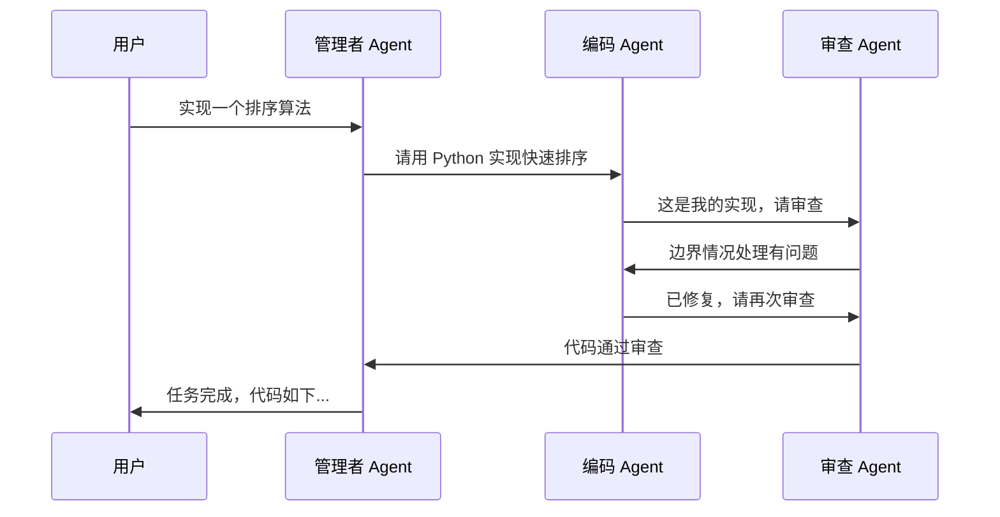

# AutoGen：对话驱动的多 Agent 框架

AutoGen 由微软研究院于 2023 年 9 月发布，是多 Agent 对话式协作的先驱。它的核心洞察是：复杂任务可以被分解为多个 Agent 之间的对话——就像人类团队通过讨论来协作解决问题。2024 年底，AutoGen 进行了从 0.2 到 0.4 版本的彻底重写，转向事件驱动架构，标志着从研究项目到生产框架的转型。

## 核心设计理念

AutoGen 将 Agent 建模为"可对话实体"（Conversable Agent）。每个 Agent 都能接收消息、处理消息、发送回复。多 Agent 协作就是这些实体之间有结构或无结构的对话过程。

这种设计的直觉性在于：它模拟了人类团队协作的自然模式——程序员和测试员之间的代码审查对话、产品经理和工程师之间的需求讨论、研究者和分析师之间的数据解读。



## AutoGen 0.2：经典版本

### ConversableAgent

AutoGen 0.2 的核心类是 `ConversableAgent`，它统一了人类代理（UserProxyAgent）和AI代理（AssistantAgent）的接口：

```python
from autogen import ConversableAgent, config_list_from_json

config_list = [{"model": "gpt-4o", "api_key": "your-key"}]

# 创建编程 Agent
coder = ConversableAgent(
    name="程序员",
    system_message="""你是一个专业的 Python 程序员。
    编写高质量、有注释的代码。完成后回复 TERMINATE。""",
    llm_config={"config_list": config_list}
)

# 创建审查 Agent
reviewer = ConversableAgent(
    name="审查员",
    system_message="""你是一个严格的代码审查员。
    检查代码质量、边界情况和性能问题。
    如果代码通过审查，回复 TERMINATE。""",
    llm_config={"config_list": config_list}
)

# 发起对话
result = reviewer.initiate_chat(
    coder,
    message="请实现一个支持泛型的二叉搜索树，包含插入、查找和删除操作。",
    max_turns=6
)
```

### GroupChat：多 Agent 群聊

当需要三个以上 Agent 协作时，GroupChat 提供了管理多方对话的机制：

```python
from autogen import GroupChat, GroupChatManager

# 创建多个专业 Agent
architect = ConversableAgent(
    name="架构师",
    system_message="你是系统架构师，负责整体设计决策。",
    llm_config={"config_list": config_list}
)

developer = ConversableAgent(
    name="开发者",
    system_message="你是后端开发者，负责具体实现。",
    llm_config={"config_list": config_list}
)

tester = ConversableAgent(
    name="测试工程师",
    system_message="你是测试工程师，负责设计测试方案和发现缺陷。",
    llm_config={"config_list": config_list}
)

# 创建群聊
group_chat = GroupChat(
    agents=[architect, developer, tester],
    messages=[],
    max_round=12,
    speaker_selection_method="auto"  # 自动选择下一个发言者
)

# 群聊管理者
manager = GroupChatManager(
    groupchat=group_chat,
    llm_config={"config_list": config_list}
)

# 启动群聊
architect.initiate_chat(
    manager,
    message="我们需要设计一个用户认证模块，支持 OAuth2 和 JWT。"
)
```

### 代码执行能力

AutoGen 的独特优势之一是内置的代码执行能力——Agent 可以编写代码并在安全沙箱中运行，根据执行结果进行迭代：

```python
from autogen import ConversableAgent
from autogen.coding import LocalCommandLineCodeExecutor

# 配置代码执行器
code_executor = LocalCommandLineCodeExecutor(work_dir="./workspace")

# 代码执行 Agent（代替人类执行代码）
executor_agent = ConversableAgent(
    name="代码执行器",
    code_execution_config={"executor": code_executor},
    human_input_mode="NEVER",
    llm_config=False  # 不使用 LLM，纯执行
)

# 编码 Agent
coding_agent = ConversableAgent(
    name="数据分析师",
    system_message="""你是一个数据分析师，使用 Python 进行数据分析。
    编写可执行的代码块，执行器会帮你运行。
    根据执行结果调整代码直到得到正确结果。""",
    llm_config={"config_list": config_list}
)

# 编码 Agent 写代码，执行 Agent 运行代码
executor_agent.initiate_chat(
    coding_agent,
    message="分析 sales.csv 文件，找出月度销售趋势并生成可视化图表。"
)
```

## AutoGen 0.4：事件驱动重构

2024 年底发布的 AutoGen 0.4 并非一次简单的功能迭代，而是一次基于社区反馈的彻底架构重构和设计哲学升级。这次变革清晰地反映了 AI Agent 开发从实验性探索到严肃工程化实践的转变。

### v0.2 时代的局限性

随着应用场景的复杂化，v0.2 架构的局限逐渐暴露。核心逻辑耦合较紧，缺乏清晰的层次划分，使扩展和定制变得困难。对话流程主要是同步执行的，在处理长时间运行任务或大量并发请求时成为性能瓶颈。此外，理解复杂的多智能体对话流如何发生、定位其中的问题非常困难，可观测性和调试能力不足成为生产环境中的主要痛点。

### v0.4 的核心架构变革

**分层架构（Layered Architecture）**：新架构明确将系统划分为不同层次——核心 API、AgentChat API、可观测性工具、分布式能力等被划分到独立模块中。每层职责清晰，开发者可以更容易地替换或扩展某个特定层次的实现而不影响整个系统。

**异步事件驱动架构（核心变革）**：Agent 之间的通信从紧耦合的同步调用变为异步消息传递和事件总线。一个 Agent 完成任务后不再直接调用下一个 Agent，而是向系统发布事件（如"任务已完成"），其他订阅了此事件的 Agent 接收后触发后续动作。这带来了三个关键优势：Agent 之间不再有直接依赖（解耦）；系统可以高效处理大量并发对话和长时间运行的后台任务（可伸缩性）；单个 Agent 处理失败不会阻塞整个对话流，可以更容易地实现重试和恢复（韧性）。

**设计哲学的成熟**：这次重构是深度倾听社区反馈的结果，AutoGen 不再仅仅是一个"框架"，其目标是成为一个可扩展的"平台"——分层和事件驱动的架构为第一方和第三方开发者构建扩展提供了坚实基础。新架构对可维护性、稳健性和可观测性的重视，表明其正将目光投向更广阔的生产级应用场景。同时 v0.4 保持了与 v0.2 的向后兼容性以方便迁移。

### 对多 Agent 编排的深远影响

事件驱动模型使得 Agent 协作可以变得极其灵活和动态——不再局限于固定的线性对话流程（如 User → Coder → Critic），可以实现基于事件的图状协作拓扑。例如，一个"代码审查"事件可以同时触发测试 Agent、安全扫描 Agent 和文档生成 Agent 并行工作。工具调用也实现了异步化——Agent 发起耗时工具调用后可以释放执行线程去处理其他任务，工具完成后通过事件通知继续。此外，事件驱动架构天然适合可观测性集成，系统中每个事件都可被捕获和追踪，极大简化了多 Agent 交互调试。

### 新架构核心变化

具体而言，v0.4 引入了几个关键概念：Agent Runtime 作为消息路由层管理 Agent 的生命周期和通信；Topic 机制替代了直接的 Agent 间对话，实现松耦合；异步优先设计，所有操作默认异步执行；更好的可观测性和错误处理。

```python
# AutoGen 0.4 风格的代码（概念示例）
from autogen_agentchat.agents import AssistantAgent
from autogen_agentchat.teams import RoundRobinGroupChat
from autogen_agentchat.conditions import TextMentionTermination

# 创建 Agent
coder = AssistantAgent(
    "coder",
    model_client=model_client,
    system_message="你是 Python 程序员，编写高质量代码。"
)

reviewer = AssistantAgent(
    "reviewer", 
    model_client=model_client,
    system_message="你是代码审查员，发现问题后指出。认为代码合格时说 APPROVE。"
)

# 定义终止条件
termination = TextMentionTermination("APPROVE")

# 组建团队
team = RoundRobinGroupChat(
    [coder, reviewer],
    termination_condition=termination,
    max_turns=8
)

# 异步执行
result = await team.run(task="实现一个 LRU Cache")
```

## 与 CrewAI 的对比

AutoGen 和 CrewAI 都是多 Agent 框架，但设计哲学有本质差异：

AutoGen 的对话式范式更灵活、更适合探索性任务，Agent 之间的交互是自由形式的对话。CrewAI 的角色式范式更结构化、更适合确定性任务，Agent 通过预定义的流程进行协作。

从使用体验看，AutoGen 更学术化，适合实验和研究；CrewAI 更工程化，适合构建可预测的生产系统。AutoGen 的 GroupChat 中谁来发言是动态决定的（可能不稳定），而 CrewAI 的执行顺序由 Process 明确定义。

## 优势与局限

### 优势

AutoGen 的核心优势在于：对话式范式最自然地模拟人类协作；内置代码执行能力使得"写代码-运行-修复"的迭代循环非常流畅；微软研究院背景带来的学术深度；0.4 版本的事件驱动架构显著提升了生产就绪度；GroupChat 的灵活性允许复杂的多方协作。

### 局限

主要局限包括：0.2 到 0.4 的破坏性迁移给早期用户带来困扰；对话轮次不可预测导致成本控制困难；GroupChat 的发言者选择有时不够智能；文档和示例质量在版本过渡期不稳定。

## 适用场景

AutoGen 最适合：需要多 Agent 讨论和辩论的研究场景、代码生成与自动调试的迭代式任务、需要灵活对话模式的探索性项目、以及学术研究中对多 Agent 通信模式的实验。

## 本章小结

AutoGen 开创了对话式多 Agent 协作的范式，将"Agent 作为对话参与者"的直觉转化为可编程的框架。尽管从 0.2 到 0.4 的重大重构带来了过渡阵痛，但新架构显著提升了框架的生产就绪性。对于需要灵活多 Agent 对话协作的场景，AutoGen 仍是最成熟的选择。

## 延伸阅读

- [AutoGen 官方文档](https://microsoft.github.io/autogen/)
- [AutoGen GitHub](https://github.com/microsoft/autogen)
- [AutoGen 论文](https://arxiv.org/abs/2308.08155)
- [AutoGen 0.4 迁移指南](https://microsoft.github.io/autogen/docs/migration-guide)
- [CrewAI 对比](./crewai.md) — 另一种多 Agent 范式
