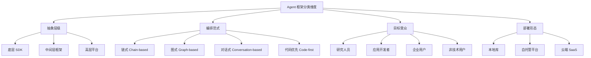
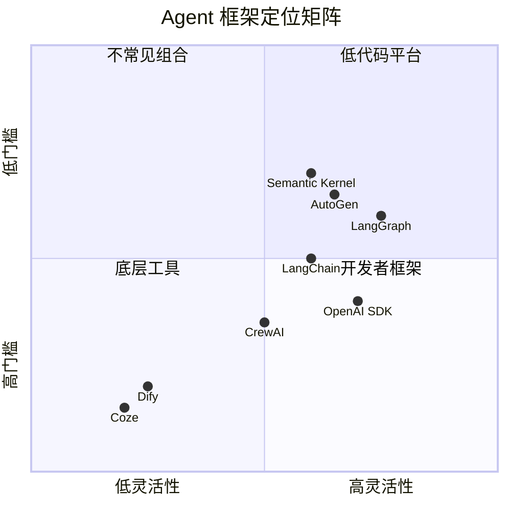

# Agent 框架分类学

Agent 框架生态在 2023-2025 年间经历了爆发式增长，从最初的 LangChain 一家独大，到如今数十个框架竞相争鸣。面对如此丰富的选择，开发者需要一套系统的分类方法论来理解框架间的差异与适用场景。本章从抽象层级、编排范式、目标受众三个核心维度，构建 Agent 框架的分类体系。

## 分类维度总览



## 维度一：抽象层级

抽象层级决定了框架给开发者暴露多少底层细节，也决定了灵活性与易用性之间的权衡。

### 底层 SDK（Low-level SDK）

底层 SDK 提供最基本的构建原语（primitives），开发者对每一步都有完全控制权。典型代表包括 OpenAI Agents SDK 和 Anthropic 的原生 API + MCP 组合。

特征：API 调用封装、基础工具注册机制、最小抽象层。优势在于可预测性强、调试直观，代价是需要自行实现编排逻辑、状态管理和错误恢复。

### 中间层框架（Mid-level Framework）

中间层框架在 SDK 之上提供了编排能力，但仍要求开发者编写代码来定义 Agent 行为。LangGraph、AutoGen、CrewAI 均属于此类。

特征：提供状态管理、流程编排、工具集成、记忆机制等开箱即用能力。开发者通过代码定义节点、边、角色等抽象概念来构建 Agent 系统。

### 高层平台（High-level Platform）

高层平台通过可视化界面让用户无需或少量编码即可构建 Agent。Dify、Coze（扣子）、AutoGPT Platform 属于此类。

特征：拖拽式工作流编辑器、预置模板、一键部署。降低了准入门槛，但牺牲了自定义灵活性。

## 维度二：编排范式

编排范式是框架的核心设计哲学，决定了开发者如何思考和组织 Agent 的行为逻辑。

### 链式范式（Chain-based）

链式范式将 Agent 行为建模为线性的处理管道：输入 - 步骤 A - 步骤 B - 输出。LangChain 早期版本是这一范式的典型代表。

```python
# 链式范式伪代码
chain = prompt | llm | output_parser | tool_executor | summarizer
result = chain.invoke({"input": "用户问题"})
```

优势在于简单直观、易于理解，适合线性处理流程。局限性在于难以处理条件分支、循环、并行执行等复杂逻辑。

### 图式范式（Graph-based）

图式范式将 Agent 行为建模为有向图，节点代表处理步骤，边代表控制流转。LangGraph 是这一范式的代表。

```python
# 图式范式伪代码
graph = StateGraph(AgentState)
graph.add_node("plan", plan_node)
graph.add_node("execute", execute_node)
graph.add_node("evaluate", evaluate_node)
graph.add_conditional_edges("evaluate", should_continue, {
    "continue": "execute",
    "finish": END
})
```

优势在于能表达任意复杂的控制流，支持循环、条件分支和并行。代价是学习曲线较陡，小任务可能过度设计。

### 对话式范式（Conversation-based）

对话式范式将 Agent 间的交互建模为对话：Agent 通过消息传递来协作。AutoGen 是这一范式的代表。

```python
# 对话式范式伪代码
coder = ConversableAgent("coder", system_message="你是一个程序员")
reviewer = ConversableAgent("reviewer", system_message="你是一个代码审查者")
reviewer.initiate_chat(coder, message="请实现一个排序算法")
```

优势在于自然直觉，与人类协作方式一致。适合研究探索和需要讨论、辩论的场景。局限性在于对话轮次不可预测，成本控制困难。

### 代码优先范式（Code-first）

代码优先范式主张用普通编程语言的控制流来编排 Agent，而非框架特有的抽象。Anthropic 推崇这种方式。

```python
# 代码优先范式伪代码
async def agent_loop(task: str):
    messages = [{"role": "user", "content": task}]
    while True:
        response = await client.messages.create(model="claude-4", messages=messages)
        if response.stop_reason == "end_turn":
            return response.content
        tool_results = await execute_tools(response.tool_use)
        messages.extend(tool_results)
```

优势在于零额外抽象、完全可控、调试简单。适合模型能力足够强的场景。局限性在于复杂系统需要自行实现大量基础设施。

## 维度三：目标受众

### 研究人员

面向研究人员的框架重视实验灵活性和可复现性，如 CAMEL、MetaGPT。通常提供论文级的功能实现，但生产就绪度较低。

### 应用开发者

面向应用开发者的框架追求开发效率和生产就绪性，如 LangChain、CrewAI、OpenAI Agents SDK。提供丰富的集成、良好的文档和活跃的社区。

### 企业用户

面向企业的框架强调安全合规、可观测性和运维能力，如 Semantic Kernel、Haystack。通常与企业级云平台深度集成。

### 非技术用户

面向非技术用户的平台通过可视化界面消除编码门槛，如 Dify、Coze。牺牲灵活性换取极低的使用门槛。

## 框架分类全景图



## 分类决策框架

选择框架时，可以按以下顺序进行决策：

第一步，确定抽象层级需求。如果团队有强工程能力且需要极致控制，选底层 SDK；如果需要快速交付且接受框架约束，选中间层；如果团队非技术背景或需要快速原型验证，选高层平台。

第二步，确定编排复杂度。线性流程选链式，有条件分支和循环选图式，需要多 Agent 讨论协作选对话式，模型能力足够且追求简洁选代码优先。

第三步，考虑生态与约束。是否需要特定模型提供商、是否有企业合规要求、团队技术栈偏好（Python vs C#）等。

## 演进趋势

当前 Agent 框架生态正在经历几个重要趋势：从重框架到轻框架的回归，随着模型能力提升，过度抽象的框架正在失去吸引力；从单 Agent 到多 Agent 的演进，编排多个专业化 Agent 协作成为主流方向；从开发工具到运行时平台的扩展，框架开始承担部署、监控、评估等全生命周期职责；标准化协议的出现，如 MCP（Model Context Protocol）正在成为工具集成的事实标准。

## 本章小结

Agent 框架的选择没有绝对的优劣之分，关键在于匹配团队能力、项目需求和约束条件。理解分类维度能帮助开发者在纷繁的选择中快速定位适合的方案。后续章节将逐一深入各主流框架，提供更具体的使用指导。

## 延伸阅读

- [LangChain 官方文档](https://python.langchain.com/)
- [LangGraph 概念文档](https://langchain-ai.github.io/langgraph/)
- [Anthropic: Building Effective Agents](https://www.anthropic.com/research/building-effective-agents)
- [OpenAI Agents SDK](https://github.com/openai/openai-agents-python)
- [Agent 框架生态图谱 (e2b)](https://e2b.dev/blog/open-source-ai-agents)
