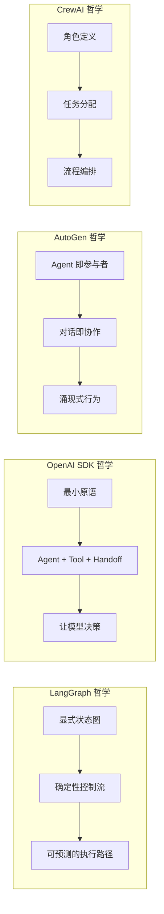
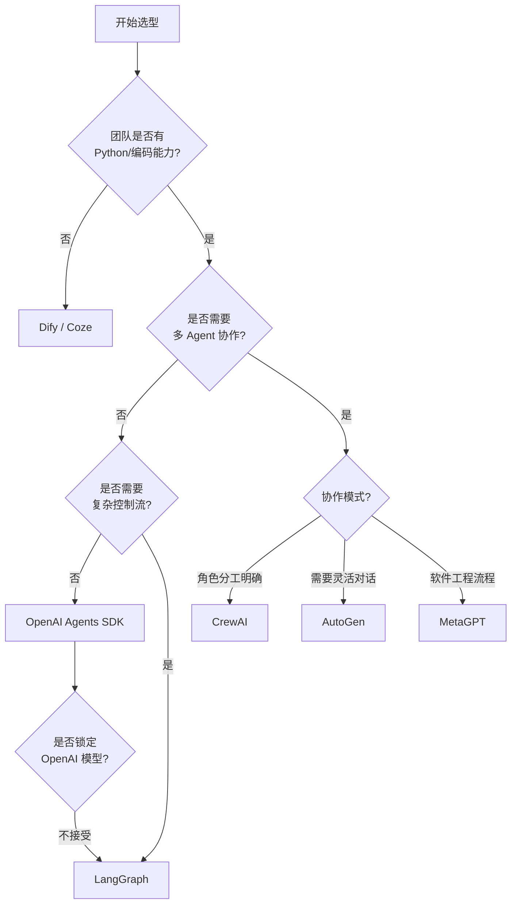

# 主流框架对比矩阵

面对 Agent 框架的快速演进，技术选型成为团队必须面对的决策。本章从实用角度出发，对主流框架进行多维度对比，并提供一套清晰的决策框架。

## 对比维度定义

在展开对比之前，先明确各评估维度的含义：

**易用性（Ease of Use）**：从零到第一个可运行 Agent 的时间和认知成本。包括文档质量、API 设计直觉性、示例丰富度。

**灵活性（Flexibility）**：框架能否支持任意复杂的 Agent 行为逻辑，包括条件分支、循环、动态路由、自定义组件。

**生产就绪度（Production Readiness）**：在真实生产环境中的可靠性，包括错误处理、可观测性、性能、部署支持。

**社区生态（Community）**：社区活跃度、第三方集成数量、问题响应速度、学习资源丰富度。

**多 Agent 支持（Multi-Agent）**：框架对多 Agent 协作的原生支持程度。

## 核心框架对比表

| 维度 | LangGraph | OpenAI SDK | AutoGen | CrewAI | Semantic Kernel |
|------|-----------|------------|---------|--------|-----------------|
| 发布时间 | 2024.01 | 2025.03 | 2023.09 | 2023.12 | 2023.03 |
| 编排范式 | 图式 | 代码优先 | 对话式 | 角色式 | 插件式 |
| 易用性 | ⭐⭐⭐ | ⭐⭐⭐⭐⭐ | ⭐⭐⭐ | ⭐⭐⭐⭐ | ⭐⭐⭐ |
| 灵活性 | ⭐⭐⭐⭐⭐ | ⭐⭐⭐⭐ | ⭐⭐⭐⭐ | ⭐⭐⭐ | ⭐⭐⭐⭐ |
| 生产就绪 | ⭐⭐⭐⭐ | ⭐⭐⭐⭐ | ⭐⭐⭐ | ⭐⭐⭐ | ⭐⭐⭐⭐⭐ |
| 社区生态 | ⭐⭐⭐⭐⭐ | ⭐⭐⭐⭐ | ⭐⭐⭐⭐ | ⭐⭐⭐⭐ | ⭐⭐⭐ |
| 多 Agent | ⭐⭐⭐⭐ | ⭐⭐⭐ | ⭐⭐⭐⭐⭐ | ⭐⭐⭐⭐⭐ | ⭐⭐⭐ |
| 模型无关 | ✅ | ❌(初期) | ✅ | ✅ | ✅ |
| 主要语言 | Python | Python | Python | Python | C#/Python/Java |
| 企业级特性 | 中 | 低 | 低 | 中 | 高 |
| GitHub Stars | 8k+ | 15k+ | 40k+ | 25k+ | 22k+ |

## 架构哲学对比

### LangGraph：工程师的精确控制

LangGraph 的哲学是"Agent 行为应该是可预测的"。通过显式定义状态图，开发者对每一步执行有完全控制。这种方式适合需要严格保证执行逻辑的生产系统。

### OpenAI Agents SDK：模型能力的极致利用

OpenAI SDK 的哲学是"模型足够聪明，框架应该足够薄"。三个核心原语（Agent、Tool、Handoff）足以表达大多数场景。这种极简主义在 GPT-4o 级别模型上效果卓越。

### AutoGen：自然协作的涌现

AutoGen 的哲学是"让 Agent 像人一样对话协作"。通过最少的结构化约束，让多个 Agent 在对话中自发地分工合作。适合探索性任务和研究场景。

### CrewAI：组织管理的隐喻

CrewAI 的哲学是"像组建团队一样组建 Agent 系统"。每个 Agent 有明确的角色、目标和背景故事，任务通过流程（sequential/hierarchical）来编排。直觉性极强。

### Semantic Kernel：企业级的稳健

Semantic Kernel 的哲学是"AI 是企业软件的一个能力层"。它不是为 Agent 而生，而是为企业应用集成 AI 能力而设计。稳定性和安全性优先于创新性。

## 典型场景选型推荐

### 场景一：快速原型验证

推荐：**OpenAI Agents SDK** 或 **CrewAI**

原因：最少的代码量即可实现可运行的 Agent。OpenAI SDK 适合单 Agent 场景，CrewAI 适合需要多角色协作的原型。

### 场景二：生产级单 Agent 系统

推荐：**LangGraph**

原因：显式的状态管理、内置持久化、流式输出、human-in-the-loop 支持。对生产环境的边界情况处理最为完善。

### 场景三：多 Agent 研究探索

推荐：**AutoGen**

原因：对话式范式天然适合探索性任务，Agent 间的交互模式最为灵活。学术社区支持强。

### 场景四：企业级 .NET 应用

推荐：**Semantic Kernel**

原因：与 Azure 生态深度集成，C# 原生支持，满足企业安全合规要求。

### 场景五：非技术团队快速上线

推荐：**Dify** 或 **Coze**

原因：可视化构建，无需编码，内置部署能力。

## 性能与成本考量

框架本身的性能开销通常不是瓶颈——LLM 调用的延迟和成本才是。但框架设计会间接影响成本：

LangGraph 通过显式控制流减少不必要的 LLM 调用，成本可预测。AutoGen 的对话式范式可能产生大量中间对话轮次，成本相对不可控。CrewAI 在任务委托时可能产生额外的 Agent 间通信成本。OpenAI SDK 的 handoff 机制相对高效，每次只有一个 Agent 活跃。

## 决策流程图

## 框架组合使用

实践中，框架并非互斥选择。常见的组合模式包括：

**LangGraph + OpenAI SDK**：用 LangGraph 管理整体流程，在节点内使用 OpenAI SDK 定义具体 Agent 行为。

**CrewAI + LangChain Tools**：复用 LangChain 丰富的工具生态，同时享受 CrewAI 直觉的编排 API。

**任何框架 + MCP**：通过 MCP 协议统一工具接入层，框架专注编排逻辑。

## 演进方向预判

2025 年及以后，框架生态可能的演进方向：轻量化趋势会持续，随着模型能力提升，过度抽象的框架将被淘汰；MCP 等标准协议将成为工具集成的默认方式，减少框架锁定；可观测性和评估能力将成为框架的标配而非可选组件；多 Agent 编排将从实验性走向生产就绪。

## 本章小结

框架选型的核心原则是"匹配而非追新"——最好的框架是最匹配团队能力和项目需求的那个。对于大多数团队，建议从 OpenAI SDK 或 CrewAI 开始快速验证想法，在确认需要更复杂控制后再迁移到 LangGraph。企业级项目则应从一开始就考虑 Semantic Kernel 或 LangGraph 的生产特性。

## 延伸阅读

- [LangGraph vs CrewAI vs AutoGen 对比 (Harrison Chase)](https://blog.langchain.dev/)
- [OpenAI Agents SDK 官方文档](https://openai.github.io/openai-agents-python/)
- [AutoGen 0.4 架构文档](https://microsoft.github.io/autogen/)
- [Semantic Kernel 官方博客](https://devblogs.microsoft.com/semantic-kernel/)
- [框架选型的第一性原理](../01-agent-basics/) — 回顾 Agent 基础概念
