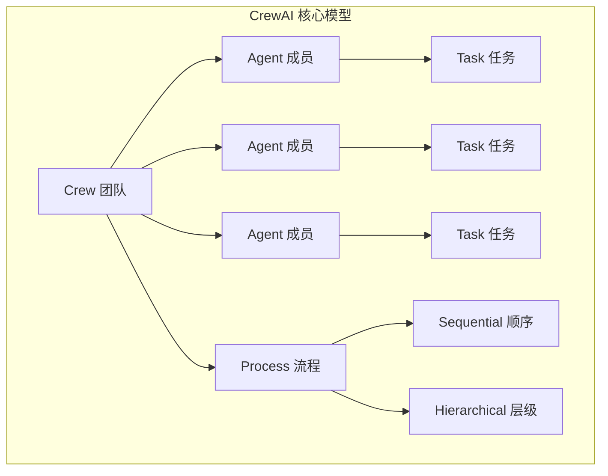

# CrewAI：基于角色的 Agent 编排

CrewAI 于 2023 年 12 月发布，凭借直觉性极强的 API 设计迅速获得开发者社区青睐。它的核心隐喻是"组建一支专业团队"：每个 Agent 有明确的角色（role）、目标（goal）和背景（backstory），通过结构化的任务（Task）和流程（Process）进行协作。如果说 AutoGen 模拟的是"自由讨论"，CrewAI 模拟的则是"项目管理"。

## 核心设计隐喻

CrewAI 的 API 设计处处体现着"团队管理"的隐喻：



这种设计让即使不熟悉 Agent 技术细节的人也能理解系统结构——"我有一个研究员负责调研，一个写手负责写作，一个编辑负责审稿，他们按顺序执行各自的任务"。

## 核心概念详解

### Agent：有角色的智能体

CrewAI 的 Agent 比大多数框架的 Agent 定义更丰富。除了系统提示外，每个 Agent 还有角色、目标和背景故事，这些信息共同塑造 Agent 的"人格"：

```python
from crewai import Agent
from crewai_tools import SerperDevTool, WebsiteSearchTool

# 研究员 Agent
researcher = Agent(
    role="高级研究分析师",
    goal="发掘 AI Agent 技术领域最前沿的发展趋势",
    backstory="""你是一位在 AI 领域有 10 年经验的研究分析师，
    擅长从海量信息中提炼关键洞察。你特别关注技术的实际落地价值，
    而不仅是学术新颖性。""",
    tools=[SerperDevTool(), WebsiteSearchTool()],
    verbose=True,
    allow_delegation=True  # 允许将子任务委托给其他 Agent
)

# 写作 Agent
writer = Agent(
    role="技术内容写手",
    goal="将复杂的技术概念转化为清晰易懂的文章",
    backstory="""你是一位技术写作专家，曾为多家顶级科技媒体撰稿。
    你善于用类比和具体案例解释抽象概念，文风简洁有力。""",
    verbose=True
)

# 编辑 Agent
editor = Agent(
    role="资深编辑",
    goal="确保文章的准确性、可读性和结构完整性",
    backstory="""你是一位有 15 年经验的技术编辑，
    对细节要求极高，同时兼顾文章整体的叙事流畅度。""",
    verbose=True
)
```

### Task：结构化的任务定义

Task 定义了具体需要完成的工作，包括描述、期望输出和负责的 Agent：

```python
from crewai import Task

# 研究任务
research_task = Task(
    description="""调研 2025 年 Agent 框架领域的最新发展，重点关注：
    1. 各主流框架的最新版本和重大更新
    2. 新兴的设计范式和趋势
    3. 企业采用情况和实际案例
    至少覆盖 5 个主流框架的最新动态。""",
    expected_output="一份结构化的调研报告，包含关键发现、数据支持和分析洞察",
    agent=researcher
)

# 写作任务
writing_task = Task(
    description="""基于调研报告，撰写一篇面向开发者的技术文章，主题为
    "2025 Agent 框架格局：你该选哪个？"。
    文章需要客观但有观点，给出实用的选型建议。""",
    expected_output="一篇 2000 字左右的技术博客文章，Markdown 格式",
    agent=writer,
    context=[research_task]  # 依赖研究任务的输出
)

# 编辑任务
editing_task = Task(
    description="""审核文章的技术准确性、逻辑连贯性和文字质量。
    修正错误，优化表达，确保文章对目标读者有价值。""",
    expected_output="经过编辑的最终版本文章",
    agent=editor,
    context=[writing_task]
)
```

### Crew：团队编排

Crew 将 Agent 和 Task 组合在一起，通过 Process 定义执行模式：

```python
from crewai import Crew, Process

# 组建团队
content_crew = Crew(
    agents=[researcher, writer, editor],
    tasks=[research_task, writing_task, editing_task],
    process=Process.sequential,  # 顺序执行
    verbose=True
)

# 启动执行
result = content_crew.kickoff()
print(result)
```

### Process：执行模式

CrewAI 支持两种主要的执行模式：

**Sequential（顺序）**：任务按定义顺序依次执行，前一个任务的输出作为后一个任务的输入。适合流水线式的工作流。

**Hierarchical（层级）**：引入一个"管理者"Agent 负责任务分配和结果审核。管理者动态决定哪个 Agent 执行什么任务，更适合复杂的决策场景。

```python
# 层级模式
hierarchical_crew = Crew(
    agents=[researcher, writer, editor],
    tasks=[research_task, writing_task, editing_task],
    process=Process.hierarchical,
    manager_llm="gpt-4o"  # 管理者使用的模型
)
```

## 高级特性

### 工具集成

CrewAI 提供了 `crewai-tools` 包，内置了搜索、网页抓取、文件操作等常用工具，同时支持自定义工具和 LangChain 工具：

```python
from crewai.tools import tool

@tool("代码搜索")
def search_codebase(query: str) -> str:
    """在代码库中搜索相关代码片段"""
    # 搜索实现
    return f"找到与 '{query}' 相关的代码..."
```

CrewAI 在 2025 年将能力扩展体系化为五种类型（Tools、MCPs、Apps、Skills、Knowledge），其中 Skills 指领域知识指令集，与 Tools 的"执行能力"形成互补。这一设计反映了行业对"能力 ≠ 工具"的认知深化——详见 [从工具到技能：Agent 能力扩展生态](../07-core-modules/skill-ecosystem.md)。

### 记忆系统

CrewAI 支持短期记忆（当前任务上下文）、长期记忆（跨任务的经验积累）和实体记忆（关于特定实体的知识）：

```python
crew = Crew(
    agents=[researcher, writer],
    tasks=[research_task, writing_task],
    memory=True,  # 开启记忆
    verbose=True
)
```

### 任务委托（Delegation）

设置 `allow_delegation=True` 的 Agent 可以将子任务委托给团队中的其他 Agent：

```python
# 研究员发现需要写代码来分析数据，委托给编码 Agent
researcher = Agent(
    role="研究员",
    goal="...",
    backstory="...",
    allow_delegation=True  # 允许委托
)
```

## 完整实战示例

```python
from crewai import Agent, Task, Crew, Process
from crewai_tools import SerperDevTool

# 工具
search_tool = SerperDevTool()

# Agent 定义
market_analyst = Agent(
    role="市场分析师",
    goal="分析目标市场的竞争格局和机会",
    backstory="资深市场分析师，擅长竞品分析和趋势判断",
    tools=[search_tool]
)

strategy_consultant = Agent(
    role="战略顾问",
    goal="基于市场分析制定可行的产品战略",
    backstory="有 20 年咨询经验的战略顾问，服务过多家科技公司"
)

# 任务定义
analysis_task = Task(
    description="分析中国市场 AI 编程助手的竞争格局，包括主要玩家、定价策略、差异化点",
    expected_output="竞争分析报告，含 SWOT 分析",
    agent=market_analyst
)

strategy_task = Task(
    description="基于竞争分析，为一款新的 AI 编程助手产品制定进入策略",
    expected_output="产品战略建议书，含定位、差异化和 GTM 策略",
    agent=strategy_consultant,
    context=[analysis_task]
)

# 组建并运行
strategy_crew = Crew(
    agents=[market_analyst, strategy_consultant],
    tasks=[analysis_task, strategy_task],
    process=Process.sequential
)

result = strategy_crew.kickoff()
```

## 优势

CrewAI 的核心优势在于：API 设计极其直觉，"角色-任务-团队"的隐喻人人都能理解；文档质量优秀，示例丰富；从设计之初就考虑了生产部署；学习曲线平缓，15 分钟即可上手；内置的记忆和委托机制为复杂场景提供了开箱即用的支持。

## 局限

主要局限包括：对于需要复杂控制流（循环、动态路由）的场景，表达力不如 LangGraph；Process 类型有限，不支持任意拓扑的执行图；对 Agent 间的交互方式约束较强，不如 AutoGen 的自由对话灵活；性能优化空间有限（每个 Task 至少一次 LLM 调用）。

## 何时选择 CrewAI

当你的场景满足以下条件时，CrewAI 是很好的选择：任务可以清晰地分解为几个角色的协作；执行流程相对确定（顺序或层级）；团队希望快速构建多 Agent 原型；不需要复杂的条件分支和循环逻辑。

如果你的场景需要精细的状态管理和任意复杂的控制流，考虑 LangGraph；如果需要更灵活的多 Agent 对话模式，考虑 AutoGen。

## 本章小结

CrewAI 用"组建团队"这个人人都懂的隐喻，大幅降低了多 Agent 系统的认知门槛。它证明了好的 API 设计可以让复杂技术变得平易近人。虽然在灵活性上不如图式框架，但对于大多数"任务分工-协作完成"的场景，CrewAI 的简洁性和直觉性是无可比拟的优势。

## 延伸阅读

- [CrewAI 官方文档](https://docs.crewai.com/)
- [CrewAI GitHub](https://github.com/crewAIInc/crewAI)
- [CrewAI Tools 文档](https://docs.crewai.com/concepts/tools)
- [CrewAI 与 LangGraph 对比](./comparison-matrix.md)
- [多 Agent 系统设计模式](./autogen.md) — AutoGen 的对话式方案
