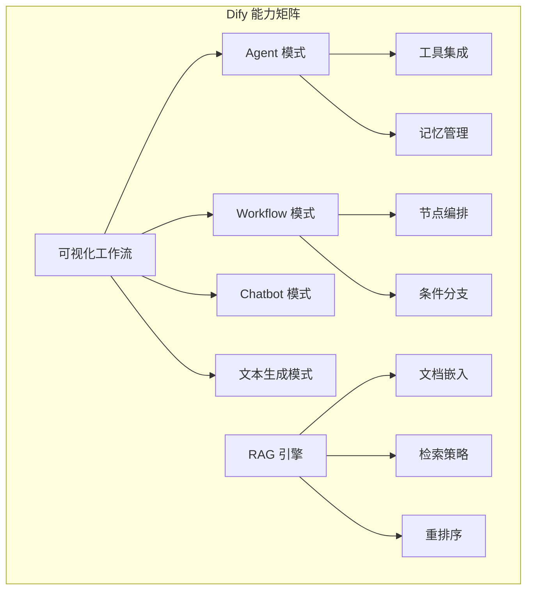

# Dify：开源 LLM 应用开发平台

Dify 是一个开源的 LLM 应用开发平台，通过可视化界面让用户无需（或少量）编码即可构建 AI 应用。在 Agent 框架生态中，Dify 代表了"高层平台"这一层级——它的目标用户不仅是工程师，更包括产品经理、运营人员等非技术角色。自 2023 年发布以来，Dify 在中国开发者社区中获得了极高的关注度，GitHub Stars 超过 50k，是最受欢迎的开源 LLMOps 项目之一。

## 产品定位

Dify 的命名来源于 "Define + Modify"，体现了其核心理念：让 AI 应用的定义和修改变得简单。它不试图取代代码级框架（如 LangGraph），而是为那些不需要或不想要底层控制的用户提供一条快速通道。

其定位可以类比为：如果 LangGraph 是 React（灵活但需要编程），那么 Dify 就是 Webflow（可视化但有边界）。两者服务不同的用户群体和场景。



## 核心功能

### 四种应用模式

Dify 提供了四种预定义的应用模式，覆盖最常见的 AI 应用场景：

**Chatbot 模式**：面向对话场景，支持多轮对话、记忆管理、人格设定。适合客服、咨询助手等场景。

**Agent 模式**：让 AI 能够根据用户问题自主选择工具和推理策略。支持 Function Calling 和 ReAct 两种推理模式。

**Workflow 模式**：最强大的模式，通过可视化画布编排多步骤处理逻辑。支持条件分支、循环、并行、HTTP 调用等。

**文本生成模式**：面向单次生成任务（如翻译、摘要、内容创作），无对话上下文。

### 可视化工作流（Workflow）

Dify 的工作流编辑器是其核心竞争力之一。通过拖拽式的画布界面，用户可以构建复杂的处理逻辑。支持的节点类型包括：LLM 节点（调用任意模型，支持提示词模板）、知识检索节点（RAG 查询）、工具节点（HTTP 请求、代码执行、第三方 API）、条件分支节点（if/else 逻辑）、变量赋值和转换节点、循环和迭代节点、人工审核节点（human-in-the-loop）。

每个节点的输入输出都可以在界面上实时预览，调试体验远优于代码级框架的 print 调试。

### RAG 管道

Dify 内置了完整的 RAG 管道，这是其最成熟的能力之一。整个流程无需编码：文档上传和解析（支持 PDF、Word、Markdown、HTML、TXT 等格式）、自动分块（支持自定义分块大小和重叠）、多种嵌入模型选择（OpenAI、Cohere、本地模型）、多种检索策略（语义搜索、关键词搜索、混合检索）、重排序（通过 Cohere Rerank 或其他重排模型优化结果）。

### 模型管理

支持几乎所有主流模型提供商：OpenAI、Anthropic、Google、Azure OpenAI，以及国内的通义千问、文心一言、Moonshot、智谱、DeepSeek 等。统一的模型管理界面让切换模型只需改一个配置，无需修改应用逻辑。

### API 发布

构建好的应用可以一键发布为 API 接口，其他系统可以直接调用。也支持嵌入式 Widget 快速集成到网页中。

## 部署方式

Dify 提供两种部署选项：

**SaaS 版本**：直接使用 dify.ai 的云端服务，零运维成本，适合个人和小团队快速试用。

**自托管版本**：通过 Docker Compose 或 Kubernetes 在私有环境中部署，数据完全自主掌控。这对于数据敏感的企业尤其重要。

```bash
# 本地快速部署（Docker Compose）
git clone https://github.com/langgenius/dify.git
cd dify/docker
cp .env.example .env
docker compose up -d
# 访问 http://localhost/install 完成初始化
```

## 优势

**极低的使用门槛**：非技术人员 30 分钟内即可构建一个可用的 AI 应用。可视化编排大幅降低了理解成本。

**完整的 RAG 能力**：从文档上传到检索优化的全流程支持，是目前开源 RAG 平台中体验最好的之一。分块策略、检索方式、重排序都可以通过界面配置。

**中国社区极度活跃**：中文文档完善、社区响应快、国内模型支持全面、大量中文教程和实践分享。对于中国开发者极其友好。

**可视化调试**：每一步的输入输出都可以在界面上实时查看。工作流中每个节点的执行结果都可以单独检查。这种调试体验是代码级框架难以匹配的。

**自托管能力**：企业可以完全在私有环境中运行，满足数据合规要求。部署流程成熟，社区有大量部署实践可参考。

**丰富的集成**：内置数十个工具集成（搜索、天气、代码执行等），支持通过 OpenAPI 快速接入自定义 API。Dify 自 v1.0（2025.2）引入全插件化架构，将模型、工具、推理策略等都抽象为可插拔的 Plugin——这是平台级能力封装的典型实践，详见 [从工具到技能：Agent 能力扩展生态](../07-core-modules/skill-ecosystem.md)。

## 局限

**灵活性受限**：可视化编排无法表达所有编程逻辑。当需求超出平台预设能力时，扩展成本急剧上升。自定义组件开发需要了解 Dify 内部架构。

**性能考量**：平台层的额外开销（数据库读写、界面渲染、日志记录）在高并发场景下可能成为瓶颈。对于对延迟敏感的生产系统需要仔细评估。

**平台锁定**：用户的业务逻辑（工作流定义、提示词、RAG 配置）存储在 Dify 的数据结构中。如果未来需要迁移到其他方案，迁移成本不低。

**Agent 能力有限**：Dify 的 Agent 模式在复杂推理、多步骤工具使用、动态流程控制方面，不如 LangGraph 或 OpenAI SDK 的精细控制能力。

## 与同类平台对比

| 维度 | Dify | FlowiseAI | Coze |
|------|------|-----------|------|
| 开源 | 是 | 是 | 否 |
| RAG 能力 | 强 | 中 | 中 |
| 可视化 | 优秀 | 良好 | 优秀 |
| 自托管 | 支持 | 支持 | 不支持 |
| 模型支持 | 极广泛 | 广泛 | 字节系为主 |
| 中文生态 | 极强 | 一般 | 强 |
| 企业功能 | 有（权限、审计） | 少 | 有 |
| Agent 能力 | 中 | 弱 | 中 |
| 社区规模 | 50k+ Stars | 30k+ Stars | 闭源生态 |

## 适用场景

Dify 最适合：企业内部知识库问答系统的快速搭建（RAG 场景）、非技术团队的 AI 应用原型验证、需要可视化管理和监控的生产应用、对数据主权有要求且希望自托管的场景、需要频繁调整提示词和工作流的迭代型项目。

不适合：需要极致灵活性和自定义控制的复杂 Agent 系统、对延迟有严苛要求的高并发场景、需要深度集成到现有代码库并与代码逻辑紧密耦合的场景、需要复杂多 Agent 协作和动态编排的高级场景。

## 实践建议

Dify 是验证想法的优秀工具。推荐的使用策略是：先在 Dify 上快速原型验证 AI 应用的可行性和用户价值，这个阶段可能只需要几天时间。如果方向正确，再评估 Dify 是否能满足生产需求——很多项目会发现 Dify 本身就足够。只有在确认需要更复杂的控制逻辑后，再考虑迁移到代码级框架。

这种"先验证后深入"的策略能避免在技术选型上花费过多时间，让团队更快地获得用户反馈。

## 生态与社区

Dify 拥有 Agent 框架领域最活跃的中文社区之一。开源项目的贡献者超过 400 人，社区 Forum 和微信群中有大量的实践分享。这种社区活力带来了几个实际好处：遇到问题时通常很快能找到解决方案、各种部署场景都有前人经验可参考、社区贡献了大量第三方工具和插件。

Dify 的商业模式是"开源核心 + 企业增值"——核心框架完全开源免费，企业版提供多租户管理、SSO 集成、审计日志、SLA 保障等能力。这种模式既保证了社区版的活力，又为项目的长期维护提供了可持续的商业支撑。

## 本章小结

Dify 代表了 Agent 框架生态中"平台化"的方向——通过牺牲部分灵活性来换取极致的易用性和快速交付能力。对于不需要复杂自定义逻辑的 AI 应用场景，Dify 是目前最具性价比的选择之一。它让"人人都能构建 AI 应用"从口号变成了现实。在中国市场，Dify 的社区生态和本地化支持使其成为很多团队的首选入门工具。

## 延伸阅读

- [Dify 官方文档](https://docs.dify.ai/)
- [Dify GitHub](https://github.com/langgenius/dify)
- [Dify 中文社区](https://community.dify.ai/)
- [Dify 自托管部署指南](https://docs.dify.ai/getting-started/install-self-hosted)
- [Coze 对比](./coze.md) — 字节跳动的 Agent 平台
- [框架分类](./classification.md) — 从分类角度理解 Dify 的定位
