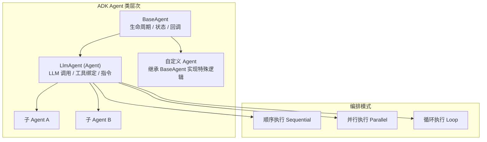

# Google ADK：Google 的 Agent 开发工具包

Google Agent Development Kit（ADK）于 2025 年 4 月由 Google 以开源形式发布，定位为构建、部署和编排 AI Agent 的全栈开发框架。与社区驱动的 LangGraph 不同，ADK 从设计之初就深度绑定 Google Cloud 生态（Vertex AI、Gemini），走的是一条"大厂官方工具链"的路线。2026 年 3 月发布的 1.0.0 版本标志着其多语言支持（Python、TypeScript、Go、Java）的正式成熟。

## 核心概念

### Agent 类层次结构

ADK 采用面向对象的类继承体系来组织 Agent 能力。`BaseAgent` 是所有 Agent 的基类，提供生命周期管理和状态接口；`LlmAgent`（别名 `Agent`）是最常用的具体实现，封装了 LLM 调用、工具绑定和指令管理；开发者可以继承这些基类创建自定义 Agent。



### 工具（Tools）与工具声明

ADK 的工具系统支持多种形式：Python 函数直接作为工具、基于 OpenAPI Schema 的声明式工具、以及内置工具（如 Google Search、Code Execution）。工具通过类型注解自动生成 Schema，无需手动编写 JSON 描述。

### 会话（Sessions）与状态管理

每个 Agent 运行在一个 Session 上下文中，Session 管理对话历史、用户状态和中间结果。ADK 提供内存和持久化两种 Session 存储后端，生产环境可对接 Vertex AI 的托管存储。

### 回调与生命周期钩子

ADK 在 Agent 执行的关键节点提供回调钩子：`before_model_call`、`after_model_call`、`before_tool_call`、`after_tool_call` 等，用于实现日志、监控、安全审计和自定义逻辑注入。

### A2A 协议（Agent-to-Agent）

A2A 是 Google 提出的跨框架 Agent 互操作协议，允许不同框架（ADK、LangGraph、CrewAI 等）构建的 Agent 通过标准化接口相互通信。这是 ADK 区别于其他框架的重要特性——它不仅关注单框架内的编排，还试图定义跨框架的协作标准。

### 编排模式

ADK 内置三种编排模式：顺序执行（Sequential）将多个子 Agent 按序串联；并行执行（Parallel）让多个子 Agent 同时运行并汇总结果；循环执行（Loop）支持迭代式任务处理直到满足终止条件。

## 代码示例

### 基础 Agent 与工具使用

```python
from google.adk.agents import Agent
from google.adk.runners import Runner
from google.adk.sessions import InMemorySessionService

# 定义工具——普通 Python 函数即可
def get_weather(city: str) -> dict:
    """获取指定城市的天气信息。"""
    return {"city": city, "temperature": "25°C", "condition": "晴"}

def search_restaurant(city: str, cuisine: str) -> dict:
    """搜索指定城市的餐厅。"""
    return {"city": city, "cuisine": cuisine, "results": ["餐厅A", "餐厅B"]}

# 创建 Agent
travel_agent = Agent(
    name="travel_assistant",
    model="gemini-2.0-flash",
    description="旅行助手，帮助用户查询天气和餐厅",
    instruction="你是一个友好的旅行助手。根据用户需求调用工具获取信息，并给出建议。",
    tools=[get_weather, search_restaurant],
)

# 运行 Agent
session_service = InMemorySessionService()
runner = Runner(agent=travel_agent, app_name="travel_app", session_service=session_service)

# 创建会话并执行
session = session_service.create_session(app_name="travel_app", user_id="user-001")
response = runner.run(user_id="user-001", session_id=session.id, 
                      new_message="北京今天天气怎么样？推荐一家川菜馆。")

for event in response:
    if event.is_final_response():
        print(event.content.parts[0].text)
```

### 多 Agent 编排

```python
from google.adk.agents import Agent, SequentialAgent, ParallelAgent

# 定义专业子 Agent
researcher = Agent(
    name="researcher",
    model="gemini-2.0-flash",
    instruction="你是研究员，负责收集和整理信息。输出结构化的研究摘要。",
    tools=[search_web],
)

writer = Agent(
    name="writer",
    model="gemini-2.0-flash",
    instruction="你是技术作者，根据研究摘要撰写清晰易懂的文章段落。",
)

reviewer = Agent(
    name="reviewer",
    model="gemini-2.0-flash",
    instruction="你是审稿人，检查文章的准确性和可读性，提出修改建议。",
)

# 顺序编排：研究 → 写作 → 审稿
content_pipeline = SequentialAgent(
    name="content_pipeline",
    description="内容生产流水线",
    sub_agents=[researcher, writer, reviewer],
)

# 并行编排：多个研究员同时工作
parallel_research = ParallelAgent(
    name="parallel_research",
    description="并行研究多个主题",
    sub_agents=[researcher_topic_a, researcher_topic_b, researcher_topic_c],
)
```

这段代码体现了 ADK 的"代码优先"（Code-first）哲学：无需 YAML 配置文件或可视化编辑器，纯 Python 代码即可表达复杂的 Agent 编排逻辑。

## 设计哲学对比：ADK vs LangGraph

| 维度 | Google ADK | LangGraph |
|------|-----------|-----------|
| **设计范式** | 面向对象，类继承体系 | 函数式，有向状态图 |
| **编排方式** | 内置 Sequential/Parallel/Loop 模式 | 显式定义节点和边，完全自定义 |
| **模型支持** | 以 Gemini 为主，可扩展其他模型 | 模型无关，支持所有主流 LLM |
| **生态绑定** | 深度集成 Google Cloud / Vertex AI | 独立于云平台，可部署任意环境 |
| **多语言** | Python, TypeScript, Go, Java | Python, TypeScript |
| **互操作性** | A2A 协议支持跨框架通信 | 无标准化跨框架协议 |
| **状态管理** | Session 对象封装 | TypedDict + Checkpointer |
| **部署方式** | 容器化，一键部署到 Cloud Run / GKE | 自行部署或使用 LangGraph Cloud |
| **学习曲线** | 中等（熟悉 OOP 即可上手） | 较陡（需理解图论概念） |
| **社区规模** | 增长中，企业案例较少 | 成熟，大量社区示例和教程 |
| **可观测性** | Vertex AI 集成监控 | LangSmith 全链路追踪 |
| **开源时间** | 2025 年 4 月 | 2024 年 1 月 |

核心差异在于思维模型：ADK 让开发者用"组织团队"的方式思考——定义角色（Agent）、分配任务（instruction）、配备工具（tools）、安排协作方式（编排模式）；LangGraph 则让开发者用"画流程图"的方式思考——定义状态、节点、边和条件路由。

## 生态与成熟度

从 PyPI 下载量看，`google-adk` 包在 2025 年 12 月前累计下载已超过 100 万次，表明开发者社区对其有显著兴趣。GitHub 仓库（google/adk-python）的 Star 数增长迅速，Issues 和 PR 活跃度也在持续上升。

然而，一个值得关注的现象是：截至 2026 年中，几乎找不到公开的企业级生产部署案例研究。这与 LangGraph 形成鲜明对比——后者有大量来自不同行业的公开案例分享和社区经验文章。

造成这一现象的可能原因包括：ADK 发布时间较短（仅一年多），企业采用需要更长的评估周期；深度绑定 GCP 意味着用户群体本身就集中在 Google Cloud 客户中，这些企业通常受 NDA 约束不便公开分享；此外，Google 自身的产品策略也倾向于通过 Vertex AI 平台而非开源社区来推广最佳实践。

## 优势与局限

### 优势

ADK 的核心优势来自 Google 的官方背书和生态整合。与 Vertex AI 的原生集成意味着开发者可以直接使用 Google 的模型托管、评估、监控和安全合规能力，无需自行搭建基础设施。多语言支持（尤其是 Java 和 Go）填补了 LangGraph 在企业级后端语言上的空白。A2A 协议的提出展现了 Google 对 Agent 互操作性的前瞻性思考，如果该协议获得广泛采纳，ADK 将在跨框架协作场景中占据先发优势。容器化部署方案和企业级治理能力（权限控制、审计日志、合规检查）也使其更适合大型组织的安全要求。

### 局限

最显著的局限是 GCP 耦合度。虽然 ADK 理论上可以配置非 Google 模型，但其最佳体验和完整功能集都围绕 Gemini 和 Vertex AI 设计，脱离 Google 生态使用会损失大量便利性。社区生态尚处于早期阶段，第三方集成、教程和最佳实践远不如 LangGraph 丰富。编排灵活性方面，内置的三种模式虽然覆盖了常见场景，但对于需要高度自定义控制流的复杂 Agent 系统，不如 LangGraph 的任意图结构灵活。

## 适用场景

以下场景优先考虑 ADK：团队已深度使用 Google Cloud，希望 Agent 系统与现有 GCP 基础设施无缝集成；需要 A2A 跨框架通信能力，构建异构 Agent 生态系统；企业合规和治理要求严格，需要平台级的安全审计和权限管理；后端团队以 Java 或 Go 为主要语言，LangGraph 的 Python/TypeScript 限制不可接受；项目需要快速从原型到生产部署，Vertex AI 的托管服务可以显著降低运维成本。

相反，如果团队需要模型无关的灵活性、丰富的社区支持、或者不希望绑定任何特定云平台，LangGraph 仍然是更稳妥的选择。

## 本章小结

Google ADK 代表了大厂对 Agent 开发框架的理解——强调企业级能力、平台整合和标准化协议。它与 LangGraph 并非简单的替代关系，而是面向不同用户群体和使用场景的互补选择。ADK 的 A2A 协议尤其值得关注，如果它能成为行业标准，将从根本上改变 Agent 系统的互操作格局。对于已在 Google Cloud 生态中的团队，ADK 提供了一条从实验到生产的最短路径；对于追求灵活性和社区支持的团队，观望其生态成熟度的发展是务实的策略。

## 延伸阅读

- [Google ADK 官方文档](https://google.github.io/adk-docs/)
- [ADK Python SDK GitHub](https://github.com/google/adk-python)
- [A2A 协议规范](https://github.com/google/A2A)
- [Vertex AI Agent Builder](https://cloud.google.com/vertex-ai/docs/agents)
- [Google Cloud Blog: Introducing ADK](https://cloud.google.com/blog/products/ai-machine-learning/build-ai-agents-with-adk) (2025-04)
- [框架对比](./comparison-matrix.md) — 与其他框架的横向对比
