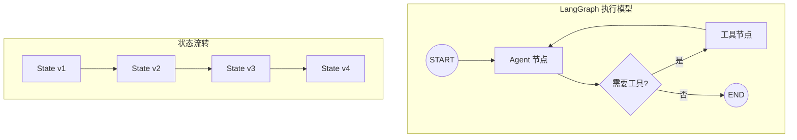

# LangChain 与 LangGraph：从链到图

LangChain 是 Agent 框架领域的开拓者，从 2022 年 10 月诞生起便引领了整个生态的发展方向。然而，随着 Agent 系统复杂度的提升，链式（Chain）抽象的局限性日益明显。2024 年 1 月推出的 LangGraph 标志着从"链"到"图"的范式跃迁，为构建生产级 Agent 系统提供了全新的思维模型。

## LangChain 的历史与演进

LangChain 由 Harrison Chase 在 2022 年 10 月创建，最初只是一个简单的 Python 库，用于将 LLM 调用串联成"链"。在 ChatGPT 带来的 AI 热潮中，LangChain 迅速成长为最流行的 LLM 应用开发框架，GitHub Stars 在数月内突破 5 万。

演进历程中的关键节点：2022 年底推出基础链式抽象；2023 年中期引入 Agent 和 Tool 概念；2023 年底发布 LangChain Expression Language（LCEL）；2024 年初推出 LangGraph 作为图式编排方案；2024 年中期进行核心包拆分（langchain-core, langchain-community）；2025 年 LangGraph 成为推荐的 Agent 构建方式。

## LangChain 核心概念

### 链（Chains）

链是 LangChain 的基础抽象——将多个处理步骤串联成管道。LCEL（LangChain Expression Language）用 `|` 运算符优雅地表达链式组合：

```python
from langchain_core.prompts import ChatPromptTemplate
from langchain_openai import ChatOpenAI
from langchain_core.output_parsers import StrOutputParser

prompt = ChatPromptTemplate.from_template("用中文解释：{concept}")
model = ChatOpenAI(model="gpt-4o")
parser = StrOutputParser()

chain = prompt | model | parser
result = chain.invoke({"concept": "量子计算"})
```

### Agent 与工具（Tools）

LangChain 的 Agent 抽象让 LLM 能够动态选择和调用工具：

```python
from langchain_core.tools import tool
from langchain_openai import ChatOpenAI

@tool
def search_web(query: str) -> str:
    """搜索网络获取最新信息"""
    return f"搜索结果：{query}"

@tool
def calculate(expression: str) -> str:
    """计算数学表达式"""
    return str(eval(expression))

model = ChatOpenAI(model="gpt-4o")
model_with_tools = model.bind_tools([search_web, calculate])
```

### 记忆（Memory）与回调（Callbacks）

Memory 组件管理对话历史和长期记忆，Callbacks 提供执行过程的钩子用于日志、监控和调试。这两个能力在 LangGraph 中以更优雅的方式被重新实现。

## LangGraph：图式编排的崛起

LangGraph 是 LangChain 团队对"Agent 编排应该是什么样"的重新思考。核心洞察是：真实的 Agent 行为不是线性的链，而是包含循环、条件分支和并行的有向图。

### 核心架构



### StateGraph：状态驱动的图

LangGraph 的核心是 StateGraph——一个以共享状态为中心的有向图。每个节点读取和更新状态，边决定下一步执行哪个节点。

```python
from langgraph.graph import StateGraph, START, END
from langgraph.graph.message import add_messages
from typing import Annotated, TypedDict
from langchain_openai import ChatOpenAI
from langchain_core.tools import tool

# 定义状态
class AgentState(TypedDict):
    messages: Annotated[list, add_messages]

# 定义工具
@tool
def get_weather(city: str) -> str:
    """获取城市天气"""
    return f"{city}今天晴，气温 25°C"

# 创建模型
model = ChatOpenAI(model="gpt-4o").bind_tools([get_weather])

# 定义节点
def call_model(state: AgentState) -> dict:
    response = model.invoke(state["messages"])
    return {"messages": [response]}

def call_tools(state: AgentState) -> dict:
    last_message = state["messages"][-1]
    results = []
    for tool_call in last_message.tool_calls:
        if tool_call["name"] == "get_weather":
            result = get_weather.invoke(tool_call["args"])
            results.append({"role": "tool", "content": result, 
                          "tool_call_id": tool_call["id"]})
    return {"messages": results}

# 定义路由
def should_continue(state: AgentState) -> str:
    last_message = state["messages"][-1]
    if hasattr(last_message, "tool_calls") and last_message.tool_calls:
        return "tools"
    return "end"

# 构建图
graph = StateGraph(AgentState)
graph.add_node("agent", call_model)
graph.add_node("tools", call_tools)
graph.add_edge(START, "agent")
graph.add_conditional_edges("agent", should_continue, {
    "tools": "tools",
    "end": END
})
graph.add_edge("tools", "agent")

# 编译并运行
app = graph.compile()
result = app.invoke({"messages": [{"role": "user", "content": "北京天气怎么样？"}]})
```

### 持久化与检查点（Persistence）

LangGraph 内置持久化支持，每一步执行的状态都可以保存为检查点（checkpoint）。这使得 Agent 可以在任意步骤暂停和恢复，实现 human-in-the-loop 模式：

```python
from langgraph.checkpoint.memory import MemorySaver

# 使用内存检查点（生产环境可用 PostgreSQL）
checkpointer = MemorySaver()
app = graph.compile(checkpointer=checkpointer)

# 执行时指定 thread_id
config = {"configurable": {"thread_id": "user-123"}}
result = app.invoke({"messages": [{"role": "user", "content": "你好"}]}, config)

# 后续对话自动恢复上下文
result = app.invoke({"messages": [{"role": "user", "content": "继续"}]}, config)
```

### 流式输出（Streaming）

LangGraph 支持多层级的流式输出：节点级流式、token 级流式、事件流：

```python
# 事件流模式
async for event in app.astream_events(
    {"messages": [{"role": "user", "content": "写一首诗"}]},
    version="v2"
):
    if event["event"] == "on_chat_model_stream":
        print(event["data"]["chunk"].content, end="")
```

### Human-in-the-Loop

通过 `interrupt_before` 或 `interrupt_after` 参数，可以在指定节点前后暂停执行，等待人工确认：

```python
app = graph.compile(
    checkpointer=checkpointer,
    interrupt_before=["tools"]  # 在工具执行前暂停
)
```

## LangSmith：可观测性平台

LangSmith 是 LangChain 团队的可观测性产品，提供 Agent 执行的全链路追踪、评估和调试能力。与 LangGraph 深度集成，每一步执行都自动记录到 LangSmith 进行可视化分析。

## 优势与批评

### 优势

LangChain/LangGraph 生态的核心优势在于：最丰富的社区和集成生态（超过 700 个集成）；LangGraph 的图式编排能力在复杂场景下无可替代；持久化、流式、human-in-the-loop 等生产级特性成熟；LangSmith 提供了目前最好的 Agent 可观测性。

### 批评

长期以来，LangChain 面临的批评包括：过度抽象（over-abstraction）导致调试困难——当出错时，开发者常常迷失在层层封装中；频繁的破坏性变更（breaking changes）让用户疲于升级；对于简单任务，框架的复杂度远超必要——"用 LangChain 做一个 API 调用需要理解 5 个类"。

LangGraph 在一定程度上回应了这些批评：它比 LangChain Agent 更显式、更可预测，但学习曲线依然较陡。

## 实践建议

对于新项目：如果需要复杂的 Agent 编排（有循环、条件分支、多步骤），LangGraph 是当前最成熟的选择。如果只需要简单的链式调用，直接使用 LCEL 或原生 SDK 即可。

对于已有 LangChain 项目：逐步迁移 Agent 逻辑到 LangGraph，保留 LangChain 的工具和集成生态。

## 本章小结

LangChain 生态从链到图的演进，反映了整个行业对 Agent 编排复杂度的认知深化。LangGraph 以显式状态图为核心抽象，在灵活性和可控性之间取得了良好平衡。尽管学习成本不低，但对于需要生产级可靠性的 Agent 系统，LangGraph 仍是目前最全面的选择。

## 延伸阅读

- [LangGraph 官方文档](https://langchain-ai.github.io/langgraph/)
- [LangChain 官方文档](https://python.langchain.com/)
- [LangSmith 平台](https://smith.langchain.com/)
- [Harrison Chase: Why LangGraph](https://blog.langchain.dev/langgraph/)
- [LangGraph 教程仓库](https://github.com/langchain-ai/langgraph/tree/main/examples)
- [框架对比](./comparison-matrix.md) — 与其他框架的横向对比
