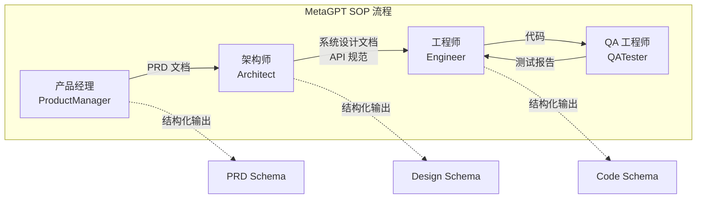

# MetaGPT：软件工程多 Agent 系统

MetaGPT 由 DeepWisdom 团队于 2023 年 8 月发布，是将"软件工程标准化流程"（SOP）注入多 Agent 系统的开创性工作。与 AutoGen 和 CrewAI 的通用编排不同，MetaGPT 专注于一个垂直场景：让多个 Agent 像真实的软件开发团队一样协作——从需求分析到架构设计，从编码实现到测试验证。

## 核心创新：SOP 驱动的 Agent 协作

MetaGPT 的核心论文观察到一个关键问题：多 Agent 系统在自由对话模式下容易产生"幻觉串联"——一个 Agent 的错误输出被后续 Agent 当作事实接受，错误逐步放大。

解决方案是引入标准化流程（Standard Operating Procedures, SOP）：每个角色的输出必须遵循特定的结构化格式，后续角色基于结构化输出工作，而非自由文本。这模拟了真实软件公司中"文档驱动开发"的最佳实践。



## 角色体系

MetaGPT 预定义了模拟真实软件团队的角色体系：

### ProductManager（产品经理）

接收用户的原始需求描述，产出结构化的 PRD（产品需求文档），包含：用户故事、竞品分析、需求列表、数据流图等。

### Architect（架构师）

接收 PRD，产出系统设计文档，包含：技术选型、系统架构图、API 接口定义、数据库设计等。

### Engineer（工程师）

接收设计文档，产出可运行的代码。每个文件的实现严格遵循架构师的设计规范。

### QATester（QA 工程师）

接收代码，编写和运行测试用例，产出测试报告。发现的 Bug 反馈给工程师修复。

## 代码示例

```python
import asyncio
from metagpt.roles import ProductManager, Architect, Engineer
from metagpt.team import Team

async def build_software(requirement: str):
    """使用 MetaGPT 团队完成软件开发"""
    
    # 组建团队
    team = Team()
    team.hire([
        ProductManager(),
        Architect(),
        Engineer(),
    ])
    
    # 注入需求
    team.invest(investment=3.0)  # 设置 token 预算（美元）
    team.run_project(requirement)
    
    # 执行
    await team.run(n_round=5)

# 运行
asyncio.run(build_software(
    "开发一个命令行待办事项管理工具，支持添加、完成、删除和列表查看功能"
))
```

执行后，MetaGPT 会在工作目录中生成完整的项目结构：

```
workspace/
├── docs/
│   ├── prd.md           # 产品需求文档
│   ├── system_design.md # 系统设计文档
│   └── api_spec.md      # API 规范
├── src/
│   ├── todo.py          # 主程序
│   └── models.py        # 数据模型
├── tests/
│   └── test_todo.py     # 测试用例
└── requirements.txt     # 依赖文件
```

## 结构化输出与 Schema 约束

MetaGPT 的关键设计在于消息传递的结构化约束。每个角色的输出不是自由文本，而是遵循预定义 Schema 的结构化数据：

```python
# 产品经理输出的 PRD 结构（简化）
class PRDSchema:
    original_requirements: str      # 原始需求
    product_goals: list[str]        # 产品目标
    user_stories: list[str]         # 用户故事
    competitive_analysis: str       # 竞品分析
    requirement_analysis: str       # 需求分析
    ui_design_draft: str           # UI 设计草稿
    open_questions: list[str]      # 待澄清问题

# 架构师输出的设计结构（简化）
class DesignSchema:
    implementation_approach: str    # 实现方案
    file_list: list[str]           # 文件列表
    data_structures: str           # 数据结构
    program_flow: str              # 程序流程
    api_design: str                # API 设计
```

这种 Schema 约束有效减少了"幻觉串联"问题——如果某个角色的输出不符合 Schema，系统会要求重新生成，而不是将错误传递下去。

## 与其他代码生成多 Agent 系统的对比

### ChatDev

ChatDev（2023 年 7 月）同样模拟软件公司的角色分工，但采用更自由的对话模式。MetaGPT 通过 SOP 和 Schema 约束提供了更可靠的输出质量，但灵活性相对较低。

### GPT Engineer / Aider

这些工具更专注于"人机协作编码"——一个 Agent 与用户交互完成开发。MetaGPT 的多 Agent 协作模式在自主性上更强，但对人的介入机会较少。

### Devin / SWE-Agent

Devin 和 SWE-Agent 代表了"单 Agent 强能力"的路线——用一个足够强的 Agent 完成全部开发工作。MetaGPT 选择的是"多 Agent 分工"路线，通过角色专业化来提升质量。

## 研究贡献

MetaGPT 的学术贡献主要体现在：

**SOP 驱动设计**：证明了结构化流程约束能显著提升多 Agent 系统的输出质量，为后续研究提供了范式参考。

**角色专业化**：验证了"让每个 Agent 专注于一个角色" 比 "让一个 Agent 扮演所有角色" 效果更好的假设。

**消息结构化**：提出了用 Schema 约束 Agent 间通信来减少错误传播的方法论。

## 优势与局限

### 优势

MetaGPT 的优势在于：完整的软件开发流程覆盖，从需求到测试一条龙；SOP 机制有效控制输出质量；结构化的文档产出有实际参考价值；学术论文级的研究深度。

### 局限

主要局限包括：场景高度垂直，仅适用于软件开发；生成代码的质量仍受 LLM 能力制约，复杂项目效果有限；流程相对僵化，难以适应非标准的开发流程；生产就绪度不如通用框架。

## 实践建议

MetaGPT 更适合作为研究参考和概念验证工具，而非直接的生产工具。它最有价值的地方在于"SOP 驱动多 Agent 协作"这一设计理念——这个思路可以被迁移到其他领域的多 Agent 系统设计中。

如果需要在生产中进行 Agent 辅助编程，目前更推荐 Claude Code、Cursor 等成熟产品。如果需要参考 MetaGPT 的多 Agent 编排思路构建自定义系统，可以在 LangGraph 或 CrewAI 上实现类似的角色分工和流程控制。

## 本章小结

MetaGPT 的核心贡献是将软件工程的最佳实践——标准化流程和结构化文档——引入多 Agent 系统设计。这种"用流程约束自由度"的思路，在多 Agent 协作容易失控的背景下具有重要价值。虽然作为工具本身的生产就绪度有限，但其设计理念值得每个多 Agent 系统的构建者学习。

## 延伸阅读

- [MetaGPT 论文](https://arxiv.org/abs/2308.00352)
- [MetaGPT GitHub](https://github.com/geekan/MetaGPT)
- [MetaGPT 官方文档](https://docs.deepwisdom.ai/)
- [ChatDev 论文](https://arxiv.org/abs/2307.07924)
- [多 Agent 协作设计模式](./autogen.md) — AutoGen 的对话式方案
