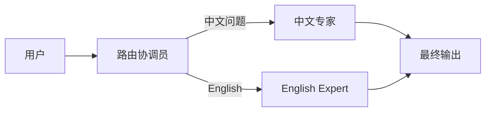

# OpenAI Agents SDK：官方的极简方案

2025 年 3 月，OpenAI 发布了 Agents SDK，取代了此前的 Assistants API，成为官方推荐的 Agent 构建方案。与 LangChain 等第三方框架的"厚抽象"路线不同，OpenAI 选择了一条极简主义路径：用最少的原语（primitives）覆盖最广的场景。这一设计哲学背后的逻辑是——当模型足够强大时，框架应该尽可能"隐形"。

## 设计哲学

OpenAI Agents SDK 的设计原则可以概括为三点：

**足够少的概念**：整个框架只有三个核心原语——Agent、Tool、Handoff。任何 Agent 系统都可以用这三个概念来描述。

**约定优于配置**：合理的默认值让开发者无需关心大多数配置项。开箱即用的追踪、guardrails 等能力自动生效。

**渐进式复杂度**：简单场景一行代码即可，复杂场景通过组合原语逐步构建，而非引入新的抽象层。

## 从 Assistants API 到 Agents SDK

Assistants API（2023 年 11 月发布）是 OpenAI 首次尝试提供 Agent 构建能力。它引入了 Thread、Run、Assistant 等有状态的服务端概念，但在实践中暴露了几个问题：状态管理复杂、调试困难、灵活性不足、与现有代码集成不自然。

Agents SDK 的核心转变是从"有状态服务"回到"无状态库"——框架在本地运行，状态由开发者控制，执行逻辑完全透明。

## 核心概念

### Agent

Agent 是 SDK 的核心单元，本质上是一个带有指令（instructions）、工具（tools）和可选配置的封装：

```python
from agents import Agent, Runner

agent = Agent(
    name="研究助手",
    instructions="你是一个专业的研究助手，帮助用户查找和总结学术信息。",
    model="gpt-4o"
)

# 同步运行
result = Runner.run_sync(agent, "量子计算的最新进展是什么？")
print(result.final_output)
```

### Tool

工具通过 Python 函数定义，SDK 自动从函数签名和 docstring 生成 JSON Schema：

```python
from agents import Agent, Runner, function_tool

@function_tool
def search_papers(query: str, year: int = 2024) -> str:
    """搜索学术论文
    
    Args:
        query: 搜索关键词
        year: 发表年份筛选
    """
    # 实际搜索实现
    return f"找到关于 '{query}' 的 {year} 年论文 3 篇..."

@function_tool
def summarize_paper(paper_id: str) -> str:
    """获取并总结论文摘要
    
    Args:
        paper_id: 论文唯一标识符
    """
    return f"论文 {paper_id} 的核心贡献是..."

research_agent = Agent(
    name="论文研究员",
    instructions="帮助用户搜索和理解学术论文。先搜索，再总结关键发现。",
    tools=[search_papers, summarize_paper]
)
```

### Handoff：多 Agent 协作

Handoff 是 Agents SDK 最优雅的设计——它允许一个 Agent 将控制权"移交"给另一个 Agent。这种 agent-as-tool 模式使得多 Agent 系统的构建极其自然：

```python
from agents import Agent, Runner

# 定义专业 Agent
chinese_agent = Agent(
    name="中文专家",
    instructions="你只用中文回答问题，是中国文化方面的专家。",
    model="gpt-4o"
)

english_agent = Agent(
    name="English Expert",
    instructions="You only respond in English and specialize in Western culture.",
    model="gpt-4o"
)

# 定义协调 Agent，通过 handoffs 连接专业 Agent
triage_agent = Agent(
    name="路由协调员",
    instructions="""根据用户问题的语言和内容，将请求路由到合适的专家：
    - 中文问题或中国文化相关 -> 中文专家
    - 英文问题或西方文化相关 -> English Expert""",
    handoffs=[chinese_agent, english_agent]
)

# 运行
result = Runner.run_sync(triage_agent, "请介绍一下春节的由来")
print(result.final_output)  # 由中文专家回答
```



### Guardrails

Guardrails 提供输入和输出的安全检查机制，可以在 Agent 执行前后进行拦截：

```python
from agents import Agent, Runner, InputGuardrail, GuardrailFunctionOutput

async def check_harmful_content(ctx, agent, input_text) -> GuardrailFunctionOutput:
    """检查是否包含有害内容"""
    # 使用另一个模型做安全检查
    result = await Runner.run(
        Agent(name="安全检查", instructions="判断内容是否有害，返回 safe 或 unsafe"),
        input_text
    )
    is_unsafe = "unsafe" in result.final_output.lower()
    return GuardrailFunctionOutput(
        output_info={"check": result.final_output},
        tripwire_triggered=is_unsafe
    )

safe_agent = Agent(
    name="安全助手",
    instructions="帮助用户解答问题",
    input_guardrails=[InputGuardrail(guardrail_function=check_harmful_content)]
)
```

### Tracing

SDK 内置了执行追踪能力，自动记录每一步 Agent 的执行过程，可导出到 OpenAI Dashboard 或其他可观测性平台：

```python
from agents import trace

with trace("研究工作流"):
    result = await Runner.run(research_agent, "调研 RAG 技术现状")
    # 整个执行过程自动被追踪
```

## 完整示例：客服系统

```python
from agents import Agent, Runner, function_tool

@function_tool
def lookup_order(order_id: str) -> str:
    """查询订单状态"""
    return f"订单 {order_id}：已发货，预计明天到达"

@function_tool
def process_refund(order_id: str, reason: str) -> str:
    """处理退款申请"""
    return f"订单 {order_id} 退款已提交，原因：{reason}"

# 订单查询 Agent
order_agent = Agent(
    name="订单专员",
    instructions="专门处理订单查询相关问题，帮用户查询订单状态和物流信息。",
    tools=[lookup_order]
)

# 退款处理 Agent
refund_agent = Agent(
    name="退款专员", 
    instructions="专门处理退款申请，需要了解退款原因后再处理。",
    tools=[process_refund]
)

# 主客服 Agent
customer_service = Agent(
    name="智能客服",
    instructions="""你是一个友好的客服代表。根据用户需求：
    - 查询订单相关问题 -> 转给订单专员
    - 退款相关问题 -> 转给退款专员
    - 其他问题直接回答""",
    handoffs=[order_agent, refund_agent]
)

result = Runner.run_sync(customer_service, "我想查一下订单 A12345 的状态")
```

## 优势

OpenAI Agents SDK 的核心优势包括：极低的学习成本，三个概念覆盖全部场景；官方维护保证了与最新模型能力的同步；Handoff 机制让多 Agent 编排既直觉又强大；内置的 tracing 和 guardrails 减少了额外依赖。

## 局限性

当前的主要局限包括：初期仅支持 OpenAI 模型（尽管社区正在添加其他提供商支持）；缺乏 LangGraph 那样的显式状态管理和持久化机制；对于需要精细控制流（循环、回退）的场景，handoff 模式的表达力不如图式编排；没有内置的 human-in-the-loop 支持。

## 与 Assistants API 对比

| 方面 | Assistants API | Agents SDK |
|------|---------------|------------|
| 运行位置 | 服务端（OpenAI 托管） | 本地（开发者控制） |
| 状态管理 | 平台管理 Thread | 开发者自行管理 |
| 调试能力 | 受限 | 完全透明 |
| 灵活性 | 低（受限于平台能力） | 高（纯代码控制） |
| 多 Agent | 不支持 | Handoff 原生支持 |
| 适用场景 | 简单对话助手 | 任意复杂度 Agent |

## 实践建议

Agents SDK 最适合这些场景：快速原型验证新想法、确定使用 OpenAI 模型的项目、需要多 Agent 协作但流程相对简单的系统、团队偏好轻量框架和最小依赖。

如果你的项目需要复杂的状态管理、持久化、或模型无关性，建议考虑 LangGraph 作为补充或替代。

## 本章小结

OpenAI Agents SDK 代表了"模型足够强时，框架应该极简"这一设计哲学的极致表达。三个核心原语的设计展现了优雅的克制——它不试图成为万能框架，而是做好"让强模型充分发挥"这一件事。对于 OpenAI 生态的用户而言，这是目前最低摩擦的 Agent 开发入口。

## 延伸阅读

- [OpenAI Agents SDK 官方文档](https://openai.github.io/openai-agents-python/)
- [GitHub 仓库](https://github.com/openai/openai-agents-python)
- [OpenAI Blog: Introducing the Agents SDK](https://openai.com/index/new-tools-for-building-agents/)
- [从 Assistants API 迁移指南](https://openai.github.io/openai-agents-python/migration/)
- [多 Agent 设计模式](./comparison-matrix.md) — 与其他框架的多 Agent 对比
