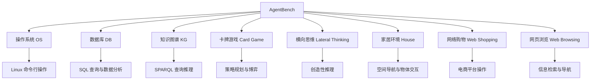

# AgentBench：多环境 Agent 评测

## 设计理念：多样环境测试多样能力

AgentBench [Liu et al., 2023] 的核心理念是：**单一环境无法全面评估 Agent 能力**。一个在代码环境中表现优异的 Agent，可能在需要常识推理的场景中表现平庸。因此，AgentBench 设计了 8 个截然不同的交互环境，每个环境测试不同的能力组合。

与静态问答基准不同，AgentBench 中的所有任务都是**多轮交互式**的。Agent 需要在环境中持续观察、决策、行动，直到任务完成或达到步数上限。这种设计更接近 Agent 在真实场景中的工作方式：接收反馈、调整策略、逐步推进。

## 八大评测环境



### 操作系统环境（OS）

Agent 在 Linux 终端中执行任务，如文件管理、系统配置、脚本编写等。测试能力：命令行操作、文件系统理解、问题诊断。Agent 需要理解 Linux 命令的语义，处理命令输出，并根据结果决定下一步操作。

示例任务："找到 /var/log 目录下最近 24 小时内修改过的、大小超过 1MB 的日志文件，并统计它们的总行数。"

### 数据库环境（DB）

Agent 需要通过 SQL 查询回答关于数据库内容的问题。测试能力：SQL 编写、数据分析、多表关联推理。Agent 可以执行 SQL 语句并查看结果，然后根据结果构造更精确的查询。

示例任务："在 employees 数据库中，找出薪资排名前 10% 且入职不满 2 年的员工所在部门。"

### 知识图谱环境（KG）

Agent 在 Freebase 等知识图谱上执行 SPARQL 查询，回答需要多跳推理的问题。测试能力：结构化查询、关系推理、知识图谱导航。Agent 需要理解实体间的关系，构造正确的图查询。

示例任务："找出所有既是导演又是编剧的人，他们执导的电影中票房最高的是哪部？"

### 卡牌游戏环境（Card Game）

Agent 参与策略卡牌游戏（如 Aquawar），需要根据当前局面做出最优决策。测试能力：策略规划、对手建模、风险评估、长期规划。这是唯一一个对抗性环境，Agent 需要考虑对手的可能行动。

### 横向思维环境（Lateral Thinking）

Agent 需要通过提问来猜测一个隐藏的情境（类似"海龟汤"游戏）。测试能力：创造性推理、假设生成与验证、信息高效获取。Agent 只能提出是/否问题，需要通过有限的问题数量推断出完整的故事。

### 家居环境（House）

基于 ALFWorld 的家居模拟环境，Agent 需要在虚拟房间中导航并完成物体操作任务。测试能力：空间推理、常识理解、计划执行。Agent 需要理解物理世界的基本规则（如需要先打开抽屉才能取出里面的物品）。

示例任务："把台灯放到书桌上。" Agent 需要先找到台灯（可能在另一个房间），拿起它，导航到书桌所在位置，然后放下。

### 网络购物环境（Web Shopping）

基于 WebShop 的电商环境，Agent 需要根据用户需求搜索和购买商品。测试能力：需求理解、搜索策略、属性匹配、价格比较。

示例任务："我需要一双适合跑步的、尺码 42、价格在 200-300 元之间的黑色运动鞋。"

### 网页浏览环境（Web Browsing）

Agent 在模拟的网页环境中完成信息检索任务。测试能力：导航策略、信息定位、内容理解、多页面信息整合。

## 多轮交互评测机制

AgentBench 的评测采用标准的 Agent-Environment 交互循环：

```python
# AgentBench 交互循环伪代码
def evaluate_agent(agent, environment, max_steps=30):
    observation = environment.reset()
    total_reward = 0
    history = []
    
    for step in range(max_steps):
        # Agent 根据观察和历史生成动作
        action = agent.act(observation, history)
        
        # 环境执行动作并返回新观察
        observation, reward, done, info = environment.step(action)
        total_reward += reward
        history.append((action, observation))
        
        if done:
            break
    
    return {
        "success": environment.is_task_completed(),
        "steps": step + 1,
        "reward": total_reward,
        "efficiency": total_reward / (step + 1)
    }
```

每个环境定义了自己的观察空间（Agent 能看到什么）、动作空间（Agent 能做什么）和奖励函数（如何判断成功）。步数上限通常设为 30 步，超出则视为失败。

## 关键发现

AgentBench 的初始评测（2023 年）揭示了几个重要发现：

**商业模型远超开源模型**：在发布时，GPT-4 在几乎所有环境中都显著优于开源模型。GPT-4 的整体得分约为开源最佳模型的 3-4 倍。

| 模型 | OS | DB | KG | 游戏 | 思维 | 家居 | 购物 | 浏览 | 整体 |
|------|----|----|----|----|------|------|------|------|------|
| GPT-4 | 42.4 | 32.5 | 57.6 | 78.7 | 7.5 | 78.0 | 62.6 | 47.1 | 4.01 |
| Claude-2 | 36.2 | 32.5 | 34.0 | 45.7 | 2.5 | 20.0 | 46.7 | 39.2 | 2.79 |
| Llama-2-70B | 12.1 | 4.6 | 10.4 | 11.7 | 0.0 | 7.0 | 22.4 | 12.7 | 0.67 |

**能力分布不均匀**：即使是最强的模型，在不同环境中的表现也差异巨大。GPT-4 在卡牌游戏和家居环境中表现优异（约78%），但在横向思维中仅有 7.5%。这说明不同类型的 Agent 任务需要不同的底层能力。

**开源模型的特定弱点**：开源模型在需要长序列推理和工具使用的环境中表现尤其差，暗示这些能力可能需要特定的训练策略（如 RLHF、工具使用微调）。

**指令遵循是基础**：许多开源模型的失败不是因为"不会做"，而是因为无法正确理解和遵循环境的交互格式要求。这说明指令遵循能力是 Agent 能力的基础。

## 差距的演进

自 2023 年发布以来，商业模型与开源模型的差距经历了显著变化：

**2023 年末**：差距最大，开源模型在多数环境中接近随机表现。

**2024 年中**：随着 Llama-3、Qwen-2 等强大开源模型的发布，差距开始缩小。特别是在 OS 和 DB 环境中，开源模型通过代码微调显著提升。

**2025 年初**：在部分环境中（如 OS、DB），最佳开源模型已接近 GPT-4 水平。但在需要复杂推理的环境中（如横向思维、知识图谱），差距仍然存在。

这一演进说明：Agent 能力不仅取决于基础模型的语言能力，还取决于指令遵循、工具使用、长序列推理等特定能力的训练。开源社区在这些方面的追赶速度令人印象深刻。

## 设计哲学的价值

AgentBench 的多环境设计带来了独特的评测价值：

**能力画像（Capability Profile）**：通过 8 个环境的得分组合，可以为每个 Agent 系统绘制能力雷达图，直观展示其强项和弱项。这比单一分数更有信息量。

**避免单一基准过拟合**：在单一基准上优化可能导致"应试"行为。多环境评测要求 Agent 具备真正的泛化能力，而非针对特定任务的技巧。

**指导应用选型**：工程师可以根据自己的应用场景（如主要是数据库操作还是网页浏览），选择在对应环境中表现最好的模型。

**揭示能力相关性**：通过分析不同环境得分的相关性，可以发现哪些能力是共通的（如 OS 和 DB 高度相关），哪些是独立的（如游戏和知识图谱）。

## 对工程实践的指导意义

AgentBench 的结果对工程师选择和部署 Agent 系统有直接指导价值：

**模型选型**：如果你的应用主要涉及数据库查询，应重点关注 DB 环境的得分；如果涉及系统运维，则 OS 环境更相关。不要被综合分数误导。

**能力补充策略**：如果选定的模型在某个环境中表现不佳，可以通过专门的 prompt 工程或工具设计来补充。例如，在 KG 环境中表现差的模型，可以通过提供更好的 SPARQL 示例来改善。

**风险评估**：在横向思维等需要创造性推理的场景中，所有模型表现都很差。这提示我们在这类场景中不应过度依赖 Agent 的自主决策。

## 局限性

**环境复杂度有限**：虽然比静态基准更真实，但 AgentBench 的环境仍是简化的模拟，与真实生产环境有差距。例如 OS 环境中没有网络问题、权限冲突等真实场景中常见的复杂性。

**任务规模较小**：每个环境的任务数量有限（几十到几百个），统计稳定性可能不足。小样本下的排名波动较大。

**更新频率低**：作为学术基准，更新速度跟不上模型迭代速度，部分结果可能已过时。

**缺乏成本维度**：AgentBench 只报告成功率，不考虑完成任务所需的 token 消耗和时间成本。在实际应用中，成本往往是决定性因素。

**交互格式固定**：每个环境的交互格式是预定义的，Agent 必须严格遵循。这可能不完全反映 Agent 在更灵活的交互场景中的表现。

## 本章小结

AgentBench 通过 8 个多样化的交互环境，提供了对 Agent 能力的全面评估视角。它揭示了不同模型在不同任务类型上的能力差异，为 Agent 系统的选型和改进提供了有价值的参考。其多环境设计理念——用多样性对抗过拟合——值得在构建自定义评测时借鉴。对于工程师而言，AgentBench 的结果提示我们：选择 Agent 模型时不应只看综合分数，而应关注与自身业务场景最相关的环境表现。

## 延伸阅读

- [Liu et al., 2023] "AgentBench: Evaluating LLMs as Agents" — 原始论文
- AgentBench 排行榜：https://llmbench.ai/agent
- 本章 [WebArena](./webarena.md) — 更深入的 Web 环境评测
- 本章 [工具使用评测](./toolbench.md) — 专注工具调用能力的评测
- 本章 [评测方法论](./methodology.md) — 多维度评测的设计原则
