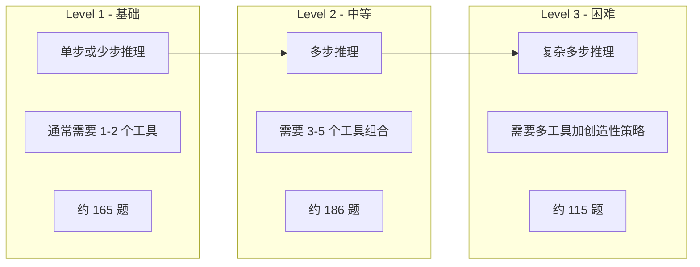

# GAIA：通用 AI 助手基准测试

## 设计哲学：人类简单、AI 困难

GAIA（General AI Assistants）[Mialon et al., 2023] 的设计理念独树一帜：构造对人类而言简单、但对 AI 系统极具挑战性的问题。这与传统基准（如数学竞赛题、专业知识问答）形成鲜明对比，那些题目对人类也很难。

GAIA 的问题看起来像是你可能会问一个能干的助手的日常问题，例如："2023 年诺贝尔物理学奖得主中，哪位的本科母校排名最高？排名依据 2024 年 QS 世界大学排名。" 人类可以通过几次搜索在几分钟内回答，但 AI 系统需要：识别需要查询的信息、执行多步搜索、整合来自不同来源的信息、进行比较推理。

这一设计哲学的深层含义是：真正有用的 AI 助手不需要解决人类也解决不了的问题，而是需要高效、准确地完成人类觉得繁琐但并不困难的任务。GAIA 测试的正是这种"实用智能"。

## 数据集结构

GAIA 包含 **466 个精心设计的问题**，分为三个难度级别：



**Level 1（基础）**：通常需要 1-2 步操作即可回答。例如："Python 3.11 的发布日期是什么？" 需要简单的网络搜索。又如："这个 PDF 文件的第 5 页提到了哪个城市？" 需要文件下载和解析。

**Level 2（中等）**：需要多步推理和工具组合。例如："下载这个 PDF 文件，找到第三章提到的公司名称，然后查询该公司 2023 年的营收。" 需要文件处理 + 信息提取 + 网络搜索。又如："这段音频中提到的人物，其维基百科页面上列出的出生地是哪里？" 需要音频转写 + 实体识别 + 网络搜索。

**Level 3（困难）**：需要复杂的多步推理、创造性的问题分解策略。例如涉及音频文件分析、图片中隐藏信息提取、多语言文档处理、需要编写代码进行数据分析等。这些问题往往没有明显的解题路径，Agent 需要自主探索。

## 所需能力

GAIA 问题的解答通常需要以下能力的组合：

| 能力类型 | 描述 | 示例 | 涉及比例 |
|---------|------|------|---------|
| Web 搜索 | 在互联网上查找信息 | 查询特定事实、新闻、数据 | 约 80% |
| 文件处理 | 读取和分析各类文件 | PDF 解析、Excel 数据提取 | 约 40% |
| 数学计算 | 执行数值运算 | 单位换算、统计计算 | 约 25% |
| 多步推理 | 将复杂问题分解为子问题 | 链式信息查询 | 约 70% |
| 多模态理解 | 处理图片、音频等非文本内容 | 图片 OCR、音频转写 | 约 20% |
| 代码执行 | 编写和运行代码辅助分析 | 数据处理脚本 | 约 15% |

关键特征是：**单一能力不足以解决大多数问题**，Agent 必须灵活组合多种工具和推理策略。这使得 GAIA 成为评测 Agent 工具编排能力的理想基准。

## 评测方式：精确匹配

GAIA 采用**精确匹配（Exact Match）**作为评判标准。Agent 的最终答案必须与标准答案完全一致（在格式归一化后）。这一设计有重要意义：

**优点**：评测完全自动化，无需人工判断，消除了主观性。答案通常是一个具体的数字、名称或日期，不存在模糊地带。可以大规模、低成本地重复评测。

**挑战**：Agent 必须给出精确答案，不能用"大约"或"可能是"来模糊处理。这要求 Agent 具备高度的信息验证能力，需要确认找到的信息是准确的。

```python
# GAIA 评测逻辑示例
import re

def evaluate_gaia(agent_answer: str, gold_answer: str) -> bool:
    """GAIA 精确匹配评测"""
    # 格式归一化
    agent_normalized = normalize(agent_answer.strip().lower())
    gold_normalized = normalize(gold_answer.strip().lower())
    
    return agent_normalized == gold_normalized

def normalize(answer: str) -> str:
    """答案格式归一化"""
    # 移除多余空格、标点差异等
    answer = re.sub(r'\s+', ' ', answer)
    answer = answer.strip('.')
    # 数字格式统一
    answer = re.sub(r',(\d{3})', r'\1', answer)  # 移除千位分隔符
    return answer
```

## 人类基线与 Agent 表现差距

GAIA 的一个核心发现是人类与 AI 系统之间的巨大表现差距：

| 评测对象 | Level 1 | Level 2 | Level 3 | 整体 |
|---------|---------|---------|---------|------|
| 人类（非专家） | 92% | 86% | 75% | 85% |
| GPT-4 + Plugins (2023) | 55% | 33% | 4% | 35% |
| 最佳 Agent 系统 (2024) | 75% | 60% | 35% | 58% |
| 最佳 Agent 系统 (2025) | 85% | 72% | 50% | 70% |

几个关键观察：人类在 Level 1 上接近完美表现，说明这些问题确实对人类"简单"；AI 系统在 Level 3 上表现最差，因为这些问题需要创造性的问题分解策略；随着 Agent 技术进步，差距在缩小，但 Level 3 仍是主要瓶颈。

特别值得注意的是 Level 3 的进步速度：从 2023 年的 4% 到 2025 年的 50%，这一巨大提升主要归功于更强的推理模型（如 o1）和更成熟的多工具编排框架。

## 为什么 GAIA 重要

**测试实际助手能力**：GAIA 的问题模拟了用户向 AI 助手提出的真实请求。高 GAIA 得分意味着系统能够作为有效的通用助手，处理日常工作中的信息查询和分析任务。

**工具使用的必要性**：纯语言模型（不使用工具）在 GAIA 上表现极差（通常低于 10%），因为大多数问题需要访问实时信息或处理外部文件。这验证了 Agent 架构（LLM + 工具）的必要性。

**端到端评测**：GAIA 不评测中间步骤，只看最终答案。这意味着 Agent 可以自由选择解题策略，评测的是综合能力而非特定技术路线。不同的 Agent 架构可以在公平的基础上对比。

**抗数据污染**：由于答案依赖实时信息（如最新排名、当前数据），模型无法通过记忆训练数据来"作弊"。这使得 GAIA 的结果更能反映真实能力。

**与商业价值直接关联**：GAIA 上的高分直接对应于"这个 AI 助手能帮我完成多少日常任务"，比抽象的语言能力评分更有商业参考价值。

## 典型失败案例分析

分析 Agent 在 GAIA 上的失败案例，可以发现几类常见问题：

**搜索策略不当**：Agent 使用了过于宽泛或过于具体的搜索词，导致找不到相关信息。例如搜索"Nobel Prize Physics 2023 winner undergraduate university"可能不如分步搜索每位获奖者的教育背景。

**信息整合错误**：Agent 正确找到了各个子问题的答案，但在最终整合时出错。例如比较排名时搞混了数字的大小关系。

**工具选择失误**：面对需要处理 PDF 的任务，Agent 可能尝试直接搜索 PDF 内容而非下载并解析文件。

**过早终止**：Agent 在获得部分信息后就给出答案，而非继续验证或补充缺失的信息。

## 局限性与批评

**问题规模有限**：466 个问题的数据集相对较小，统计显著性可能不足。在 Level 3 仅有约 115 题的情况下，几道题的差异就可能导致排名变化。

**答案时效性**：部分问题的正确答案可能随时间变化（如"当前 CEO 是谁"），需要定期更新标准答案。这增加了维护成本。

**评测成本**：由于需要真实的网络搜索和文件处理，每次评测都会产生实际的 API 调用成本，且结果可能因网络环境而异。

**能力覆盖不均**：GAIA 偏重信息检索和整合能力，对创造性任务、长文本生成、代码编写等能力覆盖不足。

**文化偏见**：问题主要基于英语世界的知识和网站，对非英语环境的 Agent 可能不公平。

## 对 Agent 开发的启示

GAIA 的结果为 Agent 开发者提供了明确的改进方向：

**工具编排能力是关键**：能否正确选择和组合工具，决定了 Agent 在 GAIA 上的表现上限。开发者应投入更多精力优化工具选择策略。

**错误检测与重试**：许多失败案例源于中间步骤的错误未被发现，导致最终答案偏离。Agent 需要内置自我验证机制。

**信息验证**：Agent 需要交叉验证从不同来源获取的信息，而非盲目信任第一个搜索结果。多源验证可以显著提高准确率。

**问题分解策略**：Level 3 的问题要求 Agent 具备将复杂问题分解为可管理子问题的能力。这需要更强的规划和推理能力。

## GAIA 与其他通用助手基准的对比

GAIA 并非唯一的通用助手评测基准，但它在设计理念上有独特之处：

| 基准 | 设计理念 | 任务类型 | 评测方式 | 规模 |
|------|---------|---------|---------|------|
| GAIA | 人类简单、AI 难 | 信息检索+推理 | 精确匹配 | 466 题 |
| MMLU | 知识广度 | 选择题 | 选项匹配 | 14000+ 题 |
| BIG-Bench | 能力多样性 | 多种格式 | 多种方式 | 200+ 任务 |
| AgentBench | 环境多样性 | 交互式操作 | 环境状态 | 8 环境 |

GAIA 的独特价值在于：它测试的是"实用智能"而非"学术智能"。MMLU 测试的是知识储备，BIG-Bench 测试的是推理能力，而 GAIA 测试的是"能否帮用户完成实际任务"。这使得 GAIA 的得分与产品价值的关联最为直接。

## 本章小结

GAIA 通过"人类简单、AI 困难"的设计哲学，精准地测试了 AI 系统作为通用助手的实际能力。它揭示了当前 Agent 系统在多步推理和工具组合方面的不足，同时也为改进方向提供了清晰的指引。对于构建通用 AI 助手的工程师而言，GAIA 是评估系统实用性的重要参考。其精确匹配的评测方式虽然严格，但也确保了评测结果的客观性和可比性。

## 延伸阅读

- [Mialon et al., 2023] "GAIA: A Benchmark for General AI Assistants" — 原始论文
- GAIA 排行榜：https://huggingface.co/spaces/gaia-benchmark/leaderboard
- 本章 [评测方法论](./methodology.md) — 评测设计的通用原则
- 本章 [工具使用评测](./toolbench.md) — 工具调用能力的专项评测
- 本书 [工具使用](../../05-tool-use/) — Agent 工具编排的技术实现
