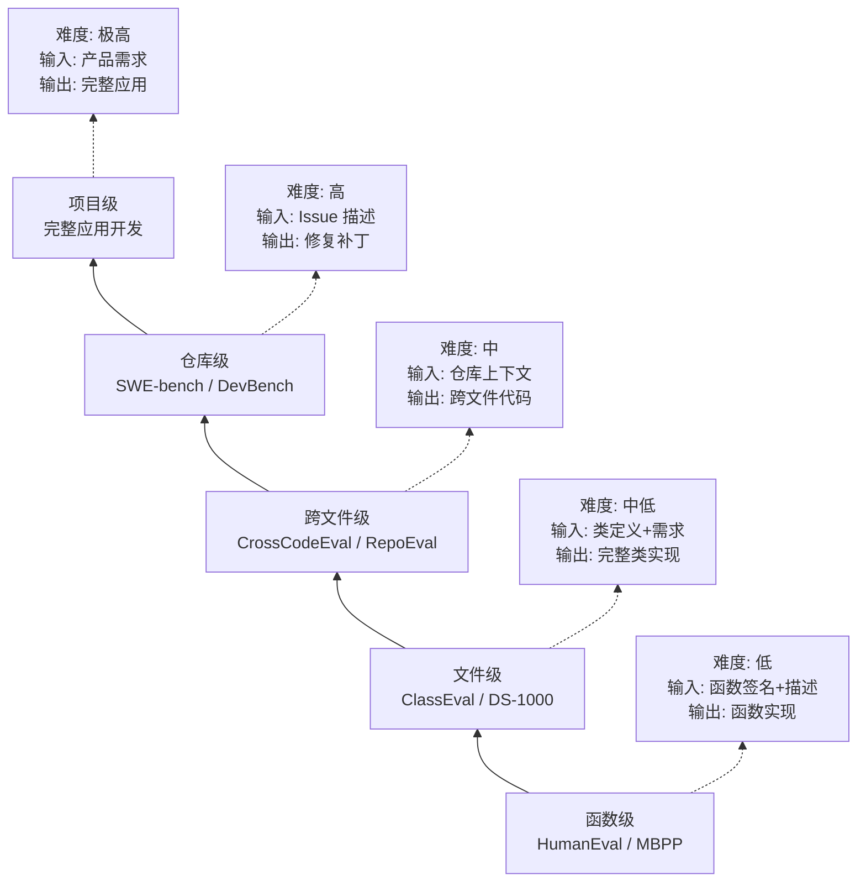

# 代码生成评测：从 HumanEval 到 Agent 级任务

## 评测阶梯：从函数到项目

代码生成评测经历了从简单到复杂的演进过程。我们可以将其理解为一个"评测阶梯"，每一层对应不同粒度的编程能力：



这个阶梯反映了一个重要事实：编程能力不是单一维度的。能写出正确的排序函数，不代表能在一个百万行代码库中定位并修复 bug。每一层都引入了新的挑战维度。

## HumanEval：函数级代码生成的起点

HumanEval [Chen et al., 2021] 是代码生成评测的奠基之作，由 OpenAI 发布。它包含 **164 个手工编写的 Python 编程问题**，每个问题提供函数签名、文档字符串和测试用例。

```python
# HumanEval 典型题目示例
def has_close_elements(numbers: List[float], threshold: float) -> bool:
    """Check if in given list of numbers, are any two numbers 
    closer to each other than given threshold.
    >>> has_close_elements([1.0, 2.0, 3.0], 0.5)
    False
    >>> has_close_elements([1.0, 2.8, 3.0, 4.0, 5.0, 2.0], 0.3)
    True
    """
```

**评测指标**：pass@k 表示生成 k 个候选解，至少有一个通过所有测试用例的概率。pass@1 是最严格的指标，要求一次生成就正确。

**当前水平**：GPT-4o 在 HumanEval 上的 pass@1 已超过 90%，Claude 3.5 Sonnet 达到 92%。这意味着函数级代码生成已基本"解决"，该基准的区分度已经很低。

**历史意义**：HumanEval 的发布标志着 LLM 代码能力评测的开始。它证明了大规模预训练模型确实能够理解编程任务并生成正确代码，为后续研究奠定了基础。

## MBPP 与 HumanEval+

**MBPP（Mostly Basic Python Problems）** [Austin et al., 2021]：包含 974 个 Python 编程问题，难度略低于 HumanEval，但规模更大。问题来自众包，覆盖基础算法、字符串处理、数学计算等。其价值在于提供了更大的样本量，使统计结果更稳定。

**HumanEval+** [Liu et al., 2024]：对 HumanEval 的测试用例进行了大幅扩充（平均每题从 7.7 个测试增加到 774 个），发现许多模型的"通过"实际上是因为测试不够严格。在 HumanEval+ 上，模型得分普遍下降 10-20 个百分点。这一发现揭示了一个重要问题：评测的质量（测试用例的严格程度）直接影响评测结论的可靠性。

**EvalPlus 项目**：在 HumanEval+ 基础上，EvalPlus 项目持续为各种代码基准增加更严格的测试用例，推动了评测质量的整体提升。

## 函数生成不等于 Agent 级编程

HumanEval 类基准的根本局限在于：它测试的是"写一个函数"的能力，而非"在真实项目中编程"的能力。两者的差距体现在多个维度：

| 维度 | 函数级评测 | Agent 级编程 |
|------|-----------|-------------|
| 上下文 | 自包含的函数描述 | 数万行代码的仓库 |
| 依赖 | 无外部依赖 | 复杂的模块间依赖 |
| 定位 | 明确告知写什么 | 需要自主定位修改位置 |
| 验证 | 提供测试用例 | 需要理解现有测试 |
| 规模 | 10-50 行代码 | 可能涉及多文件修改 |
| 知识 | 算法/数据结构 | 框架、API、设计模式 |
| 迭代 | 一次生成 | 可能需要多次尝试和调试 |

这个差距解释了为什么一个在 HumanEval 上得分 90%+ 的模型，在 SWE-bench 上可能只有 30-40% 的表现。

## LiveCodeBench：抗污染的持续评测

LiveCodeBench [Jain et al., 2024] 针对数据污染问题提出了创新解决方案：**持续从编程竞赛平台（LeetCode、Codeforces、AtCoder）抓取新发布的题目**，确保评测数据在模型训练截止日期之后。

**核心特点**：每月更新题目集，保证"新鲜度"；按时间戳标记题目，可以分析模型在不同时间段题目上的表现差异；如果模型在训练截止后的题目上表现显著下降，说明存在数据污染；覆盖代码生成、自我修复、代码执行预测、测试输出预测四个子任务。

**污染检测发现**：部分模型在训练截止日期前的题目上得分显著高于截止后的题目，差距可达 15-20 个百分点，强烈暗示数据污染的存在。这一发现对整个评测社区产生了重要影响，促使更多基准采用持续更新策略。

**自我修复评测**：LiveCodeBench 还评测了模型在首次生成错误后，能否根据错误信息修正代码。这一能力对 Agent 场景尤为重要，因为 Agent 通常有机会运行代码、观察错误、然后修复。

## CrossCodeEval：跨文件代码补全

CrossCodeEval [Ding et al., 2024] 评测模型在需要跨文件上下文时的代码补全能力：

- 从真实开源项目中提取需要引用其他文件定义的代码片段
- 模型需要理解项目结构、导入关系、类型定义等跨文件信息
- 支持 Python、Java、TypeScript、C# 四种语言
- 评测发现：即使提供了相关文件的上下文，模型在跨文件补全上的表现仍显著低于单文件场景

这一基准揭示了一个关键差距：模型可能擅长在给定上下文中生成代码，但在需要主动搜索和理解项目结构时能力不足。这正是从"代码补全"到"代码 Agent"的核心挑战。

## 仓库级评测的挑战

从函数级到仓库级，评测面临的挑战呈指数增长：

**上下文窗口限制**：一个中等规模的仓库可能有数十万行代码，远超模型的上下文窗口。Agent 需要策略性地选择查看哪些文件，这本身就是一个需要评测的能力。

**评测标准模糊**：函数级有明确的测试用例，但仓库级的"正确修复"可能有多种实现方式。SWE-bench 通过 fail-to-pass 测试来判断，但这并非完美标准。一个功能正确但代码风格不佳的修复，是否应该算"通过"？

**环境复杂性**：仓库级任务需要安装依赖、配置环境、运行测试套件，评测基础设施的复杂度大幅增加。不同项目的环境配置差异巨大。

**评测成本**：运行一次完整的仓库级评测可能需要数小时和数百美元的计算资源。这限制了评测的频率和可及性。

**多解问题**：同一个 bug 可能有多种正确的修复方式，但评测系统通常只能验证一种。这可能导致正确的修复被误判为失败。

**数据污染风险**：随着 HumanEval 等基准被广泛使用，训练数据中可能包含评测题目的解答。LiveCodeBench 通过持续收集新题目来缓解这一问题，但仓库级评测由于使用真实 Issue，污染风险相对较低。

## DevBench：完整开发流程评测

DevBench [Li et al., 2024] 将评测扩展到软件开发的完整生命周期：

- **需求分析**：从自然语言需求生成软件设计文档
- **架构设计**：确定模块划分和接口定义
- **代码实现**：编写完整的功能代码
- **测试编写**：为实现的代码编写测试用例

这代表了从"代码生成"到"软件工程"的评测升级，更接近 Agent 在实际开发中的应用场景。DevBench 的评测不仅看最终代码是否正确，还评估设计文档的质量、架构的合理性、测试的覆盖度。

## 其他重要的代码评测基准

除了上述主要基准外，还有一些值得关注的评测：

**ClassEval** [Du et al., 2023]：评测类级别的代码生成能力。给定类的描述和方法签名，要求生成完整的类实现。这比函数级更复杂，因为需要处理方法间的依赖关系和状态管理。包含 100 个 Python 类，涵盖数据结构、设计模式等。

**DS-1000** [Lai et al., 2023]：专注于数据科学编程，包含 1000 个来自 StackOverflow 的真实问题，涉及 NumPy、Pandas、Matplotlib 等库。测试模型对数据科学 API 的理解和使用能力。

**RepoEval** [Zhang et al., 2023]：从真实仓库中提取代码补全任务，要求模型利用仓库级上下文。与 CrossCodeEval 类似但更侧重于补全场景。

**SWE-bench Java**：社区正在开发的 Java 版本 SWE-bench，旨在将评测扩展到 Java 生态系统。这对企业级应用开发的评估尤为重要。

**Aider Polyglot Benchmark**：Aider 项目维护的多语言代码编辑基准，覆盖 Python、JavaScript、TypeScript、Java 等多种语言的代码修改任务。

## 评测基准选择指南

面对众多代码评测基准，开发者需要根据自身场景选择合适的评测组合：

| 应用场景 | 推荐基准 | 核心指标 |
|---------|---------|---------|
| IDE 代码补全 | HumanEval+, CrossCodeEval | pass@1, 跨文件准确率 |
| 代码审查助手 | ClassEval, RepoEval | 类级正确率, 上下文利用率 |
| 自主编程 Agent | SWE-bench, SWE-bench Verified | resolve rate |
| 数据分析助手 | DS-1000, LiveCodeBench | 任务完成率, API 使用正确率 |
| 全流程开发 | DevBench | 设计质量, 代码正确率, 测试覆盖 |

在实际评测中，建议采用"基础 + 进阶"的组合策略：先用 HumanEval+ 确认基本编程能力，再用场景相关的高级基准评估实际应用效果。同时应注意评测的时效性——使用 LiveCodeBench 等持续更新的基准可以有效避免数据污染带来的虚高分数。

评测频率方面，建议在模型更新或 Agent 架构变更时进行完整评测，日常开发中可使用轻量级子集进行回归测试。

## 从"写函数"到"修 Bug"的能力跃迁

总结代码评测的演进，我们可以看到一条清晰的路径：

**第一阶段（2021-2022）**：HumanEval/MBPP 验证了 LLM 具备基本的编程能力。这一阶段的核心问题是"LLM 能写代码吗？"答案是肯定的。

**第二阶段（2023）**：CrossCodeEval、RepoEval 等揭示了跨文件理解的挑战。核心问题变为"LLM 能理解项目结构吗？"答案是"有限地可以"。

**第三阶段（2023-2024）**：SWE-bench 将评测提升到真实软件工程水平，成为代码 Agent 的核心基准。核心问题是"Agent 能像工程师一样工作吗？"答案是"在简单任务上可以"。

**第四阶段（2024-2025）**：DevBench 等开始评测完整的开发流程，从需求到交付。核心问题是"Agent 能独立完成一个功能的开发吗？"这仍是开放问题。

对于工程师而言，选择评测基准时应考虑自己的应用场景：如果是代码补全工具，HumanEval+ 和 CrossCodeEval 更相关；如果是自主编程 Agent，SWE-bench 是必测项；如果是全流程开发助手，DevBench 提供了更全面的视角。

## 本章小结

代码生成评测从 HumanEval 的 164 道函数题发展到 SWE-bench 的 2294 个真实 Issue，反映了社区对"什么是真正有用的编程能力"的认知深化。函数级评测已接近饱和，未来的重点在仓库级和项目级评测。LiveCodeBench 的持续更新机制和 SWE-bench Verified 的人工验证，代表了评测质量保障的两个重要方向。对于 Agent 开发者而言，理解这个评测阶梯有助于准确定位自己系统的能力水平和改进方向。

## 延伸阅读

- [Chen et al., 2021] "Evaluating Large Language Models Trained on Code" — HumanEval 原始论文
- [Jain et al., 2024] "LiveCodeBench: Holistic and Contamination Free Evaluation of Large Language Models for Code"
- [Liu et al., 2024] "Is Your Code Generated by ChatGPT Really Correct?" — HumanEval+ 论文
- [Ding et al., 2024] "CrossCodeEval: A Diverse and Multilingual Benchmark for Cross-File Code Completion"
- [Li et al., 2024] "DevBench: A Comprehensive Benchmark for Software Development"
- 本章 [SWE-bench](./swe-bench.md) — 仓库级代码 Agent 评测的详细分析
