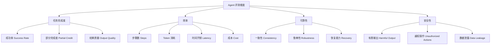
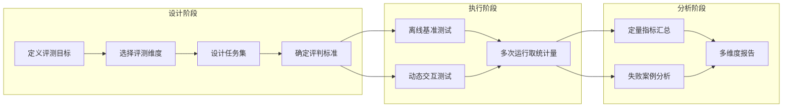

# Agent 评测方法论：如何衡量智能体能力

## 为什么 Agent 评测不同于模型评测

传统大语言模型（LLM）评测关注的是单轮输入-输出的质量：给定一个 prompt，模型生成的文本是否准确、流畅、相关。然而 Agent 评测面临根本性的不同——Agent 是在环境中持续行动的实体，其表现取决于多轮决策的累积效果。

核心差异包括：Agent 的输出不是文本而是行动序列（Action Sequence），评测需要考虑过程而非仅看结果；Agent 与环境交互产生状态变化，同一任务可能有多条正确路径；Agent 使用工具、调用 API、操作文件系统，评测需要模拟或提供真实环境；Agent 的失败模式更复杂——可能陷入循环、产生不可逆操作、或消耗过多资源。

这些差异意味着我们不能简单地将模型评测的方法套用到 Agent 上。我们需要一套专门的评测方法论。

## 评测维度体系

一个完整的 Agent 评测框架需要覆盖多个维度：



**任务完成度（Task Completion）** 是最基本的维度。但简单的 pass/fail 二元判定往往不够——一个完成了 80% 工作的 Agent 和完全失败的 Agent 不应获得相同评分。部分完成度（Partial Credit）评估正在成为趋势，它通过检查中间里程碑来给予部分分数。

**效率（Efficiency）** 衡量 Agent 完成任务的资源消耗。在生产环境中，一个用 50 步完成任务的 Agent 和用 5 步完成的 Agent，即使最终结果相同，其实际价值也截然不同。效率指标包括步骤数、Token 消耗、时间开销和金钱成本。

**可靠性（Reliability）** 关注 Agent 在重复执行时的表现方差。高方差意味着不可预测，这在生产环境中是不可接受的。一个平均成功率 70% 但方差极大的 Agent（有时 95%，有时 30%），不如一个稳定在 65% 的 Agent 可靠。

**安全性（Safety）** 评估 Agent 是否会产生有害行为，详见本章 [安全性评测](./safety-evaluation.md) 一节。

## 离线评测与在线评测

**离线评测（Offline Evaluation）** 在预定义的数据集上运行 Agent，对比预期结果。优点是可复现、成本可控、便于对比；缺点是覆盖场景有限，可能与真实使用情况脱节。离线评测适合快速迭代和回归测试。

**在线评测（Online Evaluation）** 在真实用户流量中观察 Agent 表现。通过 A/B 测试、灰度发布等方式收集真实反馈。优点是反映真实场景；缺点是成本高、周期长、难以控制变量。在线评测适合验证最终效果和发现离线评测遗漏的问题。

实践中，两者应结合使用：离线评测用于快速迭代和回归测试，在线评测用于验证最终效果。一个典型的开发流程是：本地单元测试 -> 离线基准评测 -> 小规模灰度 -> 全量上线。

## 静态基准与动态评测

**静态基准（Static Benchmarks）** 如 SWE-bench、GAIA 等，提供固定的任务集合。其优势在于标准化和可比性，但存在数据污染（Data Contamination）风险——模型可能在训练中见过测试数据。

**动态/交互式评测（Dynamic/Interactive Evaluation）** 使用实时生成或持续更新的任务。LiveCodeBench 每月从竞赛平台抓取新题目；WebArena 使用实时运行的网站环境。这类评测更能反映 Agent 的真实泛化能力，但标准化程度较低，不同时间点的结果可能不完全可比。

两种方式各有适用场景：静态基准适合横向对比不同系统，动态评测适合纵向追踪能力演进。

## 人工评测与自动化指标

| 评测方式 | 优势 | 劣势 | 适用场景 |
|---------|------|------|---------|
| 人工评测 | 灵活、能评估开放式任务 | 成本高、主观性强、不可扩展 | 复杂创意任务、用户体验评估 |
| 自动化指标 | 可扩展、可复现、成本低 | 可能遗漏细微质量差异 | 有明确正确答案的任务 |
| LLM-as-Judge | 介于两者之间、成本适中 | 存在偏见、与人工判断不完全一致 | 半开放式任务的批量评估 |

**LLM-as-Judge** [Zheng et al., 2023] 是近年兴起的方法，使用强大的 LLM 作为评判者。但需注意其固有偏见：倾向于给更长的回答更高分、对自身生成的内容评分偏高、对格式整齐的回答有偏好等。使用时应注意校准和去偏。

## 评测框架：Agent 的单元测试与端到端测试

借鉴软件工程的测试金字塔，Agent 评测也可以分层：

```python
# 单元测试：测试 Agent 的单个能力
def test_tool_selection():
    """Agent 能否为给定任务选择正确的工具"""
    agent = MyAgent()
    task = "查询北京今天的天气"
    selected_tool = agent.select_tool(task)
    assert selected_tool.name == "weather_api"

# 集成测试：测试 Agent 的多步骤流程
def test_multi_step_reasoning():
    """Agent 能否完成需要多步推理的任务"""
    agent = MyAgent()
    result = agent.run("找到最近一周股价涨幅最大的科技股并分析原因")
    assert result.steps_count <= 10
    assert result.contains_stock_name
    assert result.contains_analysis

# 端到端测试：在真实环境中测试完整任务
def test_end_to_end_github_issue():
    """Agent 能否解决真实的 GitHub Issue"""
    agent = MyAgent()
    env = GitHubEnvironment(repo="test-repo", issue=42)
    result = agent.solve(env)
    assert env.run_tests().all_passed

# 回归测试：确保改进不破坏已有能力
def test_regression_suite():
    """确保新版本不退步"""
    agent_new = MyAgent(version="2.0")
    for case in regression_cases:
        result = agent_new.run(case.task)
        assert result.score >= case.baseline_score * 0.95
```

分层评测的价值在于：单元测试快速定位问题，集成测试验证组合能力，端到端测试确认实际效果。

## "AI Agents That Matter" 的评测陷阱

Kapoor 等人 [2024] 在 "AI Agents That Matter" 一文中系统总结了当前 Agent 评测中的常见问题：

**成本与准确率的权衡被忽视**：许多论文只报告准确率而不报告成本。一个准确率 50% 但每次调用花费 $0.01 的 Agent，可能比准确率 55% 但花费 $5 的 Agent 更有实际价值。评测应同时报告 Pareto 前沿。

**评测集过窄导致过拟合**：在小规模基准上的微小提升可能不具统计显著性。SWE-bench Lite 仅 300 题，5% 的提升对应 15 道题的差异，可能仅仅是随机波动。

**缺乏置信区间报告**：Agent 行为具有随机性（温度参数、环境变化），单次运行结果不可靠。应报告多次运行的均值和标准差。

**Scaffold 优化 vs 模型能力混淆**：改进 Agent 框架（Scaffold）带来的提升不应归因于模型能力的进步。论文应明确区分这两类贡献。

**选择性报告**：只报告表现最好的配置，而不报告尝试过的其他配置。这导致发表偏见，使得复现困难。

## 构建 Agent 评测的最佳实践

**明确评测目标**：是对比不同 Agent 系统，还是追踪同一系统的迭代进步？目标不同，评测设计也不同。对比评测需要标准化；迭代追踪需要稳定性。

**多维度评估**：不要只看成功率，同时记录效率、成本、可靠性指标。一个全面的评测报告应包含成功率、平均步骤数、Token 消耗、成本、方差等多个维度。

**报告置信区间**：每个任务至少运行 3-5 次，报告均值加减标准差。对于关键结论，应进行统计显著性检验。

**控制成本变量**：在对比实验中，固定 token 预算或时间预算，观察在约束下的表现差异。这比无限制地比较更有实际意义。

**使用分层评测**：从单元测试到端到端测试逐层验证，快速定位问题。

**持续更新评测集**：定期加入新任务，防止过拟合和数据污染。

**结合定性分析**：对失败案例进行人工分析，理解失败模式而非仅看数字。失败模式的分类往往比成功率数字更有指导价值。

## 评测方法论总览



## 本章小结

Agent 评测是一个多维度、多层次的系统工程。与传统模型评测相比，Agent 评测需要考虑行动序列、环境交互、资源消耗和安全性等额外维度。没有单一指标能全面反映 Agent 能力，工程师应根据具体应用场景设计组合评测方案。在后续章节中，我们将逐一介绍当前主流的 Agent 评测基准，帮助读者理解各基准的适用场景和局限性。

## 评测方法论的前沿趋势

当前评测方法论正沿三个方向演进：

**从答案正确性到过程评估**：传统基准仅关注最终答案是否正确，忽视了解决方法的多样性和创新性。InnoGym（ICLR 2026）首次引入"性能增益 + 新颖度"双维度评价，评估 Agent 不仅能否解决问题，还能否以创新的方式解决问题。

**从单语言到跨语言评估**：当前 95.6% 的代码 Agent 基准仅基于 Python。SWE-PolyBench 扩展到多语言场景，SetupBench 则评估 Agent 在陌生环境中自主搭建开发环境的能力——这更贴近真实工程师的日常工作。

**从静态评分到动态评估**：SetupBench 等新基准采用单行验证命令的设计，支持快速动态验证；METR 的"任务完成时间视野"（task-completion time horizon）指标则从时间维度衡量 Agent 的自主能力边界。

## 延伸阅读

- [Kapoor et al., 2024] "AI Agents That Matter" — 系统分析 Agent 评测中的方法论问题
- [Zheng et al., 2023] "Judging LLM-as-a-Judge" — LLM 作为评判者的偏见分析
- [Chang et al., 2024] "A Survey on Evaluation of Large Language Models" — LLM 评测综述
- InnoGym (ICLR 2026) — 首个评估 AI Agent 创新潜力的基准 (arXiv:2512.01822)
- SWE-PolyBench — 多语言代码 Agent 评测基准
- SetupBench — 开发环境搭建能力评测
- 本书第 11 章 [安全性](../11-safety/) — Agent 安全评测的深入讨论
- 本章 [真实世界指标](./real-world-metrics.md) — 生产环境中的度量实践
