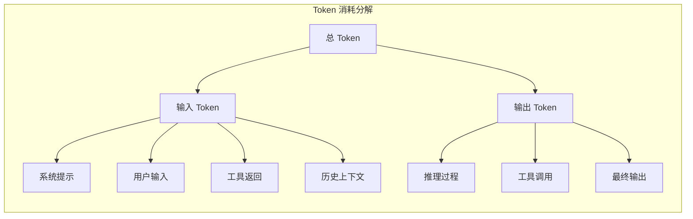
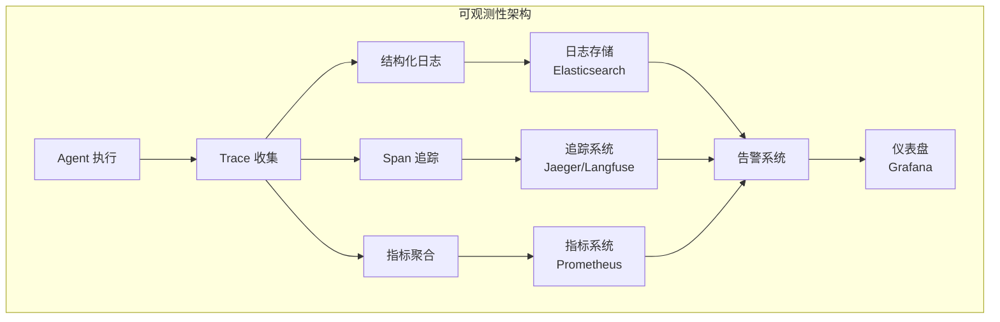

# 真实世界指标：生产环境的 Agent 度量

## 超越基准：生产环境需要什么

学术基准（如 SWE-bench、GAIA）提供了标准化的能力对比，但生产环境的需求远不止于此。一个在基准上得分优异的 Agent，在实际部署中可能因为成本过高、延迟过大、或在特定场景下不可靠而无法使用。

生产环境的 Agent 度量需要回答三个核心问题：**它有多好用？**（效果指标）**它有多贵？**（成本指标）**它有多稳定？**（可靠性指标）

## 效果指标

### 任务完成率（Task Completion Rate）

最基本的效果指标。需要按任务类型细分，因为整体完成率可能掩盖在特定类型上的严重不足。

```python
# 任务完成率计算与细分
class TaskCompletionTracker:
    def __init__(self):
        self.results = defaultdict(lambda: {"success": 0, "total": 0})
    
    def record(self, task_type: str, success: bool):
        self.results[task_type]["total"] += 1
        if success:
            self.results[task_type]["success"] += 1
    
    def get_rates(self) -> dict:
        rates = {}
        for task_type, counts in self.results.items():
            rates[task_type] = counts["success"] / max(counts["total"], 1)
        rates["overall"] = (
            sum(c["success"] for c in self.results.values()) /
            max(sum(c["total"] for c in self.results.values()), 1)
        )
        return rates
```

### 部分完成度（Partial Completion Score）

二元的成功/失败判定过于粗糙。一个完成了 80% 工作的 Agent 和完全失败的 Agent 不应获得相同评分。部分完成度通过检查中间里程碑来评估：

- 是否正确理解了任务意图
- 是否选择了合理的执行路径
- 完成了多少子步骤
- 最终输出与期望的接近程度

### 用户满意度

| 指标 | 定义 | 采集方式 |
|------|------|---------|
| 显式评分 | 用户对结果的 1-5 分评价 | 任务完成后弹窗 |
| 采纳率 | 用户接受 Agent 输出的比例 | 自动记录 |
| 修正率 | 用户需要修改 Agent 输出的比例 | 对比最终版本与 Agent 输出 |
| 留存率 | 用户持续使用 Agent 的比例 | 周/月活跃度 |
| 重试率 | 用户对同一任务重新发起请求的比例 | 会话分析 |

修正率是一个特别有价值的指标——它反映了 Agent 输出的"可用性"。即使任务"完成"了，如果用户需要大量修改，实际价值也有限。

## 效率指标

### Token 消耗



Token 消耗直接关联成本，但也反映了 Agent 的"思考效率"。一个用 1000 token 完成任务的 Agent 比用 10000 token 的更高效（假设结果质量相同）。

### API 调用次数

Agent 调用外部工具的次数。过多的调用可能意味着：Agent 在"试错"而非有计划地执行；工具选择策略不够精准；缺乏有效的结果缓存。

### 时间开销（Time to Completion）

从用户发起请求到获得最终结果的端到端时间。包括：LLM 推理时间、工具调用等待时间、网络延迟等。对于交互式场景，用户对延迟的容忍度通常在 30 秒以内。

## 成本指标

### 单任务成本（Cost per Task）

```python
# 成本计算模型
class CostCalculator:
    def __init__(self, pricing: dict):
        self.pricing = pricing  # 各模型/API 的定价
    
    def calculate_task_cost(self, trace: AgentTrace) -> dict:
        llm_cost = (
            trace.input_tokens * self.pricing["input_per_token"] +
            trace.output_tokens * self.pricing["output_per_token"]
        )
        
        tool_cost = sum(
            self.pricing["tools"].get(call.tool_name, 0)
            for call in trace.tool_calls
        )
        
        compute_cost = trace.execution_time * self.pricing["compute_per_second"]
        
        return {
            "llm_cost": llm_cost,
            "tool_cost": tool_cost,
            "compute_cost": compute_cost,
            "total": llm_cost + tool_cost + compute_cost,
            "cost_per_success": (llm_cost + tool_cost + compute_cost) / 
                               (1 if trace.success else float('inf'))
        }
```

### 成本效益比

关键不是绝对成本，而是**每单位价值的成本**。一个花费 $1 完成复杂任务的 Agent，可能比花费 $0.01 但需要人工修正 30 分钟的 Agent 更经济。

## 可靠性指标

### 失败率与失败模式

不仅要追踪失败率，更要分类失败模式：

- **硬失败**：Agent 完全无法完成任务（报错、超时、死循环）
- **软失败**：Agent 给出了结果但不正确
- **部分失败**：完成了部分子任务但未能完成整体目标
- **优雅降级**：Agent 识别到无法完成并主动告知用户

### 一致性（Consistency）

对同一任务多次执行，结果的方差有多大。高方差意味着不可预测，这在生产环境中是严重问题。

### 恢复能力（Recovery Rate）

当 Agent 遇到错误时，能否自主恢复并继续完成任务。这包括：工具调用失败后的重试策略、中间结果异常时的回退机制、环境变化时的适应能力。

## 可观测性：追踪、日志与仪表盘



### Trace 结构

每次 Agent 执行应产生完整的 Trace，包含：

```python
# Agent Trace 数据结构
@dataclass
class AgentTrace:
    trace_id: str
    task_description: str
    start_time: datetime
    end_time: datetime
    success: bool
    
    # 执行详情
    steps: List[AgentStep]  # 每一步的决策和行动
    tool_calls: List[ToolCall]  # 所有工具调用记录
    llm_calls: List[LLMCall]  # 所有 LLM 调用记录
    
    # 资源消耗
    total_input_tokens: int
    total_output_tokens: int
    total_cost_usd: float
    total_duration_seconds: float
    
    # 错误信息
    errors: List[ErrorRecord]
    recovery_attempts: int
```

### 关键仪表盘指标

生产环境的 Agent 监控仪表盘应包含：实时任务成功率（按类型分）、P50/P95/P99 延迟、每小时成本趋势、错误率与错误类型分布、Token 消耗趋势、活跃用户数与任务量。

## A/B 测试

Agent 系统的改进需要通过 A/B 测试验证：

**流量分配**：将用户随机分配到不同版本的 Agent（如新旧 prompt、不同模型、不同工具集）。

**评估周期**：由于 Agent 任务的复杂性和方差，通常需要更长的评估周期（至少 1-2 周）和更大的样本量。

**多指标权衡**：新版本可能在成功率上提升但成本增加，需要综合评估。建议定义一个加权的"北极星指标"（North Star Metric）。

**注意事项**：Agent 的随机性（温度参数）可能导致同一版本内的方差较大，需要足够的样本量才能得出统计显著的结论。

## SLA 设计

为 Agent 系统定义 SLA（Service Level Agreement）时需要考虑：

| SLA 维度 | 示例目标 | 度量方式 |
|---------|---------|---------|
| 可用性 | 99.9% uptime | 系统正常响应的时间比例 |
| 延迟 | P95 < 30s | 从请求到首次响应的时间 |
| 成功率 | > 85% 任务完成 | 按周统计的任务完成率 |
| 成本上限 | 单任务 < $0.50 | 平均单任务成本 |
| 安全性 | 0 次越权操作 | 安全审计日志 |

SLA 的设定应基于业务需求和用户期望，而非技术能力的上限。留出足够的安全余量，并建立违反 SLA 时的告警和降级机制。

## 指标收集实践

```python
# 生产环境指标收集包装器
import time
from contextlib import contextmanager

class AgentMetricsCollector:
    def __init__(self, metrics_backend):
        self.backend = metrics_backend
    
    @contextmanager
    def track_task(self, task_type: str, user_id: str):
        """包装 Agent 任务执行，自动收集指标"""
        start = time.time()
        context = {"tokens": 0, "tool_calls": 0, "errors": 0}
        
        try:
            yield context
            # 任务成功
            duration = time.time() - start
            self.backend.record_success(task_type, duration, context)
        except Exception as e:
            # 任务失败
            duration = time.time() - start
            context["errors"] += 1
            self.backend.record_failure(task_type, duration, context, str(e))
            raise
        finally:
            # 无论成败都记录资源消耗
            self.backend.record_cost(task_type, context["tokens"], 
                                    context["tool_calls"])

# 使用示例
metrics = AgentMetricsCollector(prometheus_backend)

with metrics.track_task("code_review", user_id="user_123") as ctx:
    result = agent.run(task)
    ctx["tokens"] = result.total_tokens
    ctx["tool_calls"] = len(result.tool_calls)
```

## 本章小结

生产环境的 Agent 度量是一个多维度的系统工程，需要同时关注效果、效率、成本、可靠性和安全性。学术基准提供了能力的横向对比，但生产指标才能真正反映 Agent 的业务价值。建议工程师在部署 Agent 系统时，从第一天就建立完善的可观测性基础设施，持续收集和分析这些指标，用数据驱动系统的迭代优化。

## 延伸阅读

- [Kapoor et al., 2024] "AI Agents That Matter" — 评测中成本与效果的权衡
- LangSmith / Langfuse 文档 — Agent 可观测性平台的实践指南
- 本书 [Agent 架构](../../03-architecture/) — 系统设计中的可观测性考量
- 本章 [评测方法论](./methodology.md) — 离线与在线评测的结合策略
- OpenTelemetry for LLM — 分布式追踪在 AI 系统中的应用
