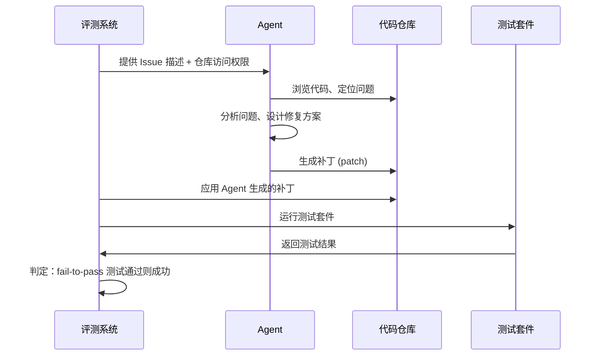

# SWE-bench：代码 Agent 的黄金标准

## 背景与动机

在 SWE-bench 出现之前，代码生成评测主要停留在函数级别。给定函数签名和描述，生成实现代码。HumanEval、MBPP 等基准测试了模型的编程能力，但与真实软件工程工作相去甚远。真实的软件工程师面对的是：理解一个大型代码库、定位 bug 所在、理解上下文依赖、编写修复代码并确保不引入新问题。

SWE-bench [Jimenez et al., 2024] 正是为了填补这一空白而设计的。它从真实的 GitHub 仓库中提取已解决的 Issue 和对应的 Pull Request，要求 Agent 在只看到 Issue 描述的情况下，自主生成修复补丁。这一设计将评测从"能否写代码"提升到了"能否像工程师一样解决问题"。

## 数据集构成

SWE-bench 的数据来源于 12 个流行的 Python 开源项目：

| 项目 | 领域 | 任务数量 | 代表性 |
|------|------|---------|--------|
| Django | Web 框架 | 约500 | 大型项目、复杂依赖 |
| scikit-learn | 机器学习 | 约300 | 数值计算、API 设计 |
| matplotlib | 数据可视化 | 约200 | 图形渲染、兼容性 |
| sympy | 符号计算 | 约300 | 数学推理、递归结构 |
| pytest | 测试框架 | 约100 | 元编程、插件系统 |
| astropy | 天文学 | 约100 | 科学计算、单位系统 |
| flask | Web 微框架 | 约50 | 轻量级、中间件 |
| requests | HTTP 库 | 约50 | 网络协议、编码 |
| sphinx | 文档生成 | 约100 | 模板、解析器 |
| xarray | 多维数组 | 约100 | 数据结构、索引 |
| pylint | 代码分析 | 约100 | AST 操作、规则引擎 |
| seaborn | 统计可视化 | 约50 | 图形 API、数据转换 |

完整数据集包含 **2294 个任务实例**，每个实例包括：原始 Issue 描述、对应的代码仓库快照（特定 commit）、参考补丁（Gold Patch）、以及用于验证的测试用例。

这些项目的选择具有代表性，涵盖了 Web 开发、科学计算、开发工具等多个领域，代码风格和架构模式各不相同，对 Agent 的泛化能力提出了较高要求。

## SWE-bench 的变体

由于完整数据集规模较大且部分任务质量参差不齐，社区发展出了多个子集：

**SWE-bench Lite**：从完整集中筛选出 **300 个任务**，标准是：Issue 描述清晰、修复范围明确（通常只涉及单个文件）、测试覆盖充分。适合快速评估和迭代。由于规模较小，评测成本可控，是日常开发中最常用的版本。

**SWE-bench Verified**：由人工标注员验证的 **500 个任务**子集，确保 Issue 描述足以定位问题、参考补丁是合理的修复方案、测试用例能正确区分修复前后的行为。这是目前最被认可的评测子集，也是各大排行榜的主要参考。

**SWE-bench Multimodal**：2024 年末推出的扩展版本，包含需要理解截图、UI 描述等视觉信息的任务，测试多模态 Agent 的能力。

## 评测流程



关键评判标准是 **fail-to-pass**：在应用补丁前失败、应用后通过的测试用例必须全部通过。同时，原本通过的测试不能因补丁而失败（即不引入回归）。这一标准既严格又公平，它不要求 Agent 的修复方式与参考补丁完全一致，只要功能正确即可。

评测基础设施使用 Docker 容器为每个任务创建隔离环境，安装正确版本的依赖，确保评测的可复现性。这也是评测成本较高的主要原因之一。

## 排行榜演进

SWE-bench 的排行榜见证了代码 Agent 能力的飞速进步：

| 时间 | 系统 | SWE-bench Lite 得分 | 关键技术 |
|------|------|-------------------|---------|
| 2023.10 | RAG + Claude | 1.96% | 基础检索 + 生成 |
| 2024.03 | Devin | 13.86% | 自主 Agent + 终端操作 |
| 2024.04 | SWE-Agent | 18.00% | 专用 Agent-Computer Interface |
| 2024.06 | Aider | 26.33% | 对话式编程 |
| 2024.08 | OpenHands | 41.67% | 多工具协作 |
| 2024.10 | Amazon Q | 49.33% | 企业级工具链 |
| 2024.12 | Various | 55-60% | 多种方法竞争 |
| 2025.03 | SOTA systems | 70%+ | 集成搜索 + 推理 + 验证 |

从不到 2% 到超过 70%，仅用了约 18 个月。这一进步既来自模型能力的提升（GPT-4 到 Claude 3.5 再到 o1/o3），也来自 Agent 架构的创新（更好的代码搜索、自我验证、迭代修复）。

值得注意的是，进步并非线性的。从 2% 到 20% 的跃升主要归功于 Agent 架构的引入（从简单的 RAG 到自主决策循环）；从 20% 到 50% 的提升来自工具链的完善（更好的代码搜索、测试运行、错误分析）；从 50% 到 70% 则更多依赖推理能力的增强（o1/o3 等推理模型的应用）。

## 典型的成功与失败模式

**成功模式**：Agent 在以下类型的任务上表现最好。Issue 描述清晰指向具体的 bug 行为；修复涉及少量文件（1-3 个）；存在明确的错误模式（如边界条件、类型错误、缺少空值检查）；相关代码有良好的测试覆盖，Agent 可以通过运行测试来验证修复。

**失败模式**：Agent 在以下场景中容易失败。需要理解复杂的架构设计意图；修复涉及多个模块的协调变更；Issue 描述模糊或需要领域知识（如天文学公式、数学定理）；需要添加新功能而非修复 bug；涉及性能优化而非功能修正。

## 已知问题与争议

**数据污染争议**：由于 SWE-bench 的数据来自公开的 GitHub 仓库，存在模型训练数据中包含相关代码的可能。虽然评测使用的是特定时间点的仓库快照，但模型可能"记住"了类似的修复模式。SWE-bench Verified 通过人工验证部分缓解了这一问题。

**测试质量问题**：部分任务的测试用例不够严格，可能存在"碰巧通过"的情况。Agent 生成的补丁虽然通过了测试，但并非正确的修复方案。研究表明约 5-10% 的"通过"可能属于此类情况。

**任务难度分布不均**：有些任务只需修改一行代码，有些则需要理解复杂的架构设计。简单任务的高通过率可能掩盖了 Agent 在复杂任务上的不足。

**评测成本高昂**：完整运行一次 SWE-bench 需要大量计算资源（为每个任务构建独立的 Docker 环境、安装依赖、运行测试），单次评测可能花费数百美元的 LLM API 费用加上数十美元的计算资源。

**Python 单一语言**：SWE-bench 仅覆盖 Python 项目，无法评估 Agent 在 Java、TypeScript、Go 等其他语言上的表现。社区正在开发多语言版本。

## 对代码 Agent 发展的影响

SWE-bench 的出现深刻影响了代码 Agent 的研发方向：

**推动了 Agent 架构创新**：为了在 SWE-bench 上取得好成绩，研究者开发了专门的代码搜索策略、文件定位算法、补丁生成与验证循环等技术。SWE-Agent 提出的 Agent-Computer Interface (ACI) 概念，为 Agent 与代码环境的交互定义了新范式。

**建立了行业标准**：SWE-bench 成为代码 Agent 产品（如 Devin、Cursor、GitHub Copilot Workspace）的核心评测指标，投资者和用户都以此作为能力参考。

**暴露了真实差距**：即使最好的系统也只能解决约 70% 的 Verified 任务，说明真实软件工程中仍有大量场景超出当前 Agent 能力。剩余 30% 的任务往往需要深层架构理解或创造性的设计决策。

**催生了新的研究方向**：包括代码搜索优化、自我验证机制、多 Agent 协作修复、以及针对特定代码库的 Agent 微调等。

## 如何在 SWE-bench 上评测自己的系统

对于希望在 SWE-bench 上评测自己 Agent 系统的工程师，以下是实践指南：

```python
# SWE-bench 评测流程伪代码
from swebench.harness import run_evaluation

def evaluate_my_agent(agent, dataset="swe-bench-verified"):
    """在 SWE-bench 上评测自定义 Agent"""
    results = []
    
    for instance in load_dataset(dataset):
        # 1. 设置环境：checkout 到指定 commit
        env = setup_environment(instance.repo, instance.base_commit)
        
        # 2. 运行 Agent：提供 Issue 描述，获取补丁
        patch = agent.solve(
            issue_description=instance.problem_statement,
            repo_path=env.repo_path
        )
        
        # 3. 应用补丁并运行测试
        env.apply_patch(patch)
        test_result = env.run_tests(instance.test_patch)
        
        # 4. 记录结果
        results.append({
            "instance_id": instance.id,
            "resolved": test_result.fail_to_pass_all_passed,
            "no_regression": test_result.pass_to_pass_all_passed,
            "tokens_used": agent.last_run_tokens,
            "time_seconds": agent.last_run_time,
        })
    
    return compute_metrics(results)
```

**资源需求**：完整评测 SWE-bench Verified（500 题）通常需要 8-24 小时和 $200-$1000 的 API 费用（取决于模型和 Agent 架构）。建议先在 Lite（300 题）上快速验证。

**常见陷阱**：确保 Docker 环境正确配置；注意 Python 版本兼容性；某些项目的依赖安装可能失败，需要处理这些边界情况。

## 为什么 SWE-bench 重要

SWE-bench 的核心价值在于它**扎根于真实的软件工程实践**。每个任务都来自真实的开发者提出的真实问题，修复方案经过了代码审查和测试验证。这使得 SWE-bench 上的进步能够直接映射到实际生产力的提升。

对于工程师而言，SWE-bench 的得分可以粗略理解为：如果你有 100 个典型的 bug 修复任务，当前最好的 Agent 能自主解决其中约 70 个。这已经是非常有实际价值的能力水平，意味着工程师可以将大量常规修复工作委托给 Agent，自己专注于更复杂的架构设计和创新工作。

## 本章小结

SWE-bench 通过将真实 GitHub Issue 转化为标准化评测任务，建立了代码 Agent 领域最具影响力的基准。它的排行榜演进记录了这一领域的快速进步，同时其已知局限也提醒我们：单一基准不能完全代表真实能力。工程师在选择代码 Agent 工具时，应将 SWE-bench 得分作为重要参考，但也需结合自身场景（语言、项目规模、任务类型）进行实际测试。

## SWE-bench Verified 退役与 Pro 登场（2025-2026）

2025 年底至 2026 年初，SWE-bench 经历了其诞生以来最剧烈的一次变革。这一变革的背景是：尽管 Verified 已是当时最严格的基准，但社区第三方审计持续发现深层问题。

**Verified 的三重困境**：

隐蔽的数据污染——虽然任务本身经过精选，但其背后的代码库和编程模式仍然可能被模型在海量预训练中学到，导致评估结果高估了模型在全新问题上的泛化能力。测试覆盖率不足——部分任务的测试用例虽能捕捉原始 bug，但不够全面，使得"投机取巧"的修复方案能够蒙混过关。任务复杂度天花板——Verified 中的任务虽然真实，但平均复杂度与真实软件工程中的难题相比仍有差距，无法有效区分 SOTA 模型之间的能力差异。

**2026 年 2 月：历史性退役声明**

OpenAI 在 2026 年 2 月发布声明：不再推荐使用 SWE-bench Verified 作为代码能力评估基准。理由是 Verified 的可靠性已不足以真实反映最先进系统之间的能力差距，继续使用可能误导社区对技术进展的判断。这一举动在业界引起震动，标志着代码评测的"验证"时代走向终结。

**SWE-bench Pro 的设计哲学**

在 Verified 退役的同时，社区（包括 OpenAI、普林斯顿等原始贡献者）联合推出了下一代基准 SWE-bench Pro。其核心改进包括：

更严格的时效隔离——引入来自 2024 年后的新开源项目 Issue，确保几乎不可能出现在任何现有模型的训练集中。更强的数据隔离机制——采用先进技术手段确保评测环境与外部网络和训练数据源彻底隔离。更高的任务复杂度——有意引入需要更长推理链、更复杂算法知识、甚至跨文件协调修改的任务。多模态原生支持——Pro 版本原生包含需要理解 Issue 中截图、UI 草图、报错堆栈截图等视觉信息的任务，不再作为独立变体存在。

**评测标准的思想演进**

从 Lite → Verified → Pro 的演进，体现了评测哲学的三次跃迁：

| 维度 | Lite (2023) | Verified (2024) | Pro (2026) |
|------|-------------|-----------------|------------|
| 评估方式 | 静态 patch 应用 | 容器化动态执行 | 完全隔离 + 时效保鲜 |
| 防污染 | 无机制 | 人工审查精选 | 时效隔离 + 技术阻断 |
| 复杂度 | 单文件修复为主 | 混合复杂度 | 刻意高复杂度、多文件 |
| 评测焦点 | "能否写代码" | "能否解 Bug" | "能否做系统工程" |

这一演进史本质上是评测基准与 AI 模型之间的"军备竞赛"——每当模型能力突破当前标尺的天花板，标尺就必须进化。它揭示了 AI 评测领域的核心悖论：一个基准越成功，就越快被模型"攻克"，从而越快失去区分力。

## SWE-bench 的局限性与新兴替代

SWE-bench 虽然影响巨大，但已暴露出若干根本性局限：语言单一性（仅 Python）、潜在的数据泄漏风险（训练数据可能包含部分修复方案）、以及对创新性解法缺乏评估。

新兴基准正在弥补这些空白：**SWE-PolyBench** 将评测扩展到 Java、TypeScript、Rust 等多种语言；**SWE-Refactor** 聚焦代码重构而非 bug 修复；**SetupBench** 评估 Agent 从零搭建开发环境的能力，更贴近真实工程场景。

## 延伸阅读

- [Jimenez et al., 2024] "SWE-bench: Can Language Models Resolve Real-World GitHub Issues?" — 原始论文
- [Yang et al., 2024] "SWE-agent: Agent-Computer Interfaces Enable Automated Software Engineering" — SWE-Agent 架构
- [Cognition AI, 2024] "Devin: AI Software Engineer" — 首个在 SWE-bench 上引起广泛关注的商业系统
- [OpenAI, 2026] "Retiring SWE-bench Verified" — Verified 退役声明与 Pro 设计动机
- SWE-bench Pro — 下一代代码 Agent 评测基准（2026 年推出）
- SWE-PolyBench — 多语言仓库级代码 Agent 评测
- SWE-Refactor — 代码重构能力评测
- SetupBench — 开发环境搭建能力评测
- SWE-bench 官方排行榜：https://www.swebench.com
- 本章 [代码生成评测](./humaneval-agent.md) — 从函数级到项目级的评测演进
