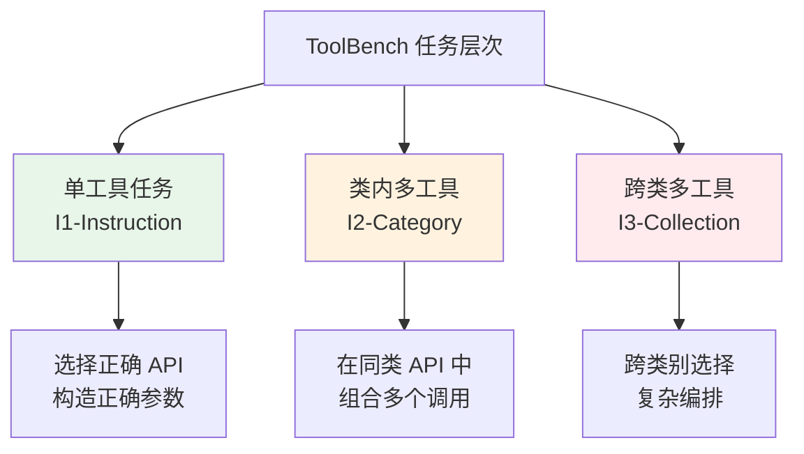

# ToolBench：工具使用能力评测

## 为什么工具使用评测很重要

工具使用（Tool Use / Function Calling）是 Agent 区别于纯语言模型的核心能力。一个 Agent 的实际价值很大程度上取决于它能否正确地选择工具、构造参数、解析返回结果并据此继续推理。然而，工具使用的评测面临独特挑战：同一任务可能有多条正确的工具调用路径，参数的"正确性"可能存在灰度，且工具调用的顺序和组合方式多种多样。

## ToolBench：大规模 API 调用评测

ToolBench [Qin et al., 2023] 构建了一个大规模的工具使用评测平台，其核心特点是规模和真实性：

**数据规模**：收集了来自 RapidAPI 平台的 **16,464 个真实 REST API**，涵盖 49 个类别（天气、金融、社交媒体、地图等）。

**任务设计**：基于这些 API 自动生成了多层次的任务：



**评测指标**：

- **通过率（Pass Rate）**：任务是否最终完成
- **胜率（Win Rate）**：与参考解法对比，由 ChatGPT 评判哪个方案更好
- **API 调用准确率**：选择的 API 是否正确
- **参数准确率**：传递的参数是否符合 API 规范

## API-Bank：结构化 API 评测

API-Bank [Li et al., 2023] 提供了更结构化的工具使用评测，将评测分为三个层次：

**Level 1 - API 调用准确性**：给定明确的任务描述和可用 API 列表，Agent 能否生成正确的 API 调用。评测 API 名称选择和参数填充的准确性。

**Level 2 - API 检索能力**：从大量候选 API 中，Agent 能否找到完成任务所需的正确 API。这测试了 Agent 的工具发现能力。

**Level 3 - 计划与执行**：面对需要多步 API 调用的复杂任务，Agent 能否制定正确的调用计划并执行。

```python
# API-Bank 评测示例
# Level 1: 直接调用
task = "查询北京明天的天气"
available_apis = ["weather.get_forecast", "weather.get_current", "maps.search"]
# 期望: weather.get_forecast(city="北京", date="tomorrow")

# Level 3: 多步计划
task = "帮我预订明天从北京到上海的最便宜航班"
# 期望计划:
# 1. flights.search(from="北京", to="上海", date="tomorrow")
# 2. flights.sort(results, by="price", order="asc")
# 3. flights.book(flight_id=results[0].id)
```

## T-Eval：细粒度工具使用评测

T-Eval [Chen et al., 2024] 将工具使用能力分解为六个细粒度维度，提供更精确的能力诊断：

| 维度 | 评测内容 | 示例 |
|------|---------|------|
| 指令遵循 (Instruct) | 能否理解任务需求 | 从复杂描述中提取关键信息 |
| 计划 (Plan) | 能否制定工具调用计划 | 确定调用顺序和依赖关系 |
| 推理 (Reason) | 能否基于中间结果推理 | 根据 API 返回调整后续策略 |
| 检索 (Retrieve) | 能否找到正确的工具 | 从大量工具中选择最合适的 |
| 理解 (Understand) | 能否理解工具文档 | 正确解读 API 参数含义 |
| 审查 (Review) | 能否验证调用结果 | 检测错误并进行修正 |

T-Eval 的价值在于：当一个 Agent 在工具使用上表现不佳时，可以通过 T-Eval 精确定位是哪个环节出了问题——是不会选工具、不会填参数、还是不会解读结果。

## Nexus：函数调用准确性评测

Nexus [Srinivasan et al., 2023] 专注于评测模型的函数调用（Function Calling）准确性，关注更底层的能力：

- **函数签名理解**：能否正确解析函数的参数类型、必选/可选参数
- **参数值推断**：能否从自然语言描述中提取正确的参数值
- **嵌套调用**：能否处理函数返回值作为另一个函数输入的场景
- **并行调用**：能否识别可以并行执行的独立函数调用

## Berkeley Function Calling Leaderboard

Berkeley Function Calling Leaderboard (BFCL) 是目前最活跃的函数调用评测排行榜，持续跟踪各模型的工具使用能力：

**评测类别**：

- **Simple Function**：单函数调用，参数直接从用户输入提取
- **Multiple Functions**：需要调用多个函数
- **Parallel Functions**：可并行执行的多函数调用
- **Nested Functions**：函数调用结果作为其他函数的输入
- **Relevance Detection**：判断是否需要调用函数（有时不需要）
- **Java/JavaScript/Python**：不同编程语言的函数调用

**典型排名（2025 年初）**：

| 模型 | 整体准确率 | Simple | Multiple | Parallel |
|------|-----------|--------|----------|----------|
| GPT-4o | ~88% | 92% | 85% | 82% |
| Claude 3.5 Sonnet | ~86% | 90% | 84% | 80% |
| Gemini 1.5 Pro | ~84% | 89% | 82% | 78% |
| Llama-3-70B | ~76% | 82% | 74% | 68% |

## 工具使用评测的核心难题

**多解问题（Multiple Valid Solutions）**：同一任务可能有多种正确的工具调用方式。例如"查询天气"可以调用 weather_api.get_current() 也可以调用 weather_service.query()，两者都正确。评测系统需要能够识别等价解。

**参数灵活性**：某些参数有多种合法表示。日期可以是 "2024-01-15"、"Jan 15, 2024"、"tomorrow"（如果今天是 1 月 14 日）。评测需要处理这种语义等价性。

**计划质量 vs 结果质量**：一个"碰巧"得到正确结果的低质量计划，和一个系统性的高质量计划，应该如何区分评分？

**工具文档质量的影响**：Agent 的表现高度依赖工具文档的质量。同一个 Agent 面对描述清晰的 API 和描述模糊的 API，表现可能天差地别。这使得跨基准的对比变得困难。

## 实践建议：构建自定义工具评测

对于在生产环境中部署 Agent 的工程师，建议构建针对自身工具集的评测：

```python
# 自定义工具评测框架示例
class ToolEvalSuite:
    def __init__(self, tools: list, test_cases: list):
        self.tools = tools
        self.test_cases = test_cases
    
    def evaluate(self, agent) -> dict:
        results = {
            "tool_selection_accuracy": 0,
            "parameter_accuracy": 0,
            "end_to_end_success": 0,
            "avg_calls_per_task": 0,
        }
        
        for case in self.test_cases:
            trace = agent.run(case.instruction, available_tools=self.tools)
            
            # 评估工具选择
            results["tool_selection_accuracy"] += (
                self._check_tool_selection(trace, case.expected_tools)
            )
            # 评估参数准确性
            results["parameter_accuracy"] += (
                self._check_parameters(trace, case.expected_params)
            )
            # 评估最终结果
            results["end_to_end_success"] += (
                self._check_result(trace.final_output, case.expected_output)
            )
            results["avg_calls_per_task"] += len(trace.tool_calls)
        
        # 归一化
        n = len(self.test_cases)
        for key in results:
            results[key] /= n
        
        return results
```

## 本章小结

工具使用评测是 Agent 评测中最具实践价值的方向之一。从 ToolBench 的大规模 API 评测，到 T-Eval 的细粒度能力诊断，再到 BFCL 的持续排行榜，这些基准共同构建了对 Agent 工具使用能力的全面评估体系。工程师在选择 Agent 框架或模型时，应重点关注其在工具使用评测上的表现，特别是与自身业务场景相似的评测类别。

## 延伸阅读

- [Qin et al., 2023] "ToolLLM: Facilitating Large Language Models to Master 16000+ Real-world APIs" — ToolBench 论文
- [Li et al., 2023] "API-Bank: A Comprehensive Benchmark for Tool-Augmented LLMs"
- [Chen et al., 2024] "T-Eval: Evaluating the Tool Utilization Capability Step by Step"
- Berkeley Function Calling Leaderboard: https://gorilla.cs.berkeley.edu/leaderboard.html
- 本书 [工具使用](../../05-tool-use/) 章节 — 工具调用的技术实现
