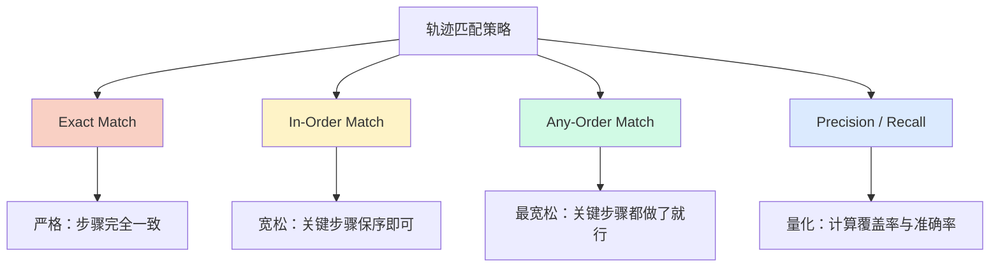
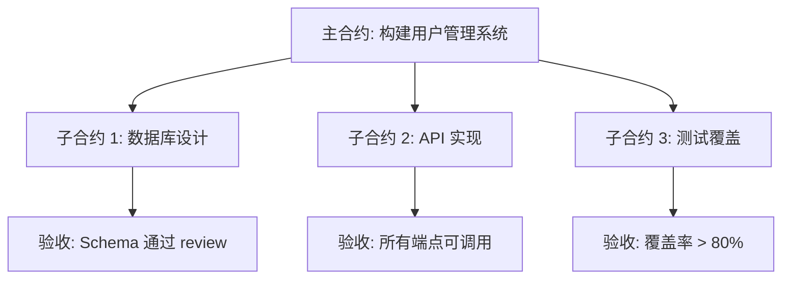

# 轨迹评估：不止看结果，更要看过程

## 概述：为什么需要轨迹评估

传统的 Agent 评估方式关注最终输出——任务是否完成、答案是否正确。但这种"终点评估"存在严重盲区：两个 Agent 可能产出相同结果，一个通过精确推理三步到位，另一个在错误路径上反复试错后碰巧成功。在生产环境中，后者意味着更高的成本、更长的延迟，以及面对稍有变化的任务就会崩溃的脆弱性。

轨迹评估（Trajectory Evaluation）通过审视 Agent 的完整执行路径来回答一个关键问题：**Agent 不仅做对了，而且做得好吗？** 这包括：是否选择了合理的工具、是否遵循了高效的策略、是否在每一步都做出了理性决策。

这在调试和改进 Agent 时尤为重要。最终结果告诉你"什么不行"，轨迹告诉你"为什么不行"。

## Agent Trajectory 定义

### 什么是轨迹

Agent 轨迹是一个序列化的**动作-观测对**（Action-Observation Pairs），记录了 Agent 从接收任务到完成任务的完整执行路径：

```python
from dataclasses import dataclass
from typing import Any

@dataclass
class TrajectoryStep:
    """A single step in an agent trajectory."""
    action: str           # The action taken (e.g., tool call name)
    action_input: dict    # Parameters passed to the action
    observation: Any      # The result returned by the environment
    thought: str = ""     # Optional: the agent's reasoning before acting
    timestamp: float = 0  # When this step occurred

@dataclass
class Trajectory:
    """Complete execution trace of an agent."""
    task: str
    steps: list[TrajectoryStep]
    final_output: Any
    metadata: dict  # token_usage, latency, cost, etc.
```

一个典型的轨迹看起来是：接收任务 → 思考 → 调用工具 A → 获得观测 → 思考 → 调用工具 B → 获得观测 → 输出结果。每一步都被记录下来，形成可回溯、可比较的执行日志。

### 轨迹 vs 最终结果：评估维度的区别

| 评估维度 | 最终结果评估 | 轨迹评估 |
|---------|------------|---------|
| 关注点 | 输出是否正确 | 执行路径是否合理 |
| 信息量 | 低（二元或评分） | 高（每步决策可审计） |
| 调试价值 | 只知结果对错 | 知道哪一步出问题 |
| 效率感知 | 无 | 能检测冗余步骤 |
| 策略评估 | 无法评估 | 可比较不同策略 |
| 适用场景 | 快速回归测试 | 深度分析与改进 |

## 轨迹匹配算法

当我们有了"期望轨迹"（Reference Trajectory）和"实际轨迹"（Actual Trajectory），如何比较它们？不同的匹配策略反映了不同的评估严格程度：



### Exact Match：精确匹配

要求实际轨迹与参考轨迹完全一致——相同的动作、相同的顺序、相同的步骤数。这是最严格的策略，适用于确定性流程（如固定的 API 调用序列），但在实际评估中过于脆弱，因为 Agent 经常有合理的替代路径。

### In-Order Match：保序匹配

只要求参考轨迹中的关键步骤按顺序出现在实际轨迹中，允许中间插入额外步骤。比如参考轨迹是 [搜索, 分析, 输出]，实际轨迹 [搜索, 验证, 分析, 格式化, 输出] 也算匹配成功。这是最常用的策略。

### Any-Order Match：任意序匹配

只检查参考轨迹中的关键步骤是否都出现了，不关心顺序。适用于多个独立子任务的场景——比如"查询天气并发送邮件"，先查天气还是先发邮件都可以。

### Precision / Recall：精确率与召回率

将轨迹评估转化为集合比较问题：Recall 衡量参考步骤中有多少被执行了（避免遗漏），Precision 衡量实际步骤中有多少是必要的（避免冗余）。

### 代码实现

```python
from enum import Enum

class MatchStrategy(Enum):
    EXACT = "exact"
    IN_ORDER = "in_order"
    ANY_ORDER = "any_order"

class TrajectoryMatcher:
    """Compare actual trajectory against reference trajectory."""
    
    def __init__(self, strategy: MatchStrategy = MatchStrategy.IN_ORDER):
        self.strategy = strategy
    
    def match(
        self,
        actual: list[str],
        reference: list[str],
    ) -> dict:
        """
        Compare actual actions against reference actions.
        Returns match result with score and details.
        """
        if self.strategy == MatchStrategy.EXACT:
            return self._exact_match(actual, reference)
        elif self.strategy == MatchStrategy.IN_ORDER:
            return self._in_order_match(actual, reference)
        elif self.strategy == MatchStrategy.ANY_ORDER:
            return self._any_order_match(actual, reference)
    
    def _exact_match(self, actual: list[str], reference: list[str]) -> dict:
        matched = actual == reference
        return {"matched": matched, "score": 1.0 if matched else 0.0}
    
    def _in_order_match(self, actual: list[str], reference: list[str]) -> dict:
        """Check if reference steps appear in order within actual."""
        ref_idx = 0
        matched_steps = []
        for step in actual:
            if ref_idx < len(reference) and step == reference[ref_idx]:
                matched_steps.append(step)
                ref_idx += 1
        recall = len(matched_steps) / len(reference) if reference else 1.0
        precision = len(matched_steps) / len(actual) if actual else 0.0
        return {
            "matched": ref_idx == len(reference),
            "recall": recall,
            "precision": precision,
            "score": recall,  # recall-oriented by default
            "matched_steps": matched_steps,
        }
    
    def _any_order_match(self, actual: list[str], reference: list[str]) -> dict:
        """Check if all reference steps appear regardless of order."""
        actual_set = set(actual)
        matched = [step for step in reference if step in actual_set]
        recall = len(matched) / len(reference) if reference else 1.0
        precision = len(matched) / len(actual) if actual else 0.0
        return {
            "matched": len(matched) == len(reference),
            "recall": recall,
            "precision": precision,
            "score": recall,
        }
    
    def f1_score(self, precision: float, recall: float) -> float:
        if precision + recall == 0:
            return 0.0
        return 2 * precision * recall / (precision + recall)
```

## LLM-as-a-Judge 轨迹评估

当轨迹包含复杂的推理过程、自然语言输出或创造性决策时，基于规则的匹配不够用。此时可以让一个强大的 LLM 充当"评委"，对轨迹质量进行主观判断。

### Rubric 设计方法论

好的 Rubric（评分标准）是 LLM-as-a-Judge 成功的关键。设计原则包括：明确定义每个分数等级对应什么行为，使用具体的正面/反面示例而非模糊描述，将评估拆分为多个独立子维度降低认知负担。

### 结构化评分输出

```python
from pydantic import BaseModel, Field

class TrajectoryJudgment(BaseModel):
    """Structured output schema for LLM trajectory evaluation."""
    
    tool_selection_score: int = Field(
        ge=1, le=5,
        description="Did the agent choose appropriate tools? "
                    "1=wrong tools, 5=optimal selection"
    )
    efficiency_score: int = Field(
        ge=1, le=5,
        description="Were there unnecessary or redundant steps? "
                    "1=very wasteful, 5=minimal and direct"
    )
    reasoning_quality: int = Field(
        ge=1, le=5,
        description="Was the agent's reasoning sound at each step? "
                    "1=illogical, 5=clear and well-justified"
    )
    error_recovery: int = Field(
        ge=1, le=5,
        description="How well did the agent handle errors or dead ends? "
                    "1=gave up or looped, 5=graceful recovery"
    )
    overall_score: int = Field(
        ge=1, le=5,
        description="Holistic trajectory quality. "
                    "1=poor, 3=acceptable, 5=excellent"
    )
    justification: str = Field(
        description="Brief explanation of the scores with specific evidence"
    )

class LLMJudge:
    """Use an LLM to evaluate agent trajectory quality."""
    
    SYSTEM_PROMPT = """You are an expert evaluator of AI agent behavior.
Given a task description and the agent's execution trajectory, 
evaluate the quality of the agent's approach.

Focus on:
- Tool selection: Were the right tools chosen?
- Efficiency: Were there wasted steps?
- Reasoning: Was each decision well-motivated?
- Error handling: How were failures addressed?

Be strict but fair. Provide specific evidence for your scores."""

    def __init__(self, model: str = "gpt-4o"):
        self.model = model
    
    def evaluate(self, task: str, trajectory: list[dict]) -> TrajectoryJudgment:
        """Evaluate a trajectory and return structured judgment."""
        prompt = self._build_prompt(task, trajectory)
        # Call LLM with structured output
        response = call_llm(
            model=self.model,
            system=self.SYSTEM_PROMPT,
            user=prompt,
            response_format=TrajectoryJudgment,
        )
        return response
    
    def _build_prompt(self, task: str, trajectory: list[dict]) -> str:
        steps_text = "\n".join(
            f"Step {i+1}: Action={s['action']}, "
            f"Input={s['input']}, Result={s['observation']}"
            for i, s in enumerate(trajectory)
        )
        return f"## Task\n{task}\n\n## Trajectory\n{steps_text}"
```

### 避免偏见

LLM-as-a-Judge 存在已知偏见，需要主动缓解：

**Position Bias（位置偏见）**：LLM 倾向于给出现在靠前位置的选项更高分。缓解方法是随机化呈现顺序，或进行双向评估取平均。

**Verbosity Bias（冗长偏见）**：更长、更详细的轨迹描述容易获得更高分。缓解方法是在 Rubric 中明确强调简洁高效是加分项，冗余是扣分项。

**Self-Enhancement Bias（自我增强偏见）**：LLM 对自身风格的输出评分偏高。缓解方法是使用与被评估 Agent 不同的模型作为 Judge。

## AI Contract 模型

传统的 Agent 评估基于模糊的 prompt——"帮我写一个 API"。AI Contract 模型将这种模糊委托升级为正式化的规格契约，让评估有据可依。

### 从 Prompt 到 Contract

一个 AI Contract 包含四个核心要素：

```python
@dataclass
class AIContract:
    """Formal specification for an agent task."""
    
    # What to deliver
    deliverables: list[str]
    # e.g., ["REST API with 5 endpoints", "Unit tests with >80% coverage"]
    
    # How to verify success
    acceptance_criteria: list[str]
    # e.g., ["All tests pass", "Response time < 200ms", "Follows OpenAPI spec"]
    
    # What resources are available
    data_sources: list[str]
    # e.g., ["PostgreSQL database at db://...", "User schema v2.3"]
    
    # Time and resource constraints
    constraints: dict
    # e.g., {"max_steps": 50, "max_tokens": 100000, "deadline": "5min"}
```

### 子合约分解

复杂任务可以分解为多个子合约（Sub-Contracts），每个子合约有独立的验收标准。评估时既看整体合约完成度，也看各子合约的完成情况：



### 协商机制

当 Agent 发现合约中存在矛盾或无法满足的条件时，Contract 模型允许协商——Agent 可以提出修改建议，说明原因，请求调整约束。这种协商过程本身也是轨迹评估的一部分：优秀的 Agent 应该能识别不合理的需求并主动沟通，而非盲目执行。

## 多 Agent 协作评估

当多个 Agent 协同工作时，评估不仅要看每个 Agent 的个体表现，还要看协作质量。

### 协作闭环检查

验证多 Agent 系统中的信息流是否形成完整闭环——A 发出的请求是否被 B 正确接收并处理，B 的结果是否被 A 正确整合。任何断裂的闭环都是协作失败。

### 角色匹配度

每个 Agent 被分配了特定角色（如 Planner、Coder、Reviewer）。角色匹配度评估 Agent 是否在其职责范围内行动——Coder 是否越权做了架构决策？Reviewer 是否遗漏了关键问题？

### 计划遵守率

在 Plan-then-Execute 模式中，Planner 生成计划后，执行 Agent 是否遵循了计划？偏离本身不一定是坏事（可能是合理适应），但需要记录和评估偏离的原因。

### 信息传递完整性

Agent 之间传递消息时是否丢失了关键信息？这通过对比上游 Agent 输出中的关键实体与下游 Agent 输入中的实体覆盖率来衡量。

```python
class MultiAgentEvaluator:
    """Evaluate collaboration quality in multi-agent systems."""
    
    def evaluate_handoff_completeness(
        self,
        sender_output: dict,
        receiver_input: dict,
        key_entities: list[str],
    ) -> float:
        """Check if critical information survived the handoff."""
        preserved = sum(
            1 for entity in key_entities
            if entity in str(receiver_input)
        )
        return preserved / len(key_entities) if key_entities else 1.0
    
    def evaluate_plan_adherence(
        self,
        plan: list[str],
        actual_trajectory: list[str],
    ) -> dict:
        """Measure how closely execution followed the plan."""
        matcher = TrajectoryMatcher(MatchStrategy.IN_ORDER)
        result = matcher.match(actual_trajectory, plan)
        return {
            "adherence_rate": result["recall"],
            "extra_steps": len(actual_trajectory) - len(plan),
            "deviation_points": [
                s for s in actual_trajectory if s not in plan
            ],
        }
```

## 评估框架集成

### Google ADK EvalSet

Google Agent Development Kit 提供了内置的 evalset 机制，支持定义期望轨迹和多种匹配策略。其核心优势是与 ADK Agent 的无缝集成，可以直接在开发流程中嵌入轨迹评估。

### LangSmith Evaluation

LangSmith 的 Evaluation 模块支持自定义 evaluator，可以同时评估最终输出和中间轨迹。通过 `run_on_dataset` API 批量运行评估，并在 Dashboard 上可视化轨迹对比。其 Dataset + Evaluator + Experiment 三层抽象适合持续集成场景。

### Braintrust

Braintrust 提供了轻量级的评估 SDK，强调 scoring function 的灵活性。支持自定义 trajectory scorer，可以对每个步骤打分后汇总。与 CI/CD 的集成使得每次代码变更都能自动触发轨迹回归测试。

三者的选型建议：如果已经在用 Google ADK 构建 Agent，优先用 EvalSet；如果使用 LangChain 生态，LangSmith 是自然选择；如果追求轻量集成和团队协作，Braintrust 更合适。

## 参考

- [Google ADK Documentation] Agent Evaluation — Trajectory 评估与 EvalSet 配置
- [LangSmith Docs] Evaluation — 自定义 evaluator 与轨迹追踪
- [Braintrust Docs] Scoring & Experiments — 评估函数设计模式
- [Zheng et al., 2023] "Judging LLM-as-a-Judge with MT-Bench and Chatbot Arena"
- [Kapoor et al., 2024] "AI Agents That Matter" — Agent 评测方法论分析
- Andrew Ng, "Agentic Design Patterns" Part 5: Evaluation — Trajectory 匹配与 AI Contract
- 本章 [评测方法论](./methodology.md) — Agent 评测的整体框架
- 本章 [真实世界指标](./real-world-metrics.md) — 生产环境中的度量实践
