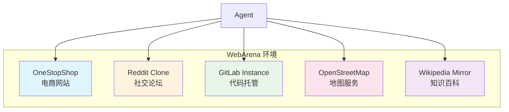

# WebArena：Web Agent 的真实环境测试

## 背景：为什么需要真实 Web 环境

早期的 Web Agent 评测多使用简化的模拟环境或静态网页快照。MiniWoB++ 等基准虽然推动了研究进展，但其任务过于简单（如"点击红色按钮"、"选择下拉菜单中的选项"），与真实网页交互的复杂性相去甚远。真实网页具有动态内容加载、复杂的 DOM 结构、多步骤表单、权限系统、异步操作等特征，这些在简化环境中无法体现。

WebArena [Zhou et al., 2024] 的核心创新在于：构建了一套**自托管的、功能完整的真实网站环境**，让 Agent 在接近生产级别的 Web 应用中执行任务。这些不是模拟器或简化版本，而是真正运行的 Web 应用，具有完整的后端逻辑、数据库和用户系统。

## 环境设计

WebArena 部署了五个功能完整的 Web 应用，覆盖不同类型的网站交互：



**OneStopShop（电商）**：基于 Magento 构建的完整电商平台，包含商品浏览、搜索、购物车、结账、订单管理、用户评价等功能。数据库中预填充了数千个商品、用户评价和订单记录。任务示例："找到评分最高的无线耳机并加入购物车"。

**Reddit Clone（论坛）**：基于 Postmill 的社交论坛，支持发帖、评论、投票、搜索、用户管理、版块订阅等功能。任务示例："在 r/technology 版块发布一篇关于 AI 安全的帖子"。

**GitLab Instance（代码托管）**：完整的 GitLab 实例，支持仓库管理、Issue 跟踪、Merge Request、CI/CD 配置、Wiki 编辑。任务示例："为 project-x 创建一个新的 Issue 并指派给 user-a"。

**OpenStreetMap（地图）**：地图浏览和搜索服务，支持路线规划、地点搜索、标注。任务示例："找到从 Carnegie Mellon University 到 Pittsburgh Airport 的驾车路线"。

**Wikipedia（百科）**：维基百科镜像，支持搜索、浏览、编辑。任务示例："找到 Alan Turing 的出生日期"。

每个环境都有独立的用户账号体系，Agent 需要使用预设的账号登录后才能执行操作。这模拟了真实场景中用户身份验证的需求。

## 任务设计

WebArena 包含 **812 个多样化任务**，按照以下原则设计：

**任务来源**：从真实用户的常见操作中提取，确保任务具有实际意义。每个任务都有明确的自然语言描述和可验证的完成标准。研究团队通过用户调研和网站使用日志分析来确定任务类型。

**难度分布**：任务从简单的信息检索（1-2 步）到复杂的多步骤操作（10+ 步）不等。复杂任务可能需要跨多个页面导航、填写表单、处理动态内容、理解搜索结果并做出判断。

**任务类型分类**：信息检索（"这个商品的价格是多少？"）、内容创建（"发布一篇帖子"）、配置修改（"修改账户设置"）、多步骤操作（"比较两个商品并购买更便宜的那个"）。

**跨站任务**：部分任务需要在多个网站间切换完成，如"在 GitLab 上找到最近的 bug report，然后在 Reddit 上发布讨论帖"。这类任务测试 Agent 的上下文管理和信息传递能力。

## 评测方法

WebArena 采用多种评测方式来判断任务是否完成：

**精确匹配（Exact Match）**：对于有明确答案的信息检索任务，直接比较 Agent 的输出与标准答案。例如"这个商品的价格是多少？"

**模糊匹配（Fuzzy Match）**：允许答案在格式上有所差异，如"$29.99"和"29.99 dollars"应被视为等价。使用字符串相似度和语义等价判断。

**程序化验证（Program-based Verification）**：对于操作类任务，通过检查环境状态变化来判断。例如"将商品加入购物车"——验证购物车中是否确实包含了指定商品。这是最可靠的评测方式，因为它直接检查操作的实际效果。

```python
# 程序化验证示例
def verify_add_to_cart(env, task):
    """验证商品是否被正确加入购物车"""
    cart_items = env.get_cart_contents()
    expected_product = task.target_product
    
    for item in cart_items:
        if item.name == expected_product.name:
            if item.quantity >= task.expected_quantity:
                return True
    return False

def verify_issue_created(env, task):
    """验证 GitLab Issue 是否被正确创建"""
    issues = env.gitlab.get_project_issues(task.project_id)
    for issue in issues:
        if (issue.title == task.expected_title and 
            issue.assignee == task.expected_assignee):
            return True
    return False
```

## Agent 的观察空间

WebArena 中的 Agent 可以通过多种方式"看到"网页：

**Accessibility Tree**：网页的无障碍树结构，提供了页面元素的层次关系和语义信息。这是纯文本 Agent 最常用的观察方式。

**HTML DOM**：原始的 HTML 结构，信息最完整但也最冗长，可能超出模型的上下文窗口。

**Screenshot**：页面截图，适合多模态 Agent。VisualWebArena 主要使用这种方式。

**混合模式**：结合 Accessibility Tree 和 Screenshot，兼顾结构信息和视觉信息。

## VisualWebArena：多模态扩展

VisualWebArena [Koh et al., 2024] 将 WebArena 扩展到多模态场景，新增了需要视觉理解的任务：基于图片内容的搜索（"找到与这张图片相似的商品"）、需要理解页面布局的操作（"点击第二行第三列的商品"）、涉及图表和可视化的信息提取等。

新增了 Classifieds（分类广告）网站环境，包含大量图片内容。总计 **910 个任务**，其中约 30% 需要视觉理解能力。这一扩展反映了真实 Web 使用中视觉信息的重要性。

## 当前 SOTA 表现与挑战

截至 2025 年初，WebArena 上的最佳表现：

| 系统 | 整体成功率 | 特点 |
|------|-----------|------|
| GPT-4o + 专用 Agent | ~35% | 多模态理解 + 结构化操作 |
| Claude 3.5 + Browser Use | ~30% | 长上下文 + 工具调用 |
| 开源模型 Agent | ~15% | 成本低但能力有限 |
| 人类表现 | ~78% | 基准上限 |

与人类 78% 的表现相比，最好的 Agent 系统仍有巨大差距。主要挑战包括：

**长序列决策**：复杂任务需要 10-20 步操作，Agent 容易在中间步骤犯错，且错误会累积。一步走错可能导致后续所有操作失效。

**动态页面理解**：现代网页大量使用 JavaScript 动态渲染，页面状态随交互变化。Agent 需要理解当前页面状态并据此决策，而非依赖对页面的静态理解。

**探索与利用的平衡**：面对不熟悉的网站，Agent 需要在探索（了解网站结构）和利用（执行任务）之间取得平衡。过度探索浪费步数，过早行动可能走错方向。

**错误恢复**：当操作失败时（如点击了错误的按钮、搜索无结果），Agent 需要识别错误并找到恢复路径，而非陷入重复循环。

**上下文管理**：长任务中，Agent 需要记住之前的操作和发现，避免重复劳动。但随着交互历史增长，上下文窗口可能不足。

## 关键洞察：真实网站远比合成环境困难

WebArena 的一个重要发现是：在简化环境中表现良好的方法，迁移到真实网站后性能大幅下降。原因包括：真实网页的 HTML 结构远比模拟环境复杂（一个电商页面可能有数千个 DOM 节点）；真实网站有登录状态、Cookie、Session 等机制；页面加载时间、网络延迟等因素影响交互流程；同一功能在不同网站的实现方式差异巨大；弹窗、广告、动态加载等干扰因素在真实环境中普遍存在。

## WorkArena 与其他 Web 基准

**WorkArena** [Drouin et al., 2024]：基于 ServiceNow 企业平台，评测 Agent 在企业级 SaaS 应用中的操作能力。包含 33 个任务类型，涵盖 IT 服务管理、知识库操作等企业场景。其价值在于测试了 Agent 在复杂企业软件中的操作能力。

**Mind2Web** [Deng et al., 2023]：从 137 个真实网站收集了 2000+ 任务，但使用静态快照而非实时环境。优势是覆盖面广，劣势是无法测试多步骤交互。适合评测单步操作的准确性。

**AssistantBench** [Yoran et al., 2024]：关注开放式 Web 任务，如"找到纽约最便宜的从 A 到 B 的交通方式"，需要 Agent 自主选择使用哪些网站。测试了 Agent 的自主规划能力。

**OSWorld** [Xie et al., 2024]：将评测扩展到整个操作系统环境，Agent 不仅操作浏览器，还可以使用桌面应用、文件系统等。代表了更广泛的计算机使用能力评测。

## 对 Web Agent 产品设计的启示

WebArena 的评测结果对 Web Agent 产品的设计有重要指导意义：

**任务范围限定**：当前技术水平下，Web Agent 最适合处理结构化、步骤明确的任务（如"在某网站上填写表单"、"查询特定信息"）。开放式、探索性的任务（如"找到最优方案"）仍需人工参与。

**人机协作模式**：最有效的产品形态可能不是完全自主的 Agent，而是"Agent 执行 + 人工确认"的协作模式。Agent 完成大部分操作，在关键决策点请求人工确认。

**错误处理设计**：鉴于 Agent 在错误恢复方面的不足，产品应设计完善的回退机制。当 Agent 检测到异常时，应能安全地停止并报告状态，而非继续盲目操作。

**渐进式信任**：产品可以根据任务类型和历史成功率，动态调整 Agent 的自主程度。对于高成功率的简单任务自动执行，对于低成功率的复杂任务请求确认。

## 评测实践建议

对于希望在 WebArena 上评测自己 Agent 的团队，以下是一些实践建议。首先，环境部署需要较高的计算资源（推荐 8 核 CPU、32GB 内存），且初始化数据导入可能需要数小时。其次，建议从单站点任务开始评测，逐步扩展到跨站点任务，以便定位具体的能力瓶颈。最后，关注失败案例的分类分析——区分"理解错误"（Agent 误解了任务意图）和"执行错误"（Agent 理解正确但操作失败）对改进方向至关重要。

## 本章小结

WebArena 通过构建真实的 Web 应用环境，将 Web Agent 评测从玩具级别提升到了接近生产级别。其 35% 左右的 SOTA 成功率表明，自主 Web 操作仍是一个极具挑战性的问题。对于工程师而言，WebArena 的结果意味着：当前的 Web Agent 适合辅助简单、结构化的 Web 操作（如表单填写、信息查询），但对于复杂的多步骤任务仍需人工监督。在产品设计中，应将 Web Agent 定位为"辅助工具"而非"完全自主系统"。

## 延伸阅读

- [Zhou et al., 2024] "WebArena: A Realistic Web Environment for Building Autonomous Agents" — 原始论文
- [Koh et al., 2024] "VisualWebArena: Evaluating Multimodal Agents on Realistic Visual Web Tasks"
- [Drouin et al., 2024] "WorkArena: How Capable Are Web Agents at Solving Common Knowledge Work Tasks?"
- [Deng et al., 2023] "Mind2Web: Towards a Generalist Agent for the Web"
- [Xie et al., 2024] "OSWorld: Benchmarking Multimodal Agents for Open-Ended Tasks in Real Computer Environments"
- 本书 [工具使用](../../05-tool-use/) 章节 — Agent 与外部环境交互的技术细节
