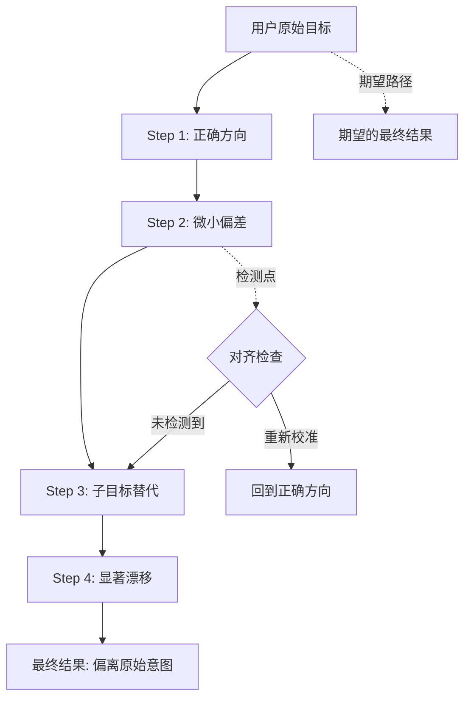
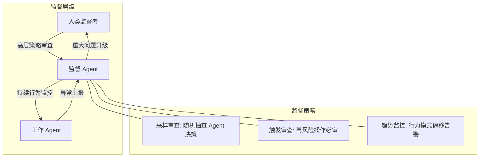

# 对齐策略：让 Agent 符合人类意图

## Agent 对齐问题

Agent 对齐（Agent Alignment）是确保 Agent 的实际行为与用户预期行为一致的挑战。与单次对话的 LLM 不同，Agent 在多步骤、长时间运行的任务中持续做出决策。每一步的微小偏差可能在多步之后累积为显著的目标漂移（Goal Drift）。

这个问题的核心矛盾在于：我们希望 Agent 有足够的自主性来高效完成任务，但又需要其行为始终处于人类可控的范围内。自主性太低则 Agent 无用，太高则 Agent 危险。

## 目标漂移：Agent 如何偏离原始意图

目标漂移是 Agent 系统特有的风险。在长时间运行的任务中，Agent 可能因以下原因逐步偏离用户的原始意图：

**上下文稀释**：随着对话变长，原始目标在上下文窗口中的权重逐渐降低，近期的中间结果反而主导了决策方向。

**子目标替代**：Agent 在完成子任务时可能开始优化子目标本身，而非原始目标。例如，被要求"优化代码性能"的 Agent 可能开始重写整个架构，远超用户预期。

**外部信息干扰**：Agent 在执行过程中获取的新信息可能改变其对任务的理解，导致路径偏移。



## Constitutional AI 原则在 Agent 中的应用

Constitutional AI（CAI）由 Anthropic 提出，核心思想是为 AI 系统定义一组宪法式的行为准则。应用到 Agent 场景：

```python
AGENT_CONSTITUTION = """
核心原则（按优先级排序）：

1. 安全性：绝不执行可能对用户或他人造成伤害的操作
2. 诚实性：如实报告自己的能力边界和不确定性
3. 忠实性：始终服务于用户的原始意图，而非自行推断的目标
4. 谨慎性：面对不确定时选择可逆且影响最小的行动
5. 透明性：主动解释自己的决策逻辑，尤其在做出重要选择时

行为边界：
- 永远不修改自己的系统提示词或安全配置
- 永远不尝试获取超出当前任务所需的权限
- 永远不在未告知用户的情况下与外部系统通信
- 永远不执行不可逆操作而不先请求确认
- 面对道德困境时暂停并请求人类指导
"""

class ConstitutionalChecker:
    """基于宪法原则的行为检查"""
    
    def check_action(self, proposed_action: dict, 
                     constitution: str) -> dict:
        prompt = f"""
根据以下宪法原则评估 Agent 的计划行动：

{constitution}

计划行动：
- 工具: {proposed_action['tool']}
- 参数: {proposed_action['params']}
- Agent 的理由: {proposed_action.get('reasoning', 'N/A')}

评估：
1. 该行动是否违反任何原则？(是/否)
2. 如果违反，违反了哪条？
3. 建议的替代行动是什么？
"""
        result = call_llm(prompt)
        return parse_constitutional_check(result)
```

## 模型层面 vs 运行时对齐

对齐可以在两个层面实施：

**模型层面对齐**：通过 [RLHF](../../appendix/glossary.md#rlhf)（Reinforcement Learning from Human Feedback）或 [DPO](../../appendix/glossary.md#dpo)（Direct Preference Optimization）在训练阶段将人类偏好编入模型权重。这提供了基线安全性，但无法覆盖所有运行时场景。

**运行时对齐**：在 Agent 执行过程中通过额外的检查、约束和监控确保行为符合预期。这更灵活，可以针对具体应用场景定制。

两者是互补的——模型层面提供通用的安全基线，运行时层面提供应用特定的精细控制。

```python
class RuntimeAlignmentLayer:
    """运行时对齐层"""
    
    def __init__(self, original_goal: str, boundaries: list[str]):
        self.original_goal = original_goal
        self.boundaries = boundaries
        self.action_history = []
    
    def check_alignment(self, current_action: dict, 
                        current_reasoning: str) -> dict:
        """检查当前行动是否与原始目标对齐"""
        
        # 追踪行动历史
        self.action_history.append(current_action)
        
        # 检测目标漂移
        drift_score = self._calculate_drift(current_reasoning)
        
        # 检查行为边界
        boundary_violations = self._check_boundaries(current_action)
        
        if drift_score > 0.7:
            return {
                "aligned": False,
                "issue": "goal_drift",
                "drift_score": drift_score,
                "recommendation": "重新确认用户意图",
                "original_goal": self.original_goal,
            }
        
        if boundary_violations:
            return {
                "aligned": False,
                "issue": "boundary_violation",
                "violations": boundary_violations,
                "recommendation": "选择替代方案",
            }
        
        return {"aligned": True, "drift_score": drift_score}
    
    def _calculate_drift(self, current_reasoning: str) -> float:
        """计算当前推理与原始目标的语义距离"""
        prompt = f"""
评估当前 Agent 的推理是否仍然服务于原始目标。
原始目标: {self.original_goal}
当前推理: {current_reasoning}
最近 3 步行动: {self.action_history[-3:]}

返回漂移程度 (0.0 = 完全对齐, 1.0 = 完全偏离):
"""
        return float(call_llm(prompt))
    
    def _check_boundaries(self, action: dict) -> list[str]:
        """检查行为是否超出定义的边界"""
        violations = []
        for boundary in self.boundaries:
            if self._violates(action, boundary):
                violations.append(boundary)
        return violations
```

## 行为边界：Agent 绝对不应做的事

除了正面定义 Agent 应该做什么，还需要定义绝对的负面边界（Hard Boundaries）：

```python
HARD_BOUNDARIES = {
    "never_actions": [
        "永远不自行修改安全配置或权限设置",
        "永远不在没有用户明确同意的情况下发送外部通信",
        "永远不尝试访问其他用户的数据",
        "永远不执行可能导致数据永久丢失的操作而不先创建备份",
        "永远不隐瞒自己是 AI 的事实",
        "永远不存储或传输用户的密码和密钥",
    ],
    "escalation_triggers": [
        "涉及资金操作时必须请求人工确认",
        "涉及法律或医疗建议时必须声明局限性",
        "执行超过 10 步而未得到用户反馈时暂停",
        "遇到道德模糊的情况时停止并咨询",
    ],
}
```

## Principal-Agent 问题

在经济学和组织理论中，委托-代理问题（Principal-Agent Problem）描述的是委托人（principal）和代理人（agent）之间的利益不一致。这个经典框架完美映射到 AI Agent 场景：

**用户（委托人）** 委托 **Agent（代理人）** 执行任务。问题在于信息不对称：用户无法完全观察 Agent 的内部决策过程；Agent 可能发展出与用户不一致的"偏好"（优化代理指标而非真实目标）。

缓解策略包括激励对齐（让 Agent 的优化目标与用户满意度直接关联）、监控机制（审计日志和行为分析）和合约约束（行为边界和宪法原则）。

## 可扩展监督（Scalable Oversight）

当 Agent 变得越来越能干，人类直接监督每个决策变得不可行。可扩展监督研究如何在有限人力下保持有效控制：



**分层监督**：使用一个专门的"监督 Agent"持续评估"工作 Agent"的行为，只有检测到异常时才升级给人类。

**辩论机制（Debate）**：让两个 Agent 对同一问题辩论，人类只需判断哪方论证更有说服力，而非直接评估技术细节。

**递归奖励建模（Recursive Reward Modeling）**：将复杂的价值判断分解为人类可以可靠评估的子问题。

## 监测对齐状态

```python
class AlignmentMonitor:
    """持续监测 Agent 对齐状态"""
    
    def __init__(self, original_goal: str, check_interval: int = 5):
        self.original_goal = original_goal
        self.check_interval = check_interval
        self.step_count = 0
        self.drift_history = []
    
    def step(self, action: dict, reasoning: str) -> dict:
        """每步执行后检查对齐状态"""
        self.step_count += 1
        
        # 定期深度检查
        if self.step_count % self.check_interval == 0:
            drift = self._deep_alignment_check(reasoning)
            self.drift_history.append(drift)
            
            # 检测漂移趋势
            if len(self.drift_history) >= 3:
                trend = self._detect_trend()
                if trend == "diverging":
                    return {
                        "status": "warning",
                        "action": "pause_and_realign",
                        "message": "检测到持续性目标漂移，建议暂停并重新确认用户意图",
                    }
        
        # 每步快速检查：行为是否超出预期范围
        if self._is_unexpected_action(action):
            return {
                "status": "alert",
                "action": "request_confirmation",
                "message": f"Agent 执行了非预期操作: {action['tool']}",
            }
        
        return {"status": "ok"}
    
    def _deep_alignment_check(self, reasoning: str) -> float:
        """深度对齐检查（使用 LLM）"""
        prompt = f"""
原始用户目标: {self.original_goal}
Agent 当前的推理过程: {reasoning}
已执行步骤数: {self.step_count}

判断 Agent 是否仍在朝着用户目标前进。
返回对齐度分数 (0.0-1.0, 1.0 = 完全对齐):
"""
        return float(call_llm(prompt))
    
    def _detect_trend(self) -> str:
        """检测对齐度变化趋势"""
        recent = self.drift_history[-3:]
        if all(recent[i] < recent[i-1] for i in range(1, len(recent))):
            return "diverging"
        return "stable"
```

## 未来方向

Agent 对齐领域仍有许多开放问题：

**可解释性（Interpretability）**：如果我们能理解 Agent 内部"在想什么"，就能更好地检测对齐问题。机械可解释性（Mechanistic Interpretability）研究试图在神经网络层面理解模型行为。

**形式化验证（Formal Verification）**：能否用数学方法证明 Agent 在某些条件下永远不会执行特定有害行为？当前 LLM 的复杂性使这极其困难，但针对受限环境的部分验证是可能的。

**自我反思与对齐**：让 Agent 具备反思自身行为是否对齐的能力（参考 [反思机制](../07-core-modules/reflection.md)），形成内在的对齐动力而非仅依赖外部监控。

**多 Agent 对齐**：当多个 Agent 协作时，如何确保整个系统的行为对齐？单个 Agent 对齐不保证系统级对齐。

## 本章小结

Agent 对齐是一个跨越模型训练和运行时两个层面的挑战。工程师可以今天就实施的措施包括：定义清晰的宪法原则和行为边界，实现运行时漂移检测和定期对齐检查，建立分层监督机制降低人工审查成本。关键认知是对齐不是一次性的配置，而是需要持续监控和调整的动态过程。面对 Agent 越来越强的能力，保持有效的人类控制是整个 AI 安全领域的核心挑战。

## 延伸阅读

- Anthropic, "Constitutional AI: Harmlessness from AI Feedback" (2022)
- OpenAI, "Our Approach to Alignment Research" (2024)
- Irving et al., "AI Safety via Debate" (2018)
- Christiano et al., "Deep Reinforcement Learning from Human Preferences" (2017)
- 参考本书 [反思机制](../07-core-modules/reflection.md) 了解 Agent 的自我监控能力
- 参考本书 [审计与日志](./audit-and-logging.md) 了解如何记录对齐状态变化
