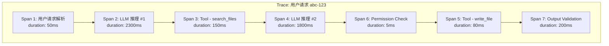
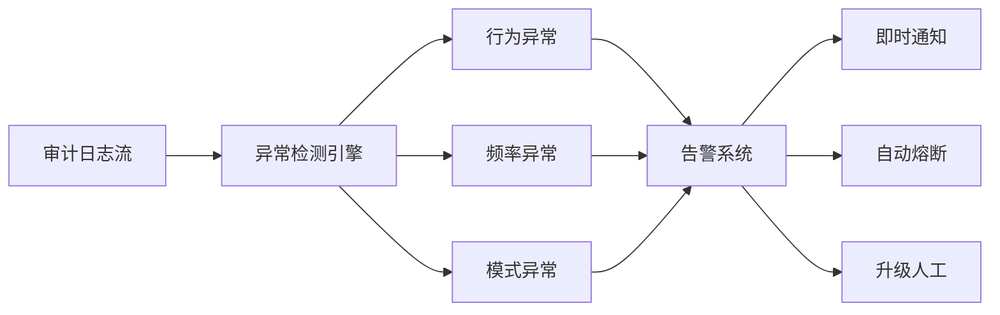

# 审计与日志：Agent 行为的可追溯性

## 为什么审计日志至关重要

Agent 系统的非确定性特征使得审计日志不再是可有可无的附属功能，而是核心安全基础设施。传统软件的代码路径可预测，出了问题可以通过代码审查定位原因。Agent 的行为路径在每次执行时都可能不同，没有完整的行为记录，事后分析几乎不可能。

审计日志服务三个核心目的：**问责（Accountability）**——谁让 Agent 做了什么、Agent 实际做了什么；**调试（Debugging）**——Agent 为什么做出了某个决策；**合规（Compliance）**——满足数据保护和行业监管要求。

## 应该记录什么

Agent 系统的日志粒度应覆盖完整的决策链路：

```python
from dataclasses import dataclass, field
from datetime import datetime
from typing import Optional, Any
from enum import Enum

class EventType(Enum):
    LLM_CALL = "llm_call"
    TOOL_INVOCATION = "tool_invocation"
    DECISION = "decision"
    STATE_CHANGE = "state_change"
    PERMISSION_CHECK = "permission_check"
    VALIDATION_RESULT = "validation_result"
    ERROR = "error"
    USER_INTERACTION = "user_interaction"

@dataclass
class AuditEvent:
    """审计事件基础结构"""
    event_id: str
    trace_id: str              # 关联同一任务的所有事件
    span_id: str               # 当前操作的唯一标识
    parent_span_id: Optional[str] = None  # 父操作（构成调用树）
    event_type: EventType = EventType.LLM_CALL
    timestamp: datetime = field(default_factory=datetime.utcnow)
    
    # 上下文信息
    user_id: str = ""
    session_id: str = ""
    agent_id: str = ""
    
    # 事件详情
    action: str = ""           # 具体操作名称
    input_data: dict = field(default_factory=dict)
    output_data: dict = field(default_factory=dict)
    metadata: dict = field(default_factory=dict)
    
    # 安全相关
    permission_level: str = ""
    risk_score: float = 0.0
    validation_passed: bool = True
    
    # 性能指标
    duration_ms: float = 0.0
    token_usage: dict = field(default_factory=dict)
```

### 关键事件类型详解

**LLM 调用日志**：记录每次模型调用的提示词（可脱敏）、完成结果、token 用量、延迟和模型版本。

**工具调用日志**：记录工具名称、输入参数、返回结果、执行时间和成功/失败状态。

**决策日志**：记录 Agent 在多个可选行动中为什么选择了特定路径。

**状态变化日志**：记录记忆更新、会话状态改变等系统内部变化。

## 结构化日志格式

```python
import json
import uuid
from contextlib import contextmanager

class AgentLogger:
    """Agent 专用结构化日志器"""
    
    def __init__(self, agent_id: str, storage_backend):
        self.agent_id = agent_id
        self.storage = storage_backend
    
    @contextmanager
    def trace(self, user_id: str, session_id: str):
        """创建一个追踪上下文，关联所有子事件"""
        trace_id = str(uuid.uuid4())
        context = TraceContext(
            trace_id=trace_id,
            user_id=user_id,
            session_id=session_id,
            agent_id=self.agent_id,
        )
        try:
            yield context
        finally:
            context.finalize()
            self.storage.flush(context)
    
    def log_llm_call(self, context, prompt_hash: str, 
                     response: str, usage: dict, duration_ms: float):
        """记录 LLM 调用"""
        event = AuditEvent(
            event_id=str(uuid.uuid4()),
            trace_id=context.trace_id,
            span_id=str(uuid.uuid4()),
            parent_span_id=context.current_span_id,
            event_type=EventType.LLM_CALL,
            user_id=context.user_id,
            session_id=context.session_id,
            agent_id=self.agent_id,
            action="llm_inference",
            input_data={"prompt_hash": prompt_hash},
            output_data={"response_preview": response[:200]},
            token_usage=usage,
            duration_ms=duration_ms,
        )
        self.storage.append(event)
    
    def log_tool_call(self, context, tool_name: str,
                      params: dict, result: Any, 
                      duration_ms: float, success: bool):
        """记录工具调用"""
        event = AuditEvent(
            event_id=str(uuid.uuid4()),
            trace_id=context.trace_id,
            span_id=str(uuid.uuid4()),
            parent_span_id=context.current_span_id,
            event_type=EventType.TOOL_INVOCATION,
            user_id=context.user_id,
            session_id=context.session_id,
            agent_id=self.agent_id,
            action=f"tool:{tool_name}",
            input_data=self._sanitize_params(params),
            output_data={"success": success, "preview": str(result)[:500]},
            duration_ms=duration_ms,
            validation_passed=success,
        )
        self.storage.append(event)
    
    def log_permission_check(self, context, tool_name: str,
                             permission_level: str, granted: bool):
        """记录权限检查结果"""
        event = AuditEvent(
            event_id=str(uuid.uuid4()),
            trace_id=context.trace_id,
            span_id=str(uuid.uuid4()),
            parent_span_id=context.current_span_id,
            event_type=EventType.PERMISSION_CHECK,
            user_id=context.user_id,
            session_id=context.session_id,
            agent_id=self.agent_id,
            action=f"permission_check:{tool_name}",
            permission_level=permission_level,
            validation_passed=granted,
            metadata={"decision": "granted" if granted else "denied"},
        )
        self.storage.append(event)
    
    def _sanitize_params(self, params: dict) -> dict:
        """脱敏处理参数中的敏感信息"""
        sanitized = {}
        sensitive_keys = {"password", "token", "secret", "key", "credential"}
        for k, v in params.items():
            if any(s in k.lower() for s in sensitive_keys):
                sanitized[k] = "[REDACTED]"
            else:
                sanitized[k] = v
        return sanitized
```

## Trace 格式：父子 Span 与关联 ID

Agent 的行为天然具有层级结构——一个用户请求触发多次 LLM 调用，每次调用可能触发多次工具执行。使用分布式追踪（Distributed Tracing）的 Span 模型表达这种层级关系：



## 存储：追加日志与防篡改

审计日志必须是追加写入（Append-Only）的，防止事后篡改：

```python
import hashlib
import json
from datetime import datetime

class TamperProofStorage:
    """防篡改审计日志存储"""
    
    def __init__(self, storage_path: str):
        self.storage_path = storage_path
        self.last_hash = "0" * 64  # 创世区块哈希
    
    def append(self, event: AuditEvent):
        """追加事件并计算链式哈希"""
        event_json = json.dumps(event.__dict__, default=str, sort_keys=True)
        
        # 链式哈希：每条记录包含前一条的哈希
        chain_data = f"{self.last_hash}|{event_json}"
        current_hash = hashlib.sha256(chain_data.encode()).hexdigest()
        
        record = {
            "event": event.__dict__,
            "previous_hash": self.last_hash,
            "current_hash": current_hash,
            "recorded_at": datetime.utcnow().isoformat(),
        }
        
        # 追加写入（不支持修改或删除）
        with open(self.storage_path, "a") as f:
            f.write(json.dumps(record, default=str) + "\n")
        
        self.last_hash = current_hash
    
    def verify_integrity(self) -> bool:
        """验证日志链完整性 - 逐条校验哈希链"""
        prev_hash = "0" * 64
        with open(self.storage_path, "r") as f:
            for line in f:
                record = json.loads(line)
                if record["previous_hash"] != prev_hash:
                    return False
                prev_hash = record["current_hash"]
        return True
```

## 合规考量

### GDPR 相关

Agent 系统处理欧盟用户数据时需要考虑：日志中包含的个人数据必须支持删除请求（Right to Erasure）；用户有权获取 Agent 关于他们的所有决策记录（Right to Access）；自动化决策需要提供可解释性。

实践中的矛盾是：安全审计要求保留完整记录，而 GDPR 要求可删除。解决方案是将可标识数据（PII）与审计元数据分离存储，对 PII 存储支持删除，对审计元数据保留但脱敏。

### SOC 2 相关

如果 Agent 系统面向企业客户，SOC 2 合规要求包括：所有系统访问有日志记录、定期审查访问日志、异常行为告警、日志保留策略文档化。

## 保留策略与数据生命周期

推荐的分层保留策略：热存储（Elasticsearch，7 天，用于实时查询和告警）、温存储（对象存储，90 天，用于事件调查和审计）、冷存储（归档存储，365 天，用于合规保留）。PII 数据应分离到加密存储中，保留 30 天并支持删除请求。

## 可观测性工具生态

当前 Agent 可观测性领域的主要工具：

**LangSmith（LangChain）**：提供 LLM 调用追踪、评估和调试，与 LangChain/LangGraph 深度集成。

**Braintrust**：专注于 LLM 应用的评估和监控，支持 A/B 测试和回归检测。

**Arize Phoenix**：开源的 LLM 可观测性平台，支持 Trace 可视化和嵌入分析。

**OpenTelemetry + 自定义方案**：使用标准 OTEL SDK，自定义 Agent 相关的 Span 属性和指标。

## 异常检测与告警



需要监控的异常信号包括：工具调用频率突增（正常速率的 3 倍以上）、权限被拒绝次数过多（可能在尝试权限探测攻击）、Token 消耗接近预算上限、Agent 执行了之前从未使用过的工具组合、以及单次任务的步骤数异常多（可能陷入循环）。

```python
class AnomalyDetector:
    """Agent 行为异常检测 - 核心检查逻辑"""
    
    RULES = [
        {"type": "rate_spike", "condition": "tool_calls > normal_rate * 3",
         "severity": "high"},
        {"type": "permission_probing", "condition": "denied_count > 5",
         "severity": "critical"},
        {"type": "token_budget", "condition": "usage > budget * 0.8",
         "severity": "medium"},
        {"type": "infinite_loop", "condition": "steps > max_steps",
         "severity": "high"},
    ]
    
    def check(self, events: list[AuditEvent]) -> list[dict]:
        """基于规则引擎检测异常并返回告警列表"""
        alerts = []
        for rule in self.RULES:
            if self._evaluate_rule(rule, events):
                alerts.append({"type": rule["type"], 
                              "severity": rule["severity"]})
        return alerts
```

## 本章小结

审计日志是 Agent 安全体系中唯一能提供事后分析能力的组件。通过结构化记录 Agent 的每个决策和行动，配合链式哈希保证日志完整性，结合异常检测实现实时告警，工程师可以在问题发生时快速定位原因、评估影响范围、并改进防御策略。日志系统的设计需要平衡记录完整性与隐私合规要求，将可标识数据与审计元数据分离是推荐的实践方案。

## 延伸阅读

- OpenTelemetry Documentation - Distributed Tracing
- LangSmith Documentation (docs.smith.langchain.com)
- GDPR Article 22: Automated Individual Decision-Making
- SOC 2 Type II - Trust Services Criteria
- 参考本书 [权限控制](./permission-control.md) 了解权限检查如何产生审计事件
- 参考本书 [Agent 核心模块 - 反思](../07-core-modules/reflection.md) 了解 Agent 如何利用日志进行自我改进
