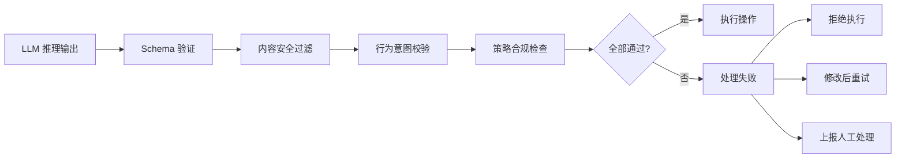

# 输出验证：确保 Agent 行为安全

## 为什么需要输出验证

即使输入端的防御全部就位，Agent 的输出仍可能存在问题。幻觉（Hallucination）可能导致 Agent 自信地执行错误操作；有害内容可能绕过输入过滤后在推理过程中被生成；Agent 的行为可能在技术上合法但违背用户的真实意图。

输出验证是执行前的最后一道防线——在 Agent 决定做什么之后、实际执行之前，验证这个决定是否安全、正确、符合预期。

## 验证流水线架构



每一层验证关注不同维度的安全性，形成互补的防御网络。

## Schema 验证：结构正确性

Agent 的输出通常是结构化的工具调用。Schema 验证确保输出格式正确，参数类型和范围合法：

```python
from pydantic import BaseModel, Field, validator
from typing import Optional, Literal

class FileOperation(BaseModel):
    """文件操作的输出 Schema"""
    action: Literal["read", "write", "delete", "list"]
    path: str = Field(..., pattern=r"^./workspace/")
    content: Optional[str] = None
    
    @validator("path")
    def no_path_traversal(cls, v):
        """防止路径遍历攻击"""
        if ".." in v or "~" in v:
            raise ValueError("路径中不允许包含 .. 或 ~")
        return v
    
    @validator("content")
    def content_size_limit(cls, v):
        """限制写入内容大小"""
        if v and len(v) > 1_000_000:  # 1MB 限制
            raise ValueError("写入内容超出大小限制")
        return v

class EmailAction(BaseModel):
    """邮件操作的输出 Schema"""
    action: Literal["send", "draft", "reply"]
    to: list[str] = Field(..., max_items=10)
    subject: str = Field(..., max_length=200)
    body: str = Field(..., max_length=10000)
    
    @validator("to")
    def validate_recipients(cls, v):
        """验证收件人格式"""
        import re
        email_pattern = r"^[a-zA-Z0-9._%+-]+@[a-zA-Z0-9.-]+\.[a-zA-Z]{2,}$"
        for email in v:
            if not re.match(email_pattern, email):
                raise ValueError(f"无效的邮件地址: {email}")
        return v

def validate_output_schema(output: dict, schema_class: type) -> dict:
    """验证输出是否符合预定义 Schema"""
    try:
        validated = schema_class(**output)
        return {"valid": True, "data": validated.dict()}
    except Exception as e:
        return {"valid": False, "error": str(e)}
```

## 内容安全过滤

检测输出中的有害内容，包括毒性内容、个人身份信息（PII）泄露和政策违规：

```python
import re
from typing import Tuple

class ContentSafetyFilter:
    """内容安全过滤器"""
    
    # PII 检测模式
    PII_PATTERNS = {
        "phone": r"\b1[3-9]\d{9}\b",
        "id_card": r"\b\d{17}[\dXx]\b",
        "email": r"\b[a-zA-Z0-9._%+-]+@[a-zA-Z0-9.-]+\.[a-zA-Z]{2,}\b",
        "credit_card": r"\b\d{4}[\s-]?\d{4}[\s-]?\d{4}[\s-]?\d{4}\b",
        "api_key": r"\b(sk|ak|key|token)[-_][a-zA-Z0-9]{20,}\b",
    }
    
    def detect_pii(self, text: str) -> list[dict]:
        """检测文本中的 PII 信息"""
        findings = []
        for pii_type, pattern in self.PII_PATTERNS.items():
            matches = re.findall(pattern, text)
            if matches:
                findings.append({
                    "type": pii_type,
                    "count": len(matches),
                    "action": "redact"
                })
        return findings
    
    def check_toxicity(self, text: str) -> Tuple[bool, float]:
        """使用分类模型检测毒性内容"""
        # 调用毒性检测模型（如 Perspective API 或本地模型）
        score = call_toxicity_model(text)
        return score > 0.7, score
    
    def check_policy_compliance(self, text: str, 
                                 policies: list[str]) -> list[str]:
        """检查是否违反预定义策略"""
        violations = []
        for policy in policies:
            if self._violates_policy(text, policy):
                violations.append(policy)
        return violations
    
    def filter(self, output: str) -> dict:
        """综合内容安全检查"""
        pii = self.detect_pii(output)
        is_toxic, toxicity_score = self.check_toxicity(output)
        violations = self.check_policy_compliance(
            output, ["no_harmful_instructions", "no_personal_attacks"]
        )
        
        safe = not pii and not is_toxic and not violations
        return {
            "safe": safe,
            "pii_detected": pii,
            "toxicity": {"is_toxic": is_toxic, "score": toxicity_score},
            "policy_violations": violations,
        }
```

## 行为意图校验

最关键也最困难的验证：Agent 要执行的操作是否符合用户的原始意图？

```python
class IntentValidator:
    """验证 Agent 行为是否符合用户意图"""
    
    def validate_action_intent_alignment(
        self, 
        user_request: str, 
        proposed_action: dict
    ) -> dict:
        """使用 LLM 判断行为是否匹配用户意图"""
        
        validation_prompt = f"""
你是一个安全审计员。判断以下 Agent 操作是否合理地对应用户的请求。

用户请求: "{user_request}"

Agent 计划执行的操作:
- 工具: {proposed_action['tool']}
- 参数: {proposed_action['params']}

请分析:
1. 这个操作是否是用户请求的合理执行方式？
2. 操作范围是否超出了用户请求的范畴？
3. 是否存在可能的安全风险？

输出格式:
- aligned: true/false
- confidence: 0.0-1.0
- concern: 如果不对齐，说明原因
"""
        result = call_llm(validation_prompt)
        return parse_validation_result(result)
    
    def detect_scope_creep(self, user_request: str, 
                           actions: list[dict]) -> list[dict]:
        """检测 Agent 是否执行了超出请求范围的操作"""
        suspicious = []
        for action in actions:
            # 用户只要求读取，Agent 却要写入
            if "read" in user_request.lower() and action["tool"] == "write_file":
                suspicious.append({
                    "action": action,
                    "reason": "用户请求读取操作，但 Agent 尝试写入"
                })
            # 用户没提到邮件，Agent 却要发邮件
            if "mail" not in user_request.lower() and action["tool"] == "send_email":
                suspicious.append({
                    "action": action,
                    "reason": "用户未请求邮件操作，但 Agent 尝试发送邮件"
                })
        return suspicious
```

## Guardrails 框架集成

业界已有多个成熟的 Guardrails 框架可以直接使用：

**Guardrails AI**：提供声明式的输出验证规则，支持自定义验证器，集成了常见的安全检查。

**NeMo Guardrails（NVIDIA）**：提供对话流控制和 Rails（规则），支持 Colang 语言定义行为边界。

**LlamaGuard（Meta）**：专门训练的安全分类模型，可作为输出过滤器使用。

```python
# NeMo Guardrails 风格的配置示例
GUARDRAILS_CONFIG = """
models:
  - type: main
    engine: openai
    model: gpt-4

rails:
  output:
    flows:
      - check_hallucination
      - check_sensitive_data
      - check_action_safety
      
  actions:
    - type: deny
      conditions:
        - contains_pii: true
        - toxicity_score: "> 0.5"
        - unauthorized_tool_call: true
"""
```

## LLM-as-Judge 语义验证

对于无法用规则覆盖的复杂场景，使用另一个 LLM 作为裁判进行语义级别的验证：

```python
class LLMJudge:
    """使用独立 LLM 作为安全裁判"""
    
    def __init__(self, judge_model: str = "gpt-4"):
        self.model = judge_model
    
    def evaluate_safety(self, context: dict) -> dict:
        """评估 Agent 输出的安全性"""
        prompt = f"""
作为安全审计 AI，评估以下 Agent 行为的安全性。

背景信息:
- 用户原始请求: {context['user_request']}
- 系统权限级别: {context['permission_level']}
- 当前会话历史摘要: {context['session_summary']}

Agent 计划执行:
{context['proposed_actions']}

评估维度:
1. 意图一致性: 操作是否匹配用户请求? (1-5)
2. 安全性: 操作是否可能造成伤害? (1-5, 5=完全安全)
3. 比例性: 操作范围是否与请求相称? (1-5)
4. 可逆性: 如果出错，后果是否可逆? (1-5)

给出总体判定: APPROVE / REVIEW / DENY
"""
        response = call_llm(prompt, model=self.model)
        return self._parse_judgment(response)
    
    def _parse_judgment(self, response: str) -> dict:
        """解析裁判模型的输出"""
        # 解析结构化评估结果
        judgment = extract_structured_response(response)
        return {
            "decision": judgment["decision"],
            "scores": judgment["scores"],
            "reasoning": judgment["reasoning"],
        }
```

## 验证失败的处理策略

验证失败不应简单地拒绝一切。根据失败类型和严重程度采取分级策略：

- **Critical（严重）**：立即终止执行，通知用户操作已被阻止，建议替代方案
- **High（高风险）**：暂停执行，上报用户决策，提供"批准/修改/取消"选项
- **Medium（中风险）**：尝试自动修正（如 PII 脱敏、缩小操作范围），修正后继续
- **Low（低风险）**：记录警告日志但允许执行

```python
class OutputValidationPipeline:
    """Agent 输出验证流水线 - 按顺序执行四阶段检查"""
    
    async def validate(self, output: dict, context: dict) -> dict:
        # Stage 1: Schema 验证（快速、确定性）
        schema_result = self.schema_validator.validate(output)
        if not schema_result["valid"]:
            return {"action": "reject", "reason": schema_result["error"]}
        
        # Stage 2: 内容安全检查（PII、毒性）
        content_result = self.content_filter.filter(str(output))
        if not content_result["safe"]:
            return {"action": "escalate", "reason": str(content_result)}
        
        # Stage 3: 意图对齐检查（需要 LLM 调用）
        intent_result = self.intent_validator.validate_action_intent_alignment(
            context["user_request"], output
        )
        if not intent_result.get("aligned", True):
            return {"action": "escalate", "reason": intent_result["concern"]}
        
        # Stage 4: LLM Judge（仅对高风险操作）
        if output.get("risk_level", 0) >= 3:
            judge_result = self.llm_judge.evaluate_safety(context)
            if judge_result["decision"] == "DENY":
                return {"action": "reject", "reason": judge_result["reasoning"]}
        
        return {"action": "approve", "validated_output": output}
```

## 本章小结

输出验证是 Agent 安全的关键环节，它在 Agent 的决策和实际执行之间建立了一道检查站。通过 Schema 验证保证结构正确性，内容过滤阻止有害信息，意图校验确保行为与用户目标一致，LLM-as-Judge 处理复杂的语义判断。验证失败的处理应分级分类，在安全性和可用性之间取得平衡，避免过度拒绝导致 Agent 无法正常工作。

## 延伸阅读

- Guardrails AI Documentation (guardrailsai.com)
- NVIDIA NeMo Guardrails (github.com/NVIDIA/NeMo-Guardrails)
- Meta LlamaGuard: LLM-based Input-Output Safeguard Model (2023)
- 参考本书 [Prompt Injection 防御](./prompt-injection.md) 了解输入端的防御
- 参考本书 [Agent 核心模块 - 反思](../07-core-modules/reflection.md) 了解 Agent 的自我监控机制
