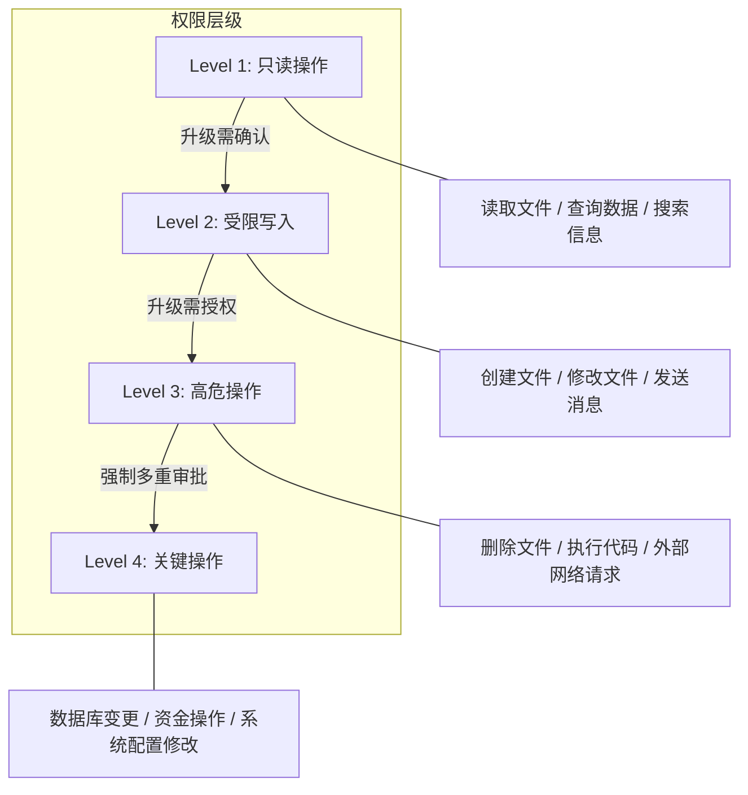
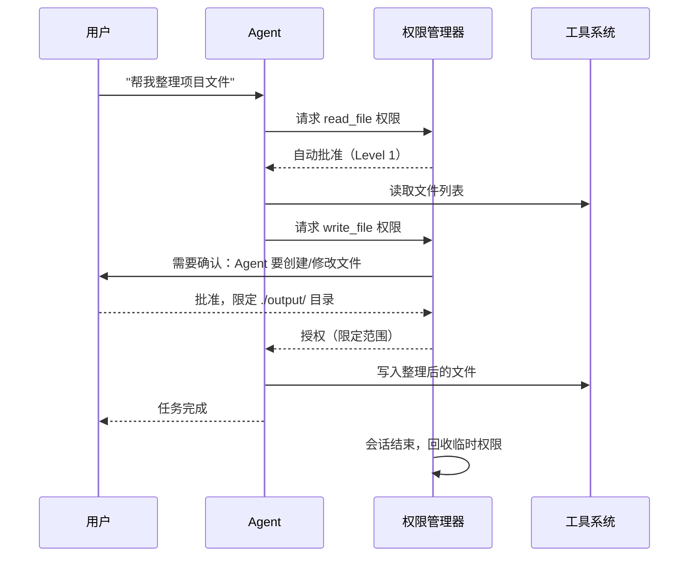

# 权限控制：最小权限原则的实践

## 为什么 Agent 需要权限控制

一个拥有所有工具、所有文件系统访问权、所有网络权限的 Agent，就像一个拥有 root 权限的程序在处理不可信输入。最小权限原则（Principle of Least Privilege）要求：Agent 在任何时刻只应拥有完成当前任务所必需的最小权限集合。

这不仅是防止恶意攻击——即使 Agent 只是产生了幻觉（hallucination）导致的错误工具调用，权限控制也能限制错误的影响范围。一个只有读文件权限的 Agent，即使被注入也无法删除数据。

## 权限层级模型



**Level 1 只读操作**：最安全的操作类别，Agent 可以自由执行无需额外确认。包括读取文件内容、搜索信息、查询数据库 SELECT 语句、列出目录结构。

**Level 2 受限写入**：可产生影响但通常可逆的操作。建议首次执行时要求用户确认。包括创建新文件、修改有版本控制的文件、发送非关键消息。

**Level 3 高危操作**：可能产生不可逆影响的操作，应始终要求明确授权。包括删除文件或数据、执行任意代码、发起外部网络请求。

**Level 4 关键操作**：涉及资金、核心数据或系统安全的操作，需要多重审批。包括数据库 DDL/DML 操作、支付和转账、修改系统安全配置。

## 工具级权限管理

每个工具应定义明确的权限声明（Permission Declaration），包括所需的最低权限级别和可访问的资源范围：

```python
from dataclasses import dataclass, field
from enum import Enum
from typing import Optional

class PermissionLevel(Enum):
    READ_ONLY = 1
    WRITE_LIMITED = 2
    HIGH_RISK = 3
    CRITICAL = 4

@dataclass
class ToolPermission:
    """工具权限声明"""
    tool_name: str
    level: PermissionLevel
    allowed_paths: list[str] = field(default_factory=list)
    allowed_hosts: list[str] = field(default_factory=list)
    rate_limit: Optional[int] = None  # 每分钟最大调用次数
    requires_confirmation: bool = False
    description: str = ""

# 权限配置示例
TOOL_PERMISSIONS = {
    "read_file": ToolPermission(
        tool_name="read_file",
        level=PermissionLevel.READ_ONLY,
        allowed_paths=["./workspace/", "./docs/"],
        description="读取工作区内的文件"
    ),
    "write_file": ToolPermission(
        tool_name="write_file",
        level=PermissionLevel.WRITE_LIMITED,
        allowed_paths=["./workspace/output/"],
        requires_confirmation=True,
        description="在输出目录创建或修改文件"
    ),
    "execute_code": ToolPermission(
        tool_name="execute_code",
        level=PermissionLevel.HIGH_RISK,
        rate_limit=10,
        requires_confirmation=True,
        description="在沙箱中执行代码"
    ),
    "database_query": ToolPermission(
        tool_name="database_query",
        level=PermissionLevel.CRITICAL,
        requires_confirmation=True,
        rate_limit=5,
        description="执行数据库操作"
    ),
}
```

## 范围限制（Scope Restrictions）

权限不仅是"能否使用某工具"，还包括"使用时的参数范围"：

```python
class ScopeValidator:
    """验证工具调用参数是否在允许范围内"""
    
    def validate_file_path(self, path: str, allowed_paths: list[str]) -> bool:
        """验证文件路径是否在允许范围内"""
        import os
        real_path = os.path.realpath(path)
        for allowed in allowed_paths:
            allowed_real = os.path.realpath(allowed)
            if real_path.startswith(allowed_real):
                return True
        return False
    
    def validate_network_access(self, url: str, allowed_hosts: list[str]) -> bool:
        """验证网络请求目标是否在白名单内"""
        from urllib.parse import urlparse
        host = urlparse(url).hostname
        return host in allowed_hosts
    
    def validate_rate_limit(self, tool_name: str, 
                            rate_limit: int, call_history: dict) -> bool:
        """验证调用频率是否超限"""
        import time
        now = time.time()
        recent_calls = [
            t for t in call_history.get(tool_name, [])
            if now - t < 60  # 60秒窗口
        ]
        return len(recent_calls) < rate_limit
```

## 用户委托权限（User-Delegated Permissions）

Agent 的权限来源于用户的委托。用户可以在会话开始时声明授权范围，Agent 不应超越这个范围：

```python
@dataclass
class UserSession:
    """用户会话权限上下文"""
    user_id: str
    granted_tools: list[str]
    granted_paths: list[str]
    max_permission_level: PermissionLevel
    auto_approve_level: PermissionLevel  # 低于此级别自动批准
    session_budget: float = 10.0  # 本次会话的 token 预算（美元）
    
    def can_use_tool(self, tool_name: str) -> bool:
        return tool_name in self.granted_tools
    
    def needs_approval(self, level: PermissionLevel) -> bool:
        return level.value > self.auto_approve_level.value

# 使用示例
session = UserSession(
    user_id="user_123",
    granted_tools=["read_file", "write_file", "search"],
    granted_paths=["./my-project/"],
    max_permission_level=PermissionLevel.WRITE_LIMITED,
    auto_approve_level=PermissionLevel.READ_ONLY,
)
```

## 审批门控（Approval Gates）

对于高风险操作，Agent 应暂停执行并请求用户确认：

```python
class ApprovalGate:
    """高风险操作的审批门控"""
    
    async def request_approval(self, action: dict, context: dict) -> bool:
        """请求用户批准高风险操作"""
        approval_request = {
            "action": action["tool_name"],
            "parameters": action["params"],
            "risk_level": action["risk_level"],
            "reason": self._explain_risk(action),
            "reversible": action.get("reversible", False),
        }
        
        # 展示给用户并等待确认
        user_response = await self._prompt_user(approval_request)
        
        # 记录审批决策（用于审计）
        self._log_approval_decision(approval_request, user_response)
        
        return user_response.approved
    
    def _explain_risk(self, action: dict) -> str:
        """生成人类可读的风险说明"""
        explanations = {
            "delete_file": f"将永久删除文件: {action['params']['path']}",
            "send_email": f"将发送邮件至: {action['params']['to']}",
            "execute_sql": f"将执行 SQL: {action['params']['query'][:100]}...",
        }
        return explanations.get(action["tool_name"], "执行高风险操作")
```

## 权限检查中间件

将权限检查封装为中间件，在每次工具调用前自动执行：

```python
class PermissionMiddleware:
    """工具调用权限检查中间件"""
    
    def __init__(self, session: UserSession, permissions: dict, 
                 approval_gate: ApprovalGate):
        self.session = session
        self.permissions = permissions
        self.approval_gate = approval_gate
        self.call_history: dict = {}
    
    async def check_and_execute(self, tool_call: dict) -> dict:
        """检查权限并执行工具调用"""
        tool_name = tool_call["name"]
        params = tool_call["params"]
        
        # Step 1: 检查工具是否在用户授权范围内
        if not self.session.can_use_tool(tool_name):
            return {"error": f"工具 {tool_name} 未被授权使用"}
        
        # Step 2: 获取工具权限声明
        permission = self.permissions.get(tool_name)
        if not permission:
            return {"error": f"工具 {tool_name} 未注册权限声明"}
        
        # Step 3: 检查权限级别是否超出会话允许范围
        if permission.level.value > self.session.max_permission_level.value:
            return {"error": "操作超出会话权限级别"}
        
        # Step 4: 验证参数范围
        if permission.allowed_paths:
            path = params.get("path", params.get("file_path", ""))
            if path and not self._validate_path(path, permission.allowed_paths):
                return {"error": f"路径 {path} 不在允许范围内"}
        
        # Step 5: 检查频率限制
        if permission.rate_limit:
            if not self._check_rate_limit(tool_name, permission.rate_limit):
                return {"error": "调用频率超限，请稍后重试"}
        
        # Step 6: 需要审批时请求用户确认
        if self.session.needs_approval(permission.level):
            approved = await self.approval_gate.request_approval(
                {"tool_name": tool_name, "params": params, 
                 "risk_level": permission.level.name},
                {"session": self.session}
            )
            if not approved:
                return {"error": "用户拒绝了此操作"}
        
        # Step 7: 执行工具调用
        result = await execute_tool(tool_name, params)
        self._record_call(tool_name)
        return result
    
    def _validate_path(self, path: str, allowed: list[str]) -> bool:
        import os
        real = os.path.realpath(path)
        return any(real.startswith(os.path.realpath(a)) for a in allowed)
    
    def _check_rate_limit(self, tool_name: str, limit: int) -> bool:
        import time
        now = time.time()
        history = self.call_history.get(tool_name, [])
        recent = [t for t in history if now - t < 60]
        return len(recent) < limit
    
    def _record_call(self, tool_name: str):
        import time
        self.call_history.setdefault(tool_name, []).append(time.time())
```

## 沙箱隔离

对于需要执行代码或访问系统资源的 Agent，沙箱提供了物理层面的隔离：

**容器级隔离**：使用 Docker 或类似容器技术限制 Agent 的系统访问。容器配置只读文件系统、无网络访问、有限 CPU 和内存。

**进程级隔离**：使用 seccomp、AppArmor 等 Linux 安全模块限制系统调用。

**VM 级隔离**：对于最高安全要求的场景，使用轻量级虚拟机（如 Firecracker）提供硬件级别的隔离。

```python
# Docker 沙箱配置示例
SANDBOX_CONFIG = {
    "image": "agent-sandbox:latest",
    "read_only": True,
    "network_mode": "none",
    "mem_limit": "512m",
    "cpu_quota": 50000,  # 50% CPU
    "volumes": {
        "/workspace": {"bind": "/app/workspace", "mode": "rw"},
    },
    "security_opt": ["no-new-privileges"],
    "cap_drop": ["ALL"],
}
```

## 动态权限调整

权限不应是静态的。Agent 可以在任务执行过程中根据需要请求临时权限提升：



## 本章小结

权限控制是 Agent 安全的核心支柱。通过工具级权限声明、参数范围验证、审批门控和沙箱隔离的组合，即使 Agent 被成功注入或产生幻觉，其造成的伤害也被限制在可控范围内。关键原则是：默认最小权限，按需临时提升，用完即回收。

## 延伸阅读

- NIST SP 800-53, "Access Control" family of controls
- Google, "BeyondCorp: A New Approach to Enterprise Security"
- Docker Security Best Practices documentation
- 参考本书 [Prompt Injection 防御](./prompt-injection.md) 了解为什么权限控制是必要的最后防线
- 参考本书 [审计与日志](./audit-and-logging.md) 了解如何记录权限使用情况
