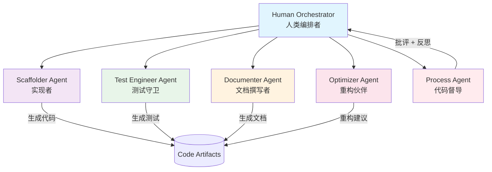
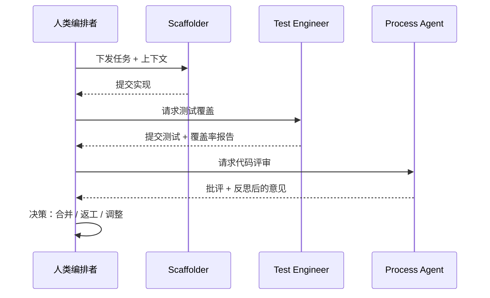

# 编程智能体工作流：从单兵到团队协作

## 引言

2025 年，编程智能体（Coding Agent）已经从演示阶段走入生产工程。Google 在其工程博客中披露，公司内部 **30% 以上的新增代码已由 AI 辅助生成**；Microsoft 的财报电话会议也给出了相近的数字。这意味着编程智能体不再是"锦上添花"的工具，而是研发流水线中的一等公民。

但"AI 写代码"这个表述过于笼统。真正进入生产的，不是一个会写代码的聊天机器人，而是一套**有角色分工、有上下文边界、有质量门禁的工程系统**。本章从 Agentic Design Patterns（Appendix G）的关键概念出发，聚焦工程落地：如何把多个专职 Agent 编排成团队、如何管理上下文不让模型"吃撑"、如何把 Prompt 当成代码来版本化、如何用 Git Hooks 把 Agent 嵌进开发闭环。

核心理念只有一句：**人类主导编排，Agent 各司其职**（Human-Led Orchestration）。开发者不是被 Agent 取代，而是从"代码作者"升级为"团队指挥"。

## 编程智能体团队架构

单个全能 Agent 看似简洁，但在真实项目中会迅速暴露问题：上下文窗口被各种职责挤爆、Prompt 越改越臃肿、一个 Bug 牵动全身。更可持续的做法是把职责拆分给**专职角色**，每个角色有清晰的输入、输出和评估标准。

### 专职角色分工



每个角色的职责边界如下：

**Scaffolder Agent（实现者）** 负责将需求转化为可运行代码。它关注的是"把功能做出来"，输入是任务描述与相关上下文，输出是符合接口约定的代码骨架与实现。它不负责自我验证——那是测试守卫的职责。

**Test Engineer Agent（测试守卫）** 在实现者交付后介入，针对代码生成单元测试、边界用例和回归测试。它的存在保证了"AI 写的代码 AI 自己也得测"，避免实现者既当运动员又当裁判带来的盲区。

**Documenter Agent（文档撰写者）** 读取代码与设计意图，生成 docstring、API 说明和变更记录。它让文档与代码同步演进，而不是事后补写的负债。

**Optimizer Agent（重构伙伴）** 在功能正确的前提下介入，识别重复代码、性能瓶颈、命名问题，给出重构建议。关键是它**只在测试覆盖到位后**才动手，避免"重构即破坏"。

**Process Agent（代码督导）** 是质量闭环的最后一环，遵循 **"先批评后反思"（Critique-then-Reflect）** 的模式：先以批判视角逐条挑刺，再退一步反思这些批评是否过度、是否抓住了真正重要的问题，最后把经过校准的意见交还给人类。这个两阶段设计避免了 Agent 要么一味点赞、要么吹毛求疵的两个极端。

### 人类主导编排原则

团队架构不等于全自动。生产级实践的底线是 **Human-Led Orchestration**：



人类保留三项不可外包的权力：**任务拆分**（决定哪些工作交给哪个 Agent）、**上下文裁剪**（决定 Agent 能看到什么）、**合并决策**（决定产物是否进入主干）。Agent 负责繁重的执行，人类负责关键的判断。

## 上下文管理策略

编程智能体的效果上限，很大程度由"它看到了什么"决定。最常见的错误是把整个仓库一股脑塞给 LLM——这既烧 token，又因噪声过多而降低质量。正确的做法是**选择性上下文注入**。

### Context Staging Area

引入一个显式的"上下文暂存区"目录，把当前任务所需的上下文集中管理：

```yaml
# 项目根目录下的上下文暂存区结构
task-context/
├── current-task.md          # 当前任务描述与验收标准
├── relevant-files/          # 软链接或路径清单，指向相关源文件
│   ├── api_handler.py
│   └── schema.py
├── interfaces.md            # 涉及的接口契约、类型定义
├── constraints.md           # 约束：性能要求、兼容性、禁止改动的部分
└── examples/                # 同类实现的参考样例
    └── similar_endpoint.py
```

这个目录的价值在于把"上下文构造"这件隐式工作显式化：每次启动一个 Agent 任务前，人类（或一个上游 Agent）先把 `task-context/` 填好，Agent 只读取这个目录，而非整个仓库。

### 选择性上下文注入

注入上下文时，遵循"够用即止"的原则。下面是一个上下文构造器的示例：

```python
# scripts/build_context.py
"""Selectively assemble context for a coding agent task."""
from pathlib import Path

# Token budget for the context window (leave room for response).
MAX_CONTEXT_TOKENS = 32_000

def build_context(task_dir: Path) -> str:
    """Assemble context in priority order, stopping at the budget."""
    # Higher priority items are injected first.
    sources = [
        ("task", task_dir / "current-task.md"),
        ("constraints", task_dir / "constraints.md"),
        ("interfaces", task_dir / "interfaces.md"),
        ("relevant_files", task_dir / "relevant-files"),
        ("examples", task_dir / "examples"),
    ]

    parts, used_tokens = [], 0
    for label, path in sources:
        chunk = _read_source(path)
        cost = _estimate_tokens(chunk)
        # Skip a source entirely rather than truncating mid-file.
        if used_tokens + cost > MAX_CONTEXT_TOKENS:
            continue
        parts.append(f"## {label}\n{chunk}")
        used_tokens += cost

    return "\n\n".join(parts)
```

注意两个工程细节：上下文按**优先级**注入（任务和约束永远先于参考样例），且宁可整段跳过也不要在文件中间截断——半截代码比没有代码更容易误导模型。

### 项目级配置文件

主流编程智能体都支持项目级的"行为说明书"，把团队规范固化下来，避免每次对话都重复交代。常见的有 `CLAUDE.md`（Claude Code）、`.cursorrules`（Cursor）以及通用的 `context.toml`：

```toml
# context.toml — 项目级 Agent 行为约定
[project]
language = "python"
style_guide = "google"           # docstring / 命名规范
test_framework = "pytest"

[conventions]
# Always-on rules injected into every agent task.
rules = [
    "All public functions must have type hints.",
    "Never commit secrets; use environment variables.",
    "Prefer composition over inheritance.",
    "Write tests before marking a task complete.",
]

[context]
# Directories the agent should generally ignore.
ignore = ["node_modules", "dist", "*.lock", "vendor"]
max_file_size_kb = 200
```

```markdown
<!-- CLAUDE.md — 放在仓库根目录，Agent 启动时自动读取 -->
# Project Conventions

## Architecture
- Hexagonal architecture: domain logic must not import infrastructure.
- All external calls go through the `adapters/` layer.

## Testing
- Run `pytest` before any commit.
- Minimum coverage for new code: 80%.

## Do Not Touch
- `legacy/` — frozen, requires human approval to modify.
```

这些文件本身就是代码资产，应纳入版本控制，并随项目演进而更新。

## Prompt 版本化

如果说项目配置是团队规范，那么系统提示（System Prompt）就是每个 Agent 的"岗位说明书"。Prompt 是 Agent 的源代码，必须当成代码来管理：版本化、可回滚、可 A/B 测试。

### /prompts 目录管理

把所有系统提示集中在一个 `/prompts` 目录，按角色和版本组织：

```yaml
prompts/
├── scaffolder/
│   ├── v1.md
│   ├── v2.md               # 改进了对边界条件的处理
│   └── CHANGELOG.md        # 记录每个版本的变更原因
├── test-engineer/
│   ├── v1.md
│   └── v2.md
├── process-agent/
│   └── v1.md               # critique-then-reflect 提示
└── registry.toml           # 当前各角色激活的版本
```

```toml
# prompts/registry.toml — 单一事实来源
[active]
scaffolder = "v2"
test_engineer = "v2"
documenter = "v1"
optimizer = "v1"
process_agent = "v1"
```

### 版本控制与 A/B 测试

把"当前用哪个版本"从代码里抽离到配置中，就能在不改代码的情况下切换版本、做对照实验：

```python
# prompts/loader.py
"""Load versioned prompts and support A/B experiments."""
import hashlib
import tomllib
from pathlib import Path

PROMPT_ROOT = Path(__file__).parent

def load_prompt(role: str, version: str | None = None) -> str:
    """Load a prompt by role; fall back to the active version."""
    if version is None:
        registry = tomllib.loads((PROMPT_ROOT / "registry.toml").read_text())
        version = registry["active"][role]
    return (PROMPT_ROOT / role / f"{version}.md").read_text()


def select_ab_version(role: str, user_id: str, split: float = 0.5) -> str:
    """Deterministically assign a prompt version for A/B testing."""
    # Stable hashing keeps a user in the same bucket across sessions.
    bucket = int(hashlib.md5(f"{role}:{user_id}".encode()).hexdigest(), 16) % 100
    return "v2" if bucket < split * 100 else "v1"
```

A/B 测试的关键是**确定性分桶**：同一个用户在同一角色上始终落入同一版本，否则会污染实验数据。实验结果应回流到评估指标（任务完成率、返工率），用数据而非直觉决定哪个版本胜出。具体的评估方法可参考本书第 12 章「测试策略」。

## Git Hooks 集成

要让编程智能体真正嵌入开发闭环，最自然的接入点是 Git Hooks。它们在开发者的日常操作（commit、push）时自动触发对应的 Agent，把质量检查前置。

### pre-commit 触发 Reviewer Agent

在每次提交前，让 Process Agent 对暂存区的变更做一次轻量评审：

```bash
#!/usr/bin/env bash
# .git/hooks/pre-commit
# Trigger the reviewer agent on staged changes before committing.
set -euo pipefail

# Collect the staged diff (excluding deletions).
DIFF=$(git diff --cached --diff-filter=d)

if [ -z "$DIFF" ]; then
    exit 0
fi

# Run the reviewer agent; it prints findings and returns non-zero on blockers.
echo "$DIFF" | python scripts/run_reviewer_agent.py --max-severity high

# A non-zero exit blocks the commit; the developer sees the findings inline.
```

```python
# scripts/run_reviewer_agent.py
"""Reviewer agent invoked by the pre-commit hook."""
import sys

from prompts.loader import load_prompt

BLOCKING_SEVERITIES = {"high", "critical"}

def main() -> int:
    diff = sys.stdin.read()
    system_prompt = load_prompt("process_agent")

    findings = review_diff(diff, system_prompt)  # returns list of findings
    for f in findings:
        print(f"[{f['severity'].upper()}] {f['file']}:{f['line']} {f['message']}")

    # Block the commit only on high/critical issues; warnings pass through.
    has_blocker = any(f["severity"] in BLOCKING_SEVERITIES for f in findings)
    return 1 if has_blocker else 0


if __name__ == "__main__":
    sys.exit(main())
```

设计上要克制：pre-commit 只拦截 **high/critical** 级别的问题，warning 级别仅提示。否则开发者会因为频繁误拦而绕过 hook（`--no-verify`），反而失去价值。

### pre-push 触发 Test Agent

push 是更重的操作，适合触发 Test Engineer Agent 补齐测试并运行：

```bash
#!/usr/bin/env bash
# .git/hooks/pre-push
# Ensure tests exist and pass before pushing to remote.
set -euo pipefail

# Identify files changed since the last pushed commit.
CHANGED=$(git diff --name-only @{push}.. -- '*.py' || git diff --name-only HEAD~1.. -- '*.py')

if [ -n "$CHANGED" ]; then
    # Let the test agent generate missing tests for changed files.
    echo "$CHANGED" | python scripts/run_test_agent.py --generate-missing
fi

# Run the suite; a failure aborts the push.
pytest --quiet
```

这样形成了清晰的质量门禁层次：**pre-commit 做快速评审（秒级），pre-push 做完整测试（分钟级）**，与开发者的操作频率匹配。需要注意的是，触发 Agent 的 hook 应当对网络异常容错——当 LLM 服务不可用时，应降级为跳过而非阻断，避免拖垮整个团队的提交流程。

## 工具链选型

编程智能体的工具生态在 2025 年已相当成熟，但定位差异明显。下表从工程视角对比主流方案：

| 工具 | 形态 | 多 Agent 支持 | 上下文管理 | 适用场景 | 主要优势 | 主要局限 |
|------|------|--------------|-----------|---------|---------|---------|
| **Cursor** | IDE（VS Code 分支） | 中（Composer 多文件） | `.cursorrules` + 自动检索 | 全功能日常开发 | 编辑器深度集成、补全体验好 | 闭源、订阅成本、对超大仓库检索有限 |
| **Claude Code** | 终端 CLI / Agent | 强（subagent + skills） | `CLAUDE.md` + 显式上下文 | 复杂多步任务、自动化编排 | 长任务规划强、可脚本化、Hooks 友好 | 学习曲线、终端为主缺图形界面 |
| **GitHub Copilot Workspace** | 云端 / IDE | 中（任务级编排） | 基于 Issue 和仓库 | GitHub 工作流内的需求实现 | 与 PR/Issue 无缝衔接 | 强绑定 GitHub 生态、灵活度受限 |
| **Aider** | 终端 CLI（开源） | 弱（单 Agent 为主） | Git-aware diff 编辑 | 命令行驱动、注重 Git 集成 | 开源可控、模型可自选、Git 原生 | 无 IDE 体验、需自行搭建工作流 |
| **Continue** | IDE 插件（开源） | 中（自定义流程） | 可配置上下文提供器 | 自托管、需要定制的团队 | 开源、模型/后端可插拔 | 配置成本高、开箱即用度低 |

选型建议遵循几条经验：**个人日常开发优先体验**（Cursor / Continue）；**复杂自动化与团队编排优先可脚本化**（Claude Code / Aider）；**已深度使用 GitHub 的团队**可直接评估 Copilot Workspace 以减少集成成本；**对数据合规或成本敏感、希望自托管**的团队应认真考虑 Aider 或 Continue 这类开源方案。需要强调的是，工具是会变的，真正沉淀下来的是本章前述的工作流——角色分工、上下文管理、Prompt 版本化、质量门禁，这些原则与具体工具解耦。

## 生产实践清单

把本章内容落地为一份可执行的 checklist，供团队对照自查：

**团队架构**
- [ ] 已明确各专职 Agent 的职责边界（实现 / 测试 / 文档 / 重构 / 督导）
- [ ] 关键决策（任务拆分、上下文裁剪、合并）保留在人类手中
- [ ] Process Agent 采用"先批评后反思"两阶段评审

**上下文管理**
- [ ] 存在显式的 `task-context/` 暂存区，而非把整库塞给 Agent
- [ ] 上下文注入有 token 预算和优先级排序
- [ ] 项目级配置（`CLAUDE.md` / `.cursorrules` / `context.toml`）已纳入版本控制

**Prompt 工程**
- [ ] 所有系统提示集中在 `/prompts` 并按版本管理
- [ ] 激活版本由配置（registry）控制，可不改代码切换
- [ ] 重要 Prompt 改动通过 A/B 测试 + 评估指标验证

**质量门禁**
- [ ] pre-commit 触发轻量评审，仅拦截 high/critical
- [ ] pre-push 触发测试生成与运行
- [ ] Hook 对 LLM 服务异常容错降级，不阻断团队提交

**成本与可观测**
- [ ] 每次 Agent 调用的 token 消耗可追踪（参考第 12 章「成本优化」）
- [ ] 关键指标（任务完成率、返工率、单次成本）有监控

## 本章小结

编程智能体的工程化，本质是把"一个会写代码的模型"升级为"一支有纪律的 AI 团队"。这支团队需要清晰的角色分工、克制的上下文边界、版本化的 Prompt 资产，以及嵌入 Git 流程的质量门禁——而所有这些都在人类的编排之下运转。

2025 年 AI 已经在写 30% 的代码，但写代码从来不是难点，**让代码可靠、可维护、可演进才是**。本章描述的工作流正是为此而生：它让编程智能体的产出不再是一次性的灵光乍现，而是可持续交付的工程产能。

## 参考

- Antonio Gulli et al., *Agentic Design Patterns*, Appendix G "Coding Agents" — 编程智能体角色模式的原始论述
- Google Engineering Blog (2025) — 内部 30%+ 新代码由 AI 辅助生成的实践分享
- Anthropic, "Claude Code Best Practices" — `CLAUDE.md`、subagent 与 Hooks 集成的官方指南
- 本书第 5 章「Agent 设计模式」— 多 Agent 协作与编排模式
- 本书第 12 章「开发工作流」— 评估驱动开发与 CI/CD 流程
- 本书第 12 章「测试策略」— A/B 测试与评估套件设计
- 本书第 12 章「成本优化」— Agent 调用的 token 成本追踪
