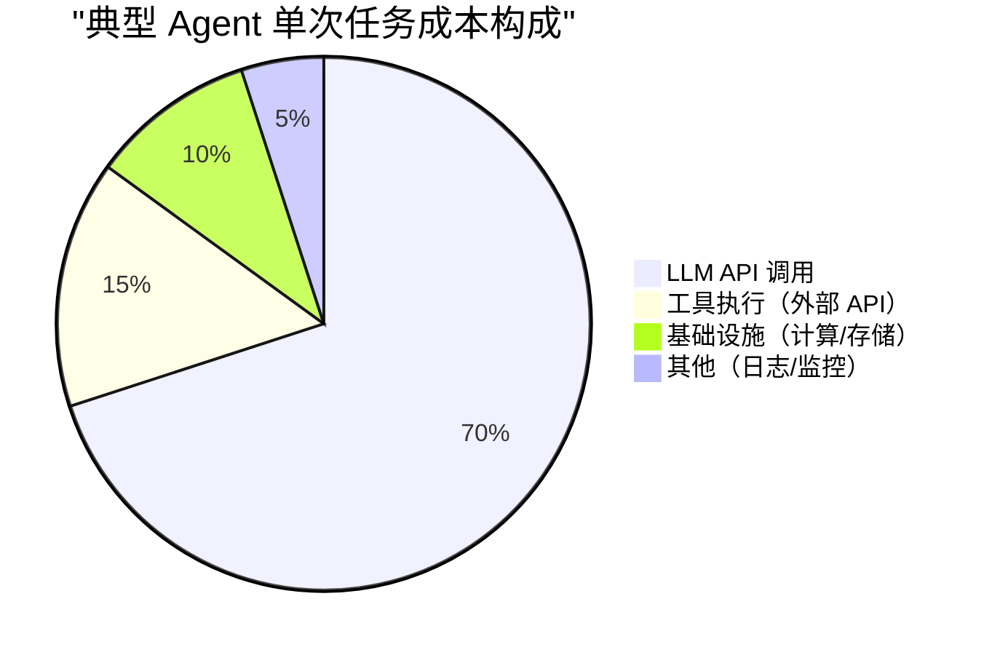
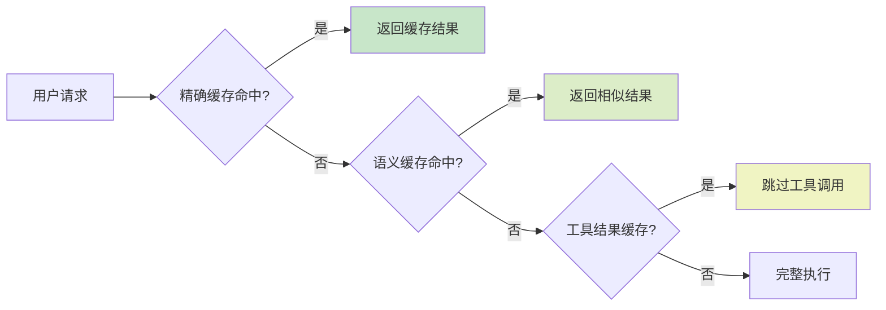

# 成本优化：控制 Agent 的运行开销

## 引言

Agent 系统的运行成本可能远超预期。一个看似简单的任务，如果 Agent 进行了 5 轮迭代、每轮调用 GPT-4o 并携带完整上下文，单次任务成本可能达到 $0.50 甚至更高。当服务面向数千用户时，月度成本可能轻松突破五位数。

成本优化不是事后补救，而应从架构设计阶段就纳入考量。本章介绍一套系统化的成本控制策略。

## 成本结构分析



LLM API 调用占据绝对主导地位，因此优化重点应放在减少调用次数和降低单次调用成本上。

### 成本计算公式

```python
# 单次 Agent 任务的成本估算
def estimate_task_cost(
    iterations: int,
    avg_input_tokens: int,
    avg_output_tokens: int,
    model: str = "gpt-4o",
) -> float:
    """估算单次任务成本"""
    PRICING = {
        "gpt-4o":       {"input": 2.50 / 1_000_000, "output": 10.00 / 1_000_000},
        "gpt-4o-mini":  {"input": 0.15 / 1_000_000, "output": 0.60 / 1_000_000},
        "claude-sonnet": {"input": 3.00 / 1_000_000, "output": 15.00 / 1_000_000},
        "claude-haiku": {"input": 0.25 / 1_000_000, "output": 1.25 / 1_000_000},
    }
    
    price = PRICING[model]
    # 注意：上下文累积，后续迭代的 input tokens 会增长
    total_cost = 0
    for i in range(iterations):
        context_growth = avg_input_tokens + (avg_output_tokens * i)
        total_cost += context_growth * price["input"]
        total_cost += avg_output_tokens * price["output"]
    
    return total_cost

# 示例：5 轮迭代，每轮 2000 input + 500 output
cost_4o = estimate_task_cost(5, 2000, 500, "gpt-4o")       # ~$0.065
cost_mini = estimate_task_cost(5, 2000, 500, "gpt-4o-mini") # ~$0.003
# 差距约 20 倍！
```

## 策略一：模型路由（Model Routing）

核心思想：用便宜模型处理简单任务，只在必要时调用昂贵模型。

```python
# cost/model_router.py
"""智能模型路由器"""

class ModelRouter:
    def __init__(self):
        self.routes = [
            {"condition": self._is_simple_query, "model": "gpt-4o-mini"},
            {"condition": self._needs_reasoning, "model": "gpt-4o"},
            {"condition": self._is_code_generation, "model": "claude-sonnet"},
        ]
        self.default_model = "gpt-4o-mini"
    
    def select_model(self, task: str, context: dict) -> str:
        """根据任务复杂度选择模型"""
        for route in self.routes:
            if route["condition"](task, context):
                return route["model"]
        return self.default_model
    
    def _is_simple_query(self, task: str, context: dict) -> bool:
        """简单查询：短输入、无需推理、格式化输出"""
        return (
            len(task) < 200
            and context.get("requires_reasoning") is False
            and context.get("iteration", 1) == 1
        )
    
    def _needs_reasoning(self, task: str, context: dict) -> bool:
        """需要深度推理的任务"""
        indicators = ["分析", "比较", "权衡", "设计", "为什么"]
        return any(ind in task for ind in indicators)

# 使用示例
router = ModelRouter()
model = router.select_model(
    task="将这段文本翻译成英文",
    context={"requires_reasoning": False}
)
# 返回 "gpt-4o-mini"，节省 95% 成本
```

## 策略二：多层缓存



```python
# cost/caching.py
"""多层缓存实现"""
import hashlib
import numpy as np
from typing import Any

class AgentCache:
    def __init__(self, embedding_model="text-embedding-3-small"):
        self.exact_cache = {}       # 精确匹配缓存
        self.semantic_cache = {}    # 语义相似缓存
        self.tool_cache = {}        # 工具结果缓存
        self.embedding_model = embedding_model
    
    def get_exact(self, prompt: str) -> str | None:
        """精确匹配：相同输入直接返回"""
        key = hashlib.sha256(prompt.encode()).hexdigest()
        return self.exact_cache.get(key)
    
    def get_semantic(self, prompt: str, threshold: float = 0.95) -> str | None:
        """语义缓存：相似问题返回已有答案"""
        query_embedding = self._embed(prompt)
        for cached_embedding, response in self.semantic_cache.values():
            similarity = np.dot(query_embedding, cached_embedding)
            if similarity >= threshold:
                return response
        return None
    
    def get_tool_result(self, tool_name: str, args: dict, ttl: int = 300) -> Any:
        """工具结果缓存：避免重复调用外部 API"""
        key = f"{tool_name}:{hashlib.md5(str(args).encode()).hexdigest()}"
        entry = self.tool_cache.get(key)
        if entry and (time.time() - entry["timestamp"]) < ttl:
            return entry["result"]
        return None
    
    def set(self, prompt: str, response: str):
        """同时写入精确缓存和语义缓存"""
        key = hashlib.sha256(prompt.encode()).hexdigest()
        self.exact_cache[key] = response
        embedding = self._embed(prompt)
        self.semantic_cache[key] = (embedding, response)
```

## 策略三：Token 优化

### Prompt 压缩

```python
# cost/token_optimization.py
"""Token 优化策略"""

class TokenOptimizer:
    def compress_context(self, messages: list[dict], max_tokens: int) -> list[dict]:
        """压缩上下文，保留关键信息"""
        total_tokens = self._count_tokens(messages)
        
        if total_tokens <= max_tokens:
            return messages
        
        # 策略 1：移除早期工具调用的详细结果
        messages = self._summarize_old_tool_results(messages)
        
        # 策略 2：压缩系统 prompt 中的示例
        messages = self._reduce_examples(messages)
        
        # 策略 3：截断过长的单条消息
        messages = self._truncate_long_messages(messages, max_per_message=2000)
        
        return messages
    
    def _summarize_old_tool_results(self, messages: list[dict]) -> list[dict]:
        """将早期工具结果替换为摘要"""
        result = []
        for i, msg in enumerate(messages):
            if (msg.get("role") == "tool" 
                and i < len(messages) - 4  # 只压缩早期的
                and len(msg["content"]) > 500):
                msg = {**msg, "content": msg["content"][:200] + "\n[...已截断...]"}
            result.append(msg)
        return result
```

### 输出长度控制

```python
# 在系统 prompt 中明确要求简洁输出
SYSTEM_PROMPT_COST_AWARE = """你是一个代码审查助手。

重要规则：
- 每个问题的描述不超过 2 句话
- 只报告 HIGH 和 MEDIUM 严重性的问题
- 不要重复代码片段，只引用行号
- 最终输出不超过 300 字"""
```

## 策略四：迭代限制与超时控制

```python
# cost/budget_enforcement.py
"""预算执行器：防止成本失控"""

class BudgetEnforcer:
    def __init__(self, max_cost_per_task: float = 0.50,
                 max_iterations: int = 10,
                 max_tokens_per_task: int = 50000):
        self.max_cost = max_cost_per_task
        self.max_iterations = max_iterations
        self.max_tokens = max_tokens_per_task
        self._current_cost = 0.0
        self._current_tokens = 0
        self._current_iterations = 0
    
    def check_budget(self) -> bool:
        """每次 LLM 调用前检查预算"""
        if self._current_cost >= self.max_cost:
            raise BudgetExceededError(
                f"任务成本已达 ${self._current_cost:.3f}，超出预算 ${self.max_cost}"
            )
        if self._current_iterations >= self.max_iterations:
            raise IterationLimitError(
                f"已迭代 {self._current_iterations} 次，达到上限"
            )
        return True
    
    def record_usage(self, input_tokens: int, output_tokens: int, model: str):
        """记录本次调用的消耗"""
        cost = self._calculate_cost(input_tokens, output_tokens, model)
        self._current_cost += cost
        self._current_tokens += input_tokens + output_tokens
        self._current_iterations += 1

# 集成到 Agent 中
class CostAwareAgent:
    def __init__(self, budget: BudgetEnforcer):
        self.budget = budget
    
    def _call_llm(self, messages):
        self.budget.check_budget()  # 调用前检查
        response = openai.chat.completions.create(...)
        self.budget.record_usage(
            response.usage.prompt_tokens,
            response.usage.completion_tokens,
            self.model
        )
        return response
```

## 策略五：批处理与请求合并

```python
# cost/batching.py
"""请求批处理：合并相似请求降低成本"""

class RequestBatcher:
    def __init__(self, batch_size: int = 5, wait_ms: int = 100):
        self.batch_size = batch_size
        self.wait_ms = wait_ms
        self._queue = []
    
    async def submit(self, request: dict) -> str:
        """提交请求，等待批处理"""
        future = asyncio.Future()
        self._queue.append((request, future))
        
        if len(self._queue) >= self.batch_size:
            await self._flush()
        else:
            await asyncio.sleep(self.wait_ms / 1000)
            if self._queue:
                await self._flush()
        
        return await future
    
    async def _flush(self):
        """批量处理队列中的请求"""
        batch = self._queue[:self.batch_size]
        self._queue = self._queue[self.batch_size:]
        
        # 合并为单次 API 调用（适用于分类、提取等任务）
        combined_prompt = self._merge_requests([r for r, _ in batch])
        response = await self._call_llm(combined_prompt)
        results = self._split_response(response, len(batch))
        
        for (_, future), result in zip(batch, results):
            future.set_result(result)
```

## 成本对比：模型选择参考

| 模型 | 输入价格 ($/1M tokens) | 输出价格 | 适用场景 |
|------|----------------------|----------|----------|
| GPT-4o | $2.50 | $10.00 | 复杂推理、多步规划 |
| GPT-4o-mini | $0.15 | $0.60 | 简单分类、格式化、路由 |
| Claude Sonnet | $3.00 | $15.00 | 长文本分析、代码生成 |
| Claude Haiku | $0.25 | $1.25 | 快速响应、简单任务 |
| 本地 Llama 3 (70B) | ~$0.05* | ~$0.05* | 隐私敏感、高频低复杂度 |

*本地部署的等效成本，含 GPU 折旧

## 何时考虑本地模型

当满足以下条件时，自部署开源模型可能更经济：

- 日均调用量 > 10,000 次
- 任务复杂度中等偏低（分类、提取、格式化）
- 对延迟要求不高（可接受 2-5 秒）
- 有 GPU 基础设施或预算

```yaml
# 本地模型部署配置示例（vLLM）
model_serving:
  engine: vllm
  model: meta-llama/Llama-3-70B-Instruct
  gpu_memory_utilization: 0.9
  max_model_len: 8192
  tensor_parallel_size: 4  # 4 GPU 并行
  
  # 成本估算
  # 4x A100 80GB: ~$12/h (云端)
  # 吞吐量: ~2000 req/h
  # 等效成本: ~$0.006/req vs API $0.03/req
```

## 常见错误与避坑指南

**错误一：忽视上下文累积**。Agent 多轮对话中，每轮的 input tokens 都包含之前所有历史。5 轮对话的总 token 消耗不是 5x，而可能是 15x。

**错误二：缓存粒度不当**。缓存整个 Agent 响应容易导致过时信息。应该分层缓存：工具结果短期缓存，知识性回答长期缓存。

**错误三：过度优化牺牲质量**。用太便宜的模型处理复杂任务会导致更多重试和人工干预，总成本反而更高。

**错误四：没有设置硬性预算上限**。一个 bug 导致 Agent 无限循环，一夜之间烧掉数千美元。必须有不可绕过的成本熔断机制。

## Agent 经济学：成本结构与收益模型

从宏观经济视角看，Agent 系统的成本收益比正在快速改善：

**GPU 基础成本**：H100 GPU 每小时云端成本约 $2.10。基于此，不同类型 Agent 任务的单次查询净收益差异显著——简单搜索模型约 $0.0009/查询，对话模型约 $0.009/查询，而 Agentic 模型可达 $0.087/查询。这表明复杂 Agent 任务的商业价值远高于简单查询。

**Prompt 模板化复用**：将用户请求重构为通用 Prompt 模板，可最大化 KV Cache 命中率。核心技巧是将变化的部分（用户输入）放在 Prompt 末尾，保持前缀（系统提示 + 工具定义）的一致性，从而复用已计算的注意力缓存。

**商业定价模式**正在分化：按 Token 计费（OpenAI/Anthropic）、按 Agent Compute Units 计费（Devin）、按请求订阅（Windsurf/Cursor）。选择合适的定价结构对 Agent 产品的商业可行性至关重要。

## 本章小结

Agent 成本优化是一个系统工程，需要从模型选择、缓存策略、Token 管理、预算控制等多个维度综合施策。核心原则是"用最便宜的方案完成任务，只在必要时升级"。建立完善的成本监控和预算熔断机制，是防止成本失控的最后防线。

## 延伸阅读

- 本书第 12 章「可观测性」— 成本指标的监控与告警
- 本书第 12 章「部署策略」— 本地模型部署的详细方案
- OpenAI Pricing Page — 最新模型定价
- vLLM 项目文档 — 高性能本地模型推理引擎
- Citi/OpenAI, "Building the Abstraction Layer for Everything" — Agent 经济模型分析
