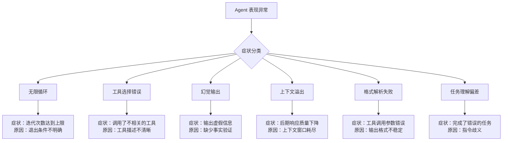
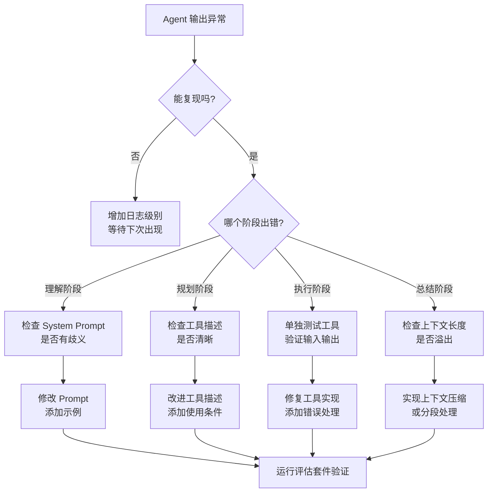

# 调试技巧：当 Agent 表现异常时

## 引言

Agent 系统的调试是一项独特的挑战。与传统软件不同，Agent 的"bug"往往不是代码错误，而是行为偏差——它没有崩溃，但做了错误的事情。更棘手的是，同样的输入可能产生不同的行为，使得"复现问题"本身就成为难题。

本章提供一套系统化的调试方法论，帮助你快速定位和修复 Agent 的异常行为。

## 常见故障模式



## 调试方法论：四步法

### 第一步：复现（Reproduce）

```python
# debugging/reproduce.py
"""复现工具：使用相同输入重新运行 Agent"""

class AgentReproducer:
    def __init__(self, trace_store):
        self.trace_store = trace_store
    
    def reproduce_from_trace(self, trace_id: str, deterministic: bool = True):
        """从历史 trace 中提取输入，重新运行"""
        trace = self.trace_store.load(trace_id)
        
        config = {
            "model": trace.model,
            "temperature": 0 if deterministic else trace.temperature,
            "seed": 42 if deterministic else None,  # 固定随机种子
            "tools": trace.tools_config,
            "system_prompt": trace.system_prompt,
        }
        
        agent = Agent(config=config)
        result = agent.run(
            input=trace.user_input,
            verbose=True,  # 开启详细日志
        )
        
        return {
            "original_trace": trace,
            "reproduced_trace": result.trace,
            "matches": self._compare_traces(trace, result.trace),
        }
    
    def _compare_traces(self, original, reproduced):
        """对比原始和复现的执行轨迹"""
        return {
            "same_tool_sequence": (
                original.tool_calls == reproduced.tool_calls
            ),
            "same_iterations": (
                original.iterations == reproduced.iterations
            ),
            "divergence_point": self._find_divergence(original, reproduced),
        }
```

### 第二步：隔离（Isolate）

将问题隔离到具体组件——是 Prompt 问题、工具问题还是模型问题：

```python
# debugging/isolate.py
"""问题隔离工具"""

class ProblemIsolator:
    def isolate_prompt_vs_tool(self, trace_id: str):
        """判断问题出在 Prompt 还是工具"""
        trace = load_trace(trace_id)
        
        # 测试 1：禁用所有工具，只看 LLM 理解
        result_no_tools = self.run_without_tools(trace.user_input)
        print(f"无工具时的理解: {result_no_tools.intent}")
        
        # 测试 2：手动提供正确的工具结果
        result_mock_tools = self.run_with_mock_results(
            trace.user_input,
            mock_results=trace.expected_tool_results
        )
        print(f"正确工具结果时的输出: {result_mock_tools.answer}")
        
        # 测试 3：单独验证工具
        for tool_call in trace.tool_calls:
            actual_result = execute_tool(tool_call.name, tool_call.args)
            expected = trace.tool_results[tool_call.id]
            if actual_result != expected:
                print(f"工具 {tool_call.name} 结果不一致!")
                print(f"  期望: {expected}")
                print(f"  实际: {actual_result}")
    
    def test_prompt_variants(self, user_input: str, variants: list[str]):
        """测试不同 Prompt 变体的效果"""
        results = []
        for prompt in variants:
            result = self.run_with_prompt(prompt, user_input)
            results.append({
                "prompt_preview": prompt[:50],
                "tool_calls": [c.name for c in result.tool_calls],
                "answer_quality": self.judge(result.answer),
            })
        return results
```

### 第三步：修复（Fix）

```python
# debugging/common_fixes.py
"""常见问题的修复模式"""

# 修复 1：无限循环 → 明确退出条件
SYSTEM_PROMPT_FIX_LOOP = """
...（原有指令）...

重要规则：
- 如果连续两次工具调用返回相同结果，停止并总结已有信息
- 如果已经收集到足够信息回答问题，立即给出最终答案
- 最多进行 {max_iterations} 轮工具调用
"""

# 修复 2：工具选择错误 → 改进工具描述
# 错误的工具描述（太模糊）
BAD_TOOL_DESC = "搜索相关信息"
# 改进后的工具描述（明确适用场景）
GOOD_TOOL_DESC = """在代码仓库中搜索文件内容。
适用场景：需要查找特定函数、类、变量的定义或使用位置。
不适用：查找文档、搜索网络信息、查看文件列表。
输入：搜索关键词（建议使用函数名或类名）
输出：匹配的文件路径和代码片段"""

# 修复 3：上下文溢出 → 主动压缩
class ContextManager:
    def manage_context(self, messages: list, max_tokens: int = 100000):
        """在上下文接近上限时主动压缩"""
        current_tokens = count_tokens(messages)
        if current_tokens > max_tokens * 0.8:  # 80% 阈值
            # 压缩早期对话为摘要
            summary = self.summarize_early_messages(messages[:len(messages)//2])
            messages = [
                messages[0],  # 保留 system prompt
                {"role": "system", "content": f"之前对话摘要：{summary}"},
                *messages[len(messages)//2:]  # 保留近期消息
            ]
        return messages
```

### 第四步：验证（Verify）

```python
# debugging/verify.py
"""验证修复是否有效"""

def verify_fix(original_trace_id: str, fix_description: str):
    """验证修复：在原始输入上重新运行，确认问题解决"""
    trace = load_trace(original_trace_id)
    
    # 用修复后的 Agent 重新运行
    new_result = fixed_agent.run(trace.user_input)
    
    # 验证原始问题不再出现
    checks = {
        "no_infinite_loop": new_result.iterations < trace.max_iterations,
        "correct_tools": validate_tool_sequence(new_result.tool_calls),
        "quality_improved": judge_quality(new_result.answer) > judge_quality(trace.answer),
        "no_regression": run_regression_suite(fixed_agent),
    }
    
    print(f"修复验证结果: {checks}")
    return all(checks.values())
```

## Debug Mode：Agent 的 "println 调试"

```python
# debugging/debug_mode.py
"""Debug 模式：详细输出 Agent 每一步的内部状态"""

class DebugAgent:
    def __init__(self, agent: Agent, verbose: bool = True):
        self.agent = agent
        self.verbose = verbose
        self.debug_log = []
    
    def run(self, user_input: str) -> str:
        self._log("=" * 60)
        self._log(f"[INPUT] {user_input}")
        self._log("=" * 60)
        
        messages = self.agent.build_initial_messages(user_input)
        
        for iteration in range(self.agent.max_iterations):
            self._log(f"\n--- 迭代 {iteration + 1} ---")
            self._log(f"[CONTEXT] 当前消息数: {len(messages)}, "
                     f"Token 数: {count_tokens(messages)}")
            
            # LLM 调用
            response = self.agent.call_llm(messages)
            self._log(f"[LLM] 模型: {self.agent.model}")
            self._log(f"[LLM] Input tokens: {response.usage.prompt_tokens}")
            self._log(f"[LLM] Output tokens: {response.usage.completion_tokens}")
            
            if response.tool_calls:
                for tc in response.tool_calls:
                    self._log(f"[TOOL CALL] {tc.function.name}({tc.function.arguments})")
                    result = self.agent.execute_tool(tc)
                    self._log(f"[TOOL RESULT] {str(result)[:200]}")
            else:
                self._log(f"[FINAL ANSWER] {response.content[:200]}")
                return response.content
        
        self._log("[WARNING] 达到最大迭代次数!")
        return "达到最大迭代次数，无法完成任务。"
    
    def _log(self, message: str):
        if self.verbose:
            print(message)
        self.debug_log.append(message)
    
    def export_debug_log(self, path: str):
        """导出调试日志供事后分析"""
        Path(path).write_text("\n".join(self.debug_log))
```

## 调试决策树



## 常见 Bug 模式与解决方案

### Bug 1：工具参数格式错误

```python
# 问题：LLM 生成的 JSON 参数偶尔格式不正确
# 解决：添加容错解析层

import json
import re

def robust_parse_arguments(raw: str) -> dict:
    """容错的参数解析"""
    # 尝试直接解析
    try:
        return json.loads(raw)
    except json.JSONDecodeError:
        pass
    
    # 尝试提取 JSON 块
    json_match = re.search(r'\{.*\}', raw, re.DOTALL)
    if json_match:
        try:
            return json.loads(json_match.group())
        except json.JSONDecodeError:
            pass
    
    # 尝试修复常见格式问题
    fixed = raw.replace("'", '"')  # 单引号→双引号
    fixed = re.sub(r',\s*}', '}', fixed)  # 移除尾逗号
    try:
        return json.loads(fixed)
    except json.JSONDecodeError:
        raise ParseError(f"无法解析参数: {raw[:100]}")
```

### Bug 2：Agent 陷入重复循环

```python
# 问题：Agent 反复调用同一工具，得到相同结果
# 解决：检测重复并强制退出

class LoopDetector:
    def __init__(self, max_repeats: int = 2):
        self.max_repeats = max_repeats
        self.history: list[tuple] = []
    
    def check(self, tool_name: str, args: dict, result: str) -> bool:
        """检测是否陷入循环，返回 True 表示应该停止"""
        current = (tool_name, json.dumps(args, sort_keys=True))
        
        repeat_count = sum(1 for h in self.history[-5:] if h == current)
        self.history.append(current)
        
        if repeat_count >= self.max_repeats:
            return True  # 应该停止
        return False
```

### Bug 3：上下文窗口耗尽导致质量下降

```python
# 问题：长对话后期，Agent 开始"忘记"早期指令
# 解决：监控 token 使用并主动管理

def monitor_context_health(messages: list, model: str) -> dict:
    """监控上下文健康状态"""
    total_tokens = count_tokens(messages)
    max_tokens = MODEL_CONTEXT_LIMITS[model]
    usage_ratio = total_tokens / max_tokens
    
    return {
        "total_tokens": total_tokens,
        "max_tokens": max_tokens,
        "usage_ratio": usage_ratio,
        "warning": usage_ratio > 0.7,
        "critical": usage_ratio > 0.9,
        "recommendation": (
            "正常" if usage_ratio < 0.7
            else "建议压缩上下文" if usage_ratio < 0.9
            else "必须立即压缩，否则将丢失信息"
        ),
    }
```

## 常见错误与避坑指南

**错误一：在生产环境调试**。永远不要在生产环境开启 verbose 日志或 debug 模式。应该通过 trace 重放在本地复现问题。

**错误二：只看最终输出**。Agent 的问题往往出在中间步骤。必须检查完整的执行轨迹，包括每次工具调用的输入输出。

**错误三：修复一个问题引入新问题**。每次修复后都必须运行回归测试套件，确保没有破坏已有功能。

**错误四：忽视模型版本变化**。模型提供商的静默更新可能改变 Agent 行为。固定模型版本（如 `gpt-4o-2024-08-06`）可以避免意外退化。

## 本章小结

Agent 调试的核心方法论是"复现→隔离→修复→验证"四步法。通过完善的追踪基础设施支持 trace 重放，通过 debug 模式暴露中间状态，通过回归测试确保修复不引入新问题。记住：Agent 的大多数"bug"不是代码错误，而是行为偏差，需要用不同于传统调试的思维方式来处理。

## 延伸阅读

- 本书第 12 章「可观测性」— 追踪数据的采集与存储
- 本书第 12 章「测试策略」— 回归测试套件的设计
- 本书第 12 章「版本管理」— 模型版本固定与回滚
- Anthropic, "Debugging Agent Systems" — Agent 调试最佳实践
