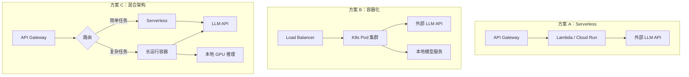
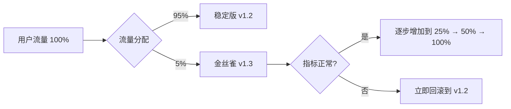

# 部署策略：Agent 系统的上线方案

## 引言

Agent 系统的部署比传统 Web 服务更具挑战性：单次请求可能持续数十秒甚至数分钟；资源消耗高度不均匀（一个复杂任务可能消耗 100 倍于简单任务的资源）；状态管理复杂（多轮对话需要维持上下文）。这些特性要求我们重新思考部署架构。

## 部署架构选型



### 架构对比

| 维度 | Serverless | 容器化 | 混合 |
|------|-----------|--------|------|
| 冷启动 | 有（1-5s） | 无 | 部分有 |
| 超时限制 | 有（通常 5-15min） | 无 | 灵活 |
| 扩缩容 | 自动 | 需配置 HPA | 分层 |
| 成本模型 | 按调用计费 | 按资源计费 | 混合 |
| 适用场景 | 低频、短任务 | 高频、长任务 | 混合负载 |

## 有状态 vs 无状态部署

Agent 的对话上下文管理是部署的核心决策点：

```python
# deployment/state_management.py
"""Agent 状态管理策略"""

# 方案 1：无状态 + 外部存储
class StatelessAgent:
    """每次请求从外部加载完整状态"""
    def __init__(self, state_store: Redis):
        self.store = state_store
    
    async def handle_request(self, session_id: str, user_input: str):
        # 从 Redis 加载对话历史
        history = await self.store.get(f"session:{session_id}")
        messages = json.loads(history) if history else []
        messages.append({"role": "user", "content": user_input})
        
        # 执行 Agent 逻辑
        response = await self.run(messages)
        
        # 保存更新后的状态
        messages.append({"role": "assistant", "content": response})
        await self.store.set(f"session:{session_id}", json.dumps(messages))
        return response

# 方案 2：有状态 + 会话亲和
class StatefulAgent:
    """状态保持在内存中，通过会话亲和路由"""
    def __init__(self):
        self.sessions: dict[str, list] = {}
    
    async def handle_request(self, session_id: str, user_input: str):
        if session_id not in self.sessions:
            self.sessions[session_id] = []
        
        self.sessions[session_id].append({"role": "user", "content": user_input})
        response = await self.run(self.sessions[session_id])
        self.sessions[session_id].append({"role": "assistant", "content": response})
        return response
```

## 扩缩容策略

Agent 请求的特殊性在于持续时间差异巨大（1s ~ 300s），传统的 RPS 指标不适合作为扩缩容依据：

```yaml
# k8s/hpa.yaml
apiVersion: autoscaling/v2
kind: HorizontalPodAutoscaler
metadata:
  name: agent-service-hpa
spec:
  scaleTargetRef:
    apiVersion: apps/v1
    kind: Deployment
    name: agent-service
  minReplicas: 3
  maxReplicas: 50
  metrics:
    # 基于并发请求数而非 RPS
    - type: Pods
      pods:
        metric:
          name: agent_active_requests
        target:
          type: AverageValue
          averageValue: "5"  # 每 Pod 最多 5 个并发 Agent
    # 辅助指标：CPU 使用率
    - type: Resource
      resource:
        name: cpu
        target:
          type: Utilization
          averageUtilization: 70
  behavior:
    scaleUp:
      stabilizationWindowSeconds: 30  # 快速扩容
      policies:
        - type: Percent
          value: 100
          periodSeconds: 30
    scaleDown:
      stabilizationWindowSeconds: 300  # 慢速缩容，避免抖动
```

## 负载均衡

Agent 请求的长连接特性需要特殊的负载均衡策略：

```yaml
# k8s/service.yaml
apiVersion: v1
kind: Service
metadata:
  name: agent-service
  annotations:
    # 使用最少连接数算法，而非轮询
    nginx.ingress.kubernetes.io/load-balance: "least_conn"
    # 长超时配置
    nginx.ingress.kubernetes.io/proxy-read-timeout: "300"
    nginx.ingress.kubernetes.io/proxy-send-timeout: "300"
spec:
  type: ClusterIP
  ports:
    - port: 8080
      targetPort: 8080
  selector:
    app: agent-service
```

## 模型服务部署

### 托管 API vs 自部署

```yaml
# configs/model_serving.yaml
model_serving:
  # 生产环境：混合策略
  production:
    primary:
      provider: openai
      model: gpt-4o
      api_key_env: OPENAI_API_KEY
      timeout: 60
      max_retries: 3
    
    fallback:
      provider: anthropic
      model: claude-3-5-sonnet
      api_key_env: ANTHROPIC_API_KEY
    
    local:
      # 用于简单任务和隐私敏感场景
      provider: vllm
      endpoint: http://model-server:8000/v1
      model: meta-llama/Llama-3-70B-Instruct
  
  # 测试环境：全部用便宜模型
  staging:
    primary:
      provider: openai
      model: gpt-4o-mini
```

### 自部署模型服务（vLLM）

```yaml
# k8s/model-server.yaml
apiVersion: apps/v1
kind: Deployment
metadata:
  name: vllm-server
spec:
  replicas: 2
  template:
    spec:
      containers:
        - name: vllm
          image: vllm/vllm-openai:latest
          args:
            - "--model=meta-llama/Llama-3-70B-Instruct"
            - "--tensor-parallel-size=4"
            - "--max-model-len=8192"
            - "--gpu-memory-utilization=0.9"
          resources:
            limits:
              nvidia.com/gpu: 4
            requests:
              memory: "80Gi"
              cpu: "16"
          ports:
            - containerPort: 8000
```

## 环境配置管理

```python
# deployment/config.py
"""环境配置管理"""
from pydantic_settings import BaseSettings

class AgentSettings(BaseSettings):
    """通过环境变量注入配置"""
    # 模型配置
    model_name: str = "gpt-4o"
    model_temperature: float = 0.7
    max_iterations: int = 10
    
    # API Keys（从 Secret 注入）
    openai_api_key: str
    anthropic_api_key: str = ""
    
    # 运行时配置
    max_concurrent_agents: int = 20
    request_timeout: int = 300
    
    # Feature Flags
    enable_caching: bool = True
    enable_streaming: bool = True
    
    # 成本控制
    max_cost_per_request: float = 1.0
    daily_budget: float = 500.0
    
    class Config:
        env_prefix = "AGENT_"
```

```yaml
# k8s/configmap.yaml
apiVersion: v1
kind: ConfigMap
metadata:
  name: agent-config
data:
  AGENT_MODEL_NAME: "gpt-4o"
  AGENT_MAX_ITERATIONS: "10"
  AGENT_ENABLE_CACHING: "true"
  AGENT_MAX_CONCURRENT_AGENTS: "20"
---
apiVersion: v1
kind: Secret
metadata:
  name: agent-secrets
type: Opaque
data:
  AGENT_OPENAI_API_KEY: <base64-encoded>
  AGENT_ANTHROPIC_API_KEY: <base64-encoded>
```

## 渐进式发布策略

### Canary 发布



```yaml
# k8s/canary.yaml
apiVersion: networking.istio.io/v1beta1
kind: VirtualService
metadata:
  name: agent-service
spec:
  hosts:
    - agent-service
  http:
    - route:
        - destination:
            host: agent-service
            subset: stable
          weight: 95
        - destination:
            host: agent-service
            subset: canary
          weight: 5
---
apiVersion: networking.istio.io/v1beta1
kind: DestinationRule
metadata:
  name: agent-service
spec:
  host: agent-service
  subsets:
    - name: stable
      labels:
        version: v1.2.0
    - name: canary
      labels:
        version: v1.3.0
```

### 自动化发布流程

```python
# scripts/canary_promote.py
"""金丝雀发布自动晋升脚本"""

async def canary_promotion(canary_version: str):
    """基于指标自动决定是否晋升金丝雀版本"""
    stages = [5, 25, 50, 100]  # 流量百分比
    
    for percentage in stages:
        set_traffic_weight(canary_version, percentage)
        print(f"金丝雀流量设置为 {percentage}%，等待观察...")
        
        await asyncio.sleep(600)  # 观察 10 分钟
        
        metrics = get_canary_metrics(canary_version)
        if not is_healthy(metrics):
            print(f"金丝雀指标异常，执行回滚")
            rollback(canary_version)
            return False
    
    print("金丝雀发布成功，已全量切换")
    return True

def is_healthy(metrics: dict) -> bool:
    """判断金丝雀版本是否健康"""
    return (
        metrics["error_rate"] < 0.05
        and metrics["p99_latency"] < 60
        and metrics["cost_per_request"] < 0.5
    )
```

## 完整 Kubernetes 部署配置

```yaml
# k8s/deployment.yaml
apiVersion: apps/v1
kind: Deployment
metadata:
  name: agent-service
  labels:
    app: agent-service
spec:
  replicas: 3
  selector:
    matchLabels:
      app: agent-service
  template:
    metadata:
      labels:
        app: agent-service
    spec:
      containers:
        - name: agent
          image: registry.example.com/agent-service:v1.2.0
          ports:
            - containerPort: 8080
          envFrom:
            - configMapRef:
                name: agent-config
            - secretRef:
                name: agent-secrets
          resources:
            requests:
              memory: "512Mi"
              cpu: "500m"
            limits:
              memory: "2Gi"
              cpu: "2000m"
          livenessProbe:
            httpGet:
              path: /health
              port: 8080
            initialDelaySeconds: 10
            periodSeconds: 30
          readinessProbe:
            httpGet:
              path: /ready
              port: 8080
            initialDelaySeconds: 5
            periodSeconds: 10
```

## 常见错误与避坑指南

**错误一：超时设置不当**。Agent 请求可能持续数分钟，默认的 30s 超时会导致大量请求被中断。需要在 LB、Ingress、Service 各层都设置足够长的超时。

**错误二：忽视冷启动**。Serverless 部署的冷启动加上模型加载时间可能达到 10s+，对用户体验影响严重。考虑预热策略或最小实例数。

**错误三：无状态假设不成立**。Agent 的多轮对话需要状态，纯无状态部署需要配合外部状态存储，否则每轮都丢失上下文。

**错误四：没有回滚方案**。Agent 的行为可能因 Prompt 微调而剧变，必须有一键回滚到上一个已知良好版本的能力。

## 本章小结

Agent 系统的部署需要针对其长连接、高资源消耗、状态依赖等特性做专门设计。混合架构（简单任务 Serverless + 复杂任务容器化）通常是最佳选择。渐进式发布（Canary）配合自动化指标监控，是安全上线的关键保障。

## 延伸阅读

- 本书第 12 章「可观测性」— 部署后的监控体系
- 本书第 12 章「成本优化」— 部署架构对成本的影响
- Kubernetes 官方文档 — 容器编排最佳实践
- vLLM 项目 — 高性能 LLM 推理引擎
- Istio 文档 — 服务网格与流量管理
