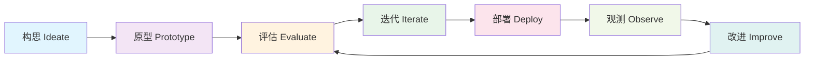
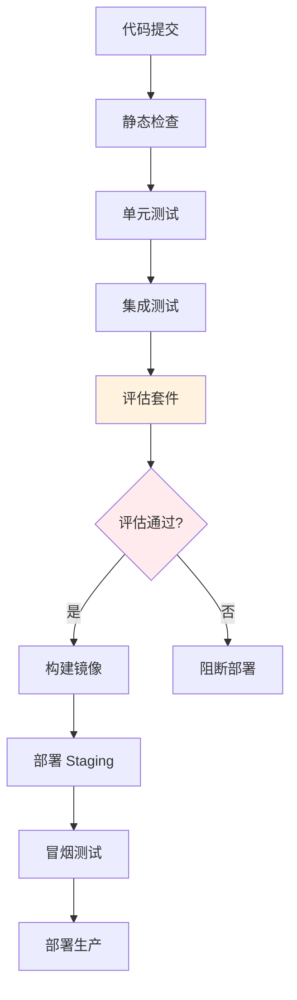

# Agent 开发工作流：从原型到生产

## 引言

构建 Agent 系统与传统软件开发有本质区别：输出不确定、行为难以预测、改进依赖实验而非纯逻辑推理。这要求我们采用一套专门的开发工作流——以评估（Evaluation）为核心驱动力，以快速迭代为基本节奏。

Anthropic 在其工程实践中反复强调一个原则：**"Start simple, add complexity only when justified by evals"**（从简单开始，只在评估证明必要时才增加复杂度）。本章将这一原则落地为可操作的开发流程。

## Agent 开发生命周期



与传统开发的瀑布或敏捷流程不同，Agent 开发的核心循环是 **评估→迭代→部署→观测** 的持续闭环。每一次改动都必须通过评估验证其价值。

## 阶段一：原型验证

### 最小可行 Agent

原型阶段的目标是用最少的代码验证核心假设。一个典型的起步方案：

```python
# prototype/agent_v0.py
"""最小原型：一个 prompt + 一个工具"""
import openai

SYSTEM_PROMPT = """你是一个代码审查助手。
当用户提交代码片段时，你需要：
1. 识别潜在问题
2. 给出改进建议
如果需要查看项目上下文，使用 search_code 工具。"""

tools = [{
    "type": "function",
    "function": {
        "name": "search_code",
        "description": "在代码库中搜索相关文件",
        "parameters": {
            "type": "object",
            "properties": {
                "query": {"type": "string", "description": "搜索关键词"}
            },
            "required": ["query"]
        }
    }
}]

def run_agent(user_input: str) -> str:
    response = openai.chat.completions.create(
        model="gpt-4o-mini",  # 原型阶段用便宜模型
        messages=[
            {"role": "system", "content": SYSTEM_PROMPT},
            {"role": "user", "content": user_input}
        ],
        tools=tools,
    )
    return response.choices[0].message.content
```

### 原型验证清单

在进入正式开发前，原型需要回答以下问题：

- LLM 能否理解任务意图？（准确率 > 70% 即可继续）
- 工具调用是否正确触发？（时机和参数是否合理）
- 端到端延迟是否可接受？（用户体验底线）
- 成本是否在预算范围内？（单次调用成本估算）

## 阶段二：评估驱动开发

### 先写评估，再写功能

这是 Agent 开发中最反直觉但最重要的实践：**在实现新功能之前，先定义如何评估它**。

```python
# evals/test_code_review.py
"""评估套件：在实现功能前定义期望行为"""

EVAL_CASES = [
    {
        "input": "def add(a, b): return a + b",
        "expected_behaviors": [
            "应该指出缺少类型注解",
            "应该建议添加 docstring",
            "不应该报告严重错误"
        ],
        "category": "simple_function"
    },
    {
        "input": "import os; os.system(user_input)",
        "expected_behaviors": [
            "必须识别命令注入风险",
            "应该建议使用 subprocess",
            "严重性应标记为 HIGH"
        ],
        "category": "security_issue"
    },
    {
        "input": "for i in range(len(lst)): print(lst[i])",
        "expected_behaviors": [
            "应该建议使用 enumerate 或直接迭代",
            "不应该标记为安全问题"
        ],
        "category": "style_issue"
    },
]

def evaluate_agent(agent_fn, cases=EVAL_CASES):
    """运行评估并生成报告"""
    results = []
    for case in cases:
        output = agent_fn(case["input"])
        score = judge_output(output, case["expected_behaviors"])
        results.append({
            "category": case["category"],
            "score": score,
            "output": output
        })
    return aggregate_results(results)
```

### 评估指标体系

| 指标 | 说明 | 目标值 |
|------|------|--------|
| 任务完成率 | 正确完成目标的比例 | > 85% |
| 工具使用准确率 | 选择正确工具的比例 | > 90% |
| 幻觉率 | 输出虚假信息的比例 | < 5% |
| 平均延迟 | 端到端响应时间 | < 30s |
| 单次成本 | 每次任务的 API 费用 | < $0.10 |

## 阶段三：项目结构与版本控制

### 推荐项目结构

```yaml
# 典型 Agent 项目目录结构
agent-project/
├── src/
│   ├── agent/
│   │   ├── __init__.py
│   │   ├── core.py          # Agent 主循环
│   │   ├── prompts/         # Prompt 模板（版本化）
│   │   │   ├── system_v1.md
│   │   │   └── system_v2.md
│   │   ├── tools/           # 工具定义与实现
│   │   │   ├── search.py
│   │   │   └── execute.py
│   │   └── config.py        # 运行时配置
│   └── api/                  # 对外接口
├── evals/
│   ├── datasets/            # 评估数据集
│   ├── judges/              # LLM-as-judge 定义
│   └── run_evals.py         # 评估入口
├── tests/
│   ├── unit/                # 单元测试
│   └── integration/         # 集成测试
├── configs/
│   ├── dev.yaml
│   ├── staging.yaml
│   └── prod.yaml
├── scripts/
│   └── deploy.sh
└── pyproject.toml
```

### Prompt 版本控制

Prompt 是 Agent 的"源代码"，必须纳入版本管理：

```python
# src/agent/prompts/registry.py
"""Prompt 版本注册表"""
from pathlib import Path

PROMPT_DIR = Path(__file__).parent

class PromptRegistry:
    def __init__(self):
        self._versions = {}
    
    def load(self, name: str, version: str = "latest") -> str:
        path = PROMPT_DIR / f"{name}_v{version}.md"
        if not path.exists():
            raise ValueError(f"Prompt {name} v{version} not found")
        return path.read_text()
    
    def get_active_version(self, name: str) -> str:
        """从配置中获取当前激活的版本"""
        return self._versions.get(name, "1")
```

## 阶段四：CI/CD 流程

### Agent 系统的 CI 流水线



```yaml
# .github/workflows/agent-ci.yml
name: Agent CI/CD
on: [push, pull_request]

jobs:
  test:
    runs-on: ubuntu-latest
    steps:
      - uses: actions/checkout@v4
      - name: Run unit tests
        run: pytest tests/unit/ -v
      
      - name: Run integration tests
        run: pytest tests/integration/ -v
        env:
          OPENAI_API_KEY: ${{ secrets.OPENAI_API_KEY }}
      
      - name: Run evaluation suite
        run: python evals/run_evals.py --threshold 0.85
        env:
          EVAL_MODEL: gpt-4o-mini  # CI 中用便宜模型
      
      - name: Check cost budget
        run: python scripts/check_eval_cost.py --max-cost 5.00

  deploy:
    needs: test
    if: github.ref == 'refs/heads/main'
    runs-on: ubuntu-latest
    steps:
      - name: Deploy to staging
        run: ./scripts/deploy.sh staging
      
      - name: Smoke test
        run: python scripts/smoke_test.py --env staging
      
      - name: Deploy to production
        run: ./scripts/deploy.sh production
```

## 阶段五：Feature Flags 与渐进式发布

Agent 的新能力应通过 Feature Flag 控制，而非直接全量上线：

```python
# src/agent/config.py
"""Feature flags for agent capabilities"""
from dataclasses import dataclass

@dataclass
class AgentFeatureFlags:
    enable_multi_tool: bool = False      # 多工具并行调用
    enable_reflection: bool = False       # 自我反思循环
    max_iterations: int = 5              # 最大迭代次数
    model_override: str | None = None    # 模型覆盖
    enable_caching: bool = True          # 响应缓存

def get_flags(user_id: str) -> AgentFeatureFlags:
    """根据用户分组返回 feature flags"""
    if is_in_experiment_group(user_id, "multi_tool_v2"):
        return AgentFeatureFlags(enable_multi_tool=True)
    return AgentFeatureFlags()  # 默认配置
```

## 常见错误与避坑指南

**错误一：过早优化 Prompt**。在没有评估数据的情况下反复调整 Prompt 是浪费时间。先建立评估基线，再有针对性地优化。

**错误二：跳过原型直接开发**。复杂的多 Agent 架构看起来很酷，但如果单个 Agent + 好的 Prompt 就能解决 80% 的问题，就不需要引入额外复杂度。

**错误三：忽视成本监控**。开发阶段不关注成本，上线后发现每天烧掉数百美元。应从第一天起就追踪每次调用的 token 消耗。

**错误四：没有回滚方案**。Agent 的行为可能因模型更新而突然退化，必须有快速回滚到上一个已知良好版本的能力。

## 本章小结

Agent 开发工作流的核心理念是"评估驱动、渐进复杂"。从最简单的原型开始，用评估数据指导每一步决策，通过 CI/CD 保证质量，用 Feature Flag 控制风险。这套流程看似保守，但实际上是到达生产环境最快的路径——因为它避免了在错误方向上浪费时间。

## 延伸阅读

- Anthropic, "Building Effective Agents" (2024) — 评估驱动开发的最佳实践
- 本书第 12 章「测试策略」— 评估套件的详细设计方法
- 本书第 12 章「版本管理」— Prompt 和工具的版本控制深入讨论
- 本书第 5 章「Agent 设计模式」— 从简单到复杂的架构演进路径
