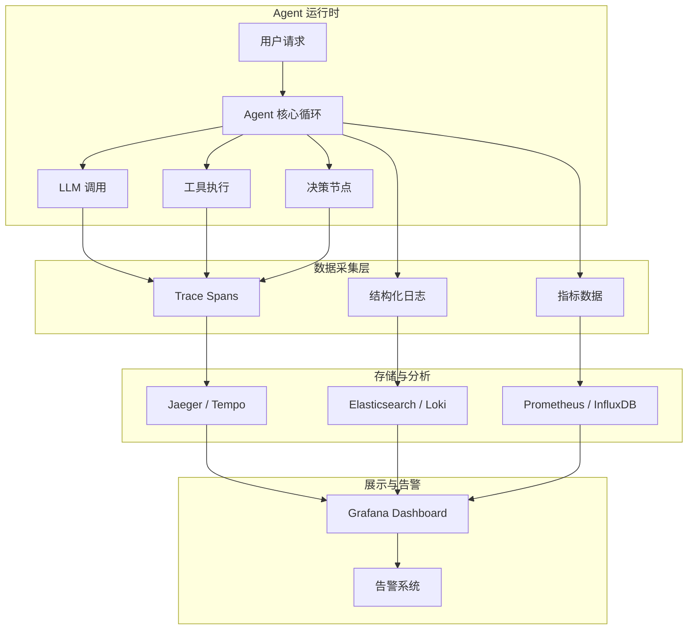

# 可观测性：Agent 系统的监控与诊断

## 引言

Agent 系统在生产环境中的行为远比传统服务复杂：一次用户请求可能触发多轮 LLM 调用、多次工具执行、动态决策分支。当系统表现异常时，如果没有完善的可观测性基础设施，定位问题几乎不可能。

可观测性（Observability）的三大支柱——日志（Logs）、指标（Metrics）、追踪（Traces）——在 Agent 场景下需要专门的适配和扩展。

## 可观测性架构总览



## 分布式追踪：Agent 执行的全链路视图

### Trace 结构设计

Agent 的一次执行应被建模为一个 Trace，其中每个关键操作是一个 Span：

```python
# observability/tracing.py
"""Agent 专用追踪装饰器"""
import time
import uuid
from contextlib import contextmanager
from dataclasses import dataclass, field
from typing import Any

@dataclass
class Span:
    name: str
    trace_id: str
    span_id: str = field(default_factory=lambda: str(uuid.uuid4())[:8])
    parent_id: str | None = None
    start_time: float = 0
    end_time: float = 0
    attributes: dict[str, Any] = field(default_factory=dict)
    events: list[dict] = field(default_factory=list)
    status: str = "ok"

class AgentTracer:
    def __init__(self, exporter=None):
        self.exporter = exporter or ConsoleExporter()
        self._active_trace: str | None = None
        self._spans: list[Span] = []
    
    @contextmanager
    def trace(self, name: str):
        """创建顶层 Trace"""
        self._active_trace = str(uuid.uuid4())
        span = Span(name=name, trace_id=self._active_trace)
        span.start_time = time.time()
        try:
            yield span
        except Exception as e:
            span.status = "error"
            span.attributes["error.message"] = str(e)
            raise
        finally:
            span.end_time = time.time()
            self._spans.append(span)
            self.exporter.export(self._spans)
    
    @contextmanager
    def span(self, name: str, parent: Span | None = None, **attrs):
        """创建子 Span"""
        s = Span(
            name=name,
            trace_id=self._active_trace,
            parent_id=parent.span_id if parent else None,
            attributes=attrs,
        )
        s.start_time = time.time()
        try:
            yield s
        except Exception as e:
            s.status = "error"
            s.attributes["error.message"] = str(e)
            raise
        finally:
            s.end_time = time.time()
            self._spans.append(s)
```

### 在 Agent 中集成追踪

```python
# agent/core_with_tracing.py
"""带追踪的 Agent 核心循环"""

class TracedAgent:
    def __init__(self, tracer: AgentTracer):
        self.tracer = tracer
    
    def run(self, user_input: str) -> str:
        with self.tracer.trace("agent.run") as root:
            root.attributes["input.length"] = len(user_input)
            root.attributes["input.preview"] = user_input[:100]
            
            messages = [{"role": "user", "content": user_input}]
            iteration = 0
            
            while iteration < self.max_iterations:
                iteration += 1
                
                # LLM 调用 Span
                with self.tracer.span("llm.call", parent=root,
                    model=self.model,
                    iteration=iteration,
                ) as llm_span:
                    response = self._call_llm(messages)
                    llm_span.attributes["tokens.input"] = response.usage.prompt_tokens
                    llm_span.attributes["tokens.output"] = response.usage.completion_tokens
                    llm_span.attributes["cost"] = self._calc_cost(response.usage)
                
                # 工具调用 Span
                if response.tool_calls:
                    for tool_call in response.tool_calls:
                        with self.tracer.span("tool.execute", parent=root,
                            tool_name=tool_call.function.name,
                            tool_args=tool_call.function.arguments,
                        ) as tool_span:
                            result = self._execute_tool(tool_call)
                            tool_span.attributes["result.length"] = len(str(result))
                            tool_span.attributes["success"] = not result.get("error")
                else:
                    root.attributes["total_iterations"] = iteration
                    return response.content
```

## 结构化日志

### 日志规范

Agent 的日志应包含足够的上下文信息，便于事后分析：

```python
# observability/logging.py
"""Agent 结构化日志"""
import structlog

logger = structlog.get_logger()

def log_agent_step(trace_id: str, step: str, **kwargs):
    """记录 Agent 执行的每一步"""
    logger.info(
        "agent.step",
        trace_id=trace_id,
        step=step,
        **kwargs
    )

# 使用示例
log_agent_step(
    trace_id="abc-123",
    step="llm_call",
    model="gpt-4o",
    iteration=2,
    input_tokens=1500,
    output_tokens=300,
    latency_ms=2100,
    has_tool_calls=True,
)

log_agent_step(
    trace_id="abc-123",
    step="tool_execute",
    tool_name="search_code",
    args={"query": "authentication"},
    result_size=3,
    latency_ms=150,
    success=True,
)

log_agent_step(
    trace_id="abc-123",
    step="completed",
    total_iterations=3,
    total_tokens=5200,
    total_cost_usd=0.045,
    total_latency_ms=8500,
)
```

### 日志级别策略

```python
# 生产环境日志配置
LOGGING_CONFIG = {
    "production": {
        "level": "INFO",
        "capture": ["trace_id", "step", "latency_ms", "tokens", "cost", "errors"],
        "exclude": ["full_prompt", "full_response"],  # 生产不记录完整内容
    },
    "development": {
        "level": "DEBUG",
        "capture": ["*"],  # 开发环境记录一切
        "include_prompts": True,
        "include_responses": True,
    },
    "debugging": {
        "level": "TRACE",
        "capture": ["*"],
        "include_intermediate_states": True,  # 包含每步中间状态
    }
}
```

## 关键指标监控

### 核心指标定义

```python
# observability/metrics.py
"""Agent 核心指标采集"""
from prometheus_client import Counter, Histogram, Gauge

# 请求级指标
agent_requests_total = Counter(
    "agent_requests_total", "Agent 请求总数",
    ["status", "model"]
)
agent_latency = Histogram(
    "agent_latency_seconds", "Agent 端到端延迟",
    buckets=[1, 2, 5, 10, 30, 60, 120]
)
agent_iterations = Histogram(
    "agent_iterations", "每次请求的迭代次数",
    buckets=[1, 2, 3, 5, 8, 10, 15, 20]
)

# Token 与成本指标
tokens_used = Counter(
    "agent_tokens_total", "Token 使用总量",
    ["type", "model"]  # type: input/output
)
cost_usd = Counter(
    "agent_cost_usd_total", "累计成本（美元）",
    ["model", "task_type"]
)

# 工具指标
tool_calls_total = Counter(
    "agent_tool_calls_total", "工具调用总数",
    ["tool_name", "status"]
)
tool_latency = Histogram(
    "agent_tool_latency_seconds", "工具执行延迟",
    ["tool_name"]
)

# 健康指标
active_agents = Gauge(
    "agent_active_count", "当前活跃 Agent 数"
)
error_rate = Gauge(
    "agent_error_rate", "最近 5 分钟错误率"
)
```

### Dashboard 设计

关键 Dashboard 面板应包含：

| 面板 | 指标 | 告警阈值 |
|------|------|----------|
| 请求成功率 | agent_requests_total{status="success"} / total | < 95% |
| P99 延迟 | histogram_quantile(0.99, agent_latency) | > 60s |
| 每小时成本 | rate(cost_usd_total[1h]) | > $50/h |
| 工具失败率 | tool_calls{status="error"} / total | > 10% |
| 平均迭代数 | avg(agent_iterations) | > 8 |
| Token 消耗趋势 | rate(tokens_used[5m]) | 突增 200% |

## 告警策略

```yaml
# alerting/agent_alerts.yml
groups:
  - name: agent_health
    rules:
      - alert: AgentHighErrorRate
        expr: |
          sum(rate(agent_requests_total{status="error"}[5m]))
          / sum(rate(agent_requests_total[5m])) > 0.1
        for: 5m
        labels:
          severity: critical
        annotations:
          summary: "Agent 错误率超过 10%"
      
      - alert: AgentCostSpike
        expr: |
          rate(agent_cost_usd_total[1h]) > 50
        for: 10m
        labels:
          severity: warning
        annotations:
          summary: "Agent 每小时成本超过 $50"
      
      - alert: AgentStuckInLoop
        expr: |
          histogram_quantile(0.95, agent_iterations) > 10
        for: 5m
        labels:
          severity: warning
        annotations:
          summary: "Agent 疑似陷入循环，迭代次数异常"
```

## 工具生态

### 主流可观测性工具对比

| 工具 | 定位 | 特点 | 适用场景 |
|------|------|------|----------|
| LangSmith | LLM 专用 | Prompt 追踪、评估集成 | LangChain 生态 |
| Braintrust | 评估+追踪 | 在线评估、A/B 测试 | 评估驱动开发 |
| Arize Phoenix | ML 可观测 | 嵌入可视化、漂移检测 | 模型监控 |
| OpenTelemetry | 通用标准 | 厂商无关、生态丰富 | 自建方案 |
| Helicone | LLM 代理 | 零代码接入、成本追踪 | 快速接入 |

### OpenTelemetry 集成示例

```python
# observability/otel_setup.py
"""OpenTelemetry 集成配置"""
from opentelemetry import trace
from opentelemetry.sdk.trace import TracerProvider
from opentelemetry.sdk.trace.export import BatchSpanProcessor
from opentelemetry.exporter.otlp.proto.grpc.trace_exporter import OTLPSpanExporter

def setup_otel(service_name: str = "agent-service"):
    provider = TracerProvider()
    processor = BatchSpanProcessor(
        OTLPSpanExporter(endpoint="http://otel-collector:4317")
    )
    provider.add_span_processor(processor)
    trace.set_tracer_provider(provider)
    return trace.get_tracer(service_name)
```

## Langfuse vs OpenLLMetry：两种架构范式

Agent 可观测性领域形成了两种代表性范式，各有其适用场景：

### Langfuse：侵入式深度追踪

Langfuse（及商业版 LangSmith）代表了基于 SDK 的深度集成方案。开发者在 Agent 代码中集成其 SDK，运行时自动捕获 LLM 输入输出、工具调用参数、Token 使用量等，形成完整的执行树。

优势在于语义信息极为丰富（能捕获函数名、变量值、逻辑分支），提供端到端的完整视图，以及强大的调试、审查和评估 UI。劣势是对代码有侵入性、可能与特定框架耦合、无法监控未集成 SDK 的组件，且在高吞吐场景下 SDK 的埋点和上报有性能开销。

### OpenLLMetry：基于 OpenTelemetry 的开放生态

OpenLLMetry 拥抱开放标准，在 OpenTelemetry（OTel）之上扩展 LLM 特有的语义约定。通过 Traceloop 等项目，为 prompts、completions、Token 使用和成本等信号定义了标准的 span attributes，支持自动打桩或手动集成。

优势在于数据格式标准化（可对接 Jaeger、Prometheus、Datadog 等任何 OTel 后端）、避免厂商锁定、与云原生监控体系协同工作（将 AI 性能数据与基础设施数据关联）、侵入性相对更低。劣势是自动打桩捕获的业务上下文可能不够丰富，且搭建完整采集管道比使用 SaaS 版 Langfuse 更复杂。

## 采样策略：高吞吐量下的成本-精度权衡

对于生产环境中的高吞吐量多智能体系统，对每次交互都进行完整追踪将产生巨大的数据量和成本。采样（Sampling）是平衡监控精度与运营成本的关键技术。

### 头部采样（Head-based Sampling）

在调用链开始时根据固定概率决定是否采集。实现简单、资源消耗低，但可能遗漏低概率的关键事件（如稀有错误）——你可能采集了 99 个成功请求，唯独漏掉了那 1 个失败请求。

### 尾部采样（Tail-based Sampling）

先收集调用链上的所有 span，在整个链完成后根据特征（是否含错误、延迟是否超标、是否涉及关键业务）决定是否保留。能够 100% 捕获错误和异常链，对 SLA 监控和故障排查极为重要。但需要在 OTel Collector 中缓存一段时间内所有 span，对内存和计算资源要求高。

### 自适应/智能采样（2025-2026 前沿方向）

超越固定规则，动态调整采样行为以在成本和精度之间达到最佳平衡：

**基于成本的采样**：对 Token 消耗特别高的调用链（如长文档 RAG 调用）提高采样率，重点监控成本异常。

**基于质量的采样**：通过评估模型对 Agent 输出实时打分，对低质量响应强制采样以便后续分析。

**决策缓存与动态权重**：缓存重复成功请求的决策路径，对这些路径降低采样率；对新的、未见过的交互模式提高采样率。

**用户分层采样**：对 VIP 用户或内测用户 100% 采样，普通用户采用较低采样率。

**自适应存储策略**：对所有调用链存储摘要信息（metadata），但只对被采样到的链存储完整的输入输出（payload），在存储端进一步优化成本。

### 实践建议

对于生产级多 Agent 系统：尾部采样是保障关键事件可观测性的基础，自适应采样是精细化平衡的进阶手段。Langfuse 因深度集成擅长在应用层实现复杂的业务逻辑采样；OpenLLMetry 可利用 OTel Collector 的可扩展性在数据管道层部署灵活的尾部和自适应策略。

## 调试：重放与对比

可观测性数据的最大价值在于支持事后调试——重放失败的执行轨迹，对比成功与失败的差异：

```python
# observability/replay.py
"""Trace 重放工具"""

def compare_traces(success_trace_id: str, failure_trace_id: str):
    """对比成功和失败的执行轨迹"""
    success = load_trace(success_trace_id)
    failure = load_trace(failure_trace_id)
    
    diff = {
        "iterations": (success.iterations, failure.iterations),
        "tools_diff": set(failure.tools_called) - set(success.tools_called),
        "divergence_point": find_first_divergence(success.spans, failure.spans),
        "token_diff": failure.total_tokens - success.total_tokens,
    }
    return diff
```

## 本章小结

Agent 系统的可观测性需要在传统三大支柱基础上做专门适配：追踪需要覆盖 LLM 调用、工具执行和决策节点；日志需要结构化且包含足够上下文；指标需要关注 Token 消耗、成本和迭代次数等 Agent 特有维度。完善的可观测性是调试、优化和保障 Agent 可靠性的基础。

## 延伸阅读

- 本书第 12 章「调试技巧」— 基于追踪数据的调试方法
- 本书第 12 章「成本优化」— 基于指标数据的成本控制
- OpenTelemetry 官方文档 — 分布式追踪标准
- LangSmith 文档 — LLM 应用专用可观测性平台
