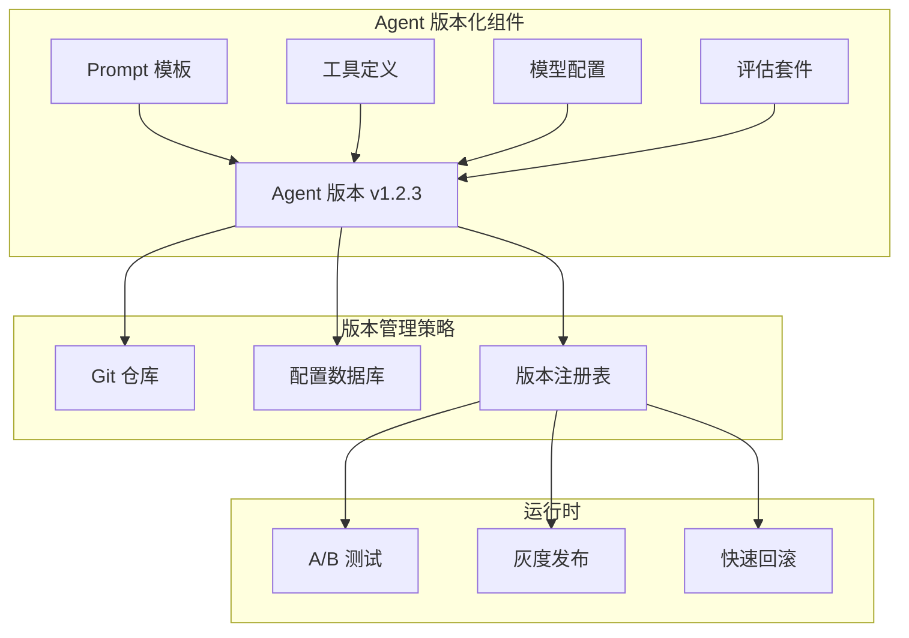
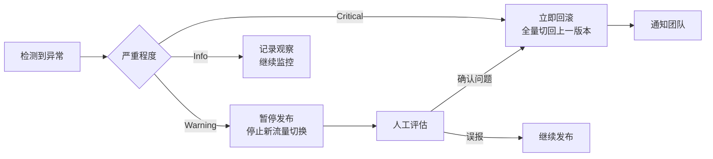

# 版本管理：Agent 系统的演进控制

## 引言

Agent 系统的"源代码"不仅仅是程序代码——Prompt 模板、工具定义、模型配置、评估数据集都是决定 Agent 行为的关键组件。任何一个组件的变更都可能导致行为剧变。因此，Agent 系统需要一套比传统软件更精细的版本管理策略。

## 需要版本化的组件



## Prompt 版本管理

### 方案一：Git 文件版本化

最简单直接的方案，适合小团队：

```yaml
# prompts/code_reviewer/
# ├── v1.0.md    # 初始版本
# ├── v1.1.md    # 增加安全检查
# ├── v2.0.md    # 重构为结构化输出
# └── config.yaml

# prompts/code_reviewer/config.yaml
name: code_reviewer
active_version: "2.0"
versions:
  "1.0":
    file: v1.0.md
    created: 2024-01-15
    description: "初始版本，基础代码审查"
    status: deprecated
  "1.1":
    file: v1.1.md
    created: 2024-02-20
    description: "增加安全漏洞检查能力"
    status: deprecated
  "2.0":
    file: v2.0.md
    created: 2024-04-10
    description: "重构为结构化 JSON 输出"
    status: active
    eval_score: 0.89
```

### 方案二：数据库版本化

适合需要动态切换和 A/B 测试的场景：

```python
# versioning/prompt_registry.py
"""Prompt 版本注册表（数据库方案）"""
from datetime import datetime
from sqlalchemy import Column, String, Text, Float, DateTime, Boolean
from sqlalchemy.orm import DeclarativeBase

class Base(DeclarativeBase):
    pass

class PromptVersion(Base):
    __tablename__ = "prompt_versions"
    
    id = Column(String, primary_key=True)  # e.g., "code_reviewer:v2.0"
    name = Column(String, nullable=False)
    version = Column(String, nullable=False)
    content = Column(Text, nullable=False)
    description = Column(String)
    is_active = Column(Boolean, default=False)
    eval_score = Column(Float)
    created_at = Column(DateTime, default=datetime.utcnow)
    created_by = Column(String)
    
class PromptRegistry:
    def __init__(self, db_session):
        self.db = db_session
    
    def get_active(self, name: str) -> str:
        """获取当前激活版本的 Prompt"""
        version = self.db.query(PromptVersion).filter(
            PromptVersion.name == name,
            PromptVersion.is_active == True
        ).first()
        if not version:
            raise ValueError(f"No active version for prompt: {name}")
        return version.content
    
    def get_version(self, name: str, version: str) -> str:
        """获取指定版本"""
        v = self.db.query(PromptVersion).filter(
            PromptVersion.name == name,
            PromptVersion.version == version
        ).first()
        return v.content if v else None
    
    def activate(self, name: str, version: str):
        """激活指定版本（原子操作）"""
        # 先停用所有版本
        self.db.query(PromptVersion).filter(
            PromptVersion.name == name
        ).update({"is_active": False})
        # 激活目标版本
        self.db.query(PromptVersion).filter(
            PromptVersion.id == f"{name}:{version}"
        ).update({"is_active": True})
        self.db.commit()
    
    def rollback(self, name: str):
        """回滚到上一个版本"""
        versions = self.db.query(PromptVersion).filter(
            PromptVersion.name == name
        ).order_by(PromptVersion.created_at.desc()).limit(2).all()
        
        if len(versions) >= 2:
            self.activate(name, versions[1].version)
            return versions[1].version
```

## 工具版本管理

工具的版本管理需要特别关注向后兼容性：

```python
# versioning/tool_versioning.py
"""工具版本管理与兼容性"""

class ToolRegistry:
    def __init__(self):
        self._tools: dict[str, dict[str, Tool]] = {}  # name -> version -> tool
    
    def register(self, name: str, version: str, tool: Tool,
                 deprecated: bool = False):
        """注册工具版本"""
        if name not in self._tools:
            self._tools[name] = {}
        self._tools[name][version] = tool
        if deprecated:
            tool.mark_deprecated(
                message=f"工具 {name} v{version} 已废弃，请使用最新版本"
            )
    
    def get(self, name: str, version: str = "latest") -> Tool:
        """获取工具，支持版本指定"""
        if version == "latest":
            versions = sorted(self._tools[name].keys(), reverse=True)
            return self._tools[name][versions[0]]
        return self._tools[name][version]

# 工具版本兼容性示例
class SearchToolV1:
    """v1: 简单文本搜索"""
    schema = {
        "name": "search",
        "parameters": {
            "query": {"type": "string"}
        }
    }

class SearchToolV2:
    """v2: 增加过滤器，保持向后兼容"""
    schema = {
        "name": "search",
        "parameters": {
            "query": {"type": "string"},
            "filters": {"type": "object", "default": {}},  # 新增，有默认值
            "max_results": {"type": "integer", "default": 10},  # 新增
        }
    }
    
    def execute(self, query: str, filters: dict = None, max_results: int = 10):
        """v1 的调用方式仍然有效"""
        # ...
```

## 模型版本固定

```yaml
# configs/model_pinning.yaml
# 固定模型版本，避免提供商静默更新导致行为变化
models:
  primary:
    provider: openai
    # 不要用 "gpt-4o"（会自动更新）
    # 要用具体的版本快照
    model: "gpt-4o-2024-08-06"
    
  fallback:
    provider: anthropic
    model: "claude-3-5-sonnet-20241022"

# 模型升级策略
upgrade_policy:
  # 新模型版本发布后的处理流程
  on_new_version:
    1_evaluate: "在评估套件上运行新版本"
    2_compare: "对比新旧版本的得分差异"
    3_canary: "5% 流量切换到新版本"
    4_promote: "指标正常后全量切换"
    5_pin: "更新配置文件中的版本号"
```

## 语义化版本（Semantic Versioning）适配

传统 SemVer（MAJOR.MINOR.PATCH）需要为 Agent 场景做适配：

```python
# versioning/semver.py
"""Agent 语义化版本规则"""

VERSION_RULES = """
Agent 版本号规则：MAJOR.MINOR.PATCH

MAJOR（主版本）变更条件：
- Prompt 结构性重写（输出格式变化）
- 移除工具或改变工具接口
- 模型更换（如 GPT-4 → Claude）
- 评估得分变化 > 10%

MINOR（次版本）变更条件：
- 新增工具（不影响已有功能）
- Prompt 优化（输出格式不变）
- 新增能力维度
- 评估得分变化 5-10%

PATCH（补丁）变更条件：
- 修复特定 case 的错误行为
- 微调 Prompt 措辞
- 更新工具描述
- 评估得分变化 < 5%
"""

def determine_version_bump(changes: dict, eval_diff: float) -> str:
    """根据变更内容自动判断版本号升级类型"""
    if (changes.get("prompt_rewrite") or 
        changes.get("tool_removed") or
        changes.get("model_changed") or
        abs(eval_diff) > 0.10):
        return "major"
    
    if (changes.get("tool_added") or
        changes.get("new_capability") or
        abs(eval_diff) > 0.05):
        return "minor"
    
    return "patch"
```

## A/B 测试不同 Agent 版本

```python
# versioning/ab_testing.py
"""Agent A/B 测试框架"""

class AgentABTest:
    def __init__(self, name: str, variants: dict[str, AgentConfig]):
        self.name = name
        self.variants = variants  # {"control": config_v1, "treatment": config_v2}
        self.results: dict[str, list] = {k: [] for k in variants}
    
    def assign_variant(self, user_id: str) -> str:
        """确定性地分配用户到实验组"""
        hash_val = int(hashlib.md5(
            f"{self.name}:{user_id}".encode()
        ).hexdigest(), 16)
        
        # 50/50 分流
        return "treatment" if hash_val % 100 < 50 else "control"
    
    def run(self, user_id: str, input: str) -> str:
        """根据分组运行对应版本的 Agent"""
        variant = self.assign_variant(user_id)
        config = self.variants[variant]
        
        agent = Agent(config=config)
        result = agent.run(input)
        
        # 记录结果用于分析
        self.results[variant].append({
            "user_id": user_id,
            "input": input,
            "output": result,
            "latency": result.latency,
            "cost": result.cost,
            "iterations": result.iterations,
        })
        
        return result
    
    def analyze(self) -> dict:
        """分析 A/B 测试结果"""
        control = self.results["control"]
        treatment = self.results["treatment"]
        
        return {
            "control_avg_score": np.mean([r["score"] for r in control]),
            "treatment_avg_score": np.mean([r["score"] for r in treatment]),
            "control_avg_cost": np.mean([r["cost"] for r in control]),
            "treatment_avg_cost": np.mean([r["cost"] for r in treatment]),
            "p_value": self._calculate_significance(control, treatment),
            "recommendation": self._recommend(control, treatment),
        }
```

## 回滚策略



```python
# versioning/rollback.py
"""快速回滚系统"""

class RollbackManager:
    def __init__(self, config_store, prompt_registry):
        self.config_store = config_store
        self.prompt_registry = prompt_registry
        self._rollback_history = []
    
    def rollback_all(self, reason: str):
        """一键回滚所有组件到上一个已知良好版本"""
        last_good = self.config_store.get_last_known_good()
        
        # 回滚 Prompt
        for prompt_name, version in last_good["prompts"].items():
            self.prompt_registry.activate(prompt_name, version)
        
        # 回滚模型配置
        self.config_store.set("model_config", last_good["model_config"])
        
        # 回滚工具配置
        self.config_store.set("tools_config", last_good["tools_config"])
        
        # 记录回滚事件
        self._rollback_history.append({
            "timestamp": datetime.utcnow(),
            "reason": reason,
            "rolled_back_to": last_good["version"],
        })
        
        # 触发告警
        alert(f"Agent 已回滚到 {last_good['version']}，原因：{reason}")
    
    def mark_as_good(self, version: str):
        """标记当前版本为已知良好版本"""
        current_config = self.config_store.get_current()
        self.config_store.set_last_known_good(current_config)
```

## 配置管理：环境差异化

```python
# versioning/config_management.py
"""多环境配置管理"""

ENVIRONMENT_CONFIGS = {
    "development": {
        "model": "gpt-4o-mini",
        "temperature": 0.7,
        "max_iterations": 20,  # 开发时允许更多迭代
        "enable_debug_mode": True,
        "cost_limit": 1.0,
    },
    "staging": {
        "model": "gpt-4o-2024-08-06",
        "temperature": 0.7,
        "max_iterations": 10,
        "enable_debug_mode": False,
        "cost_limit": 0.5,
    },
    "production": {
        "model": "gpt-4o-2024-08-06",
        "temperature": 0.7,
        "max_iterations": 10,
        "enable_debug_mode": False,
        "cost_limit": 0.5,
        "enable_caching": True,
        "enable_monitoring": True,
    },
}

def get_config(env: str = None) -> dict:
    """获取当前环境的配置"""
    env = env or os.getenv("AGENT_ENV", "development")
    return ENVIRONMENT_CONFIGS[env]
```

## 迁移策略：不中断进行中的对话

```python
# versioning/migration.py
"""版本迁移：不中断进行中的对话"""

class VersionMigrator:
    def migrate_session(self, session_id: str, from_version: str, to_version: str):
        """将进行中的会话迁移到新版本"""
        session = load_session(session_id)
        
        # 策略 1：当前会话继续用旧版本，新会话用新版本
        if self.strategy == "finish_existing":
            session.pinned_version = from_version  # 锁定当前版本
            return
        
        # 策略 2：生成迁移摘要，在新版本中继续
        if self.strategy == "migrate_with_summary":
            summary = summarize_conversation(session.messages)
            session.messages = [
                {"role": "system", "content": get_prompt(to_version)},
                {"role": "system", "content": f"对话历史摘要：{summary}"},
            ]
            session.version = to_version
            return
```

## 常见错误与避坑指南

**错误一：不固定模型版本**。使用 `gpt-4o` 而非 `gpt-4o-2024-08-06` 意味着模型可能在你不知情的情况下更新，导致行为突变。

**错误二：Prompt 变更不经过评估**。任何 Prompt 修改都应该先在评估套件上验证，即使只是"微调措辞"。

**错误三：没有回滚方案**。上线新版本后发现问题，却无法快速回退。必须在部署前确认回滚路径可用。

**错误四：A/B 测试样本量不足**。Agent 输出的方差大，需要足够的样本量才能得出统计显著的结论。建议每组至少 100 个样本。

## 本章小结

Agent 系统的版本管理需要覆盖 Prompt、工具、模型配置和评估套件四大组件。语义化版本号帮助团队理解变更影响，A/B 测试提供数据驱动的决策依据，快速回滚机制是生产安全的最后防线。核心原则：每一次变更都可追溯、可评估、可回滚。

## 延伸阅读

- 本书第 12 章「开发工作流」— 版本管理在 CI/CD 中的集成
- 本书第 12 章「部署策略」— 金丝雀发布与版本切换
- 本书第 12 章「测试策略」— 评估套件作为版本门禁
- Git 官方文档 — 分支策略与标签管理
- LaunchDarkly 文档 — Feature Flag 最佳实践
